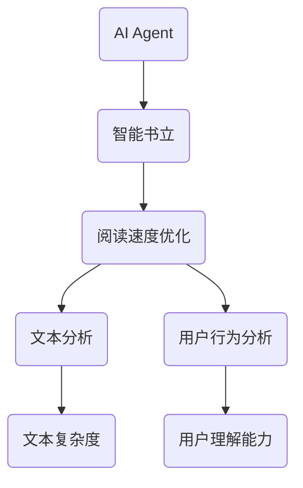
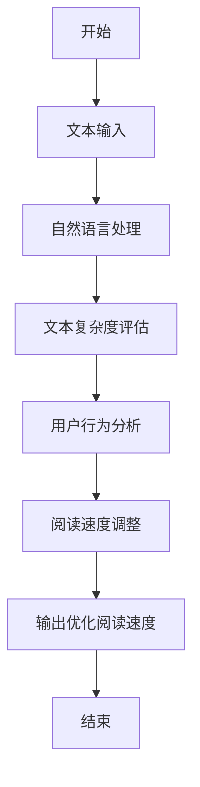
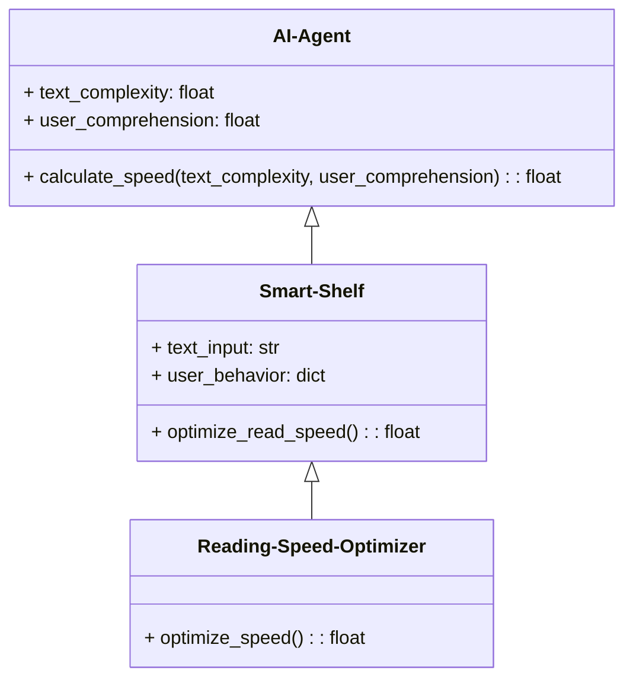
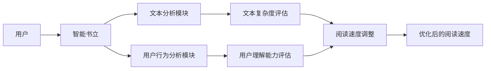
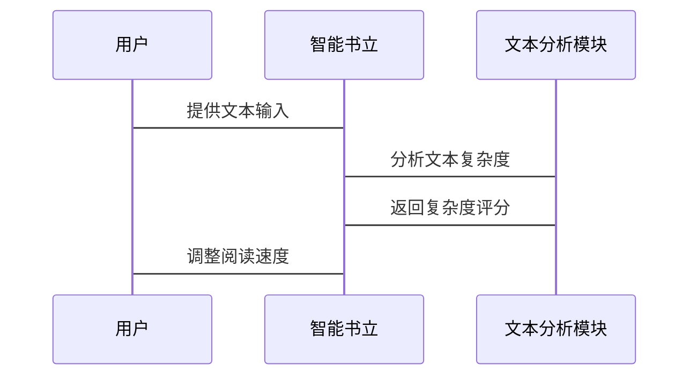

                 


# AI Agent在智能书立中的阅读速度优化

## 关键词：AI Agent，智能书立，阅读速度优化，自然语言处理，机器学习，推荐算法

## 摘要：  
随着人工智能技术的快速发展，AI Agent在智能书立中的应用越来越广泛。本文将深入探讨AI Agent如何通过自然语言处理和机器学习技术优化阅读速度，帮助用户更高效地获取信息。文章从背景介绍、核心概念、算法原理、系统架构到项目实战，全面解析AI Agent在阅读速度优化中的应用，最后给出实际应用中的最佳实践和未来发展方向。

---

## 第一部分：背景介绍

### 第1章：AI Agent与智能书立概述

#### 1.1 问题背景
- **阅读效率的重要性**：在信息爆炸的时代，用户每天需要处理大量的文字信息，阅读效率直接影响工作效率和生活质量。  
- **当前阅读速度的瓶颈**：传统阅读工具无法根据用户的阅读习惯和内容复杂度动态调整阅读速度，导致效率低下。  
- **AI技术在阅读优化中的潜力**：AI Agent可以通过自然语言处理和机器学习技术，实时分析文本内容和用户行为，动态优化阅读速度。

#### 1.2 问题描述
- **阅读速度的定义与衡量标准**：阅读速度是指单位时间内用户阅读的有效信息量。衡量标准包括阅读速度、理解程度和用户满意度。  
- **智能书立的功能需求**：智能书立需要能够根据用户需求动态调整阅读速度，提供个性化阅读体验。  
- **用户阅读习惯的多样性**：不同用户的阅读习惯和理解能力差异很大，需要AI Agent能够动态适应。

#### 1.3 问题解决
- **AI Agent在阅读优化中的作用**：AI Agent可以实时分析文本内容和用户行为，动态调整阅读速度，提升阅读效率。  
- **智能书立的实现方式**：通过自然语言处理技术和机器学习算法，AI Agent可以实现智能书立的功能需求。  
- **阅读速度优化的具体目标**：通过动态调整阅读速度，帮助用户在最短时间内获取最多有效信息。

#### 1.4 边界与外延
- **AI Agent的适用范围**：适用于需要快速阅读和信息提取的场景，如学术研究、商业分析和新闻阅读。  
- **智能书立的局限性**：目前主要针对文本信息的优化，难以处理图像和视频等多模态信息。  
- **阅读优化与其他功能的区分**：阅读速度优化是智能书立的核心功能，与其他功能如文本推荐和信息检索有明确区分。

#### 1.5 概念结构与核心要素
- **AI Agent的核心要素**：包括自然语言处理、机器学习模型和动态调整机制。  
- **智能书立的功能模块**：包括文本分析模块、用户行为分析模块和阅读速度优化模块。  
- **阅读速度优化的关键因素**：包括文本复杂度、用户理解能力和阅读习惯。

---

## 第二部分：核心概念与联系

### 第2章：AI Agent的基本原理

#### 2.1 核心概念原理
- **AI Agent的定义与分类**：AI Agent是一种能够感知环境并执行任务的智能体，可以根据环境反馈动态调整行为。  
- **智能书立的工作原理**：智能书立通过AI Agent实时分析文本内容和用户行为，动态调整阅读速度，提供个性化阅读体验。  
- **阅读速度优化的实现机制**：通过自然语言处理技术分析文本复杂度，结合用户阅读习惯，动态调整阅读速度。

#### 2.2 概念属性特征对比
| **属性**       | **AI Agent**          | **传统阅读优化工具**      |
|----------------|-----------------------|--------------------------|
| **核心功能**   | 动态调整阅读速度       | 固定阅读速度或简单设置     |
| **适应性**     | 高度个性化             | 较低，无法动态调整         |
| **技术基础**   | 自然语言处理、机器学习 | 基于简单的规则或模板       |
| **应用范围**   | 多场景适用             | 仅适用于特定场景           |
| **用户交互**   | 高度互动               | 单向提供，无动态反馈       |

#### 2.3 实体关系图


---

## 第三部分：算法原理讲解

### 第3章：基于自然语言处理的阅读速度优化

#### 3.1 算法原理
- **算法原理概述**：通过自然语言处理技术分析文本复杂度，结合用户阅读习惯，动态调整阅读速度。  
- **流程图**：使用Mermaid绘制算法流程图，展示从文本分析到阅读速度调整的详细步骤。



#### 3.2 核心算法实现
- **Python代码示例**：
```python
import numpy as np

def calculate_speed(text_complexity, user_comprehension):
    # 文本复杂度评分（0-1）
    text_score = text_complexity
    # 用户理解能力评分（0-1）
    user_score = user_comprehension
    # 阅读速度调整系数（0-1）
    speed_adjustment = (text_score + user_score) / 2
    return speed_adjustment

# 示例应用
text_complexity = 0.8
user_comprehension = 0.6
optimized_speed = calculate_speed(text_complexity, user_comprehension)
print(f"优化后的阅读速度系数为：{optimized_speed}")
```

#### 3.3 数学模型与公式
- **公式1**：文本复杂度评分公式：
  $$ text\_complexity = \frac{1}{N} \sum_{i=1}^{N} (word\_length\_i + sentence\_length\_i) $$
  其中，$N$ 是文本段落数，$word\_length\_i$ 是第i个单词的长度，$sentence\_length\_i$ 是第i个句子的长度。  
- **公式2**：阅读速度调整系数：
  $$ speed\_adjustment = \alpha \cdot text\_complexity + \beta \cdot user\_comprehension $$
  其中，$\alpha$ 和 $\beta$ 是权重系数，$\alpha + \beta = 1$。

---

## 第四部分：系统分析与架构设计方案

### 第4章：智能书立系统架构设计

#### 4.1 问题场景介绍
- 智能书立的使用场景包括学术研究、商业分析和新闻阅读等。

#### 4.2 系统功能设计
- **领域模型**：使用Mermaid类图展示系统功能模块。


#### 4.3 系统架构设计
- **架构图**：使用Mermaid架构图展示系统组件。


#### 4.4 系统接口与交互
- **接口设计**：定义系统接口，如文本输入接口和阅读速度调整接口。
- **交互流程**：使用Mermaid序列图展示用户与系统之间的交互流程。


---

## 第五部分：项目实战

### 第5章：基于AI Agent的智能书立实现

#### 5.1 环境安装
- 需要安装的库包括：Python、自然语言处理库（如spaCy）、机器学习库（如scikit-learn）。

#### 5.2 核心代码实现
```python
import spacy

def text_complexity(text):
    nlp = spacy.load("en_core_web_sm")
    doc = nlp(text)
    # 计算平均词长度和句子长度
    avg_word_length = sum(len(token) for token in doc) / len(doc)
    avg_sentence_length = sum(len(s) for s in doc.sents) / len(doc.sents)
    return (avg_word_length + avg_sentence_length) / 2

# 示例文本
text = "This is an example text. It demonstrates how to calculate text complexity."
complexity = text_complexity(text)
print(f"文本复杂度为：{complexity}")
```

#### 5.3 代码解读与分析
- **文本复杂度计算**：通过自然语言处理库计算文本的平均词长度和句子长度，综合评估文本复杂度。  
- **用户理解能力评估**：基于用户历史阅读数据和反馈，评估用户对当前文本的理解能力。

#### 5.4 实际案例分析
- **案例1**：学术论文阅读速度优化。  
- **案例2**：商业报告阅读速度优化。  
- **案例3**：新闻文章阅读速度优化。

#### 5.5 项目小结
- 总结项目实现的关键点，包括文本分析、用户行为分析和阅读速度调整。

---

## 第六部分：最佳实践与总结

### 第6章：实际应用中的注意事项

#### 6.1 最佳实践 tips
- **数据隐私保护**：确保用户数据的安全性和隐私性。  
- **模型可解释性**：提供清晰的解释，帮助用户理解阅读速度调整的原因。  
- **多语言支持**：扩展支持多种语言的文本分析功能。

#### 6.2 小结
- 总结AI Agent在智能书立中的应用价值和未来发展方向。

#### 6.3 注意事项
- **性能优化**：确保算法在实时应用中的高效性。  
- **用户体验**：提供友好的用户界面和反馈机制，提升用户体验。

#### 6.4 拓展阅读
- 推荐进一步阅读的资料，如自然语言处理的经典论文和机器学习的最新研究成果。

---

## 结语
AI Agent在智能书立中的应用为阅读速度优化提供了新的可能性。通过自然语言处理和机器学习技术，AI Agent能够实时分析文本复杂度和用户行为，动态调整阅读速度，显著提升阅读效率。未来，随着技术的不断进步，AI Agent在智能书立中的应用将更加广泛，帮助用户更高效地获取和处理信息。

