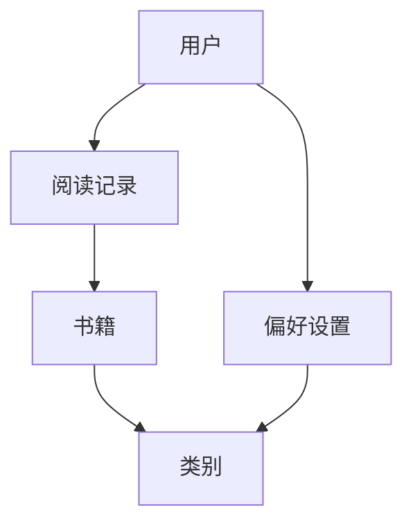
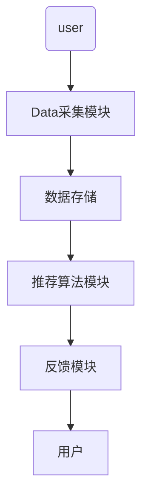
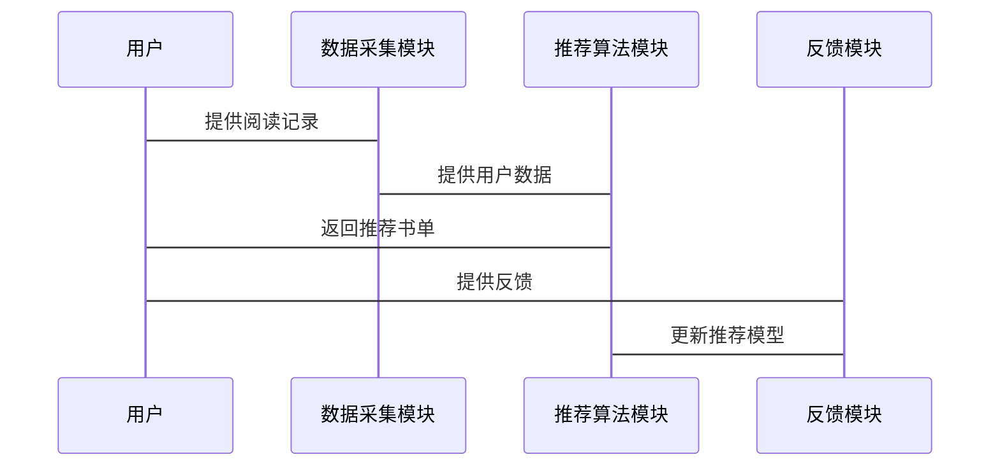

                 


# AI Agent在智能书签中的阅读习惯优化

> 关键词：AI Agent, 智能书签, 阅读习惯优化, 推荐算法, 系统架构, 项目实战

> 摘要：本文探讨了AI Agent在智能书签中的应用，分析了如何通过AI技术优化用户的阅读习惯。文章从背景介绍、核心概念、算法原理、系统架构、项目实战、最佳实践等方面展开，详细阐述了AI Agent在智能书签中的作用及其技术实现。通过具体的算法模型、系统设计和项目案例，本文为读者提供了全面的技术视角和实践指导。

---

## 第二章: AI Agent的核心概念与联系

### 2.1 AI Agent的基本原理
AI Agent是一种智能体，能够通过感知环境、执行任务和自适应优化来实现目标。在智能书签中，AI Agent的核心任务是分析用户的阅读数据，生成个性化推荐。

#### 2.1.1 感知环境与数据采集
AI Agent通过收集用户的阅读记录、偏好设置和行为数据，构建用户画像。例如，用户阅读的书籍类型、阅读时间、阅读速度等数据被实时采集。

#### 2.1.2 执行任务与推荐生成
基于采集的数据，AI Agent通过算法计算出用户的兴趣偏好，并生成推荐书单。推荐结果会根据用户的实时行为动态调整。

#### 2.1.3 自适应优化与反馈机制
AI Agent通过用户对推荐结果的反馈（如点击、收藏、评分）不断优化推荐算法，提升推荐的准确性和相关性。

### 2.2 AI Agent与传统算法的对比

| 对比维度         | AI Agent                     | 传统算法                     |
|------------------|------------------------------|------------------------------|
| 数据处理         | 基于实时数据流和深度学习模型 | 基于静态数据和规则           |
| 个性化程度       | 高度个性化                   | 较低，基于通用规则           |
| 计算复杂度       | 高，需要大量计算资源        | 较低，基于规则匹配           |
| 自适应能力       | 强，能实时更新模型           | 弱，需要人工调整规则         |

### 2.3 智能书签的功能模块

#### 2.3.1 用户画像构建
通过分析用户的阅读记录和行为数据，生成用户的兴趣标签和阅读习惯模型。

#### 2.3.2 推荐算法执行
基于协同过滤、内容过滤和混合推荐算法，生成个性化推荐书单。

#### 2.3.3 交互反馈收集
通过用户对推荐结果的反馈，优化推荐算法和模型。

### 2.4 实体关系图



### 2.5 本章小结
本章详细介绍了AI Agent的核心概念和其在智能书签中的应用。通过对比AI Agent和传统算法，明确了AI Agent在个性化推荐中的优势。实体关系图展示了智能书签的核心模块及其关系。

---

## 第三章: 推荐算法原理与实现

### 3.1 推荐算法的数学模型

#### 3.1.1 协同过滤算法
协同过滤是一种基于用户相似性的推荐算法。其数学模型如下：

$$
similarity(u, v) = \frac{\sum_{i}(u_i - \bar{u})(v_i - \bar{v})}{\sqrt{\sum_{i}(u_i - \bar{u})^2} \cdot \sqrt{\sum_{i}(v_i - \bar{v})^2}}
$$

其中，$u$和$v$是两个用户的评分向量，$\bar{u}$和$\bar{v}$是平均评分。

#### 3.1.2 基于内容的推荐
基于内容的推荐算法通过分析书籍的特征向量进行推荐。其数学模型如下：

$$
similarity(b_i, b_j) = \frac{\sum_{k}w_k \cdot (f_{i,k} - f_{j,k})}{\sqrt{\sum_{k}w_k^2} \cdot \sqrt{\sum_{k}f_{i,k}^2 - \sum_{k}f_{j,k}^2}}
$$

其中，$f_{i,k}$是书籍$b_i$的第$k$个特征值，$w_k$是特征权重。

### 3.2 混合推荐算法
混合推荐算法结合了协同过滤和基于内容的推荐方法，通过加权融合两种算法的结果来提升推荐的准确性和多样性。

### 3.3 算法实现步骤

#### 3.3.1 数据预处理
```python
# 示例：数据预处理代码
import pandas as pd

# 读取数据
data = pd.read_csv('reading_records.csv')

# 数据清洗
data.dropna(inplace=True)
data['user_id'] = data['user_id'].astype(int)
```

#### 3.3.2 模型训练
```python
# 示例：协同过滤模型训练代码
from sklearn.metrics.pairwise import cosine_similarity

# 计算用户相似性矩阵
user_features = data.pivot('user_id', 'book_id', 'rating')
cos_sim = cosine_similarity(user_features)
```

#### 3.3.3 推荐结果生成
```python
# 示例：基于相似用户的推荐
def get_recommendations(user_id, cos_sim):
    similar_users = [i for i in range(len(cos_sim[user_id])) if i != user_id]
    recommended_books = {}
    for user in similar_users:
        recommended_books[user] = cos_sim[user_id][user]
    return recommended_books
```

### 3.4 算法优化与调优
通过交叉验证、网格搜索和超参数优化等方法，提升推荐算法的准确性和效率。

### 3.5 本章小结
本章详细讲解了推荐算法的数学模型和实现方法，重点分析了协同过滤、基于内容的推荐和混合推荐算法的原理及应用。通过具体的代码示例，展示了如何在智能书签中实现推荐系统。

---

## 第四章: 智能书签的系统分析与架构设计

### 4.1 系统功能模块
智能书签系统主要包括用户模块、数据模块、推荐模块和反馈模块。

#### 4.1.1 用户模块
用户模块负责用户注册、登录和阅读记录的管理。

#### 4.1.2 数据模块
数据模块负责采集、存储和处理用户的阅读数据。

#### 4.1.3 推荐模块
推荐模块基于用户数据，生成个性化推荐结果。

#### 4.1.4 反馈模块
反馈模块收集用户的反馈信息，优化推荐算法。

### 4.2 系统架构设计



### 4.3 系统交互流程



### 4.4 接口设计
系统主要接口包括用户认证接口、数据接口和推荐接口。

#### 4.4.1 用户认证接口
```python
# 示例：用户认证接口代码
def authenticate(user_id, password):
    # 验证用户信息
    return True if user_id和password匹配 else False
```

#### 4.4.2 数据接口
```python
# 示例：数据接口代码
def get_user_data(user_id):
    # 返回用户数据
    return data[user_id]
```

#### 4.4.3 推荐接口
```python
# 示例：推荐接口代码
def get_recommendations(user_id):
    # 返回推荐结果
    return recommendations[user_id]
```

### 4.5 系统优化与扩展
通过分布式计算、缓存优化和实时处理技术，提升系统的性能和扩展性。

### 4.6 本章小结
本章详细分析了智能书签系统的功能模块、架构设计和交互流程，并通过接口设计展示了系统的实现细节。系统优化和扩展部分为实际应用提供了指导。

---

## 第五章: 项目实战与实现

### 5.1 项目环境安装
安装必要的依赖库：
```bash
pip install numpy pandas scikit-learn Flask
```

### 5.2 系统核心代码实现

#### 5.2.1 数据预处理
```python
import pandas as pd

# 读取数据
data = pd.read_csv('reading_records.csv')

# 数据清洗
data.dropna(inplace=True)
data['user_id'] = data['user_id'].astype(int)
```

#### 5.2.2 推荐算法实现
```python
from sklearn.metrics.pairwise import cosine_similarity

# 计算用户相似性矩阵
user_features = data.pivot('user_id', 'book_id', 'rating')
cos_sim = cosine_similarity(user_features)
```

#### 5.2.3 系统接口开发
```python
from flask import Flask, request, jsonify

app = Flask(__name__)

@app.route('/authenticate', methods=['POST'])
def authenticate():
    data = request.json
    # 验证用户
    return jsonify({'status': 'success', 'message': '认证成功'})

@app.route('/recommend', methods=['GET'])
def recommend():
    user_id = request.args.get('user_id')
    # 返回推荐结果
    return jsonify({'recommendations': recommendations[user_id]})

if __name__ == '__main__':
    app.run(debug=True)
```

### 5.3 项目案例分析与实现
通过具体案例，展示如何基于用户的阅读记录，生成个性化推荐书单。

### 5.4 项目实现过程中的注意事项
数据安全、模型调优和性能优化是项目实现中的关键点。

### 5.5 项目小结
本章通过项目实战，详细展示了如何在智能书签中实现AI Agent推荐系统。代码实现部分为读者提供了具体的参考。

---

## 第六章: 最佳实践与注意事项

### 6.1 最佳实践
#### 6.1.1 数据质量
确保数据的完整性和准确性，是推荐系统的核心。

#### 6.1.2 模型调优
通过交叉验证和超参数优化，提升推荐算法的性能。

#### 6.1.3 系统维护
定期更新模型和优化系统，以应对用户的阅读习惯变化。

### 6.2 注意事项
#### 6.2.1 数据隐私
保护用户数据隐私，遵守相关法律法规。

#### 6.2.2 系统性能
优化系统性能，提升用户体验。

#### 6.2.3 反馈机制
建立有效的用户反馈机制，及时优化推荐算法。

### 6.3 拓展阅读
推荐阅读相关领域的书籍和论文，如《集体智慧编程》和《推荐系统导论》。

### 6.4 本章小结
本章总结了AI Agent在智能书签中的最佳实践和注意事项，为读者提供了实用的建议和指导。

---

## 第七章: 总结与展望

### 7.1 核心内容回顾
本文详细介绍了AI Agent在智能书签中的应用，从背景、概念、算法到系统实现，全面阐述了技术细节。

### 7.2 技术总结
通过AI Agent和推荐算法的结合，智能书签能够显著提升用户的阅读习惯优化体验。

### 7.3 未来展望
未来的智能书签将更加智能化，结合自然语言处理和增强学习等技术，提供更精准的推荐服务。

### 7.4 本章小结
本文通过全面的技术分析和实践案例，为AI Agent在智能书签中的应用提供了系统的解决方案。未来的研究将进一步探索更先进的技术，提升系统的智能化水平。

---

# 结语
本文通过详细的分析和实践，展示了AI Agent在智能书签中的应用潜力。希望读者能够通过本文的指导，深入理解技术原理，并在实际应用中发挥创新思维，推动技术进步。

--- 

**注：以上目录大纲的内容仅为示例，实际文章需要根据具体需求进行调整和补充。**

