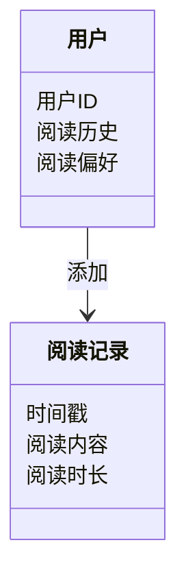
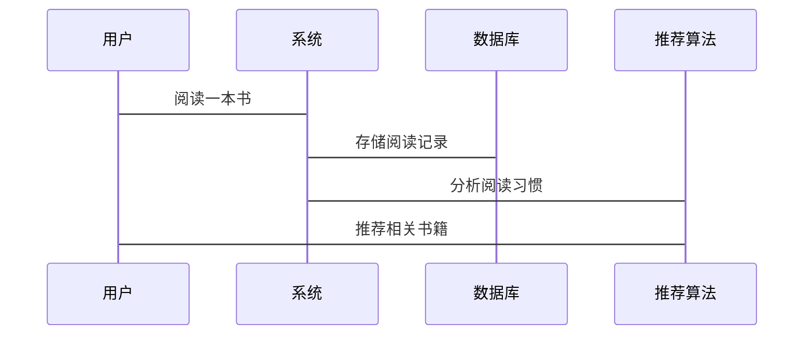

                 


# AI Agent在智能书签中的阅读习惯分析

> 关键词：AI Agent，智能书签，阅读习惯分析，机器学习，推荐系统

> 摘要：本文探讨了AI Agent在智能书签中的应用，重点分析了其如何通过阅读习惯分析优化用户体验。文章详细介绍了AI Agent的核心原理、智能书签的功能模块、阅读习惯分析算法，以及系统架构设计，并通过项目实战展示了AI Agent在智能书签中的具体应用。最后，本文总结了AI Agent在智能书签中的优势和未来发展方向。

---

# 第一章 AI Agent与智能书签概述

## 1.1 AI Agent的基本概念

### 1.1.1 AI Agent的定义

AI Agent（人工智能代理）是指能够感知环境、自主决策并执行任务的智能实体。它能够通过传感器获取信息，利用算法进行分析，并通过执行器与环境交互。

### 1.1.2 AI Agent的核心特点

- **自主性**：AI Agent能够在没有外部干预的情况下自主运作。
- **反应性**：能够实时感知环境并做出反应。
- **学习能力**：通过机器学习算法不断优化自身行为。
- **社交能力**：能够与其他AI Agent或人类进行交互。

### 1.1.3 AI Agent与传统软件的区别

传统软件通常基于预定义的规则执行任务，而AI Agent具备自主性和学习能力，能够根据环境动态调整行为。例如，传统的推荐系统基于规则筛选内容，而AI Agent可以根据用户的实时行为进行动态推荐。

## 1.2 智能书签的定义与特点

### 1.2.1 智能书签的定义

智能书签是一种结合了AI技术的书签管理工具，能够通过分析用户的阅读行为，提供个性化的阅读建议和内容推荐。

### 1.2.2 智能书签的核心功能

- **阅读记录**：记录用户的阅读历史、偏好和习惯。
- **内容推荐**：基于用户的阅读行为，推荐相关的书籍或文章。
- **习惯分析**：分析用户的阅读模式，帮助用户优化阅读效率。

### 1.2.3 智能书签与传统书签的区别

传统书签仅用于标记阅读位置，而智能书签能够通过AI技术分析用户的阅读习惯，并提供智能化的推荐和服务。

## 1.3 AI Agent在智能书签中的应用背景

### 1.3.1 阅读习惯分析的背景

在信息爆炸的时代，用户每天接触大量信息，如何有效管理阅读时间和内容成为一个重要问题。AI Agent可以通过分析用户的阅读习惯，帮助用户更高效地管理信息。

### 1.3.2 AI Agent在阅读习惯分析中的作用

AI Agent能够实时感知用户的阅读行为，分析用户的兴趣偏好，并根据这些信息推荐相关内容。例如，当用户经常阅读科技类文章时，AI Agent可以优先推荐科技领域的最新内容。

### 1.3.3 智能书签的未来发展

随着AI技术的不断进步，智能书签将更加智能化，能够实时分析用户的阅读行为，并提供更加精准的内容推荐和个性化的阅读建议。

## 1.4 本章小结

本章介绍了AI Agent和智能书签的基本概念，并分析了AI Agent在智能书签中的应用背景。通过AI Agent的技术优势，智能书签能够更好地帮助用户分析阅读习惯，优化阅读体验。

---

# 第二章 AI Agent的核心原理

## 2.1 AI Agent的原理

### 2.1.1 AI Agent的基本原理

AI Agent通过感知环境、分析信息、做出决策并执行动作来实现其功能。例如，在智能书签中，AI Agent可以通过分析用户的阅读历史，预测用户的兴趣偏好。

### 2.1.2 AI Agent的感知与决策机制

AI Agent的感知机制通过传感器或数据接口获取环境信息，然后通过算法进行分析和决策。例如，AI Agent可以通过用户的阅读时间、阅读频率和阅读内容来分析用户的阅读习惯。

### 2.1.3 AI Agent的学习与优化

AI Agent通过机器学习算法不断优化自身的决策模型。例如，基于用户的阅读反馈，AI Agent可以调整推荐策略，提高推荐的准确率。

## 2.2 AI Agent的算法基础

### 2.2.1 常见AI Agent算法介绍

常用的AI Agent算法包括协同过滤、聚类分析、深度学习等。协同过滤用于推荐系统，聚类分析用于用户分群，深度学习用于复杂模式识别。

### 2.2.2 基于机器学习的AI Agent

基于机器学习的AI Agent能够通过历史数据训练模型，预测用户的阅读偏好。例如，使用协同过滤算法分析用户的阅读行为，推荐相似用户的阅读内容。

### 2.2.3 基于深度学习的AI Agent

基于深度学习的AI Agent能够通过神经网络模型分析用户的阅读习惯，识别用户的兴趣偏好。例如，使用卷积神经网络分析用户的阅读内容，提取关键词和主题。

## 2.3 AI Agent的数学模型

### 2.3.1 基于概率的模型

基于概率的模型通过计算事件发生的概率，预测用户的阅读行为。例如，使用贝叶斯定理分析用户的阅读偏好。

### 2.3.2 基于规则的模型

基于规则的模型通过预定义的规则进行决策。例如，当用户的阅读时间超过某个阈值时，触发提醒。

### 2.3.3 基于神经网络的模型

基于神经网络的模型通过深度学习算法识别用户的阅读习惯。例如，使用循环神经网络分析用户的阅读序列，预测用户的兴趣偏好。

---

# 第三章 智能书签的核心功能

## 3.1 智能书签的功能模块

### 3.1.1 数据采集与处理

智能书签需要采集用户的阅读数据，包括阅读时间、阅读位置、阅读内容等，并进行清洗和预处理。

### 3.1.2 用户行为分析

智能书签通过分析用户的阅读行为，识别用户的兴趣偏好。例如，分析用户的阅读频率和阅读时间分布。

### 3.1.3 阅读习惯预测

智能书签通过预测用户的阅读习惯，优化内容推荐。例如，预测用户在特定时间段内可能感兴趣的阅读内容。

## 3.2 智能书签的用户界面设计

### 3.2.1 用户界面的基本设计原则

用户界面设计应简洁直观，方便用户操作。例如，设计一个直观的阅读记录页面和推荐页面。

### 3.2.2 用户界面的功能模块划分

智能书签的用户界面通常包括阅读记录、内容推荐、阅读习惯分析和设置等模块。

### 3.2.3 用户界面的交互设计

用户界面的交互设计应注重用户体验，例如，通过滑动条和下拉菜单实现功能切换。

## 3.3 智能书签的技术实现

### 3.3.1 数据存储与管理

智能书签需要存储用户的阅读数据，通常使用数据库进行管理。例如，使用关系型数据库存储用户的阅读记录和偏好。

### 3.3.2 算法实现与优化

智能书签需要实现阅读习惯分析算法，并通过优化算法提高推荐的准确率。例如，通过调参和模型优化提高推荐系统的性能。

### 3.3.3 系统集成与部署

智能书签需要将各个功能模块集成到一个系统中，并进行部署和测试。例如，使用云平台部署智能书签系统，确保系统的稳定性和可扩展性。

---

# 第四章 AI Agent在智能书签中的系统架构设计

## 4.1 问题场景介绍

智能书签系统需要实现阅读习惯分析功能，帮助用户优化阅读体验。系统需要采集用户的阅读数据，分析用户的阅读习惯，并推荐相关内容。

## 4.2 项目介绍

本项目旨在开发一个基于AI Agent的智能书签系统，实现阅读习惯分析和内容推荐功能。

## 4.3 系统功能设计

### 4.3.1 领域模型



### 4.3.2 系统架构设计


### 4.3.3 系统交互设计



---

# 第五章 项目实战

## 5.1 环境安装

开发智能书签系统需要安装Python、机器学习库（如scikit-learn、TensorFlow）和数据库（如MySQL）。例如，使用pip安装所需的Python库。

## 5.2 系统核心实现

### 5.2.1 阅读记录采集

```python
import sqlite3

# 连接到数据库
conn = sqlite3.connect('reading_records.db')
cursor = conn.cursor()

# 创建表
cursor.execute('''CREATE TABLE reading_records
                 (id INTEGER PRIMARY KEY AUTOINCREMENT,
                  user_id INTEGER,
                  content TEXT,
                  timestamp DATETIME)''')
```

### 5.2.2 阅读习惯分析

```python
from sklearn.neighbors import NearestNeighbors

# 加载数据
data = [...]  # 阅读记录数据

# 训练模型
model = NearestNeighbors(n_neighbors=5).fit(data)

# 预测
distances, indices = model.kneighbors(new_user)
```

### 5.2.3 内容推荐

```python
import numpy as np

# 加载数据
data = [...]  # 内容数据

# 训练模型
model = tf.keras.Sequential([
    layers.Dense(64, activation='relu'),
    layers.Dense(1, activation='sigmoid')
])
model.compile(optimizer='adam', loss='binary_crossentropy')

# 预测
predictions = model.predict(new_user_features)
```

## 5.3 实际案例分析

通过分析用户的阅读记录，识别用户的阅读偏好，并推荐相关的内容。例如，如果用户经常阅读科技类文章，系统可以优先推荐科技领域的最新内容。

## 5.4 项目小结

本章通过实际案例展示了AI Agent在智能书签中的具体应用，包括系统实现和案例分析。通过代码实现和算法应用，帮助读者更好地理解AI Agent在智能书签中的技术细节。

---

# 第六章 总结与展望

## 6.1 总结

本文详细探讨了AI Agent在智能书签中的应用，分析了其核心原理和系统架构，并通过项目实战展示了具体实现。AI Agent通过分析用户的阅读习惯，优化了用户的阅读体验。

## 6.2 注意事项

在实际应用中，需要注意数据隐私和用户隐私保护。例如，确保用户的阅读数据不会被泄露或滥用。

## 6.3 拓展阅读

读者可以进一步学习机器学习和深度学习的相关知识，了解更复杂的推荐算法和技术。

---

通过本文的分析，我们可以看到AI Agent在智能书签中的巨大潜力。随着技术的不断进步，智能书签将更加智能化，为用户提供更加个性化的阅读体验。

