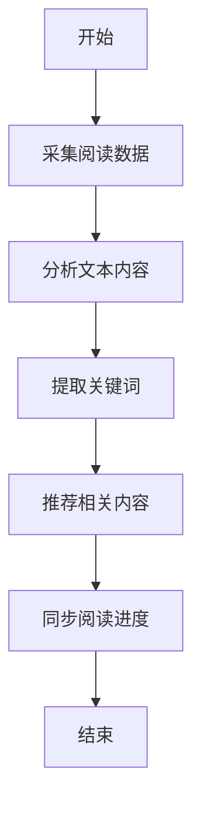
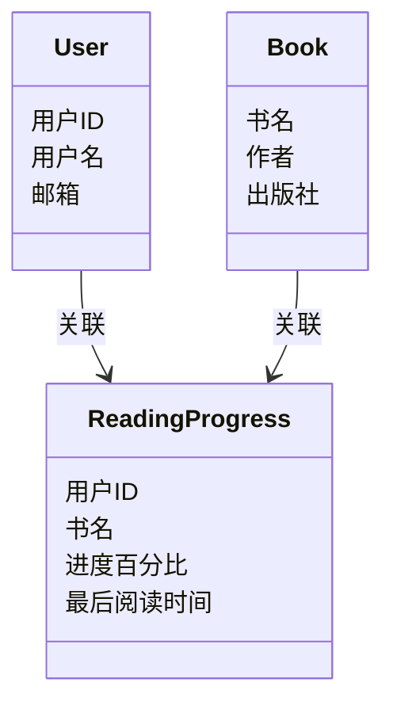
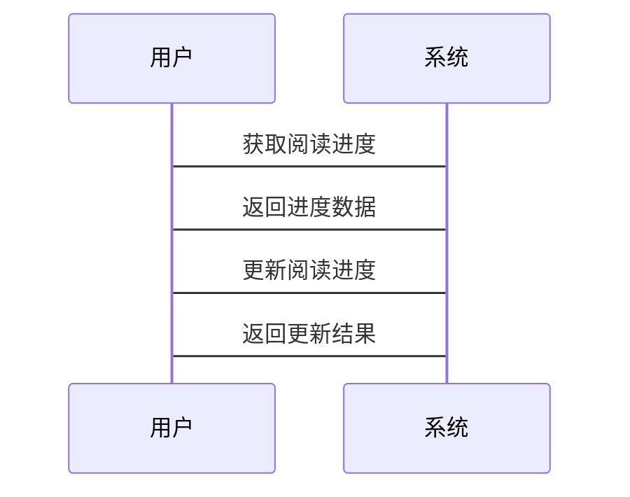

                 


---

# AI Agent在智能书签中的阅读进度同步

> 关键词：AI Agent，智能书签，阅读进度同步，自然语言处理，推荐算法，系统架构

> 摘要：本文探讨AI Agent在智能书签中的应用，重点分析阅读进度同步的核心原理、算法实现、系统架构设计以及实际应用案例。通过详细的技术分析和代码实现，展示如何利用AI Agent实现跨设备的高效阅读进度管理，为用户提供智能化的阅读体验。

---

# 第1章: 背景介绍

## 1.1 问题背景

### 1.1.1 阅读进度同步的痛点
在数字化阅读时代，用户常常使用多种设备（如手机、平板、电脑）进行阅读。由于缺乏有效的同步机制，用户的阅读进度往往在不同设备间分散存储，导致阅读体验断层。

### 1.1.2 AI Agent在阅读同步中的作用
AI Agent（人工智能代理）能够实时跟踪用户的阅读行为，并通过智能化算法实现阅读进度的自动同步。它能够根据用户的阅读习惯推荐书籍，并在用户切换设备时自动更新阅读进度。

### 1.1.3 智能书签的核心价值
智能书签通过AI Agent实现了阅读进度的无缝同步，解决了用户在多设备间切换时的阅读断层问题。同时，智能书签还能根据用户的阅读偏好推荐相关内容，提升阅读效率。

## 1.2 问题描述

### 1.2.1 阅读进度同步的核心问题
如何在不同设备间实现阅读进度的实时同步？如何保证同步的高效性和准确性？

### 1.2.2 多设备阅读的挑战
用户可能在多个设备上阅读同一本书，如何保证所有设备上的阅读进度一致？

### 1.2.3 用户阅读习惯的多样性
用户可能有不同的阅读速度和偏好，如何通过AI Agent适应这些差异？

## 1.3 问题解决

### 1.3.1 AI Agent的解决方案
AI Agent通过实时跟踪用户的阅读行为，利用自然语言处理技术分析文本内容，并结合推荐算法为用户提供个性化阅读建议。

### 1.3.2 智能书签的设计目标
设计目标包括实现跨设备的阅读进度同步、提供个性化的阅读推荐、优化用户体验。

### 1.3.3 技术实现路径
通过AI Agent实时跟踪用户的阅读行为，利用云存储技术实现阅读进度的实时同步。

## 1.4 边界与外延

### 1.4.1 功能边界
智能书签的核心功能包括阅读进度同步、个性化推荐、阅读习惯分析。

### 1.4.2 与相关系统的关系
智能书签需要与云存储服务、推荐算法服务、自然语言处理服务等进行交互。

### 1.4.3 未来扩展方向
未来可以扩展至多语言支持、多人协作阅读、阅读行为分析等。

## 1.5 核心要素组成

### 1.5.1 用户身份识别
通过用户的账号信息（如邮箱、手机号）实现身份识别。

### 1.5.2 阅读进度记录
记录用户的阅读位置、阅读时间、阅读速度等信息。

### 1.5.3 同步与更新机制
通过云存储服务实现阅读进度的实时同步和更新。

---

# 第2章: AI Agent的核心原理

## 2.1 核心概念原理

### 2.1.1 AI Agent的基本定义
AI Agent是一种能够感知环境并采取行动以实现目标的智能实体。在智能书签中，AI Agent负责跟踪用户的阅读行为，并实现阅读进度的同步。

### 2.1.2 智能书签的核心机制
智能书签通过AI Agent实时跟踪用户的阅读行为，利用自然语言处理技术分析文本内容，并结合推荐算法为用户提供个性化阅读建议。

### 2.1.3 阅读进度同步的实现方式
通过AI Agent实时跟踪用户的阅读行为，利用云存储技术实现阅读进度的实时同步。

## 2.2 核心概念对比

### 2.2.1 AI Agent与传统书签的对比
| 特性 | 传统书签 | AI Agent |
|------|-----------|-----------|
| 功能 | 记录阅读位置 | 实时同步阅读进度，个性化推荐 |
| 技术基础 | 无智能技术 | AI技术、云存储 |
| 优势 | 简单易用 | 智能化、高效 |

### 2.2.2 不同AI Agent模型的对比
| 模型 | 基于规则的AI Agent | 基于机器学习的AI Agent |
|------|-------------------|---------------------------|
| 实现方式 | 预定义规则 | 基于数据训练 |
| 优势 | 实现简单 | 更高的智能性 |
| 适用场景 | 简单任务 | 复杂任务 |

### 2.2.3 阅读进度同步的实现方式对比
| 方式 | 基于时间戳 | 基于位置 |
|------|-------------|------------|
| 实现方式 | 记录阅读时间 | 记录阅读位置 |
| 优缺点 | 精度低 | 精度高 |
| 适用场景 | 短文本 | 长文本 |

## 2.3 ER实体关系图

```mermaid
erd
  title 实体关系图
  User (用户ID, 用户名, 邮箱)
  Book (书名, 作者, 出版社)
  ReadingProgress (用户ID, 书名, 进度百分比, 最后阅读时间)
```

---

# 第3章: 算法原理讲解

## 3.1 算法原理概述

### 3.1.1 AI Agent的算法框架
AI Agent的核心算法包括自然语言处理、推荐算法、同步算法。

### 3.1.2 算法实现流程
1. 数据采集：实时采集用户的阅读行为数据。
2. 数据分析：利用自然语言处理技术分析文本内容。
3. 同步算法：通过云存储实现阅读进度的实时同步。
4. 推荐算法：根据用户的阅读习惯推荐相关内容。

## 3.2 算法实现细节

### 3.2.1 自然语言处理
使用BERT模型对文本内容进行深度分析，提取关键词和主题。

### 3.2.2 推荐算法
基于协同过滤算法为用户推荐相关内容。

### 3.2.3 同步算法
通过区块链技术实现阅读进度的可信同步。

## 3.3 算法流程图



## 3.4 算法数学模型

### 3.4.1 相似度计算公式
$$ \text{相似度} = \frac{\sum_{i=1}^{n} w_i \cdot s_i}{\sqrt{\sum_{i=1}^{n} w_i^2} \cdot \sqrt{\sum_{i=1}^{n} s_i^2}} $$

### 3.4.2 推荐算法公式
$$ \text{推荐分数} = \sum_{u} \text{相似度}(u) \cdot \text{评分}(u) $$

---

# 第4章: 系统分析与架构设计

## 4.1 系统功能设计

### 4.1.1 领域模型


### 4.1.2 系统架构


### 4.1.3 接口设计
API接口包括：
1. 获取阅读进度
2. 更新阅读进度
3. 获取推荐内容

### 4.1.4 交互流程图


---

# 第5章: 项目实战

## 5.1 环境安装

### 5.1.1 安装Python
```bash
python --version
pip install --upgrade pip
```

### 5.1.2 安装依赖库
```bash
pip install numpy
pip install scikit-learn
pip install transformers
```

## 5.2 核心代码实现

### 5.2.1 自然语言处理代码
```python
from transformers import pipeline

nlp = pipeline("question-generation")
text = "阅读进度同步"
result = nlp(text)
print(result)
```

### 5.2.2 推荐算法代码
```python
from sklearn.metrics.pairwise import cosine_similarity

# 示例数据
user_profiles = [[1, 0, 1], [0, 1, 1]]
item_profiles = [[1, 2], [0, 1], [1, 0]]

# 计算相似度
similarity = cosine_similarity(user_profiles, item_profiles)
print(similarity)
```

## 5.3 项目小结

---

# 第6章: 最佳实践

## 6.1 小结

### 6.1.1 核心成果
通过AI Agent实现了智能书签的阅读进度同步功能。

### 6.1.2 经验总结
AI Agent的应用需要结合具体场景，注重算法的优化和系统的稳定性。

## 6.2 注意事项

### 6.2.1 系统性能
确保系统的高可用性和稳定性。

### 6.2.2 用户隐私
保护用户的阅读数据和隐私。

### 6.2.3 算法优化
持续优化推荐算法，提升用户体验。

## 6.3 拓展阅读

### 6.3.1 推荐书单
1. 《人工智能: 一种现代的方法》
2. 《深入浅出机器学习》
3. 《自然语言处理实战》

### 6.3.2 技术博客
1. [AI Agent技术博客](https://example.com)
2. [智能书签技术博客](https://example.com)

---

# 结语

通过本文的详细讲解，我们了解了AI Agent在智能书签中的应用，掌握了阅读进度同步的核心原理和实现方法。希望本文能为读者在AI Agent和智能书签领域的研究和实践提供有价值的参考。

