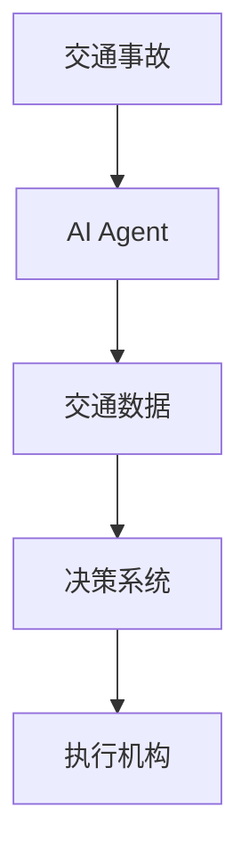
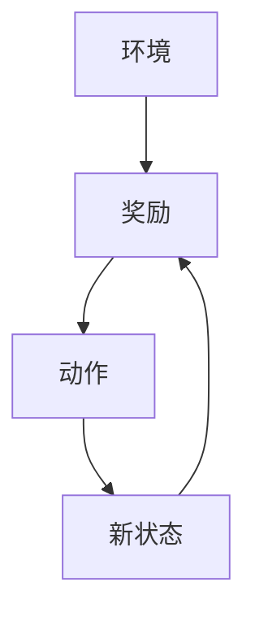
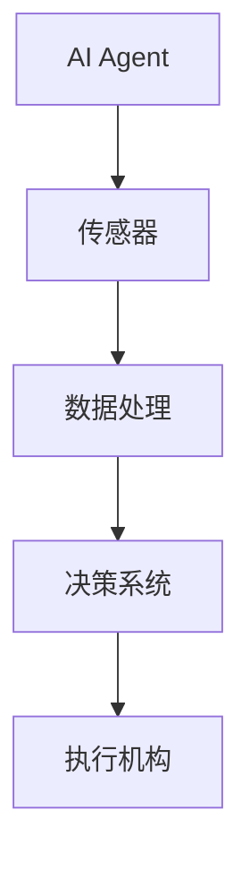
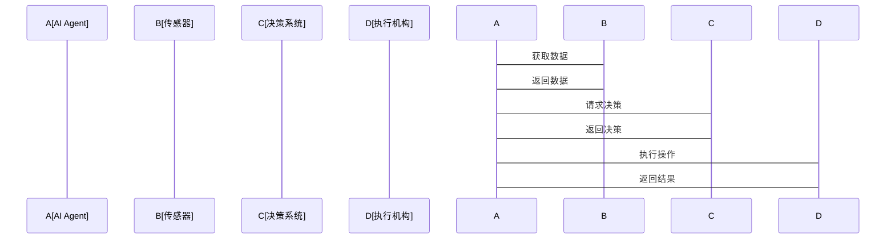

                 


# AI Agent在智能交通事故预防中的实践

> 关键词：AI Agent, 智能交通, 交通事故预防, 多智能体系统, 交通管理系统

> 摘要：本文探讨了AI Agent在智能交通事故预防中的应用，从理论到实践，系统地分析了AI Agent的核心概念、算法原理、系统架构设计以及实际案例。通过详细的技术分析和案例解读，展示了AI Agent在提升交通安全性、减少交通事故中的巨大潜力。

---

# 第一部分: AI Agent在智能交通事故预防中的背景与概念

## 第1章: AI Agent与智能交通事故预防概述

### 1.1 问题背景与描述
#### 1.1.1 交通事故的现状与挑战
现代社会，交通事故已成为全球性问题。每年因交通事故造成的人员伤亡和财产损失巨大。传统交通管理系统存在效率低下、反应迟钝等问题，难以应对复杂多变的交通场景。AI Agent作为一种智能体，能够实时感知、决策和执行，为交通事故预防提供了新的解决方案。

#### 1.1.2 AI Agent在交通领域的应用前景
AI Agent（人工智能代理）是一种能够自主感知环境、做出决策并执行任务的智能系统。在交通领域，AI Agent可以用于实时监控、危险预警、路径规划等场景，显著提升交通安全性。

#### 1.1.3 智能交通事故预防的核心问题
智能交通事故预防的核心问题是通过AI Agent实现对交通环境的实时感知、危险行为预测和主动干预。这需要解决多智能体协同、实时数据处理、复杂决策等问题。

### 1.2 AI Agent的定义与特点
#### 1.2.1 AI Agent的基本定义
AI Agent是一种智能实体，能够感知环境、自主决策并执行任务。在交通领域，AI Agent可以是自动驾驶汽车、交通管理系统或其他智能交通设备。

#### 1.2.2 AI Agent的核心特点
- **自主性**：能够自主决策，无需人工干预。
- **反应性**：能够实时感知环境并做出反应。
- **协作性**：能够与其他智能体协同工作，共同完成任务。
- **学习能力**：能够通过数据和经验不断优化自身性能。

#### 1.2.3 AI Agent与传统交通管理系统的区别
传统的交通管理系统依赖于固定的规则和硬件设施，而AI Agent能够动态适应环境，具有更强的灵活性和智能性。

### 1.3 智能交通事故预防的边界与外延
#### 1.3.1 问题解决的边界
智能交通事故预防的边界包括交通环境感知、危险预测、实时干预等。其外延则涉及交通数据的采集、处理、分析和应用。

#### 1.3.2 相关概念的扩展与外延
AI Agent在交通中的应用不仅限于事故预防，还包括交通流量优化、路线规划、智能停车管理等领域。

#### 1.3.3 核心要素与组成结构
智能交通事故预防系统的核心要素包括AI Agent、交通传感器、通信网络、数据处理系统和执行机构。

### 1.4 本章小结
本章介绍了AI Agent在智能交通事故预防中的背景、定义、特点以及应用边界。通过对比传统交通管理系统，明确了AI Agent的优势和潜力。

---

# 第二部分: AI Agent的核心概念与原理

## 第2章: AI Agent的核心概念与联系

### 2.1 核心概念原理
#### 2.1.1 AI Agent的感知与决策机制
AI Agent通过传感器和数据源感知环境，利用算法进行分析和决策。例如，自动驾驶汽车通过摄像头、雷达等传感器感知周围环境，并利用深度学习算法进行路径规划和决策。

#### 2.1.2 多智能体系统在交通中的应用
在交通场景中，多个AI Agent需要协同工作，例如自动驾驶汽车、交通信号灯控制器和路侧传感器。这些智能体需要通过通信和协作完成任务。

#### 2.1.3 AI Agent与交通数据流的关系
AI Agent通过处理交通数据流（如车流量、事故报告、天气数据等）来实现对交通环境的实时感知和决策。

### 2.2 核心概念属性特征对比
下表对比了AI Agent与其他交通管理技术的核心属性：

| **技术**       | **自主性** | **实时性** | **学习能力** |
|----------------|------------|------------|--------------|
| 传统交通系统   | 低         | 低         | 无           |
| AI Agent       | 高         | 高         | 有           |

### 2.3 ER实体关系图架构


### 2.4 本章小结
本章详细分析了AI Agent的核心概念与原理，通过对比和实体关系图展示了其在交通系统中的作用。

---

# 第三部分: AI Agent的算法原理与数学模型

## 第3章: AI Agent的算法原理

### 3.1 算法原理概述
#### 3.1.1 强化学习在AI Agent中的应用
强化学习是一种通过试错优化决策的算法。AI Agent通过与环境交互，学习最优策略。例如，自动驾驶汽车通过强化学习优化路径规划。

#### 3.1.2 决策树算法在交通场景中的应用
决策树是一种基于规则的分类算法。AI Agent可以利用决策树分析交通数据，预测危险场景并做出决策。

### 3.2 算法流程与代码实现
#### 3.2.1 强化学习算法流程


#### 3.2.2 决策树算法代码实现
```python
from sklearn.tree import DecisionTreeClassifier
import numpy as np

# 生成训练数据
X = np.random.randn(100, 5)
y = np.random.randint(0, 2, 100)

# 训练决策树模型
model = DecisionTreeClassifier()
model.fit(X, y)

# 预测
test_case = np.random.randn(1, 5)
print(model.predict(test_case))
```

### 3.3 算法的数学模型
#### 3.3.1 强化学习的数学模型
$$ R(s, a) = \text{奖励函数} $$
$$ V(s) = \max_a Q(s, a) $$
其中，$R(s, a)$表示在状态$s$和动作$a$下的奖励，$Q(s, a)$表示动作价值函数。

#### 3.3.2 决策树的数学模型
决策树的分裂标准通常使用信息增益或基尼指数。基尼指数公式为：
$$ G = \sum_{i=1}^n p_i(1 - p_i) $$
其中，$p_i$是某个子节点的样本比例。

### 3.4 本章小结
本章通过强化学习和决策树算法，详细讲解了AI Agent的算法原理，并通过代码实现和数学模型展示了其应用。

---

# 第四部分: 系统分析与架构设计

## 第4章: 系统分析与架构设计

### 4.1 系统架构设计
#### 4.1.1 系统组成
智能交通事故预防系统由AI Agent、传感器、通信网络、数据处理系统和执行机构组成。

#### 4.1.2 系统架构图


### 4.2 系统功能设计
#### 4.2.1 功能模块
- **数据采集模块**：采集交通数据。
- **数据处理模块**：对数据进行清洗和预处理。
- **决策模块**：基于AI算法做出决策。
- **执行模块**：执行决策并反馈结果。

### 4.3 系统接口设计
#### 4.3.1 数据接口
- **输入接口**：传感器数据、用户输入。
- **输出接口**：决策结果、反馈信息。

#### 4.3.2 通信接口
- **内部通信**：AI Agent与传感器、决策系统的通信。
- **外部通信**：与云端或其他智能体的通信。

### 4.4 系统交互序列图


### 4.5 本章小结
本章详细分析了智能交通事故预防系统的架构设计，包括系统组成、功能模块、接口设计和交互流程。

---

# 第五部分: 项目实战

## 第5章: 项目实战

### 5.1 环境安装与配置
#### 5.1.1 系统环境
- 操作系统：Linux/Windows/MacOS
- 开发工具：Python、Jupyter Notebook
- 依赖库：NumPy、Scikit-learn、Matplotlib

#### 5.1.2 安装步骤
```bash
pip install numpy scikit-learn matplotlib
```

### 5.2 核心代码实现
#### 5.2.1 数据采集与处理
```python
import numpy as np

# 生成模拟数据
X = np.random.randn(100, 5)
y = np.random.randint(0, 2, 100)

# 数据预处理
from sklearn.preprocessing import StandardScaler
scaler = StandardScaler()
X_scaled = scaler.fit_transform(X)
```

#### 5.2.2 AI Agent实现
```python
from sklearn.tree import DecisionTreeClassifier

# 训练决策树模型
model = DecisionTreeClassifier()
model.fit(X_scaled, y)

# 预测新案例
test_case = np.random.randn(1, 5)
test_case_scaled = scaler.transform(test_case)
print(model.predict(test_case_scaled))
```

### 5.3 案例分析
#### 5.3.1 案例描述
假设在一条繁忙的城市道路上，AI Agent需要实时监控车流量、天气状况和道路状况，预测潜在危险并做出决策。

#### 5.3.2 数据分析与结果
通过分析交通数据，AI Agent预测到前方可能出现拥堵，并建议改变路线以避免危险。

### 5.4 本章小结
本章通过实际案例展示了AI Agent在智能交通事故预防中的应用，详细解读了数据处理、模型训练和决策过程。

---

# 第六部分: 最佳实践与总结

## 第6章: 最佳实践与总结

### 6.1 最佳实践
- **数据质量**：确保数据的准确性和完整性。
- **算法选择**：根据具体场景选择合适的算法。
- **系统优化**：优化系统性能，提高响应速度。

### 6.2 小结
本文详细探讨了AI Agent在智能交通事故预防中的应用，从理论到实践，系统地分析了其核心概念、算法原理、系统架构设计和实际案例。AI Agent通过实时感知、智能决策和主动干预，显著提升了交通安全性。

### 6.3 注意事项
- AI Agent的决策依赖于数据质量和算法性能。
- 系统的安全性和可靠性是应用的关键。

### 6.4 拓展阅读
- 《强化学习入门》
- 《多智能体系统设计》
- 《智能交通系统》

### 6.5 本章小结
本章总结了AI Agent在智能交通事故预防中的应用，并提出了最佳实践和注意事项。

---

# 结语

AI Agent作为人工智能领域的前沿技术，在智能交通事故预防中的应用前景广阔。通过本文的分析和实践，我们看到了AI Agent在提升交通安全性中的巨大潜力。未来，随着技术的不断发展，AI Agent将在交通领域发挥更重要的作用。

