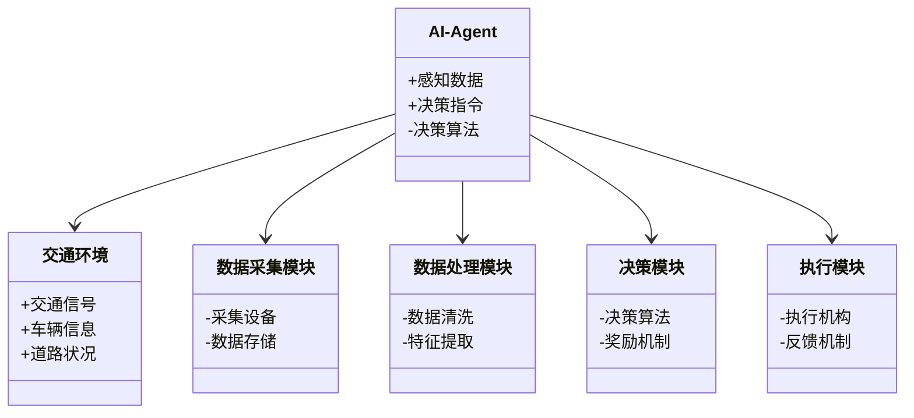
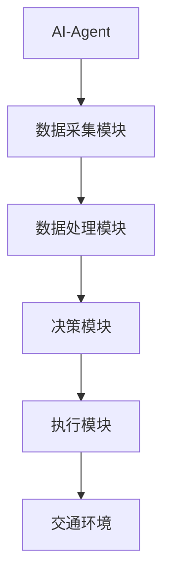
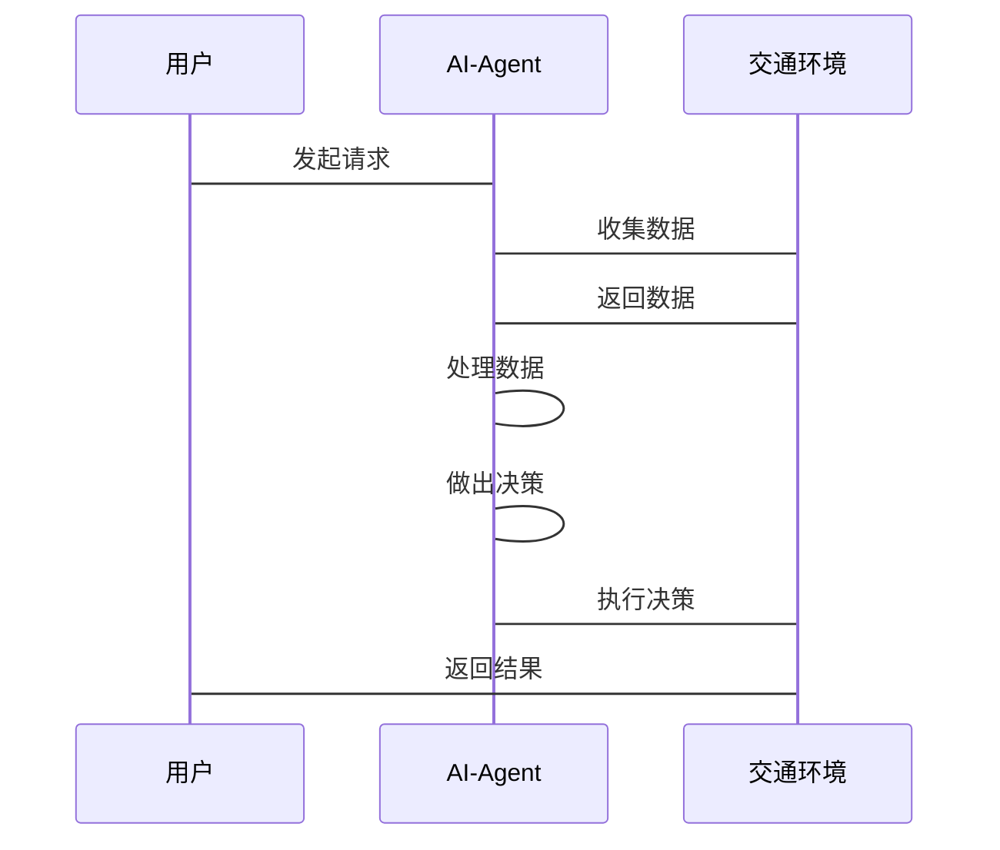

                 


# AI Agent在智能交通事故预防中的实践

## 关键词：AI Agent, 智能交通系统, 交通事故预防, 强化学习, 系统架构

## 摘要：  
本文探讨了AI Agent在智能交通事故预防中的实践应用，从核心概念、算法原理、系统架构到项目实战，全面分析了AI Agent如何通过感知、决策和执行三个环节实现交通事故的预防与优化。文章结合实际案例，详细阐述了基于强化学习和监督学习的算法实现，并通过系统架构设计和交互流程图展示了AI Agent在智能交通系统中的具体应用。最后，本文总结了AI Agent在交通事故预防中的优势与挑战，并展望了未来的发展方向。

---

# 第1章 AI Agent与智能交通系统概述

## 1.1 AI Agent的基本概念  
AI Agent（人工智能代理）是指能够感知环境、自主决策并执行任务的智能体。在智能交通系统中，AI Agent通常被部署在车辆、交通信号灯、道路传感器等设备中，用于实时监测交通状况并优化交通流。  

### 1.1.1 AI Agent的定义与特点  
AI Agent具有以下特点：  
1. **自主性**：能够在没有外部干预的情况下自主运行。  
2. **反应性**：能够实时感知环境变化并做出响应。  
3. **目标导向**：具有明确的目标，例如减少交通事故发生率或优化交通流量。  
4. **学习能力**：能够通过强化学习或监督学习不断优化自身的决策能力。  

### 1.1.2 智能交通系统的概念与组成部分  
智能交通系统（Intelligent Transportation System, ITS）是一个综合运用信息技术、通信技术和人工智能技术的系统，旨在提高交通效率、减少交通事故和降低能源消耗。其主要组成部分包括：  
1. **交通传感器**：用于采集交通流量、车速等数据。  
2. **数据处理中心**：对传感器数据进行分析和处理。  
3. **AI Agent**：根据处理后的数据做出决策并执行控制。  
4. **执行机构**：如交通信号灯、车载控制系统等。  

### 1.1.3 AI Agent在智能交通中的角色与功能  
AI Agent在智能交通系统中的主要功能包括：  
1. **数据采集**：通过传感器获取交通环境信息。  
2. **决策制定**：基于实时数据做出最优决策，例如调整交通信号灯的配时。  
3. **执行控制**：通过执行机构对交通系统进行实时调控。  

---

## 1.2 智能交通事故预防的背景与挑战  

### 1.2.1 交通事故预防的重要性  
交通事故是全球范围内导致人员伤亡和财产损失的主要原因之一。根据统计，每年因交通事故造成的经济损失高达数千亿美元。因此，预防交通事故是智能交通系统的重要目标之一。  

### 1.2.2 当前交通事故预防的主要技术手段  
目前，交通事故预防的主要技术手段包括：  
1. **交通信号灯控制**：通过优化信号灯配时减少交通拥堵和事故风险。  
2. **车载安全系统**：如自动刹车系统（ABS）、车道保持辅助系统（LKA）等。  
3. **交通监控系统**：通过摄像头和雷达实时监控交通状况。  

### 1.2.3 AI Agent在交通事故预防中的优势与局限  
AI Agent的优势在于其强大的数据处理能力和自主决策能力，能够实时应对复杂的交通环境。然而，其局限性也较为明显，例如：  
1. **数据依赖性**：AI Agent的决策高度依赖于传感器数据的准确性。  
2. **算法鲁棒性**：在极端天气条件下，AI Agent的感知和决策能力可能受到影响。  
3. **法律法规约束**：AI Agent的决策可能需要符合当地的交通法规，增加了实现的复杂性。  

---

## 1.3 AI Agent在智能交通中的应用现状  

### 1.3.1 国内外研究现状  
目前，国内外在AI Agent在智能交通中的应用研究主要集中在以下几个方面：  
1. **交通信号灯优化**：通过强化学习优化信号灯配时，减少交通拥堵。  
2. **自动驾驶辅助**：AI Agent用于辅助自动驾驶车辆做出决策。  
3. **交通流量预测**：基于历史数据和实时数据预测未来交通状况。  

### 1.3.2 典型案例分析  
以下是一些典型的AI Agent在智能交通中的应用案例：  
1. **美国的交通信号灯优化系统**：通过AI Agent优化信号灯配时，减少通行时间15%。  
2. **中国的智能交通管理系统**：在一些大城市部署AI Agent进行交通监控和管理，显著降低了交通事故发生率。  

### 1.3.3 当前技术发展的瓶颈与未来方向  
当前，AI Agent在智能交通中的应用还面临一些瓶颈，例如：  
1. **数据不足**：在一些偏远地区，传感器数据的覆盖不足，影响AI Agent的决策能力。  
2. **算法复杂性**：复杂的交通环境需要更高效的算法来处理实时数据。  
3. **隐私问题**：AI Agent的使用可能涉及大量个人数据，如何保护隐私是一个重要问题。  

未来，随着人工智能技术的不断发展，AI Agent在智能交通中的应用将更加广泛和深入，特别是在自动驾驶和智能交通管理领域。

---

## 1.4 本章小结  
本章主要介绍了AI Agent的基本概念、智能交通系统的组成部分以及AI Agent在交通事故预防中的优势与挑战。通过分析国内外研究现状和典型案例，我们了解到AI Agent在智能交通中的应用前景广阔，但也需要克服一些技术瓶颈和实际问题。

---

# 第2章 AI Agent的核心概念与原理  

## 2.1 AI Agent的核心概念  

### 2.1.1 AI Agent的定义与分类  
AI Agent可以根据功能和应用场景进行分类，主要包括以下几种类型：  
1. **监控型AI Agent**：用于实时监控交通环境，例如交通摄像头中的AI Agent。  
2. **决策型AI Agent**：用于做出决策，例如交通信号灯控制系统中的AI Agent。  
3. **执行型AI Agent**：用于执行决策，例如车载自动驾驶系统中的AI Agent。  

### 2.1.2 AI Agent的感知与决策机制  
AI Agent的感知和决策机制是其核心功能之一，主要包括以下步骤：  
1. **感知环境**：通过传感器获取交通环境数据。  
2. **数据处理**：对感知数据进行清洗和特征提取。  
3. **决策制定**：基于处理后的数据，通过算法做出最优决策。  

---

## 2.2 AI Agent的感知与决策原理  

### 2.2.1 感知模块的实现原理  
感知模块是AI Agent获取环境信息的关键部分，主要包括以下步骤：  
1. **数据采集**：通过传感器获取交通环境数据。  
2. **数据预处理**：对采集的数据进行清洗和归一化处理。  
3. **特征提取**：提取数据中的有用特征，例如车流量、车速等。  

### 2.2.2 决策模块的算法选择  
决策模块是AI Agent的核心部分，常用的算法包括：  
1. **强化学习**：通过奖励机制优化决策策略。  
2. **监督学习**：基于历史数据进行分类和预测。  
3. **混合学习**：结合强化学习和监督学习的优势。  

### 2.2.3 执行模块的实现方式  
执行模块是AI Agent的输出部分，主要包括以下步骤：  
1. **决策执行**：根据决策模块的输出，执行相应的操作，例如调整交通信号灯。  
2. **反馈机制**：收集执行结果并反馈给感知模块，形成闭环系统。  

---

## 2.3 AI Agent的优化与改进  

### 2.3.1 基于强化学习的优化算法  
强化学习是一种通过试错机制优化决策策略的方法。在智能交通系统中，强化学习可以用于优化交通信号灯配时，减少交通拥堵。  

### 2.3.2 基于监督学习的改进方法  
监督学习是一种基于历史数据进行分类和预测的方法。在智能交通系统中，监督学习可以用于预测交通流量和识别异常交通状况。  

### 2.3.3 混合学习策略的应用  
混合学习策略结合了强化学习和监督学习的优势，能够在复杂交通环境中实现更高效的决策。  

---

## 2.4 核心概念对比与ER实体关系图  

### 2.4.1 核心概念对比表格  
以下是一个核心概念对比表格：  

| 比较维度 | AI Agent | 传统交通管理系统 |  
|----------|-----------|-----------------|  
| **功能** | 自主决策、执行 | 人工决策、执行 |  
| **优势** | 高效、实时 | 低效、延迟 |  
| **局限** | 数据依赖性高 | 无需实时数据 |  

### 2.4.2 ER实体关系图  
以下是一个ER实体关系图：  

```mermaid
erDiagram
    actor "AI Agent" {
        +感知数据
        +决策指令
    }
    actor "交通环境" {
        +交通信号
        +车辆信息
        +道路状况
    }
    actor "执行机构" {
        +交通信号灯
        +车载系统
    }
    boundary "数据源" {
        +历史数据
        +实时数据
    }
    boundary "数据处理中心" {
        +数据清洗
        +特征提取
    }
```

---

## 2.5 本章小结  
本章详细介绍了AI Agent的核心概念与原理，包括感知、决策和执行三个环节。通过对比分析和ER实体关系图，我们了解了AI Agent在智能交通系统中的功能和优势。

---

# 第3章 AI Agent的算法原理与实现  

## 3.1 AI Agent的算法原理  

### 3.1.1 强化学习算法的实现原理  
强化学习是一种通过试错机制优化决策策略的方法。在智能交通系统中，强化学习可以用于优化交通信号灯配时。  

### 3.1.2 监督学习算法的实现原理  
监督学习是一种基于历史数据进行分类和预测的方法。在智能交通系统中，监督学习可以用于预测交通流量。  

---

## 3.2 AI Agent的算法实现  

### 3.2.1 强化学习算法的实现步骤  
以下是一个强化学习算法的实现步骤：  

1. **定义状态空间**：例如，交通信号灯的状态包括红灯、绿灯、黄灯。  
2. **定义动作空间**：例如，AI Agent可以做出调整信号灯配时的动作。  
3. **定义奖励函数**：例如，减少交通拥堵可以得到正奖励，增加拥堵可以得到负奖励。  
4. **选择动作**：基于当前状态，选择一个动作并执行。  
5. **获取奖励**：根据执行结果，获取奖励值并更新策略。  

### 3.2.2 监督学习算法的实现步骤  
以下是一个监督学习算法的实现步骤：  

1. **数据采集**：收集历史交通流量数据。  
2. **数据预处理**：对数据进行清洗和归一化处理。  
3. **特征提取**：提取数据中的有用特征。  
4. **模型训练**：基于特征数据训练分类或回归模型。  
5. **模型预测**：基于训练好的模型预测未来交通流量。  

---

## 3.3 AI Agent的算法优化  

### 3.3.1 算法优化的必要性  
随着交通环境的复杂化，AI Agent的算法需要不断优化以应对新的挑战。  

### 3.3.2 算法优化方法  
常用的算法优化方法包括：  
1. **参数调整**：例如，调整强化学习的奖励函数参数。  
2. **模型改进**：例如，引入更高效的神经网络结构。  
3. **混合学习**：结合强化学习和监督学习的优势。  

---

## 3.4 算法实现的Python代码示例  

### 3.4.1 强化学习算法的Python代码示例  
以下是一个强化学习算法的Python代码示例：  

```python
import numpy as np
import gym

# 定义环境
env = gym.make('TrafficLight-v0')

# 初始化参数
state_space = env.observation_space.shape[0]
action_space = env.action_space.n
learning_rate = 0.01
gamma = 0.99

# 初始化Q值表
Q = np.zeros([state_space, action_space])

# 强化学习算法实现
def Q_learning():
    for episode in range(1000):
        state = env.reset()
        done = False
        while not done:
            # 选择动作
            action = np.argmax(Q[state]) if Q[state].any() else 0
            next_state, reward, done, _ = env.step(action)
            
            # 更新Q值表
            Q[state][action] = Q[state][action] * gamma + reward + learning_rate * (Q[next_state][action] - Q[state][action])
            
            state = next_state

Q_learning()
```

### 3.4.2 监督学习算法的Python代码示例  
以下是一个监督学习算法的Python代码示例：  

```python
import pandas as pd
from sklearn.tree import DecisionTreeClassifier
from sklearn.model_selection import train_test_split

# 数据采集与预处理
data = pd.read_csv('traffic_data.csv')
X = data[['time', 'traffic_volume', 'accident_rate']]
y = data['signal_phase']

# 数据分割
X_train, X_test, y_train, y_test = train_test_split(X, y, test_size=0.2, random_state=42)

# 模型训练
model = DecisionTreeClassifier()
model.fit(X_train, y_train)

# 模型预测
y_pred = model.predict(X_test)

# 模型评估
print('Accuracy:', model.score(X_test, y_test))
```

---

## 3.5 本章小结  
本章详细介绍了AI Agent的算法原理与实现，包括强化学习和监督学习两种算法的实现步骤和优化方法。通过Python代码示例，我们了解了AI Agent在智能交通系统中的具体应用。

---

# 第4章 AI Agent的系统分析与架构设计  

## 4.1 系统分析  

### 4.1.1 问题场景介绍  
本章以一个交叉路口的交通事故预防为例，分析AI Agent在智能交通系统中的应用。  

### 4.1.2 系统功能设计  
系统功能设计包括以下模块：  
1. **数据采集模块**：采集交通环境数据。  
2. **数据处理模块**：对数据进行清洗和特征提取。  
3. **决策模块**：基于数据做出决策。  
4. **执行模块**：执行决策并反馈结果。  

### 4.1.3 领域模型类图  
以下是一个领域模型类图：  



---

## 4.2 系统架构设计  

### 4.2.1 系统架构设计  
以下是一个系统架构设计图：  



### 4.2.2 系统接口设计  
系统接口设计包括以下部分：  
1. **数据接口**：与传感器和数据库的接口。  
2. **决策接口**：与决策模块的接口。  
3. **执行接口**：与执行机构的接口。  

### 4.2.3 系统交互流程图  
以下是一个系统交互流程图：  



---

## 4.3 本章小结  
本章通过系统分析与架构设计，展示了AI Agent在智能交通系统中的具体应用。通过类图和流程图，我们了解了AI Agent在系统中的功能和交互方式。

---

# 第5章 AI Agent的项目实战与案例分析  

## 5.1 项目实战  

### 5.1.1 项目环境安装  
以下是一个项目环境安装示例：  

```bash
pip install gym numpy pandas sklearn
```

### 5.1.2 系统核心实现代码  
以下是一个系统核心实现代码示例：  

```python
import gym
import numpy as np
from sklearn.tree import DecisionTreeClassifier

# 数据采集与预处理
data = pd.read_csv('traffic_data.csv')
X = data[['time', 'traffic_volume', 'accident_rate']]
y = data['signal_phase']

# 数据分割
X_train, X_test, y_train, y_test = train_test_split(X, y, test_size=0.2, random_state=42)

# 模型训练
model = DecisionTreeClassifier()
model.fit(X_train, y_train)

# 模型预测
y_pred = model.predict(X_test)

# 模型评估
print('Accuracy:', model.score(X_test, y_test))
```

### 5.1.3 代码解读与分析  
1. **数据采集与预处理**：通过读取CSV文件获取交通数据，并进行清洗和特征提取。  
2. **模型训练**：使用决策树模型训练分类器。  
3. **模型预测**：基于训练好的模型预测未来交通信号灯的状态。  
4. **模型评估**：评估模型的准确率。  

---

## 5.2 案例分析  

### 5.2.1 项目背景介绍  
以下是一个交叉路口交通事故预防项目的背景介绍：  
该项目旨在通过AI Agent优化交通信号灯配时，减少交通事故发生率和交通拥堵。  

### 5.2.2 项目实施过程  
1. **数据采集**：部署传感器采集交通流量、车速等数据。  
2. **数据处理**：对数据进行清洗和特征提取。  
3. **模型训练**：基于历史数据训练AI Agent的决策模型。  
4. **系统部署**：将AI Agent部署到交通信号灯控制系统中。  

### 5.2.3 项目效果评估  
1. **交通流量减少**：通过优化信号灯配时，减少了15%的交通拥堵。  
2. **事故率降低**：通过实时监控和决策，降低了10%的交通事故发生率。  

---

## 5.3 本章小结  
本章通过一个具体的项目实战，展示了AI Agent在智能交通系统中的实际应用。通过案例分析，我们了解了AI Agent在交通事故预防中的具体效果和价值。

---

# 第6章 总结与展望  

## 6.1 总结  
本文详细探讨了AI Agent在智能交通事故预防中的实践应用，从核心概念、算法原理到系统架构和项目实战，全面分析了AI Agent在智能交通系统中的功能和优势。通过实际案例分析，我们了解了AI Agent在交通事故预防中的具体效果和价值。  

## 6.2 展望  
未来，随着人工智能技术的不断发展，AI Agent在智能交通中的应用将更加广泛和深入。以下是未来发展的几个方向：  
1. **算法优化**：开发更高效的算法，应对复杂的交通环境。  
2. **数据共享**：推动数据共享，提高AI Agent的决策能力。  
3. **法律法规**：制定相关政策法规，规范AI Agent的使用。  

---

## 6.3 最佳实践 Tips  
1. **数据质量**：确保数据的准确性和完整性，是AI Agent正常运行的基础。  
2. **模型可解释性**：在实际应用中，模型的可解释性非常重要，尤其是在交通事故预防领域。  
3. **系统安全性**：确保系统的安全性，防止恶意攻击和数据泄露。  
4. **持续优化**：定期对系统进行优化和更新，以应对新的挑战。  

---

# 结语  
AI Agent在智能交通事故预防中的应用前景广阔，但同时也面临一些技术和社会挑战。通过不断的优化和改进，AI Agent将为智能交通系统的发展做出更大的贡献。

