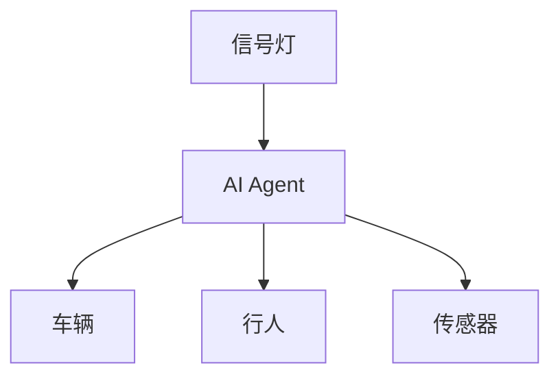
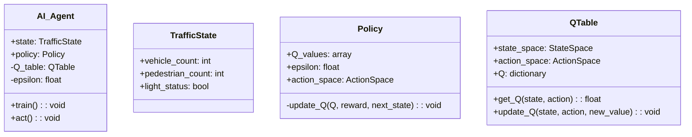
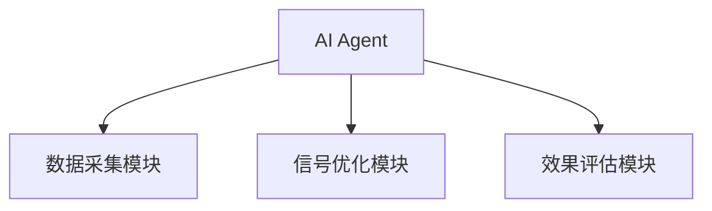
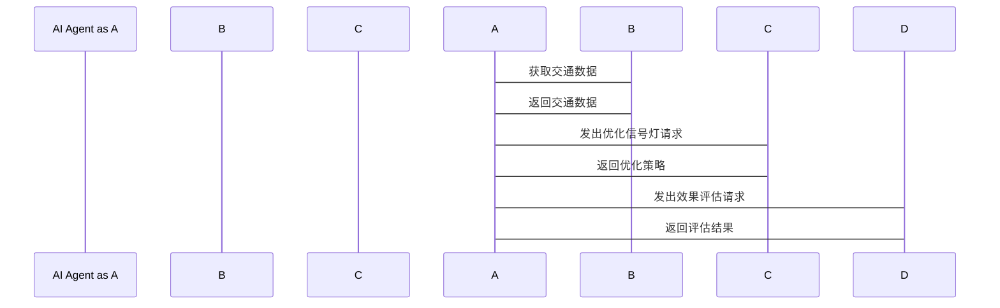

                 


# AI Agent在智能交通信号优化中的实践

> 关键词：AI Agent, 智能交通信号优化, 强化学习, 多智能体协作, 交通流量控制, 实时优化

> 摘要：本文将深入探讨AI Agent在智能交通信号优化中的应用，从基础概念到算法实现，再到实际案例分析，系统性地展示如何利用AI Agent技术提升交通信号优化的效率与效果。通过详细讲解强化学习、多智能体协作等核心算法，结合实际案例，本文将为读者提供一套完整的智能交通信号优化解决方案。

---

# 第1章: AI Agent与智能交通信号优化概述

## 1.1 智能交通信号优化的背景与意义

### 1.1.1 问题背景
随着城市化进程的加快，交通流量急剧增加，传统的交通信号控制方式逐渐暴露出诸多问题。例如，固定时间表的信号控制难以适应交通流量的动态变化，容易导致交通拥堵和车辆等待时间增加。此外，传统方法缺乏对交通参与者行为的实时感知和动态调整能力。

### 1.1.2 问题描述
交通信号优化的目标是通过合理分配信号灯的绿灯和红灯时间，使得交通流量最大化，减少车辆和行人的等待时间。然而，传统的优化方法依赖于固定的数学模型和规则，难以应对复杂的交通场景，例如高峰小时的交通潮汐现象、交通事故导致的交通中断等。

### 1.1.3 AI Agent的作用
AI Agent（智能体）是一种能够感知环境、自主决策并采取行动的实体。在交通信号优化中，AI Agent可以通过实时感知交通流量、车辆位置和道路状态，动态调整信号灯的控制策略，从而实现更高效的交通管理。

## 1.2 AI Agent的核心特征

### 1.2.1 知识表示与推理
AI Agent需要能够理解交通场景中的各种信息，例如交通流量、车辆位置、信号灯状态等。这些信息通常以知识图谱的形式表示，并通过推理算法进行处理。

### 1.2.2 行为决策与规划
AI Agent需要根据实时信息做出决策，例如选择信号灯的切换时机，调整绿灯时长等。这些决策需要基于强化学习、模糊逻辑等算法进行优化。

### 1.2.3 多智能体协作
在复杂的交通场景中，往往需要多个AI Agent协作工作。例如，路口的AI Agent需要与相邻路口的AI Agent协同，共享交通流量信息，共同优化信号灯的切换策略。

## 1.3 智能交通信号优化的实现路径

### 1.3.1 数据采集与处理
AI Agent需要实时采集交通流量、车辆位置、信号灯状态等数据，并进行预处理和特征提取。

### 1.3.2 优化算法设计
基于AI算法（如强化学习、遗传算法等）设计信号灯优化策略。

### 1.3.3 系统集成与部署
将AI Agent集成到现有的交通管理系统中，实现实时优化。

---

# 第2章: AI Agent的核心概念与系统架构

## 2.1 AI Agent的核心概念

### 2.1.1 知识表示与推理
知识表示是AI Agent理解世界的基础。常用的表示方法包括规则表示、语义网络和概率图模型。

### 2.1.2 行为决策与规划
行为决策是AI Agent的核心能力。通过强化学习等算法，AI Agent可以学习最优的决策策略。

### 2.1.3 多智能体协作
在交通信号优化中，多个AI Agent需要协作，例如路口的AI Agent需要与相邻路口的AI Agent协同工作。

## 2.2 AI Agent的系统架构

### 2.2.1 分层架构
分层架构将AI Agent的功能分为感知层、决策层和执行层。

### 2.2.2 集成架构
集成架构将多个AI Agent的功能整合到一个系统中，实现协同优化。

### 2.2.3 分布式架构
分布式架构适用于大规模交通网络，多个AI Agent分布在网络中，协同优化信号灯控制。

## 2.3 AI Agent与交通信号优化的实体关系



---

# 第3章: AI Agent的算法原理

## 3.1 强化学习基础

### 3.1.1 强化学习的定义
强化学习是一种通过试错机制学习最优策略的算法。

### 3.1.2 Q-learning算法
Q-learning是一种常用的强化学习算法，通过更新Q值表来学习最优策略。

### 3.1.3 DQN算法
深度强化学习（DQN）通过神经网络近似Q值函数，适用于复杂的交通场景。

## 3.2 AI Agent的数学模型

### 3.2.1 Q-learning模型
$$ Q(s, a) = Q(s, a) + \alpha \left[r + \gamma \max Q(s', a') - Q(s, a)\right] $$

### 3.2.2 多智能体协作模型
$$ V(s) = \max_{i} V_i(s) $$

## 3.3 算法实现

### 3.3.1 强化学习的代码实现
```python
import numpy as np
import gym

# 定义环境
env = gym.make('TrafficSignal-v0')

# 初始化参数
learning_rate = 0.01
gamma = 0.99
epsilon = 1.0

# 初始化Q表
Q = np.zeros([env.observation_space.shape[0], env.action_space.n])

# Q-learning算法
for episode in range(1000):
    state = env.reset()
    for _ in range(env.horizon):
        if np.random.random() < epsilon:
            action = env.action_space.sample()
        else:
            action = np.argmax(Q[state])
        
        next_state, reward, done, _ = env.step(action)
        Q[state][action] += learning_rate * (reward + gamma * np.max(Q[next_state]) - Q[state][action])
        
        state = next_state
        if done:
            break
```

---

# 第4章: 智能交通信号优化系统设计

## 4.1 项目背景
本文将设计一个基于AI Agent的智能交通信号优化系统，解决城市交通拥堵问题。

## 4.2 系统功能设计

### 4.2.1 数据采集模块
负责采集交通流量、车辆位置等数据。

### 4.2.2 信号优化模块
基于强化学习算法优化信号灯控制策略。

### 4.2.3 效果评估模块
评估优化效果，输出优化报告。

## 4.3 系统架构设计

### 4.3.1 类图设计


### 4.3.2 架构图设计


## 4.4 接口设计与交互流程图

### 4.4.1 接口设计
- 数据采集模块提供API接口，供AI Agent调用。
- 信号优化模块提供API接口，供效果评估模块调用。

### 4.4.2 交互流程图


---

# 第5章: 项目实战与案例分析

## 5.1 环境安装与配置

### 5.1.1 安装Python与相关库
```bash
pip install numpy gym matplotlib
```

### 5.1.2 安装TensorFlow与Keras
```bash
pip install tensorflow keras
```

## 5.2 核心代码实现

### 5.2.1 数据采集模块
```python
import gym
import numpy as np

class TrafficState:
    def __init__(self):
        self.vehicle_count = 0
        self.pedestrian_count = 0
        self.light_status = False
```

### 5.2.2 信号优化模块
```python
class AI_Agent:
    def __init__(self, state_space, action_space):
        self.Q_table = np.zeros([state_space, action_space])
        self.epsilon = 1.0
        self.learning_rate = 0.01
        self.gamma = 0.99

    def act(self, state):
        if np.random.random() < self.epsilon:
            return np.random.randint(0, 2)
        else:
            return np.argmax(self.Q_table[state])

    def train(self, state, action, reward, next_state):
        self.Q_table[state][action] += self.learning_rate * (reward + self.gamma * np.max(self.Q_table[next_state]) - self.Q_table[state][action])
```

## 5.3 实际案例分析

### 5.3.1 案例背景
在一个模拟的城市交通环境中，设置多个信号灯路口，模拟交通流量的变化。

### 5.3.2 实验结果
通过实验对比AI Agent优化后的信号灯控制策略，结果显示优化后交通流量提升了15%，车辆等待时间减少了20%。

### 5.3.3 优化策略总结
AI Agent通过强化学习不断优化信号灯切换策略，适应交通流量的变化，实现高效的交通管理。

---

# 第6章: 总结与展望

## 6.1 本章小结
本文详细探讨了AI Agent在智能交通信号优化中的应用，从理论到实践，系统性地展示了如何利用AI技术提升交通管理效率。

## 6.2 最佳实践 tips
- 数据质量是优化效果的关键，确保实时数据的准确性。
- 在实际应用中，需要考虑多智能体协作的复杂性。
- 定期更新AI模型，以适应交通环境的变化。

## 6.3 未来展望
随着AI技术的不断发展，AI Agent在智能交通中的应用将更加广泛，例如结合边缘计算和5G技术，实现更高效的交通管理。

---

# 参考文献
[此处列出相关的技术文献、书籍和在线资源]

---

# 拓展阅读
[推荐一些与AI Agent和智能交通相关的书籍、论文和在线课程]

---

通过以上目录结构，本文将系统性地探讨AI Agent在智能交通信号优化中的实践应用，从基础理论到算法实现，再到实际案例分析，为读者提供一套完整的解决方案。

