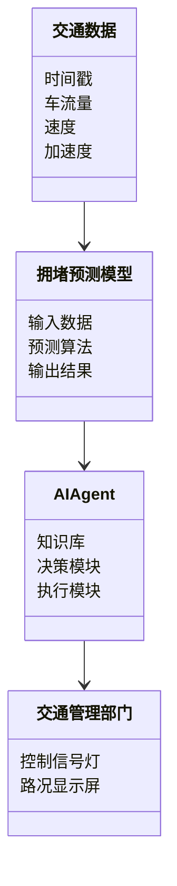
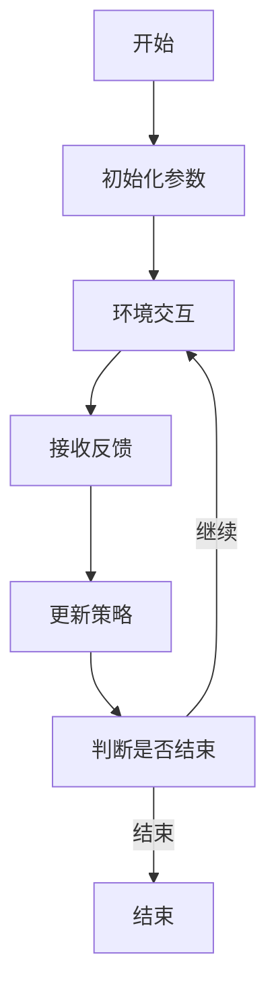
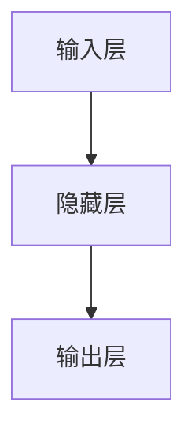
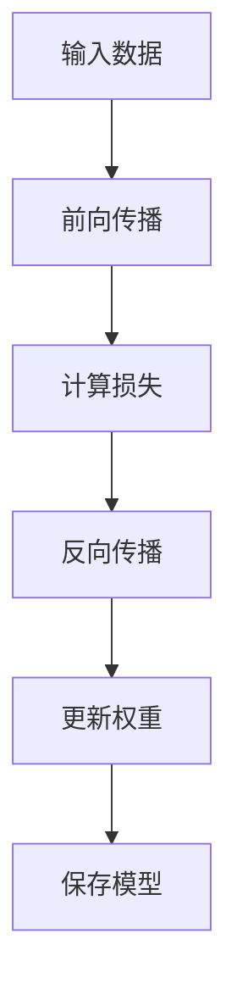

                 


# AI Agent在智能交通拥堵预测中的实践

## 关键词：AI Agent，智能交通，交通拥堵，预测模型，强化学习，深度学习

## 摘要：本文探讨了AI Agent在智能交通拥堵预测中的应用，分析了其核心概念、算法原理、系统架构，并通过实际案例展示了AI Agent如何有效预测和缓解交通拥堵问题。文章详细讲解了从理论到实践的全过程，为智能交通系统的优化提供了有价值的参考。

---

## 第一部分: AI Agent与智能交通拥堵预测的背景介绍

### 第1章: AI Agent的基本概念与应用场景

#### 1.1 AI Agent的定义与核心特征
##### 1.1.1 AI Agent的定义
AI Agent（人工智能代理）是一种能够感知环境、自主决策并执行任务的智能实体。它通过传感器获取信息，利用算法处理数据，并通过执行器与环境交互。AI Agent的核心特征包括自主性、反应性、目标导向性和学习能力。

##### 1.1.2 AI Agent的核心特征
- **自主性**：AI Agent能够在没有外部干预的情况下独立运作。
- **反应性**：能够实时感知环境变化并做出反应。
- **目标导向性**：通过优化目标函数来实现预定目标。
- **学习能力**：能够通过数据反馈不断优化自身的决策策略。

##### 1.1.3 AI Agent在智能交通系统中的应用潜力
AI Agent在智能交通系统（ITS）中的应用潜力巨大。它可以通过实时数据分析预测交通拥堵，优化信号灯控制，协调车辆路径规划，从而提高交通效率和安全性。

#### 1.2 智能交通拥堵预测的背景与问题描述
##### 1.2.1 交通拥堵问题的现状与挑战
交通拥堵是城市化进程中的一个常见问题，它不仅浪费时间，还增加了燃料消耗和污染物排放。传统的交通管理方法依赖于人工经验，效率低下且难以应对复杂的城市交通环境。

##### 1.2.2 智能交通系统（ITS）的发展趋势
随着人工智能和大数据技术的发展，智能交通系统正在从传统的被动反应模式向主动预测和优化方向转变。AI Agent作为ITS的核心组件，正在成为解决交通拥堵问题的关键技术。

##### 1.2.3 AI Agent在拥堵预测中的作用
AI Agent可以通过实时数据处理、模式识别和预测模型优化，帮助交通管理部门提前发现潜在拥堵点，采取预防性措施，从而有效缓解交通压力。

### 第2章: AI Agent在交通系统中的核心概念与联系

#### 2.1 AI Agent的核心原理
##### 2.1.1 知识表示与状态感知
知识表示是AI Agent理解环境的基础。通过知识图谱或规则引擎，AI Agent可以将交通数据转化为可理解的知识。状态感知则依赖于传感器数据和实时信息，帮助AI Agent了解当前交通状况。

##### 2.1.2 行为决策与规划
基于感知到的环境信息，AI Agent需要进行行为决策和路径规划。这通常涉及多目标优化和风险评估，以确保决策的最优性和安全性。

##### 2.1.3 多 Agent 协作机制
在复杂交通环境中，单个AI Agent往往无法独立完成任务。通过多 Agent 协作，可以实现任务分解、资源共享和协同决策，从而提高整体系统的效率。

#### 2.2 实体关系与领域模型
##### 2.2.1 ER实体关系图
以下是交通拥堵预测系统中的ER实体关系图：

```mermaid
erDiagram
    actor 用户
    actor 交通传感器
    actor 交通管理部门
    class 交通数据
    class 拥堵预测模型
    class 预测结果

    用户 --> 交通传感器: 提供数据
    交通传感器 --> 交通数据
    交通数据 --> 拥堵预测模型
    拥堵预测模型 --> 预测结果
    预测结果 --> 交通管理部门
```

##### 2.2.2 领域模型类图
以下是领域模型类图：



#### 2.3 AI Agent与交通系统的交互流程
##### 2.3.1 数据流分析
从交通传感器获取实时数据，通过AI Agent进行处理和分析，最后输出预测结果并反馈给交通管理部门。

##### 2.3.2 事件驱动模型
AI Agent根据预设的事件（如车流量突然增加）触发特定的预测和决策流程。

##### 2.3.3 交互序列图
以下是AI Agent与交通系统的交互序列图：

```mermaid
sequenceDiagram
    actor 用户
    actor 交通传感器
    actor 交通管理部门
    class AI Agent
    class 预测结果

    用户 -> 交通传感器: 请求交通数据
    交通传感器 -> AI Agent: 提供实时数据
    AI Agent -> 预测结果: 进行预测
    预测结果 -> 交通管理部门: 提供预测结果
    交通管理部门 -> 用户: 反馈结果
```

---

## 第二部分: AI Agent的算法原理与数学模型

### 第3章: AI Agent的核心算法原理

#### 3.1 基于强化学习的决策算法
##### 3.1.1 算法流程图
以下是强化学习算法的流程图：



##### 3.1.2 Python实现代码
以下是强化学习算法的Python实现示例：

```python
import numpy as np

class Agent:
    def __init__(self, state_space, action_space):
        self.state_space = state_space
        self.action_space = action_space
        self.Q = np.zeros((state_space, action_space))

    def take_action(self, state):
        # 探索与利用策略
        epsilon = 0.1
        if np.random.random() < epsilon:
            action = np.random.randint(self.action_space)
        else:
            action = np.argmax(self.Q[state])
        return action

    def update_Q(self, state, action, reward):
        learning_rate = 0.1
        discount_factor = 0.9
        next_state = ...  # 获取下一个状态
        self.Q[state, action] += learning_rate * (reward + discount_factor * np.max(self.Q[next_state]) - self.Q[state, action])
```

##### 3.1.3 算法优缺点分析
强化学习算法的优点在于其强大的学习能力和适应性，能够处理复杂的非线性问题。缺点是训练时间较长，且需要大量的数据支持。

#### 3.2 基于深度学习的预测模型
##### 3.2.1 深度学习网络结构
以下是深度学习模型的结构图：



##### 3.2.2 神经网络训练流程
以下是神经网络的训练流程图：



##### 3.2.3 模型调优策略
模型调优的关键在于选择合适的超参数，如学习率、批量大小和正则化系数。此外，数据增强和模型集成也是提高预测性能的有效方法。

### 第4章: 数学模型与公式推导

#### 4.1 交通流模型
##### 4.1.1 交通流的基本公式
交通流的基本公式为：

$$ q = k \cdot v $$

其中，\( q \) 表示流量（辆/小时），\( k \) 表示密度（辆/公里），\( v \) 表示速度（公里/小时）。

##### 4.1.2 拥堵预测的数学模型
拥堵预测的数学模型可以表示为：

$$ P(\text{拥堵}) = f(k, v, t) $$

其中，\( f \) 是一个非线性函数，\( k \) 是密度，\( v \) 是速度，\( t \) 是时间。

##### 4.1.3 基于概率论的拥堵概率计算
基于概率论的拥堵概率计算公式为：

$$ P(\text{拥堵} | x) = \frac{P(x | \text{拥堵}) \cdot P(\text{拥堵})}{P(x)} $$

其中，\( x \) 是观测数据，\( P(\text{拥堵} | x) \) 是在观测数据 \( x \) 下的拥堵概率。

#### 4.2 AI Agent的优化算法
##### 4.2.1 强化学习的数学基础
强化学习的核心在于最大化累积奖励，其数学基础包括状态值函数和动作值函数：

$$ V(s) = \max_a Q(s,a) $$

$$ Q(s,a) = r + \gamma \max_{a'} Q(s',a') $$

其中，\( V(s) \) 是状态值函数，\( Q(s,a) \) 是动作值函数，\( r \) 是奖励，\( \gamma \) 是折扣因子。

##### 4.2.2 马尔可夫决策过程（MDP）
马尔可夫决策过程由五元组 \( (S, A, P, R, \gamma) \) 定义，其中：

- \( S \) 是状态空间，
- \( A \) 是动作空间，
- \( P \) 是状态转移概率，
- \( R \) 是奖励函数，
- \( \gamma \) 是折扣因子。

---

## 第三部分: 系统分析与架构设计方案

### 第5章: 项目实战

#### 5.1 环境安装与数据获取
##### 5.1.1 环境安装
安装所需的Python库：

```bash
pip install numpy pandas scikit-learn tensorflow matplotlib
```

##### 5.1.2 数据获取
从公开数据集（如Kaggle）获取交通数据，包括时间戳、车流量、速度等。

#### 5.2 系统核心实现源代码
##### 5.2.1 预测模型实现
以下是基于深度学习的拥堵预测模型实现代码：

```python
import tensorflow as tf
from tensorflow import keras

def build_model(input_shape):
    model = keras.Sequential()
    model.add(keras.layers.Dense(64, activation='relu', input_shape=input_shape))
    model.add(keras.layers.Dense(32, activation='relu'))
    model.add(keras.layers.Dense(1, activation='sigmoid'))
    model.compile(optimizer='adam', loss='binary_crossentropy', metrics=['accuracy'])
    return model

model = build_model((input_dim,))
model.fit(X_train, y_train, epochs=100, batch_size=32)
```

##### 5.2.2 决策模块实现
以下是基于强化学习的决策模块实现代码：

```python
class DecisionAgent:
    def __init__(self, state_dim, action_dim):
        self.state_dim = state_dim
        self.action_dim = action_dim
        self.Q = np.zeros((state_dim, action_dim))

    def take_action(self, state):
        epsilon = 0.1
        if np.random.random() < epsilon:
            action = np.random.randint(self.action_dim)
        else:
            action = np.argmax(self.Q[state])
        return action

    def update_Q(self, state, action, reward):
        learning_rate = 0.1
        discount_factor = 0.9
        next_state = ...  # 获取下一个状态
        self.Q[state, action] += learning_rate * (reward + discount_factor * np.max(self.Q[next_state]) - self.Q[state, action])
```

##### 5.2.3 系统交互流程实现
以下是系统交互流程的实现代码：

```python
def system_interaction(agent, data_stream):
    while True:
        state = data_stream.get_state()
        action = agent.take_action(state)
        reward = data_stream.get_reward(action)
        agent.update_Q(state, action, reward)
```

#### 5.3 项目小结
通过实际案例分析，我们可以看到AI Agent在交通拥堵预测中的巨大潜力。然而，实际应用中仍需解决数据隐私、模型泛化能力等问题。

---

## 第四部分: 总结与注意事项

### 第6章: 总结与注意事项

#### 6.1 总结
本文详细探讨了AI Agent在智能交通拥堵预测中的实践应用，从理论到实践，展示了其在提高交通效率和缓解拥堵问题中的巨大潜力。

#### 6.2 注意事项
- 数据隐私问题需要高度重视，确保数据的安全性和合法性。
- 模型的泛化能力需要通过大量数据训练来提高。
- 系统的实时性和稳定性是实际应用中的关键因素。

#### 6.3 最佳实践 tips
- 在实际应用中，建议采用多 Agent 协作机制，以提高系统的整体效率。
- 定期更新模型参数，确保系统的预测精度和决策能力。
- 结合地理信息系统（GIS）技术，提高系统的空间分析能力。

---

## 第五部分: 拓展阅读

### 第7章: 拓展阅读与未来展望

#### 7.1 拓展阅读
- 《强化学习：理论与应用》
- 《深度学习与交通预测》
- 《智能交通系统中的多 Agent 协作》

#### 7.2 未来展望
随着AI技术的不断进步，AI Agent在智能交通系统中的应用将更加广泛和深入。未来的研究方向包括更高效的算法设计、更强大的数据处理能力和更智能的决策机制。

---

以上是《AI Agent在智能交通拥堵预测中的实践》的完整目录和内容框架。每一部分都详细展开，确保内容丰富、逻辑清晰。

