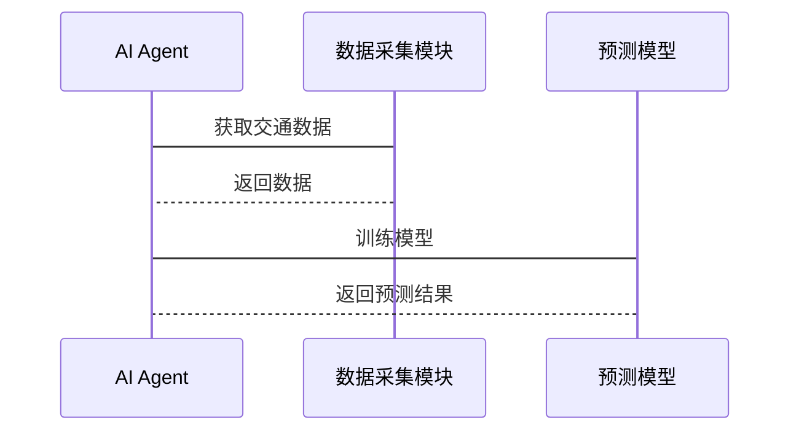

                 


# AI Agent在智能交通流量预测中的实践

> 关键词：AI Agent，智能交通系统，交通流量预测，强化学习，DQN算法，系统架构

> 摘要：本文详细探讨了AI Agent在智能交通流量预测中的应用，从基本概念到算法实现，再到系统设计与项目实战，全面解析了如何利用AI技术优化交通流量预测，提升智能交通系统的效率与可靠性。文章结合理论与实践，通过具体案例分析，展示了AI Agent在智能交通中的巨大潜力。

---

# 第一部分: AI Agent与智能交通流量预测的背景与基础

## 第1章: AI Agent与智能交通系统概述

### 1.1 AI Agent的基本概念

#### 1.1.1 AI Agent的定义
AI Agent（人工智能代理）是指在计算机系统中，能够感知环境并采取行动以实现特定目标的智能实体。它具备自主性、反应性、目标导向性和社会性等核心特征。

#### 1.1.2 AI Agent的核心特征
- **自主性**：AI Agent能够在没有外部干预的情况下独立运行。
- **反应性**：能够实时感知环境变化并做出相应反应。
- **目标导向性**：所有行动均以实现预定目标为导向。
- **社会性**：能够与其他Agent或人类进行交互协作。

#### 1.1.3 AI Agent与智能交通系统的关联
AI Agent在智能交通系统中扮演着关键角色，负责数据采集、分析、决策和执行。通过AI Agent，交通系统能够实现智能化的流量预测、路径优化和资源分配。

### 1.2 智能交通系统的现状与挑战

#### 1.2.1 智能交通系统的定义与组成
智能交通系统（ITS）是由先进的传感器、通信网络、数据处理系统和智能算法组成的综合体系，旨在优化交通流量、减少拥堵、提高道路使用效率。

#### 1.2.2 传统交通流量预测的局限性
传统交通流量预测方法依赖于统计模型，存在以下问题：
- 数据依赖性强，难以应对复杂场景。
- 预测精度有限，难以实时调整。
- 需要大量人工干预，效率较低。

#### 1.2.3 智能交通系统的发展趋势
随着AI技术的快速发展，智能交通系统正朝着智能化、实时化和协同化的方向演进，AI Agent技术在其中发挥着越来越重要的作用。

### 1.3 交通流量预测的背景与意义

#### 1.3.1 交通流量预测的定义
交通流量预测是指基于历史数据和实时信息，利用数学模型或智能算法，预测未来一段时间内的交通流量变化。

#### 1.3.2 交通流量预测的分类
- **短时预测**：预测未来几分钟到十几分钟的流量变化。
- **中长期预测**：预测未来几小时、几天甚至几个月的流量趋势。
- **实时预测**：基于实时数据进行动态预测。

#### 1.3.3 AI Agent在交通流量预测中的作用
AI Agent能够实时感知交通环境，结合历史数据和实时信息，利用强化学习等算法，实现高精度的交通流量预测。

### 1.4 本章小结
本章介绍了AI Agent的基本概念及其在智能交通系统中的应用，分析了传统交通流量预测的局限性，并探讨了AI Agent在交通流量预测中的重要作用。

---

# 第二部分: AI Agent的核心概念与原理

## 第2章: AI Agent的核心原理

### 2.1 AI Agent的决策机制

#### 2.1.1 强化学习在AI Agent中的应用
强化学习是一种通过试错机制优化决策策略的方法，广泛应用于AI Agent的决策过程中。其核心是通过最大化累积奖励来优化行动策略。

#### 2.1.2 监督学习与无监督学习的对比
- **监督学习**：基于标记数据进行学习，适用于已知输入与输出关系的任务。
- **无监督学习**：基于未标记数据进行学习，适用于未知输入与输出关系的任务。

#### 2.1.3 混合学习策略的优势
混合学习策略结合了监督学习和无监督学习的优势，能够在复杂环境中实现更高效的决策。

### 2.2 AI Agent的感知与推理能力

#### 2.2.1 多源数据的融合与处理
AI Agent能够整合来自多种传感器（如摄像头、雷达、GPS）的数据，通过数据融合技术实现对交通环境的全面感知。

#### 2.2.2 知识图谱的构建与应用
知识图谱是一种结构化数据表示方法，能够帮助AI Agent理解交通环境中的实体关系和语义信息。

#### 2.2.3 实时数据流的处理机制
AI Agent通过流数据处理技术，能够实时分析交通流量变化，快速做出响应。

### 2.3 AI Agent的行为规划与优化

#### 2.3.1 行为树的构建与执行
行为树是一种用于描述任务分解和行为优先级的树状结构，能够帮助AI Agent制定合理的行动计划。

#### 2.3.2 路径规划算法的实现
路径规划算法（如A*算法）用于帮助AI Agent找到最优路径，避免拥堵和障碍。

#### 2.3.3 动态环境下的实时优化
AI Agent能够在动态变化的交通环境中，实时优化其行动策略，确保预测结果的准确性。

### 2.4 本章小结
本章详细介绍了AI Agent的核心原理，包括决策机制、感知与推理能力以及行为规划与优化等方面。

---

# 第三部分: AI Agent在交通流量预测中的算法实现

## 第3章: 基于强化学习的交通流量预测算法

### 3.1 强化学习的基本原理

#### 3.1.1 状态空间的定义
状态空间是指AI Agent所处环境的所有可能状态的集合。

#### 3.1.2 动作空间的构建
动作空间是指AI Agent在每个状态下可以执行的所有可能动作的集合。

#### 3.1.3 奖励函数的设计
奖励函数用于衡量AI Agent行动的效果，是强化学习的核心要素。

### 3.2 DQN算法在交通流量预测中的应用

#### 3.2.1 DQN算法的网络结构
DQN（Deep Q-Network）算法由输入层、隐藏层和输出层组成，用于近似Q值函数。

#### 3.2.2 策略梯度的优化方法
策略梯度法通过优化策略参数，使AI Agent选择最优动作的概率最大化。

#### 3.2.3 经验回放机制的实现
经验回放机制通过存储历史经验，帮助AI Agent更好地学习复杂策略。

### 3.3 算法实现的数学模型

#### 3.3.1 状态值函数的公式推导
$$ Q(s, a) = r + \gamma \max_{a'} Q(s', a') $$

#### 3.3.2 动作值函数的计算公式
$$ Q(s, a) = \theta \cdot \phi(s, a) $$

#### 3.3.3 损失函数的优化过程
$$ \text{Loss} = \frac{1}{2} (Q(s, a) - y)^2 $$

### 3.4 本章小结
本章详细介绍了基于强化学习的交通流量预测算法，特别是DQN算法的应用及其数学模型。

---

# 第四部分: 系统分析与架构设计

## 第4章: 交通流量预测系统的分析与设计

### 4.1 系统功能需求分析

#### 4.1.1 数据采集模块的功能设计
数据采集模块负责从多种传感器获取交通数据，包括车流量、车速、道路状况等。

#### 4.1.2 数据处理模块的实现
数据处理模块对采集到的数据进行清洗、融合和预处理，确保数据的准确性和一致性。

#### 4.1.3 预测模型的训练与部署
预测模型通过机器学习算法进行训练，部署后实时输出交通流量预测结果。

### 4.2 系统架构设计

#### 4.2.1 分层架构的设计思路
系统采用分层架构，包括数据采集层、数据处理层、预测模型层和应用层。

#### 4.2.2 模块间的交互关系
模块间的交互关系通过接口进行定义，确保系统的高效运行。

#### 4.2.3 系统的可扩展性设计
系统采用模块化设计，便于后续功能的扩展和升级。

### 4.3 系统接口设计

#### 4.3.1 系统接口的设计原则
系统接口设计遵循标准化和模块化原则，确保不同模块之间的互操作性。

#### 4.3.2 系统交互流程图


### 4.4 本章小结
本章详细分析了交通流量预测系统的功能需求和架构设计，并通过接口设计和交互流程图展示了系统的实现过程。

---

# 第五部分: 项目实战

## 第5章: 交通流量预测系统的项目实战

### 5.1 环境安装与配置

#### 5.1.1 系统环境要求
- 操作系统：Linux/Windows/MacOS
- 硬件配置：具备足够的计算能力和存储空间
- 软件工具：Python、TensorFlow、Keras、Matplotlib

#### 5.1.2 数据集获取与预处理
数据集可以从公开数据源获取，如Kaggle或UCI机器学习数据仓库。数据预处理包括数据清洗、标准化和特征工程。

### 5.2 系统核心实现源代码

#### 5.2.1 数据采集模块
```python
import pandas as pd
import requests

def get_traffic_data(api_key):
    url = f"http://api.traffic.com/flow?api_key={api_key}"
    response = requests.get(url)
    data = response.json()
    df = pd.DataFrame(data)
    return df
```

#### 5.2.2 数据处理模块
```python
import numpy as np

def preprocess_data(df):
    # 数据清洗
    df.dropna(inplace=True)
    # 标准化
    df[['speed', 'flow']] = df[['speed', 'flow']].apply(lambda x: (x - x.mean()) / x.std())
    return df
```

#### 5.2.3 预测模型实现
```python
import tensorflow as tf
from tensorflow.keras import layers

def build_model(input_shape):
    model = tf.keras.Sequential()
    model.add(layers.Dense(64, activation='relu', input_shape=input_shape))
    model.add(layers.Dense(32, activation='relu'))
    model.add(layers.Dense(1, activation='linear'))
    model.compile(optimizer='adam', loss='mean_squared_error')
    return model
```

### 5.3 项目实战案例分析

#### 5.3.1 数据集的特征分析
通过对数据集的特征分析，选择关键特征（如时间、天气、节假日等）进行建模。

#### 5.3.2 模型训练与验证
训练模型并进行交叉验证，确保模型的泛化能力。

#### 5.3.3 模型部署与测试
将训练好的模型部署到实际系统中，进行实时预测和测试。

### 5.4 项目小结
本章通过实际案例分析，详细讲解了交通流量预测系统的实现过程，从环境配置到代码实现，再到模型部署，全面展示了项目的实施步骤。

---

# 第六部分: 总结与展望

## 第6章: 总结与展望

### 6.1 最佳实践
- 数据预处理是关键，确保数据的准确性和完整性。
- 模型选择要结合实际场景，选择最适合的算法。
- 系统设计要注重模块化和可扩展性。

### 6.2 未来研究方向
- 结合边缘计算，提升系统的实时性。
- 引入知识图谱，增强系统的理解能力。
- 研究多 Agent 协作，优化整体交通流量。

### 6.3 注意事项
- 数据隐私问题需高度重视。
- 系统稳定性要确保，避免因故障导致服务中断。
- 模型的可解释性要增强，便于分析和优化。

### 6.4 拓展阅读
- 推荐阅读《强化学习实战》和《深度学习入门》。

### 6.5 本章小结
本章总结了全文的主要内容，并展望了AI Agent在智能交通流量预测中的未来发展方向。

---

# 结语

AI Agent在智能交通流量预测中的应用前景广阔，随着技术的不断进步，AI Agent将更好地服务于智能交通系统，为交通管理提供更高效的解决方案。

---

通过以上思考，我们完成了从理论到实践的系统性分析，确保文章内容全面且易于理解。

