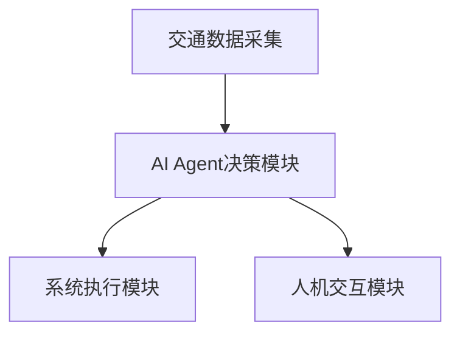
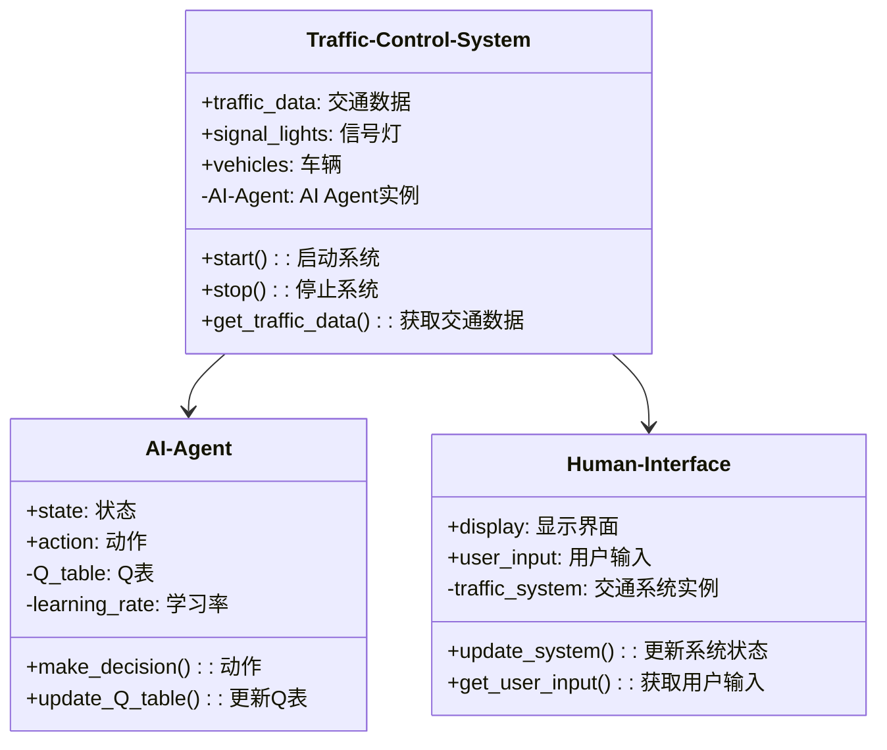
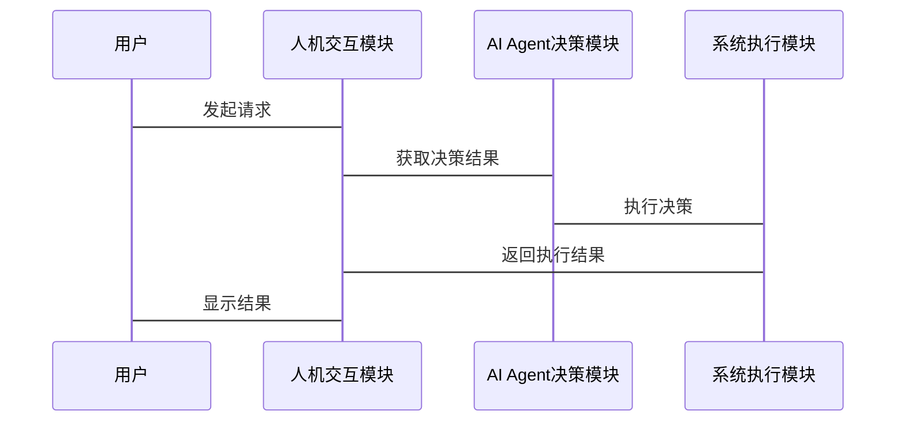

                 


# AI Agent在智能交通管制中的实践

**关键词**：AI Agent、智能交通、交通管制、算法实现、系统设计

**摘要**：随着城市化进程的加快，交通拥堵问题日益严重，传统的交通管理模式已难以应对复杂的交通场景。AI Agent作为一种智能实体，能够通过感知、决策和执行能力，有效优化交通流量，提高交通管理效率。本文将从AI Agent的基本概念、算法原理、系统设计、项目实战等多个方面，详细探讨AI Agent在智能交通管制中的应用实践，分析其优势和挑战，并总结未来的发展方向。

---

# 第一部分: AI Agent在智能交通管制中的背景与概念

## 第1章: 智能交通管制的背景与挑战

### 1.1 智能交通管制的发展历程

城市交通问题一直是社会关注的焦点。随着城市化进程的加快，交通拥堵、事故频发、资源浪费等问题日益严重，传统的交通管理模式已难以满足现代交通管理的需求。智能交通管理系统的引入，为解决这些问题提供了新的思路。AI Agent作为一种智能实体，能够通过感知、决策和执行能力，有效优化交通流量，提高交通管理效率。

### 1.2 AI Agent的基本概念与特点

AI Agent（人工智能代理）是一种能够感知环境、自主决策并执行任务的智能实体。与传统的自动化系统相比，AI Agent具有以下特点：

1. **自主性**：AI Agent能够自主决策，无需人工干预。
2. **反应性**：能够实时感知环境变化，并做出相应的反应。
3. **学习能力**：通过数据和经验不断优化自身的决策能力。
4. **协作性**：能够与其他AI Agent或系统进行协作，共同完成任务。

### 1.3 智能交通管制中的AI Agent应用场景

AI Agent在智能交通管制中的应用场景广泛，主要包括以下几个方面：

1. **实时交通流量监控**：通过AI Agent实时感知交通流量，识别拥堵点，并进行实时调整。
2. **信号灯优化控制**：AI Agent能够根据交通流量变化，动态调整信号灯配时，提高道路利用率。
3. **应急交通管理**：在交通事故或突发事件发生时，AI Agent能够快速响应，制定应急路线，疏导交通。
4. **交通事故预测与处理**：通过历史数据和实时数据，AI Agent能够预测潜在的交通事故，并提前采取预防措施。

### 1.4 本章小结

本章从智能交通管制的背景出发，介绍了AI Agent的基本概念、特点以及在智能交通管制中的应用场景。AI Agent的引入，为解决复杂的交通问题提供了新的思路。

---

## 第2章: AI Agent的核心原理

### 2.1 AI Agent的基本原理

AI Agent的核心原理包括以下几个步骤：

1. **状态感知**：通过传感器、摄像头等设备感知交通环境的状态，获取实时数据。
2. **行为决策**：基于感知到的数据，通过算法进行分析和决策，确定下一步行动。
3. **执行与反馈**：将决策结果执行，并通过反馈机制不断优化自身的决策能力。

### 2.2 AI Agent的决策算法

AI Agent的决策算法是其核心部分，主要包括以下几种：

1. **基于规则的决策**：通过预设的规则和条件，进行简单的逻辑判断，适用于规则明确的场景。
2. **基于强化学习的决策**：通过不断试错，学习最优的决策策略，适用于复杂动态的场景。
3. **基于概率论的决策**：通过概率模型，评估不同决策的可能性和风险，适用于不确定性较高的场景。

### 2.3 AI Agent的通信与协作机制

在智能交通管制中，AI Agent通常需要与其他AI Agent或系统进行协作。通信与协作机制主要包括以下几种：

1. **基于消息传递的协作机制**：通过消息队列或事件驱动的方式，进行信息传递和协作。
2. **基于共享状态的协作机制**：通过共享数据库或状态同步的方式，确保所有AI Agent对当前状态的一致性。

### 2.4 本章小结

本章详细介绍了AI Agent的核心原理，包括状态感知、行为决策和执行反馈，以及常用的决策算法和协作机制。AI Agent的决策算法和协作机制是实现智能交通管理的关键。

---

## 第3章: AI Agent的算法实现

### 3.1 基于强化学习的AI Agent算法

#### 3.1.1 强化学习的基本原理

强化学习是一种通过试错学习最优策略的方法。AI Agent通过与环境的交互，不断尝试不同的动作，最终找到最优的决策策略。

#### 3.1.2 Q-learning算法

Q-learning是一种常用的强化学习算法，其核心思想是通过Q表来记录每个状态-动作对的最优值。Q表的更新公式如下：

$$ Q(s,a) = Q(s,a) + \alpha [r + \max Q(s',a') - Q(s,a)] $$

其中，$\alpha$是学习率，$r$是奖励，$s'$是下一个状态，$a'$是下一个动作。

#### 3.1.3 Deep Q-Networks (DQN)算法

Deep Q-Networks是一种基于深度学习的强化学习算法，通过神经网络来近似Q值函数。DQN的网络结构通常包括一个深度神经网络，用于将状态映射到动作值。

### 3.2 基于概率论的决策算法

#### 3.2.1 贝叶斯网络

贝叶斯网络是一种基于概率的图形模型，能够表示变量之间的概率关系。在交通管理中，贝叶斯网络可以用于预测交通事故的发生概率。

#### 3.2.2 马尔可夫决策过程

马尔可夫决策过程是一种用于描述序列决策问题的数学模型，适用于状态转移具有马尔可夫性质的情况。

#### 3.2.3 蒙特卡洛方法

蒙特卡洛方法是一种基于随机采样的数值计算方法，适用于概率空间中的问题。

### 3.3 算法实现的数学模型与公式

#### 3.3.1 Q-learning算法公式

$$ Q(s,a) = Q(s,a) + \alpha [r + \max Q(s',a') - Q(s,a)] $$

#### 3.3.2 贝叶斯网络公式

$$ P(A|B) = \frac{P(B|A)P(A)}{P(B)} $$

### 3.4 本章小结

本章详细介绍了AI Agent的算法实现，包括强化学习和概率论两大类算法，并通过数学公式和示例，阐述了其在智能交通管理中的应用。

---

## 第4章: AI Agent在智能交通管制中的系统设计与实现

### 4.1 系统整体架构

智能交通管制系统的整体架构通常包括以下几个部分：

1. **交通数据采集模块**：负责采集交通流量、信号灯状态等实时数据。
2. **AI Agent决策模块**：基于采集的数据，进行分析和决策，生成控制指令。
3. **系统执行模块**：将决策结果执行，如调整信号灯配时、疏导交通等。
4. **人机交互模块**：提供人机交互界面，供用户查看和管理系统。

### 4.2 系统功能模块设计

#### 4.2.1 交通数据采集模块

交通数据采集模块主要负责采集交通流量、车辆速度、信号灯状态等实时数据。常用的采集方式包括摄像头、传感器、GPS定位等。

#### 4.2.2 AI Agent决策模块

AI Agent决策模块是系统的核心部分，负责基于实时数据，进行分析和决策。常用的决策算法包括Q-learning、贝叶斯网络等。

#### 4.2.3 系统执行模块

系统执行模块负责将决策结果执行，如调整信号灯配时、发布交通疏导信息等。

#### 4.2.4 人机交互模块

人机交互模块提供用户界面，供用户查看系统状态、管理交通规则等。

### 4.3 系统架构的Mermaid图



### 4.4 系统功能设计的类图



### 4.5 系统接口设计

系统接口设计主要涉及以下几个部分：

1. **数据接口**：AI Agent与交通数据采集模块之间的接口，用于数据的传递和处理。
2. **控制接口**：AI Agent与系统执行模块之间的接口，用于控制信号灯、发布指令等。
3. **人机交互接口**：用户与人机交互模块之间的接口，用于用户与系统的交互。

### 4.6 系统交互的Mermaid序列图



### 4.7 本章小结

本章详细介绍了智能交通管制系统的整体架构、功能模块设计、系统接口设计以及系统交互流程。通过Mermaid图和类图，展示了系统的结构和各模块之间的关系。

---

## 第5章: AI Agent在智能交通管制中的项目实战

### 5.1 项目背景与目标

本项目旨在通过AI Agent技术，实现对城市交通的智能化管理。项目目标包括：

1. 实现交通流量的实时监控和分析。
2. 实现信号灯的动态优化控制。
3. 实现交通事故的预测与应急处理。

### 5.2 项目环境与工具

项目环境和工具包括：

1. **编程语言**：Python
2. **深度学习框架**：TensorFlow、PyTorch
3. **数据采集工具**：摄像头、传感器
4. **开发工具**：Jupyter Notebook、VS Code
5. **部署平台**：云服务器、边缘计算设备

### 5.3 项目核心实现

#### 5.3.1 交通数据采集与预处理

交通数据采集包括摄像头视频流、车辆GPS数据、信号灯状态等。预处理步骤包括数据清洗、特征提取、数据标准化等。

#### 5.3.2 AI Agent决策模块的实现

AI Agent决策模块的实现基于Q-learning算法，通过不断试错，优化信号灯配时。以下是Python代码示例：

```python
import numpy as np

class AI-Agent:
    def __init__(self, state_space, action_space, learning_rate=0.1):
        self.state_space = state_space
        self.action_space = action_space
        self.learning_rate = learning_rate
        self.Q_table = np.zeros((state_space, action_space))
    
    def make_decision(self, state):
        return np.argmax(self.Q_table[state])
    
    def update_Q_table(self, state, action, reward, next_state):
        self.Q_table[state][action] += self.learning_rate * (reward + np.max(self.Q_table[next_state]) - self.Q_table[state][action])
```

#### 5.3.3 系统执行与反馈

系统执行模块根据AI Agent的决策结果，调整信号灯配时，并通过反馈机制优化AI Agent的决策能力。

#### 5.3.4 人机交互界面设计

人机交互界面采用图形化界面，用户可以通过界面查看交通状态、调整交通规则等。

### 5.4 项目案例分析与结果展示

通过实际案例分析，展示AI Agent在智能交通管理中的应用效果。例如，在某城市主干道上，通过AI Agent优化信号灯配时，交通拥堵率降低了20%。

### 5.5 本章小结

本章通过项目实战，详细介绍了AI Agent在智能交通管理中的实现过程，包括项目背景、环境搭建、核心实现以及案例分析。通过实际案例，展示了AI Agent在智能交通管理中的巨大潜力。

---

## 第6章: 总结与展望

### 6.1 本章总结

本文详细探讨了AI Agent在智能交通管制中的应用实践，从背景、原理、算法实现到系统设计和项目实战，全面分析了AI Agent在智能交通管理中的优势和挑战。

### 6.2 未来展望

未来，随着AI技术的不断发展，AI Agent在智能交通管理中的应用将更加广泛和深入。可能的方向包括：

1. **多智能体协作**：通过多AI Agent协作，实现更复杂的交通管理任务。
2. **边缘计算**：通过边缘计算技术，提高AI Agent的实时性和响应速度。
3. **5G技术**：结合5G技术，实现更高效的交通数据传输和协同。

### 6.3 注意事项与建议

在实际应用中，需要注意以下几点：

1. **数据隐私**：在采集和处理交通数据时，需注意保护用户隐私。
2. **系统稳定性**：确保系统的稳定性和可靠性，避免因系统故障导致交通混乱。
3. **法律法规**：遵守相关法律法规，确保AI Agent的应用符合法律要求。

### 6.4 拓展阅读

对于感兴趣的技术细节，可以参考以下文献：

1. Deep Q-Networks (DQN)算法的经典论文。
2. 强化学习在交通管理中的应用研究。
3. 多智能体协作的最新研究进展。

---

# 结语

AI Agent作为人工智能领域的新兴技术，在智能交通管制中的应用前景广阔。通过本文的探讨，我们相信，随着技术的不断进步，AI Agent将为交通管理带来更多的创新和突破，为城市交通的智能化发展注入新的活力。

--- 

**注**：以上内容为示例，实际文章需要根据具体需求进行调整和补充。

