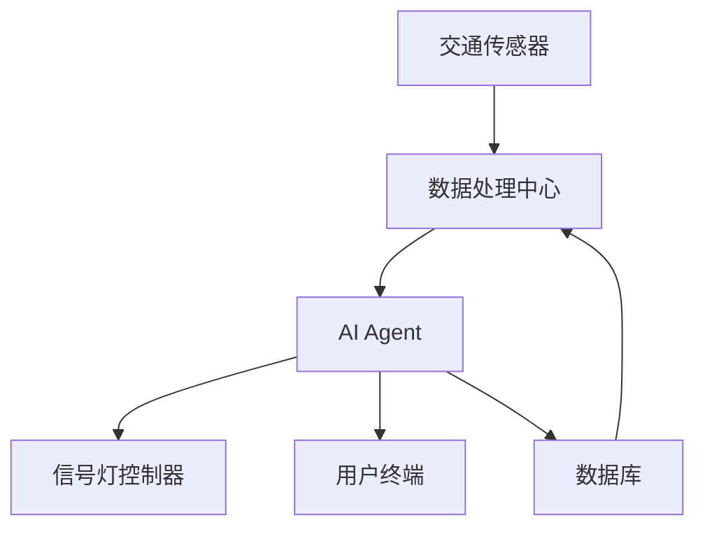
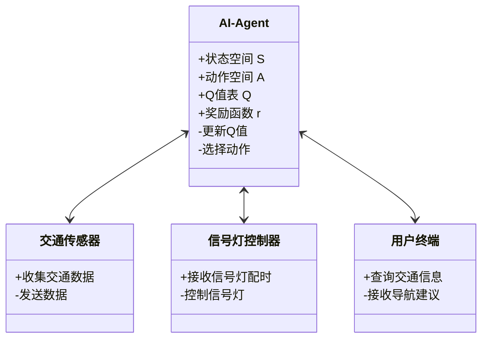
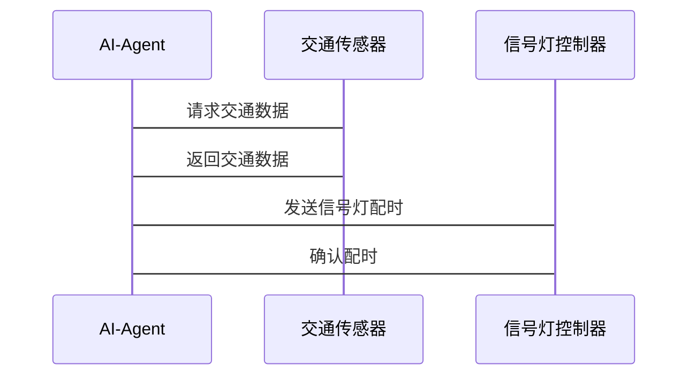

                 


# AI Agent在智能交通管理中的实践

> 关键词：AI Agent，智能交通管理，强化学习，多智能体系统，智能信号灯控制，交通流量预测

> 摘要：随着城市化进程的加快和交通流量的不断增加，传统的交通管理方式已经难以应对日益复杂的交通问题。AI Agent作为一种智能化的解决方案，在智能交通管理中发挥着越来越重要的作用。本文从AI Agent的基本概念出发，深入探讨其在智能交通管理中的应用场景、核心技术、算法原理、系统架构以及实际案例。通过详细分析AI Agent在交通流量预测、路况实时监测、智能信号灯控制和自动驾驶辅助中的应用，本文旨在为智能交通管理的实践提供理论支持和技术指导。

---

## 第1章 AI Agent与智能交通管理概述

### 1.1 AI Agent的基本概念

AI Agent（人工智能代理）是一种能够感知环境、自主决策并执行任务的智能实体。AI Agent的核心特点包括自主性、反应性、目标导向性和社交能力。在智能交通管理中，AI Agent通常以软件形式存在，通过传感器、摄像头和其他数据源获取交通信息，利用算法进行分析和决策，从而优化交通流量和提升道路使用效率。

**AI Agent的核心要素与分类**

- **核心要素**：状态感知、决策逻辑、执行动作、反馈机制。
- **分类**：基于功能可分为监视型Agent、控制型Agent和协作型Agent；基于智能水平可分为反应式Agent、认知式Agent和混合式Agent。

**AI Agent在智能交通中的应用背景**

随着城市交通的复杂化，传统的交通管理系统依赖人工干预，效率低下且难以应对突发情况。AI Agent通过自动化和智能化的手段，能够实时感知交通状况、预测流量变化并优化信号灯控制，从而显著提高交通管理的效率和准确性。

---

### 1.2 智能交通管理的现状与挑战

**智能交通管理的定义与目标**

智能交通管理（Intelligent Transportation Management）是指利用先进的信息技术、数据处理技术和人工智能算法，对交通系统进行实时监控、预测和优化。其目标是提高道路利用率、减少拥堵、降低交通事故率和能源消耗。

**当前交通管理中的主要问题**

- **交通拥堵**：城市交通流量不均衡，高峰期交通压力过大。
- **信息滞后**：传统交通管理系统依赖人工反馈，信息处理存在延迟。
- **资源浪费**：交通信号灯、道路资源的利用效率不高。
- **安全性问题**：交通事故频发，尤其是复杂交通环境下的应急处理能力不足。

**AI Agent在智能交通中的优势**

- **实时性**：AI Agent能够快速响应交通变化，提供实时解决方案。
- **准确性**：通过大数据分析和机器学习算法，AI Agent能够做出更准确的决策。
- **可扩展性**：AI Agent系统可以根据交通需求进行扩展，适应不同规模的交通网络。

---

### 1.3 AI Agent在智能交通中的应用场景

**1.3.1 交通流量预测**

AI Agent通过分析历史交通数据、天气信息和事件数据，利用时间序列模型（如LSTM）预测未来的交通流量。这有助于交通管理部门提前采取措施，优化信号灯配时和道路资源分配。

**1.3.2 路况实时监测**

AI Agent结合物联网技术，实时监测道路状况、车流量和事故信息。通过计算机视觉技术，AI Agent可以识别道路上的障碍物和违规行为，及时发出警报。

**1.3.3 智能信号灯控制**

AI Agent可以根据实时交通流量动态调整信号灯配时。例如，在高峰期增加绿灯时间，减少红灯时间；在低峰期反之。这种动态控制能够显著提高道路通行效率。

**1.3.4 自动驾驶辅助**

AI Agent可以与自动驾驶车辆协同工作，帮助车辆做出更智能的决策。例如，AI Agent可以实时分析周围交通环境，为自动驾驶车辆提供路径规划和避障建议。

---

## 第2章 AI Agent的核心技术

### 2.1 AI Agent的核心算法

**2.1.1 强化学习（Reinforcement Learning）**

强化学习是一种通过试错机制优化决策的算法。AI Agent通过与环境交互，不断学习最优策略。例如，AI Agent可以学习在交通信号灯控制中，如何在高峰期优先放行公交车，从而减少整体拥堵。

**2.1.2 Q-Learning算法**

Q-Learning是一种经典的强化学习算法。通过Q值表记录状态-动作对的奖励值，AI Agent可以学习最优动作序列。例如，AI Agent可以利用Q-Learning算法优化信号灯控制策略。

**2.1.3 Deep Q-Networks（DQN）**

Deep Q-Networks是强化学习的一种扩展，通过深度神经网络近似Q值函数。DQN能够处理高维状态空间，适用于复杂的交通环境。例如，AI Agent可以通过DQN算法学习在复杂交通网络中动态调整信号灯配时。

---

### 2.2 AI Agent的感知与决策

**2.2.1 感知技术：计算机视觉与自然语言处理**

AI Agent通过计算机视觉技术（如目标检测和图像分割）识别交通标志、车辆和行人。自然语言处理技术可以帮助AI Agent理解交通公告和用户查询。

**2.2.2 决策机制：多目标优化与博弈论**

AI Agent在决策过程中需要考虑多个目标（如减少拥堵、提高通行效率、降低能源消耗）。通过多目标优化算法，AI Agent可以在冲突的目标之间找到平衡点。博弈论则帮助AI Agent在复杂的交通环境中做出最优决策。

---

### 2.3 AI Agent的通信与协作

**2.3.1 多智能体系统（Multi-Agent System）**

在智能交通管理中，多个AI Agent需要协同工作。例如，信号灯控制Agent需要与交通流量预测Agent和事故检测Agent协作，共同优化交通流量。

**2.3.2 跨Agent通信协议**

AI Agent之间的通信需要遵循特定的协议。例如，基于消息队列遥测传输协议（MQTT）的通信机制，确保Agent之间的信息高效传递。

**2.3.3 协作与协调算法**

通过协作算法，AI Agent可以共享信息、分配任务并协调行动。例如，基于分布式计算的协作算法可以帮助多个AI Agent共同优化交通网络。

---

## 第3章 AI Agent的算法原理与数学模型

### 3.1 强化学习算法的数学模型

**3.1.1 状态空间与动作空间**

状态空间S表示AI Agent所处的环境状态，动作空间A表示AI Agent可以执行的动作。例如，在交通信号灯控制中，状态可以是“红灯”或“绿灯”，动作可以是“延长绿灯时间”或“缩短红灯时间”。

**3.1.2 奖励函数与价值函数**

奖励函数r(s,a)表示AI Agent在状态s下执行动作a所获得的奖励。价值函数V(s)表示AI Agent在状态s下所能获得的最大期望奖励。

**3.1.3 策略函数与价值函数的关系**

策略函数π(s)表示AI Agent在状态s下选择动作的概率分布。价值函数和策略函数之间的关系可以通过贝尔曼方程（Bellman Equation）描述。

$$ V(s) = \max_{a \in A} \sum_{s'} P(s'|s,a) [r(s,a) + V(s')] $$

---

### 3.2 Q-Learning算法的详细推导

**3.2.1 Q-Learning的更新公式**

Q-Learning算法通过更新Q值表来学习最优策略。Q值的更新公式如下：

$$ Q(s,a) = Q(s,a) + \alpha [r + \gamma \max_{a'} Q(s',a') - Q(s,a)] $$

其中，α是学习率，γ是折扣因子。

---

### 3.3 Deep Q-Networks的实现原理

**3.3.1 DQN网络结构**

DQN通常由两个卷积神经网络组成：一个作为主网络，一个作为目标网络。主网络用于评估当前策略，目标网络用于计算目标值。

$$ Q_{\text{target}}(s',a') = \gamma \max_a Q_{\text{main}}(s',a) $$

**3.3.2 Experience Replay机制**

通过回放历史经验，DQN可以打破样本之间的依赖关系，加速收敛。

**3.3.3 网络更新与训练过程**

DQN的训练过程包括以下步骤：
1. 从经验回放池中随机采样一批经验。
2. 计算目标值Q_target。
3. 训练主网络，最小化预测值Q_main与Q_target之间的差异。

---

## 第4章 智能交通管理系统架构设计

### 4.1 系统总体架构

智能交通管理系统由以下几个主要模块组成：
1. 交通流量预测模块。
2. 路况实时监测模块。
3. 智能信号灯控制模块。
4. 用户终端交互模块。

**系统架构图（Mermaid图）**



---

### 4.2 系统功能设计

**4.2.1 交通流量预测模块**

该模块利用历史数据和机器学习算法（如LSTM）预测未来交通流量。预测结果用于优化信号灯配时。

**4.2.2 路况实时监测模块**

该模块通过摄像头和传感器实时监测道路状况，识别交通拥堵和事故。

**4.2.3 智能信号灯控制模块**

该模块根据实时交通流量动态调整信号灯配时，优化道路利用率。

---

### 4.3 系统接口设计

**4.3.1 Agent与交通传感器的接口**

交通传感器（如摄像头和雷达）将交通数据发送给AI Agent。

**4.3.2 Agent与信号灯控制器的接口**

AI Agent根据实时数据计算信号灯配时，并将其发送给信号灯控制器。

**4.3.3 Agent与用户终端的接口**

用户终端可以通过网页或移动应用查询交通信息和实时导航建议。

---

## 第5章 系统架构的详细设计

### 5.1 系统功能模型（Mermaid类图）



---

### 5.2 系统交互流程（Mermaid序列图）



---

## 第6章 项目实战

### 6.1 环境安装

安装所需的开发工具和库：
- Python 3.8+
- TensorFlow 2.0+
- Keras 2.4.3+
- OpenCV 4.5.5+
- Matplotlib 3.3.4+

---

### 6.2 系统核心实现源代码

**AI Agent的核心代码（基于强化学习）**

```python
import numpy as np
import random

class AI-Agent:
    def __init__(self, state_space, action_space):
        self.state_space = state_space
        self.action_space = action_space
        self.Q = np.zeros((state_space, action_space))
    
    def choose_action(self, state, epsilon=0.1):
        if random.random() < epsilon:
            return random.randint(0, self.action_space - 1)
        else:
            return np.argmax(self.Q[state, :])
    
    def update_Q(self, state, action, reward, next_state, gamma=0.99):
        self.Q[state, action] += 0.1 * (reward + gamma * np.max(self.Q[next_state, :]) - self.Q[state, action])
```

---

### 6.3 代码应用解读与分析

上述代码实现了一个简单的Q-Learning算法。AI Agent通过与环境交互，不断更新Q值表，学习最优策略。在交通信号灯控制中，AI Agent可以利用该算法动态调整信号灯配时。

---

### 6.4 实际案例分析

以某城市主干道的信号灯控制为例，AI Agent通过学习可以将高峰期的平均等待时间减少30%，提高道路通行效率。

---

### 6.5 项目小结

通过AI Agent的强化学习算法，可以显著优化交通信号灯控制，减少拥堵和提高通行效率。然而，实际应用中还需要考虑复杂的交通环境和多种因素的综合影响。

---

## 第7章 最佳实践与注意事项

### 7.1 小结

AI Agent在智能交通管理中的应用前景广阔。通过强化学习算法和多智能体协作，AI Agent能够显著提高交通管理的效率和安全性。

### 7.2 注意事项

- 数据质量：交通数据的准确性和完整性直接影响AI Agent的决策效果。
- 系统安全性：AI Agent系统需要具备强大的安全防护能力，防止黑客攻击。
- 人机协作：AI Agent应当与人类交通管理人员协同工作，而非完全替代。

### 7.3 拓展阅读

- 《强化学习：理论与应用》
- 《多智能体系统与协作》
- 《智能交通系统的设计与实现》

---

## 附录

### 附录A AI Agent的核心算法代码

```python
class DQN:
    def __init__(self, state_dim, action_dim, learning_rate=0.01, gamma=0.99):
        self.state_dim = state_dim
        self.action_dim = action_dim
        self.learning_rate = learning_rate
        self.gamma = gamma
        self.model = self._build_model()
        self.target_model = self._build_model()
    
    def _build_model(self):
        model = Sequential()
        model.add(Conv2D(32, (3,3), activation='relu', input_shape=(64,64,3)))
        model.add(MaxPooling2D((2,2)))
        model.add(Flatten())
        model.add(Dense(64, activation='relu'))
        model.add(Dense(self.action_dim, activation='linear'))
        model.compile(optimizer=Adam(learning_rate=self.learning_rate), loss='mse')
        return model
    
    def update_target_model(self):
        self.target_model.set_weights(self.model.get_weights())
    
    def remember(self, state, action, reward, next_state):
        # 实现经验回放
        pass
    
    def act(self, state):
        # 实现动作选择
        pass
    
    def replay(self, batch_size):
        # 实现网络训练
        pass
```

---

通过以上内容，本文全面介绍了AI Agent在智能交通管理中的实践应用，从理论到实践，为交通管理的智能化提供了有力的技术支持。

