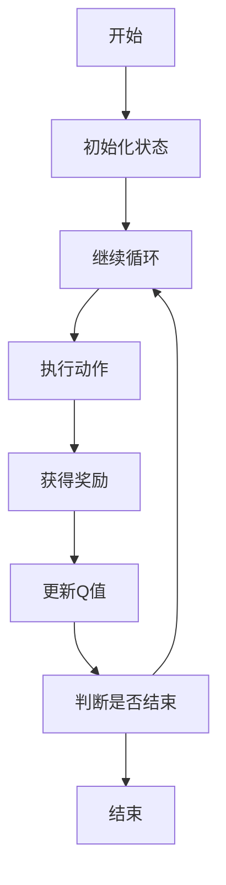
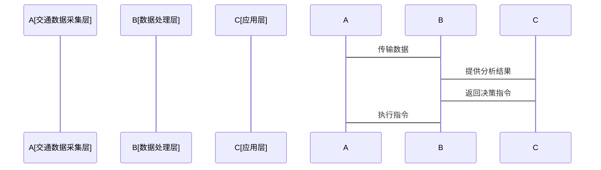

                 


# AI Agent在智能交通系统中的应用

## 关键词
AI Agent, 智能交通系统, 路径规划, 强化学习, 交通优化

## 摘要
本文探讨了AI Agent在智能交通系统中的应用，从背景、原理到系统设计和项目实战，全面分析了AI Agent如何优化交通管理。通过详细的技术分析和实例，展示了AI Agent在智能交通中的潜力和实现方法。

---

## 第一部分: AI Agent与智能交通系统概述

### 第1章: AI Agent与智能交通系统背景介绍

#### 1.1 AI Agent的基本概念
- **1.1.1 什么是AI Agent**
  - AI Agent是一种智能体，能够感知环境、自主决策并执行动作。
  - 具备自主性、反应性、目标导向和学习能力。
- **1.1.2 AI Agent的核心特征**
  - 能够感知环境并根据反馈调整行为。
  - 具备问题解决和目标优化的能力。
- **1.1.3 AI Agent与传统交通系统的关系**
  - AI Agent通过智能化决策提升传统交通系统的效率。

#### 1.2 智能交通系统的定义与特点
- **1.2.1 智能交通系统的定义**
  - 利用AI、大数据和物联网等技术，实现交通系统的智能化管理。
- **1.2.2 智能交通系统的核心特点**
  - 实时数据处理、智能决策、动态优化。
- **1.2.3 智能交通系统的应用场景**
  - 交通流量管理、交通事故预防、智能导航等。

#### 1.3 AI Agent在智能交通系统中的应用背景
- **1.3.1 传统交通系统的局限性**
  - 交通拥堵、资源浪费、效率低下。
- **1.3.2 AI Agent如何解决交通问题**
  - 实现交通流的实时优化，减少拥堵。
- **1.3.3 智能交通系统的边界与外延**
  - 边界：从交通信号灯到自动驾驶。
  - 外延：与智慧城市、物联网等技术的融合。

---

## 第二部分: AI Agent的核心概念与原理

### 第2章: AI Agent的核心概念与原理

#### 2.1 AI Agent的核心原理
- **2.1.1 AI Agent的感知机制**
  - 使用传感器和数据源获取实时交通信息。
- **2.1.2 AI Agent的决策机制**
  - 基于感知数据，通过算法做出最优决策。
- **2.1.3 AI Agent的执行机制**
  - 执行决策并反馈结果。

#### 2.2 AI Agent与智能交通系统的联系
- **2.2.1 AI Agent在交通管理中的角色**
  - 作为决策核心，优化交通流量。
- **2.2.2 AI Agent与交通数据的关系**
  - 数据是AI Agent决策的基础。
- **2.2.3 AI Agent在交通优化中的作用**
  - 提高交通效率，减少资源浪费。

#### 2.3 AI Agent与传统交通系统的对比
- **功能对比**
| 特性           | AI Agent驱动的系统         | 传统交通系统       |
|----------------|--------------------------|-------------------|
| 数据处理       | 高效实时处理             | 延迟且不灵活       |
| 决策方式       | 基于AI算法优化决策       | 依赖人工规则       |
| 反应能力       | 快速响应环境变化         | 响应较慢           |

---

## 第三部分: AI Agent的算法原理与数学模型

### 第3章: AI Agent的算法原理与数学模型

#### 3.1 AI Agent的核心算法
- **路径规划算法**
  - Dijkstra算法：用于找到最短路径。
  - A*算法：结合启发式搜索，提高效率。
- **强化学习算法**
  - Q-learning：通过奖励机制优化决策。
- **联合概率图模型**
  - Bayesian networks：用于处理不确定性。

#### 3.2 算法原理的数学模型
- **路径规划的数学模型**
  - 目标函数：最小化路径长度。
  - 约束条件：避开障碍物。
  $$ \text{目标函数: } \text{最小化路径长度} $$
  $$ \text{约束条件: } \text{避开障碍物} $$

- **强化学习的数学模型**
  $$ Q(s,a) = r + \gamma \max Q(s',a') $$

#### 3.3 算法流程图


---

## 第四部分: 智能交通系统的系统架构与设计

### 第4章: 智能交通系统的系统架构与设计

#### 4.1 系统架构设计
- **4.1.1 系统分层架构**
  - 数据采集层：采集交通数据。
  - 数据处理层：处理并分析数据。
  - 应用层：执行优化决策。
- **4.1.2 系统架构图**


#### 4.2 系统功能设计
- **功能模块**
  - 数据采集模块：传感器和摄像头。
  - 数据预处理模块：清洗和格式化数据。
  - AI Agent决策模块：基于算法做出决策。
  - 执行模块：控制交通信号灯等设备。

#### 4.3 系统交互图


---

## 第五部分: 项目实战与总结

### 第5章: 项目实战

#### 5.1 环境安装
- 安装Python、TensorFlow、NumPy等库。

#### 5.2 核心代码实现
```python
import numpy as np
from sklearn import neighbors

# 示例：基于K近邻算法的路径规划
def find_shortest_path(grid, start, end):
    # grid: 二维数组，1表示障碍物，0表示可通行区域
    # start: 起点坐标
    # end: 终点坐标
    # 使用BFS算法
    from collections import deque
    visited = np.zeros((grid.shape[0], grid.shape[1]), dtype=int)
    queue = deque()
    queue.append((start[0], start[1]))
    visited[start[0], start[1]] = 1

    directions = [(0, 1), (1, 0), (0, -1), (-1, 0)]

    while queue:
        current = queue.popleft()
        if current == (end[0], end[1]):
            return reconstruct_path(visited, start, end)
        for direction in directions:
            next_row = current[0] + direction[0]
            next_col = current[1] + direction[1]
            if 0 <= next_row < grid.shape[0] and 0 <= next_col < grid.shape[1]:
                if grid[next_row, next_col] == 0 and visited[next_row, next_col] == 0:
                    visited[next_row, next_col] = 1
                    queue.append((next_row, next_col))
    return None

def reconstruct_path(visited, start, end):
    path = []
    current = (end[0], end[1])
    while current != (start[0], start[1]):
        path.append(current)
        current = get_parent(current, visited)
    path.append(start)
    return path[::-1]

def get_parent(node, visited):
    # 假设visited记录的是每个节点的父节点
    # 这里简化为简单实现，实际应用中需要更复杂的逻辑
    pass
```

#### 5.3 代码解读与分析
- 以上代码实现了一个简单的路径规划算法，展示了AI Agent在交通优化中的应用。
- 可以通过修改算法参数和数据输入，实现更复杂的交通优化功能。

#### 5.4 实际案例分析
- 案例：智能交通信号灯优化。
- 通过AI Agent实时调整信号灯时长，减少交通拥堵。

#### 5.5 项目总结
- 通过项目实战，展示了AI Agent在智能交通中的实际应用。
- 强调了算法选择和系统设计的重要性。

---

## 第六章: 总结与展望

### 6.1 总结
- AI Agent在智能交通系统中具有巨大潜力。
- 通过算法优化和系统设计，可以显著提升交通效率。

### 6.2 未来展望
- 更高级的AI算法（如深度强化学习）的应用。
- 与更多智能技术（如5G、物联网）的结合。

### 6.3 注意事项
- 数据隐私问题：AI Agent需要处理大量交通数据，需注意数据安全。
- 系统可靠性：确保AI Agent决策的可靠性，避免因算法错误导致交通事故。

### 6.4 小结
- AI Agent是智能交通系统的核心技术。
- 通过不断优化算法和系统设计，AI Agent将在未来交通中发挥更大作用。

---

## 附录

### 附录A: AI Agent相关工具与库
- Python库：TensorFlow、Keras、NumPy。
- 开发工具：Jupyter Notebook、PyCharm。

### 附录B: 参考文献
1. Russell, S., & Norvig, P. (2010). Artificial Intelligence: A Modern Approach.
2. 刘军. (2020). 智能交通系统导论.

---

通过以上内容，我们详细探讨了AI Agent在智能交通系统中的应用，从理论到实践，全面分析了其在现代交通管理中的潜力和实现方法。希望本文能为读者提供有价值的参考和启发。

