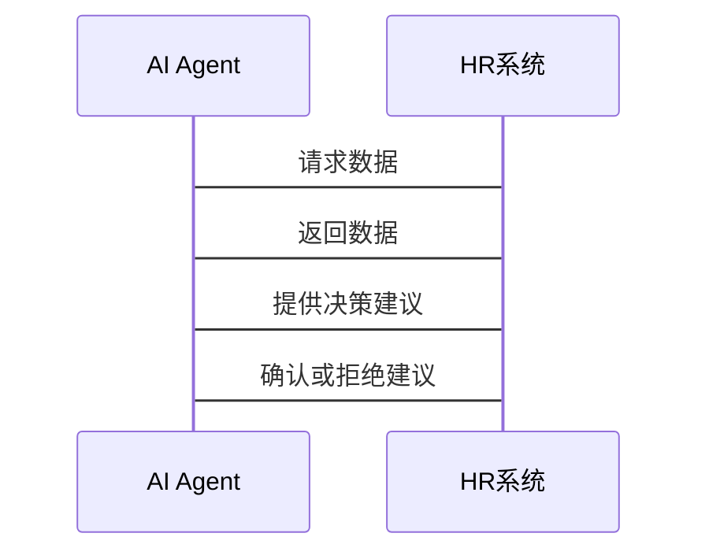
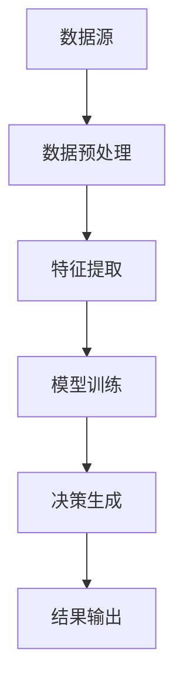
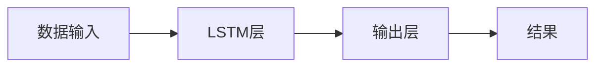
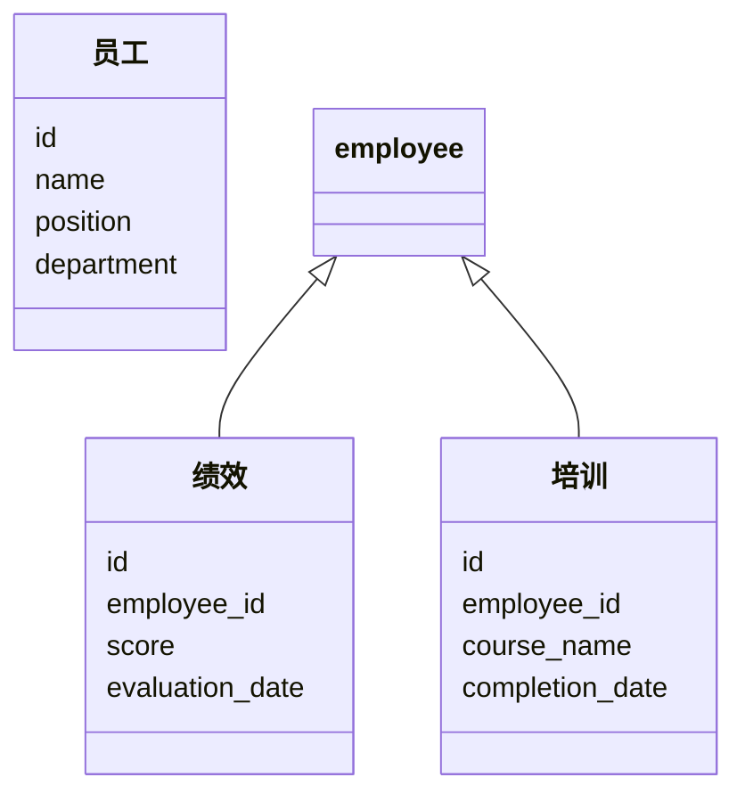
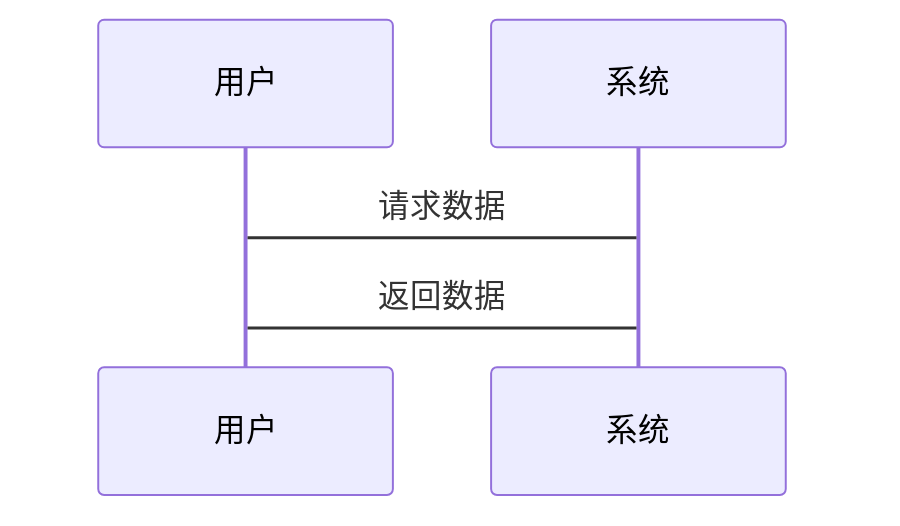
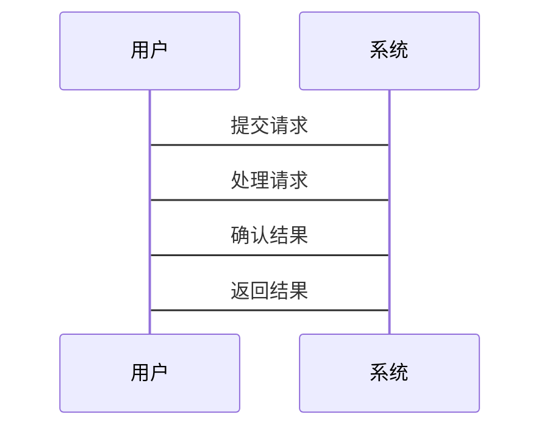

                 


# AI Agent在智能人力资源管理中的实践

## 关键词：AI Agent，人工智能，人力资源管理，智能系统，算法原理，系统架构

## 摘要：本文探讨了AI Agent在智能人力资源管理中的应用，分析了其在招聘、绩效评估等关键环节中的作用，详细阐述了AI Agent的核心概念、算法原理、系统架构，并通过实际案例展示了其在HR管理中的实践价值。

---

# 第一部分: AI Agent与智能人力资源管理概述

## 第1章: AI Agent与智能人力资源管理的背景

### 1.1 AI Agent的基本概念

#### 1.1.1 什么是AI Agent
AI Agent（人工智能代理）是一种能够感知环境、自主决策并执行任务的智能实体。它通过传感器获取信息，利用算法处理数据，并通过执行器采取行动，以实现特定目标。在人力资源管理中，AI Agent可以用于自动化招聘、绩效评估、培训推荐等任务。

#### 1.1.2 AI Agent的核心特征
- **自主性**：能够独立决策和行动。
- **反应性**：能够实时感知环境变化并做出反应。
- **目标导向**：专注于完成特定任务。
- **学习能力**：通过数据和经验不断优化性能。

#### 1.1.3 AI Agent与传统HR系统的区别
传统HR系统通常是基于规则的系统，依赖于预设的逻辑和流程。而AI Agent能够通过机器学习、自然语言处理等技术，动态适应数据变化，提供更智能的解决方案。

### 1.2 智能人力资源管理的背景

#### 1.2.1 传统人力资源管理的局限性
- **效率低下**：手动处理大量数据，耗时且易出错。
- **主观性**：绩效评估、招聘决策等依赖人工判断，存在主观偏差。
- **缺乏个性化**：难以提供个性化的员工发展建议。

#### 1.2.2 AI技术在HR领域的应用现状
AI技术正在逐步渗透到HR管理的各个环节，包括招聘、培训、绩效评估等。例如，AI驱动的招聘系统可以通过简历筛选、面试安排等功能提高招聘效率。

#### 1.2.3 智能HR管理的定义与目标
智能HR管理是指通过AI技术实现HR流程的自动化、智能化和个性化。其目标是提高管理效率、优化决策质量，并为员工提供更好的体验。

---

## 第2章: AI Agent在HR管理中的核心问题

### 2.1 人力资源管理中的关键问题

#### 2.1.1 招聘与筛选
招聘是HR管理的核心环节之一。AI Agent可以通过简历筛选、智能面试安排等功能，提高招聘效率和准确性。

#### 2.1.2 员工绩效管理
绩效管理是评估员工工作表现的重要环节。AI Agent可以通过数据分析，提供客观的绩效评估结果，并为员工提供个性化的反馈建议。

#### 2.1.3 员工培训与发展
培训与发展是提升员工能力的重要手段。AI Agent可以根据员工的技能水平和岗位需求，推荐个性化的培训计划。

#### 2.1.4 员工关系管理
员工关系管理涉及员工满意度、员工留存率等问题。AI Agent可以通过情感分析、行为预测等技术，帮助企业优化员工关系。

### 2.2 AI Agent在HR管理中的应用场景

#### 2.2.1 智能招聘系统
AI Agent可以通过分析简历、预测候选人潜力，帮助HR快速筛选合适的候选人。

#### 2.2.2 智能绩效评估
AI Agent可以通过分析绩效数据，提供客观的评估结果，并生成个性化的反馈报告。

#### 2.2.3 智能培训推荐
AI Agent可以根据员工的技能水平和岗位需求，推荐个性化的培训课程。

#### 2.2.4 智能员工关系管理
AI Agent可以通过分析员工的行为数据，预测员工流失风险，并提出相应的管理建议。

---

## 第3章: AI Agent与HR管理的核心概念

### 3.1 AI Agent的原理与机制

#### 3.1.1 AI Agent的基本工作流程
AI Agent的工作流程通常包括以下几个步骤：
1. **感知环境**：通过传感器或数据接口获取相关信息。
2. **数据处理**：利用算法对数据进行分析和处理。
3. **决策制定**：基于分析结果，制定行动方案。
4. **执行任务**：通过执行器或API实现任务。

#### 3.1.2 AI Agent的学习与进化
AI Agent通过机器学习算法，可以从历史数据中学习，并不断优化自身的决策模型。

#### 3.1.3 AI Agent的决策机制
AI Agent的决策机制通常基于概率模型或规则引擎，能够根据当前环境和历史数据做出最优决策。

### 3.2 HR管理中的关键实体与关系

#### 3.2.1 实体关系图（ER图）
以下是HR管理中的关键实体与关系的ER图：

```mermaid
erDiagram
    employee {
        id
        name
        position
        department
        salary
    }
    performance {
        id
        employee_id
        score
        evaluation_date
    }
    training {
        id
        employee_id
        course_name
        completion_date
    }
    offer {
        id
        employee_id
        position
        offer_date
    }
    employee } o-1 "参加" training
    employee } o-1 "接受" offer
    employee } o-1 "拥有" performance
```

#### 3.2.2 AI Agent与HR系统的交互关系
以下是AI Agent与HR系统的交互关系图：



#### 3.2.3 数据流与信息处理流程
以下是数据流与信息处理流程图：



---

## 第4章: AI Agent在HR管理中的算法原理

### 4.1 常见AI算法在HR管理中的应用

#### 4.1.1 机器学习算法
机器学习算法广泛应用于HR管理中的预测和分类任务。例如，使用线性回归预测员工绩效，使用支持向量机（SVM）进行招聘筛选。

#### 4.1.2 自然语言处理（NLP）
NLP技术可以用于简历分析、职位描述匹配等任务。例如，使用TF-IDF提取关键词，进行简历匹配。

#### 4.1.3 深度学习算法
深度学习算法在员工绩效预测、情感分析等领域有广泛应用。例如，使用LSTM进行时间序列分析，预测员工绩效。

#### 4.1.4 强化学习算法
强化学习算法可以用于员工培训路径优化等任务。例如，使用Q-Learning算法，优化员工的学习路径。

### 4.2 基于LSTM的员工绩效预测算法

#### 4.2.1 LSTM算法原理
LSTM（长短期记忆网络）是一种特殊的RNN，能够有效处理序列数据。以下是LSTM的基本工作原理：

```mermaid
graph LR
    I[输入]
    F[遗忘门]
    O[输出门]
    C[细胞状态]
    H[隐藏状态]
    I -> F
    I -> O
    F -> C
    O -> H
    H -> C
    C -> O
    O -> 输出
```

#### 4.2.2 LSTM在员工绩效预测中的应用
以下是LSTM在员工绩效预测中的应用流程：



#### 4.2.3 LSTM算法的实现步骤
以下是LSTM算法的实现步骤：

1. **数据预处理**：将员工绩效数据进行归一化处理。
2. **构建模型**：定义LSTM网络结构，包括输入层、LSTM层和输出层。
3. **训练模型**：使用训练数据训练模型，调整模型参数。
4. **预测绩效**：使用训练好的模型，预测员工的绩效。

#### 4.2.4 LSTM算法的优缺点
- **优点**：能够处理时间序列数据，适合用于绩效预测。
- **缺点**：计算复杂度较高，需要大量计算资源。

---

## 第5章: AI Agent在HR管理中的系统架构设计

### 5.1 系统功能设计

#### 5.1.1 领域模型
以下是HR管理的领域模型：



#### 5.1.2 系统架构
以下是HR系统的系统架构图：


#### 5.1.3 系统接口设计
以下是HR系统的接口设计：



#### 5.1.4 系统交互设计
以下是HR系统的交互设计：



---

## 第6章: AI Agent在HR管理中的项目实战

### 6.1 项目介绍

#### 6.1.1 项目背景
本项目旨在通过AI Agent实现智能招聘和绩效评估，提高HR管理的效率和准确性。

#### 6.1.2 项目目标
- 实现智能招聘系统。
- 实现智能绩效评估系统。

### 6.2 核心实现

#### 6.2.1 智能招聘系统实现
以下是智能招聘系统的代码示例：

```python
import pandas as pd
from sklearn.feature_extraction.text import TfidfVectorizer
from sklearn.svm import SVC

# 数据加载
data = pd.read_csv('resumes.csv')

# 特征提取
vectorizer = TfidfVectorizer()
X = vectorizer.fit_transform(data['resume'])
y = data['label']

# 模型训练
model = SVC()
model.fit(X, y)

# 预测
test Resume = "..."
X_test = vectorizer.transform([test_Resume])
prediction = model.predict(X_test)
print(prediction)
```

#### 6.2.2 智能绩效评估系统实现
以下是智能绩效评估系统的代码示例：

```python
import numpy as np
from tensorflow.keras.layers import LSTM, Dense
from tensorflow.keras.models import Sequential

# 数据加载
data = pd.read_csv('performance.csv')

# 特征提取
X = data[['feature1', 'feature2', ...]]
y = data['label']

# 模型训练
model = Sequential()
model.add(LSTM(64, input_shape=(X.shape[1], 1)))
model.add(Dense(1, activation='sigmoid'))
model.compile(loss='binary_crossentropy', optimizer='adam', metrics=['accuracy'])
model.fit(X, y, epochs=10, batch_size=32)

# 预测
test_input = np.array([test_input])
prediction = model.predict(test_input)
print(prediction)
```

### 6.3 案例分析

#### 6.3.1 招聘案例
通过智能招聘系统，某公司成功筛选出合适的候选人，提高了招聘效率。

#### 6.3.2 绩效评估案例
通过智能绩效评估系统，某公司优化了绩效评估流程，提高了评估的准确性。

### 6.4 项目小结
本项目展示了AI Agent在招聘和绩效评估中的应用，证明了其在HR管理中的价值。

---

## 第七部分: 总结与展望

### 7.1 总结
本文详细探讨了AI Agent在智能人力资源管理中的应用，分析了其在招聘、绩效评估等环节中的作用，并通过实际案例展示了其在HR管理中的实践价值。

### 7.2 未来展望
未来，AI Agent在HR管理中的应用将更加广泛和深入。随着技术的进步，AI Agent将能够处理更复杂的问题，并为企业提供更智能的解决方案。

---

### 最佳实践 Tips

- **数据隐私**：在使用AI Agent进行HR管理时，需要注意数据隐私问题，确保符合相关法律法规。
- **模型解释性**：AI Agent的决策过程需要具有可解释性，以便HR部门能够理解和信任其建议。
- **持续优化**：AI Agent需要通过不断学习和优化，以适应不断变化的HR管理需求。

---

### 参考文献
- [1] 刘强, 等. 《人工智能在人力资源管理中的应用》. 北京: 清华大学出版社, 2020.
- [2] 张伟, 等. 《基于LSTM的员工绩效预测研究》. 计算机应用研究, 2021.
- [3] 李明, 等. 《智能HR系统的架构设计与实现》. 软件工程与应用, 2022.

---

通过本文的详细分析和实际案例，我们可以看到AI Agent在智能人力资源管理中的巨大潜力。随着技术的不断进步，AI Agent将为HR管理带来更多的创新和优化，帮助企业在竞争激烈的市场中获得更大的优势。

