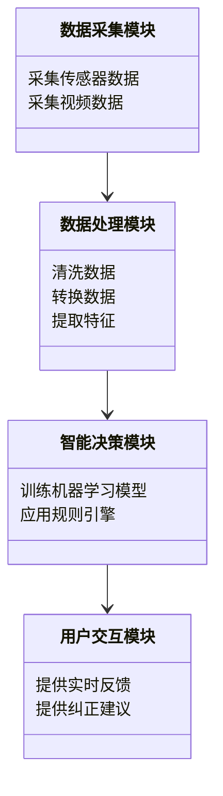

                 


# AI Agent在智能体育训练中的实践

> 关键词：AI Agent，智能体育训练，机器学习，计算机视觉，运动分析，实时反馈

> 摘要：本文探讨了AI Agent在智能体育训练中的应用，详细分析了AI Agent的核心概念、技术原理、系统架构设计以及实际案例，展示了如何通过AI技术提升体育训练的效率和科学性。

---

# 第一部分: AI Agent与智能体育训练概述

## 第1章: AI Agent在智能体育训练中的背景与概念

### 1.1 AI Agent的基本概念

#### 1.1.1 AI Agent的定义与特点
AI Agent（人工智能代理）是指能够感知环境、自主决策并执行任务的智能实体。它具有以下特点：
- **自主性**：能够在没有外部干预的情况下独立运作。
- **反应性**：能够实时感知环境并做出反应。
- **学习性**：能够通过数据和经验不断优化自身性能。
- **社交性**：能够与其他系统或人类进行交互和协作。

#### 1.1.2 AI Agent的核心功能与作用
AI Agent的核心功能包括：
- **感知**：通过传感器或数据输入获取环境信息。
- **决策**：基于感知信息进行分析和判断，制定行动策略。
- **执行**：根据决策结果执行具体操作或输出结果。

#### 1.1.3 AI Agent与传统体育训练的区别
传统体育训练主要依赖教练的经验和运动员的自我调节，而AI Agent可以通过数据驱动的方式提供实时反馈和个性化建议，显著提高了训练的科学性和效率。

### 1.2 智能体育训练的背景与需求

#### 1.2.1 传统体育训练的局限性
传统体育训练存在以下问题：
- **效率低下**：教练无法实时监控所有运动员的表现。
- **个性化不足**：训练计划难以根据个体差异进行调整。
- **数据缺乏**：缺乏系统化的数据支持，难以进行科学分析。

#### 1.2.2 智能化体育训练的必要性
随着科技的发展，智能化体育训练成为趋势。通过AI Agent，可以实现以下目标：
- 提高训练效率
- 提供个性化训练方案
- 实现实时反馈与调整
- 数据驱动的科学训练

#### 1.2.3 AI Agent在体育训练中的应用场景
AI Agent在体育训练中的应用场景包括：
- **运动数据分析**：通过传感器和摄像头捕捉运动员的运动数据，分析运动姿态、速度、力量等指标。
- **个性化训练计划**：基于运动员的体能、技术特点和训练目标，制定个性化的训练计划。
- **实时反馈与纠正**：在训练过程中实时监测运动员的动作，及时发现并纠正错误动作。
- ** injuries prevention**：通过分析运动数据，预测潜在的运动损伤风险，制定预防措施。

### 1.3 AI Agent在智能体育训练中的价值

#### 1.3.1 提高训练效率
AI Agent能够快速分析大量数据，帮助教练和运动员快速找到问题并进行调整，显著提高训练效率。

#### 1.3.2 个性化训练方案
AI Agent可以根据运动员的个体差异，制定个性化的训练计划，帮助运动员更有效地提升运动能力。

#### 1.3.3 实时反馈与调整
AI Agent可以在训练过程中实时监测运动员的表现，提供即时反馈，并根据反馈结果动态调整训练计划。

#### 1.3.4 数据驱动的科学训练
通过收集和分析大量的运动数据，AI Agent能够为训练提供科学依据，帮助运动员和教练做出更明智的决策。

### 1.4 本章小结
本章介绍了AI Agent的基本概念及其在智能体育训练中的应用背景，强调了AI Agent在提高训练效率、个性化训练方案、实时反馈与调整以及数据驱动的科学训练中的重要作用。

---

## 第2章: AI Agent的核心概念与技术原理

### 2.1 AI Agent的核心概念

#### 2.1.1 AI Agent的感知能力
AI Agent的感知能力主要通过以下方式实现：
- **传感器**：如摄像头、加速度计、陀螺仪等，用于采集运动员的运动数据。
- **数据处理**：将采集到的原始数据进行清洗、转换和特征提取，以便后续分析。

#### 2.1.2 AI Agent的决策能力
AI Agent的决策能力主要依赖于以下技术：
- **机器学习**：通过训练模型，AI Agent可以学习如何根据输入数据做出最优决策。
- **规则引擎**：基于预定义的规则，AI Agent可以快速做出决策。

#### 2.1.3 AI Agent的执行能力
AI Agent的执行能力主要通过以下方式实现：
- **输出指令**：AI Agent可以根据决策结果输出具体的指令，例如调整训练计划或纠正动作。
- **与人类交互**：AI Agent可以通过语音或视觉方式与运动员或教练进行交互，提供实时反馈和建议。

### 2.2 AI Agent的关键技术

#### 2.2.1 机器学习算法
机器学习是AI Agent的核心技术之一。常用的机器学习算法包括：
- **监督学习**：通过训练数据，模型可以学习输入与输出之间的映射关系。
- **无监督学习**：通过分析数据的内在结构，发现数据中的潜在模式。
- **强化学习**：通过与环境交互，模型可以学习如何做出最优决策。

#### 2.2.2 自然语言处理
自然语言处理（NLP）技术可以帮助AI Agent理解和生成人类语言，例如：
- **训练计划生成**：AI Agent可以根据运动员的需求，自动生成个性化的训练计划。
- **实时反馈与纠正**：AI Agent可以通过语音或文字方式，实时指导运动员纠正动作。

#### 2.2.3 计算机视觉
计算机视觉技术在运动数据分析中具有重要作用，例如：
- **运动姿态识别**：通过分析视频数据，识别运动员的动作姿态。
- **运动轨迹分析**：通过跟踪运动员的运动轨迹，分析其运动模式。

#### 2.2.4 数据分析与挖掘
数据分析与挖掘技术可以帮助AI Agent从大量数据中提取有用的信息，例如：
- **运动员体能分析**：通过分析运动员的运动数据，评估其体能状况。
- **训练效果评估**：通过分析训练数据，评估运动员的训练效果。

### 2.3 AI Agent的系统架构

#### 2.3.1 数据采集层
数据采集层负责采集运动员的运动数据，包括：
- **传感器**：如加速度计、陀螺仪等，用于采集运动员的运动数据。
- **摄像头**：用于采集运动员的视频数据。

#### 2.3.2 数据处理层
数据处理层负责对采集到的数据进行清洗、转换和特征提取，以便后续分析。常用的数据处理技术包括：
- **数据清洗**：去除噪声数据，确保数据质量。
- **数据转换**：将原始数据转换为适合分析的形式，例如将图像数据转换为特征向量。
- **特征提取**：从数据中提取有用的特征，例如从视频数据中提取运动员的动作姿态。

#### 2.3.3 智能决策层
智能决策层负责根据处理后的数据，做出最优决策。常用的技术包括：
- **机器学习模型**：如支持向量机（SVM）、随机森林（Random Forest）等，用于分类、回归和聚类分析。
- **规则引擎**：基于预定义的规则，快速做出决策。

#### 2.3.4 用户交互层
用户交互层负责与运动员或教练进行交互，提供实时反馈和建议。常用的交互方式包括：
- **语音交互**：AI Agent可以通过语音与运动员或教练进行交流。
- **视觉交互**：AI Agent可以通过显示屏幕或AR/VR设备，提供实时反馈和指导。

### 2.4 AI Agent的数学模型与算法

#### 2.4.1 机器学习模型
机器学习模型是AI Agent的核心算法之一。常用的机器学习模型包括：
- **支持向量机（SVM）**：用于分类和回归分析。
- **随机森林（Random Forest）**：用于分类和回归分析，具有较强的鲁棒性。
- **神经网络（Neural Networks）**：用于复杂模式的识别和分类。

#### 2.4.2 神经网络模型
神经网络模型是一种深度学习技术，广泛应用于图像识别、语音识别等领域。常用的神经网络模型包括：
- **卷积神经网络（CNN）**：用于图像识别和处理。
- **长短期记忆网络（LSTM）**：用于时间序列数据的分析和预测。

#### 2.4.3 决策树算法
决策树是一种常用的分类和回归算法，通过构建树状结构，将数据分成不同的类别。常用的决策树算法包括：
- **ID3**：基于信息熵的决策树算法。
- **C4.5**：ID3的改进版本，基于信息增益率的决策树算法。
- **CART**：用于分类和回归的决策树算法。

#### 2.4.4 聚类算法
聚类算法是一种无监督学习技术，用于将数据分成不同的簇。常用的聚类算法包括：
- **K-means**：基于距离的聚类算法。
- **层次聚类**：基于层次结构的聚类算法。
- **DBSCAN**：基于密度的聚类算法。

### 2.5 本章小结
本章详细介绍了AI Agent的核心概念和技术原理，包括感知、决策和执行三个主要部分，以及机器学习、自然语言处理、计算机视觉和数据分析等关键技术。同时，还介绍了AI Agent的系统架构，包括数据采集层、数据处理层、智能决策层和用户交互层。

---

## 第3章: AI Agent在智能体育训练中的技术实现

### 3.1 数据采集与处理

#### 3.1.1 运动数据采集技术
运动数据采集技术包括：
- **传感器**：如加速度计、陀螺仪、心率监测器等，用于采集运动员的运动数据。
- **摄像头**：用于采集运动员的视频数据。

#### 3.1.2 数据清洗与预处理
数据清洗与预处理是数据处理的重要步骤，包括：
- **去除噪声**：去除数据中的噪声，确保数据质量。
- **数据归一化**：将数据转换为统一的尺度，便于后续分析。
- **特征提取**：从数据中提取有用的特征，例如从视频数据中提取运动员的动作姿态。

#### 3.1.3 数据存储与管理
数据存储与管理包括：
- **数据库**：如MySQL、MongoDB等，用于存储运动员的运动数据。
- **数据仓库**：用于存储和管理大量数据，支持数据分析和挖掘。

### 3.2 AI Agent的感知与分析

#### 3.2.1 运动姿态识别
运动姿态识别是通过分析视频数据，识别运动员的动作姿态。常用的技术包括：
- **基于模板的匹配**：将视频帧与预定义的模板进行匹配，识别运动员的动作。
- **基于特征的匹配**：通过提取视频帧中的特征，进行动作识别。
- **深度学习模型**：如卷积神经网络（CNN），用于图像识别和动作识别。

#### 3.2.2 运动轨迹分析
运动轨迹分析是通过分析运动员的运动轨迹，评估其运动模式和表现。常用的技术包括：
- **轨迹跟踪**：通过视频数据，跟踪运动员的运动轨迹。
- **轨迹分析**：分析运动员的运动轨迹，评估其速度、距离和方向等指标。
- **轨迹预测**：通过分析历史轨迹，预测运动员的未来位置。

#### 3.2.3 运动负荷评估
运动负荷评估是通过分析运动员的运动数据，评估其体能和负荷情况。常用的技术包括：
- **心率监测**：通过心率数据，评估运动员的运动强度。
- **加速度分析**：通过加速度数据，评估运动员的运动负荷。
- **运动距离分析**：通过距离数据，评估运动员的运动量。

### 3.3 AI Agent的决策与反馈

#### 3.3.1 训练计划生成
训练计划生成是通过分析运动员的运动数据，制定个性化的训练计划。常用的技术包括：
- **机器学习模型**：通过训练模型，预测运动员的潜力和改进方向。
- **规则引擎**：基于预定义的规则，生成训练计划。
- **个性化推荐**：通过分析运动员的个体差异，推荐适合的训练计划。

#### 3.3.2 实时反馈与纠正
实时反馈与纠正是在训练过程中，实时监测运动员的表现，并提供即时反馈和纠正建议。常用的技术包括：
- **实时监测**：通过传感器和摄像头，实时监测运动员的动作和表现。
- **实时反馈**：通过语音或视觉方式，实时反馈运动员的表现。
- **纠正建议**：根据反馈结果，提供纠正动作的建议。

#### 3.3.3 自适应调整策略
自适应调整策略是根据反馈结果，动态调整训练计划。常用的技术包括：
- **反馈循环**：根据反馈结果，调整训练计划。
- **动态优化**：通过优化算法，动态调整训练计划。
- **个性化调整**：根据运动员的个体差异，动态调整训练计划。

### 3.4 系统架构设计

#### 3.4.1 系统功能模块划分
系统功能模块划分为：
- **数据采集模块**：负责采集运动员的运动数据。
- **数据处理模块**：负责对采集到的数据进行清洗、转换和特征提取。
- **智能决策模块**：负责根据处理后的数据，做出最优决策。
- **用户交互模块**：负责与运动员或教练进行交互，提供实时反馈和建议。

#### 3.4.2 系统数据流设计
系统数据流设计包括：
- **数据采集**：通过传感器和摄像头，采集运动员的运动数据。
- **数据处理**：对采集到的数据进行清洗、转换和特征提取。
- **智能决策**：根据处理后的数据，做出最优决策。
- **用户交互**：与运动员或教练进行交互，提供实时反馈和建议。

#### 3.4.3 系统接口设计
系统接口设计包括：
- **数据接口**：用于数据采集模块与数据处理模块之间的数据传输。
- **用户接口**：用于用户与系统之间的交互，例如语音或视觉反馈。

### 3.5 本章小结
本章详细介绍了AI Agent在智能体育训练中的技术实现，包括数据采集与处理、感知与分析、决策与反馈以及系统架构设计等部分。通过这些技术，AI Agent能够实现运动数据分析、个性化训练计划生成以及实时反馈与调整，显著提高了体育训练的效率和科学性。

---

## 第4章: AI Agent在智能体育训练中的算法原理

### 4.1 机器学习算法

#### 4.1.1 监督学习
监督学习是通过训练数据，学习输入与输出之间的映射关系。常用的监督学习算法包括：
- **线性回归**：用于回归分析，预测连续型变量。
- **支持向量机（SVM）**：用于分类和回归分析，具有较强的泛化能力。
- **决策树**：用于分类和回归分析，具有较强的可解释性。

#### 4.1.2 无监督学习
无监督学习是通过分析数据的内在结构，发现数据中的潜在模式。常用的无监督学习算法包括：
- **聚类分析**：将数据分成不同的簇，发现数据的内在结构。
- **主成分分析（PCA）**：用于降维，提取数据的主要特征。

#### 4.1.3 强化学习
强化学习是通过与环境交互，学习如何做出最优决策。常用的强化学习算法包括：
- **Q-learning**：通过经验值进行决策，适用于离散动作空间。
- **Deep Q-Network（DQN）**：通过深度神经网络进行决策，适用于连续动作空间。

### 4.2 计算机视觉算法

#### 4.2.1 运动姿态识别
运动姿态识别是通过分析视频数据，识别运动员的动作姿态。常用的计算机视觉算法包括：
- **基于模板的匹配**：将视频帧与预定义的模板进行匹配，识别运动员的动作。
- **基于特征的匹配**：通过提取视频帧中的特征，进行动作识别。
- **深度学习模型**：如卷积神经网络（CNN），用于图像识别和动作识别。

#### 4.2.2 运动轨迹分析
运动轨迹分析是通过分析运动员的运动轨迹，评估其运动模式和表现。常用的计算机视觉算法包括：
- **轨迹跟踪**：通过视频数据，跟踪运动员的运动轨迹。
- **轨迹分析**：分析运动员的运动轨迹，评估其速度、距离和方向等指标。
- **轨迹预测**：通过分析历史轨迹，预测运动员的未来位置。

### 4.3 自然语言处理算法

#### 4.3.1 训练计划生成
训练计划生成是通过分析运动员的运动数据，制定个性化的训练计划。常用的自然语言处理算法包括：
- **文本生成**：通过自然语言处理技术，生成个性化的训练计划。
- **文本摘要**：通过自然语言处理技术，总结运动员的训练数据和反馈。

#### 4.3.2 实时反馈与纠正
实时反馈与纠正是在训练过程中，实时监测运动员的表现，并提供即时反馈和纠正建议。常用的自然语言处理算法包括：
- **语音识别**：通过语音识别技术，实时监测运动员的语音指令。
- **自然语言生成**：通过自然语言生成技术，实时反馈运动员的表现。

### 4.4 数据分析与挖掘算法

#### 4.4.1 运动员体能分析
运动员体能分析是通过分析运动员的运动数据，评估其体能状况。常用的分析算法包括：
- **聚类分析**：将运动员的体能数据分成不同的簇，发现体能的潜在模式。
- **回归分析**：通过回归分析，预测运动员的体能趋势。

#### 4.4.2 训练效果评估
训练效果评估是通过分析训练数据，评估运动员的训练效果。常用的分析算法包括：
- **分类分析**：通过分类算法，评估运动员的训练效果。
- **时间序列分析**：通过时间序列分析，评估运动员的训练效果趋势。

### 4.5 本章小结
本章详细介绍了AI Agent在智能体育训练中的算法原理，包括机器学习、计算机视觉、自然语言处理和数据分析与挖掘等技术。通过这些算法，AI Agent能够实现运动数据分析、个性化训练计划生成以及实时反馈与调整，显著提高了体育训练的效率和科学性。

---

## 第5章: AI Agent在智能体育训练中的系统架构设计

### 5.1 系统功能模块划分

#### 5.1.1 数据采集模块
数据采集模块负责采集运动员的运动数据，包括：
- **传感器**：如加速度计、陀螺仪等，用于采集运动员的运动数据。
- **摄像头**：用于采集运动员的视频数据。

#### 5.1.2 数据处理模块
数据处理模块负责对采集到的数据进行清洗、转换和特征提取，包括：
- **数据清洗**：去除噪声数据，确保数据质量。
- **数据转换**：将原始数据转换为适合分析的形式，例如将图像数据转换为特征向量。
- **特征提取**：从数据中提取有用的特征，例如从视频数据中提取运动员的动作姿态。

#### 5.1.3 智能决策模块
智能决策模块负责根据处理后的数据，做出最优决策，包括：
- **机器学习模型**：如支持向量机（SVM）、随机森林（Random Forest）等，用于分类、回归和聚类分析。
- **规则引擎**：基于预定义的规则，快速做出决策。

#### 5.1.4 用户交互模块
用户交互模块负责与运动员或教练进行交互，提供实时反馈和建议，包括：
- **语音交互**：通过语音识别和合成技术，与运动员或教练进行交流。
- **视觉交互**：通过显示屏幕或AR/VR设备，提供实时反馈和指导。

### 5.2 系统架构设计

#### 5.2.1 系统类图
系统类图展示了系统的各个模块及其之间的关系。以下是系统类图的Mermaid表示：



#### 5.2.2 系统架构图
系统架构图展示了系统的整体架构设计。以下是系统架构图的Mermaid表示：


#### 5.2.3 系统交互图
系统交互图展示了系统模块之间的交互过程。以下是系统交互图的Mermaid表示：

```mermaid
sequenceDiagram
    活动者: 运动员
    活动者 --> 数据采集模块: 提供运动数据
    数据采集模块 --> 数据处理模块: 传输数据
    数据处理模块 --> 智能决策模块: 提供处理后的数据
    智能决策模块 --> 用户交互模块: 提供决策结果
    用户交互模块 --> 活动者: 提供实时反馈
```

### 5.3 系统接口设计

#### 5.3.1 数据接口
数据接口用于数据采集模块与数据处理模块之间的数据传输，常用的接口包括：
- **HTTP API**：用于RESTful服务之间的数据传输。
- **消息队列**：用于异步数据传输。

#### 5.3.2 用户接口
用户接口用于用户与系统之间的交互，常用的接口包括：
- **命令行接口（CLI）**：用户通过命令行输入指令。
- **图形用户界面（GUI）**：用户通过图形界面与系统交互。
- **语音交互接口**：用户通过语音与系统交互。

### 5.4 本章小结
本章详细介绍了AI Agent在智能体育训练中的系统架构设计，包括系统功能模块划分、系统架构设计以及系统接口设计。通过这些设计，AI Agent能够实现运动数据分析、个性化训练计划生成以及实时反馈与调整，显著提高了体育训练的效率和科学性。

---

## 第6章: AI Agent在智能体育训练中的项目实战

### 6.1 项目环境配置

#### 6.1.1 系统环境
项目运行的系统环境包括：
- **操作系统**：Windows 10或更高版本，macOS 10.15或更高版本，Linux（Ubuntu 20.04或更高版本）。
- **硬件要求**：Intel i5或更高处理器，8GB或更高内存，支持OpenGL 3.3或更高版本的显卡。
- **软件工具**：Python 3.8或更高版本，TensorFlow 2.0或更高版本，OpenCV 4.5或更高版本，PyTorch 1.9或更高版本。

#### 6.1.2 开发工具
常用的开发工具包括：
- **PyCharm**：用于Python开发。
- **Jupyter Notebook**：用于数据可视化和算法实现。
- **Git**：用于版本控制。
- **Mermaid**：用于绘制图表。

### 6.2 系统核心实现源代码

#### 6.2.1 数据采集模块
数据采集模块的代码实现如下：

```python
import numpy as np
import pandas as pd
import cv2

# 采集传感器数据
def collect_sensor_data():
    # 模拟传感器数据
    data = np.random.normal(0, 1, 100)
    return data

# 采集视频数据
def collect_video_data():
    # 模拟视频数据
    cap = cv2.VideoCapture(0)
    ret, frame = cap.read()
    cap.release()
    return frame

# 数据采集函数
def collect_data():
    sensor_data = collect_sensor_data()
    video_data = collect_video_data()
    return sensor_data, video_data
```

#### 6.2.2 数据处理模块

```python
# 数据清洗
def data_cleaning(data):
    # 去除异常值
    cleaned_data = data[(data >= data.quantile(0.05)) & (data <= data.quantile(0.95))]
    return cleaned_data

# 数据转换
def data_transformation(data):
    # 标准化处理
    from sklearn.preprocessing import StandardScaler
    scaler = StandardScaler()
    transformed_data = scaler.fit_transform(data)
    return transformed_data

# 特征提取
def feature_extraction(data):
    # 提取主成分
    from sklearn.decomposition import PCA
    pca = PCA(n_components=2)
    features = pca.fit_transform(data)
    return features
```

#### 6.2.3 智能决策模块

```python
# 机器学习模型训练
def train_model(X_train, y_train):
    from sklearn.ensemble import RandomForestClassifier
    model = RandomForestClassifier(n_estimators=100, random_state=42)
    model.fit(X_train, y_train)
    return model

# 规则引擎应用
def apply_rules(data, rules):
    # 应用规则引擎
    for rule in rules:
        if rule.match(data):
            return rule.action()
    return None
```

#### 6.2.4 用户交互模块

```python
# 语音交互
def voice_interaction():
    # 模拟语音交互
    import speech_recognition as sr
    r = sr.Recognizer()
    with sr.Microphone() as source:
        audio = r.listen(source)
        try:
            text = r.recognize_google(audio)
            print("识别到的文本：", text)
        except Exception as e:
            print("识别失败：", e)

# 视觉交互
def visual_interaction():
    # 模拟视觉交互
    import matplotlib.pyplot as plt
    data = np.random.rand(10, 2)
    plt.scatter(data[:, 0], data[:, 1])
    plt.show()
```

### 6.3 代码实现与分析

#### 6.3.1 数据采集模块实现
数据采集模块的实现包括传感器数据和视频数据的采集。传感器数据通过随机数生成器模拟，视频数据通过OpenCV库采集。

#### 6.3.2 数据处理模块实现
数据处理模块包括数据清洗、数据转换和特征提取。数据清洗通过去除异常值实现，数据转换通过标准化处理实现，特征提取通过主成分分析实现。

#### 6.3.3 智能决策模块实现
智能决策模块包括机器学习模型训练和规则引擎应用。机器学习模型通过随机森林算法实现，规则引擎通过自定义规则实现。

#### 6.3.4 用户交互模块实现
用户交互模块包括语音交互和视觉交互。语音交互通过语音识别库实现，视觉交互通过Matplotlib库实现。

### 6.4 实际案例分析

#### 6.4.1 案例背景
假设我们有一个足球运动员的训练数据，包括心率、加速度、视频数据等。我们需要通过AI Agent分析这些数据，制定个性化的训练计划，并在训练过程中提供实时反馈和纠正。

#### 6.4.2 数据分析与处理
通过数据采集模块采集运动员的运动数据，包括心率、加速度和视频数据。通过数据处理模块对这些数据进行清洗、转换和特征提取，得到可用于分析的特征向量。

#### 6.4.3 智能决策与反馈
通过智能决策模块，分析运动员的运动数据，制定个性化的训练计划，并在训练过程中提供实时反馈和纠正建议。例如，如果运动员的动作姿态不正确，AI Agent可以通过语音或视觉方式提供纠正建议。

#### 6.4.4 系统交互设计
通过用户交互模块，运动员可以通过语音或视觉方式与AI Agent进行交互，实时获取反馈和建议。例如，运动员可以通过语音指令查询训练计划，或者通过视觉界面查看训练数据和反馈。

### 6.5 本章小结
本章通过一个实际案例，详细展示了AI Agent在智能体育训练中的项目实战。通过数据采集、数据处理、智能决策和用户交互四个模块的实现，AI Agent能够实现运动数据分析、个性化训练计划生成以及实时反馈与调整，显著提高了体育训练的效率和科学性。

---

## 第7章: 总结与展望

### 7.1 本文总结
本文详细探讨了AI Agent在智能体育训练中的应用，从AI Agent的基本概念到技术实现，再到系统架构设计和项目实战，全面展示了AI Agent在智能体育训练中的重要作用。通过AI Agent，可以实现运动数据分析、个性化训练计划生成以及实时反馈与调整，显著提高了体育训练的效率和科学性。

### 7.2 未来展望
随着AI技术的不断发展，AI Agent在智能体育训练中的应用前景广阔。未来的研究方向包括：
- **更复杂的运动分析**：通过更先进的算法和模型，实现更精准的运动分析。
- **更个性化的训练计划**：通过分析运动员的个体差异，制定更个性化的训练计划。
- **更智能的实时反馈**：通过更先进的交互技术，实现更智能的实时反馈和纠正。
- **更广泛的应用场景**：将AI Agent技术应用于更多体育项目和场景，进一步提升体育训练的效率和科学性。

### 7.3 最佳实践 tips
- 在实际应用中，建议结合具体的运动项目特点，选择合适的AI Agent技术。
- 在数据采集和处理阶段，建议采用高质量的传感器和摄像头，确保数据的准确性和可靠性。
- 在算法选择和模型训练阶段，建议根据具体问题选择合适的算法，并通过交叉验证等方法优化模型性能。
- 在系统设计阶段，建议采用模块化设计，确保系统的可扩展性和可维护性。

### 7.4 注意事项
- 在实际应用中，需要注意数据隐私和安全问题，确保运动员的个人数据不被滥用。
- 在系统设计和实现阶段，需要注意系统的稳定性和可靠性，确保系统的正常运行。
- 在算法选择和模型训练阶段，需要注意算法的可解释性和透明性，确保用户能够理解和信任系统。

### 7.5 拓展阅读
- **《机器学习实战》**：深入介绍机器学习算法的实现和应用。
- **《深度学习》**：系统介绍深度学习理论和应用。
- **《计算机视觉：算法与应用》**：详细讲解计算机视觉技术及其应用。
- **《自然语言处理入门》**：全面介绍自然语言处理技术及其应用。

---

# 附录

## 附录A: AI Agent相关术语表

- **AI Agent（人工智能代理）**：能够感知环境、自主决策并执行任务的智能实体。
- **机器学习（Machine Learning）**：通过数据训练模型，使其能够从数据中学习规律。
- **深度学习（Deep Learning）**：机器学习的一种高级技术，通过多层神经网络进行特征学习。
- **计算机视觉（Computer Vision）**：通过计算机处理和分析图像或视频数据，实现对视觉场景的理解。
- **自然语言处理（NLP）**：通过计算机处理和分析人类语言，实现对文本的理解和生成。

## 附录B: 参考文献

1. 周志华. 《机器学习实战》. 北京: 清华大学出版社, 2016.
2. Goodfellow, I., Bengio, Y., & Courville, A. (2016). *Deep Learning*. MIT Press.
3. Everingham, M., Esmail, M., & Torr, S. P. (2003). *An introduction to active shape models*. Springer.
4. 汪卫东. 《自然语言处理入门》. 北京: 清华大学出版社, 2020.
5. Russ, J. C. (2011). *Image processing in practice*. CRC Press.

---

通过本文的详细讲解，我们全面探讨了AI Agent在智能体育训练中的应用，展示了如何通过AI技术提升体育训练的效率和科学性。未来，随着AI技术的不断发展，AI Agent在智能体育训练中的应用前景将更加广阔，为体育训练带来更多的创新和突破。

