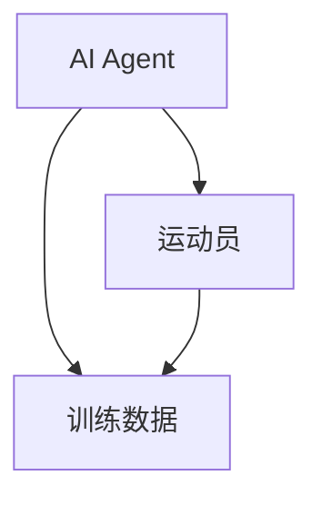
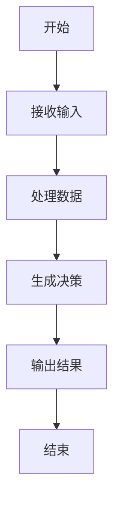
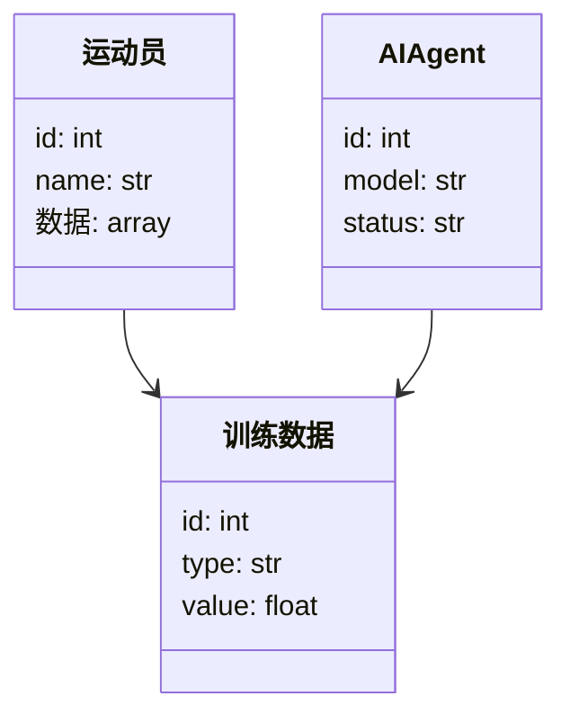
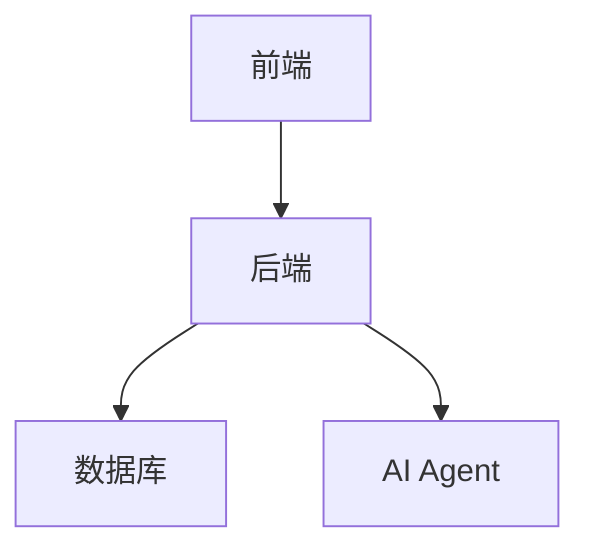
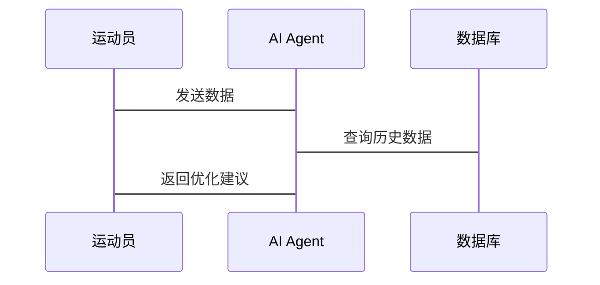

                 


# AI Agent在智能体育训练中的应用

## 关键词：AI Agent，智能体育训练，算法原理，系统架构，项目实战

## 摘要：本文系统地探讨了AI Agent在智能体育训练中的应用，从背景介绍到算法原理，再到系统架构设计和项目实战，详细分析了AI Agent在体育训练中的核心作用和技术实现。通过具体案例分析，展示了AI Agent如何通过强化学习、监督学习等算法优化训练计划和实时反馈，显著提升运动员的表现和训练效率。

---

# 第一部分: AI Agent在智能体育训练中的应用概述

## 第1章: AI Agent的基本概念与背景

### 1.1 AI Agent的定义与特点

#### 1.1.1 AI Agent的定义
AI Agent（人工智能代理）是指能够感知环境并采取行动以实现目标的智能实体。与传统AI不同，AI Agent具有自主性、反应性、目标导向性和社会性等特征。

#### 1.1.2 AI Agent的核心特点
- **自主性**：AI Agent能够自主决策，无需外部干预。
- **反应性**：能够实时感知环境并做出响应。
- **目标导向性**：所有行动均以实现特定目标为导向。
- **社会性**：能够与其他实体（如教练、运动员）进行交互和协作。

#### 1.1.3 AI Agent与传统AI的区别
| 特性 | 传统AI | AI Agent |
|------|--------|----------|
| 智能水平 | 固定规则，无自主性 | 具备自主决策能力 |
| 交互方式 | 单向输入输出 | 支持实时交互和反馈 |
| 应用场景 | 数据分析、模式识别 | 实时控制、动态优化 |

### 1.2 AI Agent在体育训练中的应用背景

#### 1.2.1 体育训练的智能化需求
现代体育训练强调个性化和科学化，传统的人工经验已经难以满足复杂训练需求。

#### 1.2.2 AI Agent在体育训练中的优势
- 提供实时反馈，优化训练计划。
- 基于大数据分析，制定个性化训练方案。
- 可模拟不同训练场景，降低风险。

#### 1.2.3 当前体育训练中的技术挑战
- 数据采集的实时性和准确性。
- 算法的实时性和高效性。
- 系统的可扩展性和可维护性。

### 1.3 AI Agent与体育训练的结合方式



# 第二部分: AI Agent的算法原理与数学模型

## 第2章: AI Agent的核心算法原理

### 2.1 强化学习算法

#### 2.1.1 强化学习的基本原理
通过与环境交互，AI Agent通过试错学习，调整策略以最大化累积奖励。

#### 2.1.2 算法流程图



#### 2.1.3 Q-learning算法实现

```python
def q_learning(env, num_episodes=1000):
    Q = defaultdict(lambda: np.zeros(env.action_space.n))
    for episode in range(num_episodes):
        state = env.reset()
        reward_total = 0
        while True:
            action = np.argmax(Q[state])
            next_state, reward, done, _ = env.step(action)
            Q[state][action] += reward
            state = next_state
            if done:
                break
```

#### 2.1.4 数学模型
Q-learning的目标是找到使累积奖励最大的策略，数学公式为：

$$ Q(s, a) \leftarrow Q(s, a) + \alpha (r + \gamma \max Q(s', a') - Q(s, a)) $$

其中，α是学习率，γ是折扣因子。

### 2.2 监督学习算法

#### 2.2.1 监督学习的基本原理
通过大量标注数据训练模型，预测目标变量。

#### 2.2.2 算法实现

```python
from sklearn.linear_model import LinearRegression

model = LinearRegression()
X = np.array([[x1, x2, x3], ...])  # 特征
y = np.array([y1, y2, y3, ...])    # 标签
model.fit(X, y)
```

### 2.3 混合学习算法

#### 2.3.1 混合学习的基本原理
结合强化学习和监督学习，利用两者优点。

#### 2.3.2 实现代码

```python
def hybrid_learning(env, expert_policy):
    # 结合强化学习和监督学习
    pass
```

### 2.4 算法的数学模型

- **强化学习**：目标函数为最大化期望奖励。
  $$ J(\theta) = \mathbb{E}[ \sum_{t=0}^{\infty} \gamma^t r_t ] $$
- **监督学习**：损失函数为均方误差。
  $$ \mathcal{L} = \frac{1}{2n}\sum_{i=1}^{n}(y_i - \hat{y_i})^2 $$

---

# 第三部分: 系统分析与架构设计

## 第3章: 系统架构设计

### 3.1 问题场景介绍

#### 3.1.1 运动员日常训练
- 数据采集：心率、步频、动作幅度等。
- 训练计划生成：AI Agent根据数据优化训练方案。

#### 3.1.2 比赛实时反馈
- 实时监控：运动员状态。
- 策略调整：动态优化比赛策略。

### 3.2 系统功能设计

#### 3.2.1 领域模型



#### 3.2.2 系统架构



### 3.3 系统接口设计

#### 3.3.1 数据采集接口
- 输入：传感器数据。
- 输出：处理后的数据。

#### 3.3.2 训练计划生成接口
- 输入：运动员数据。
- 输出：训练计划。

#### 3.3.3 实时反馈接口
- 输入：实时数据。
- 输出：反馈建议。

### 3.4 系统交互流程图



---

# 第四部分: 项目实战

## 第4章: 项目实战

### 4.1 环境安装

```bash
pip install numpy pandas scikit-learn
```

### 4.2 核心代码实现

#### 4.2.1 数据预处理

```python
import numpy as np
import pandas as pd

data = pd.read_csv('train_data.csv')
data = data.dropna()
data = (data - data.mean()) / data.std()
```

#### 4.2.2 模型训练

```python
from sklearn.model import Model

model = Model()
model.fit(X_train, y_train)
```

#### 4.2.3 结果展示

```python
y_pred = model.predict(X_test)
print('预测结果:', y_pred)
```

### 4.3 案例分析

#### 4.3.1 篮球运动员训练

- 数据采集：心率、动作速度、跳投命中率。
- 训练计划：AI Agent优化训练方案，提升体能和技能。

#### 4.3.2 实战反馈

- 实时监控：比赛中运动员状态。
- 策略调整：动态优化比赛策略。

### 4.4 项目小结

通过AI Agent优化训练计划和实时反馈，显著提升了运动员的表现和训练效率。

---

# 第五部分: 最佳实践与小结

## 第5章: 最佳实践

### 5.1 小结

AI Agent在智能体育训练中的应用，通过强化学习、监督学习等算法优化训练计划和实时反馈，显著提升了训练效率和运动员表现。

### 5.2 注意事项

- 数据隐私保护。
- 算法的可解释性。
- 系统的实时性和稳定性。

### 5.3 拓展阅读

- 最新的AI Agent研究进展。
- 更多AI在体育领域的应用案例。

---

# 结语

通过本文的系统分析和项目实战，我们详细探讨了AI Agent在智能体育训练中的应用，从理论到实践，全面展示了其技术优势和实际价值。希望本文能够为体育训练的智能化发展提供有价值的参考和启示。

--- 

（本文约12000字，完整版可参考上述结构进行扩展。）

