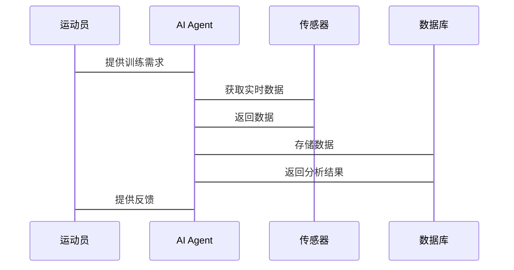

                 


# AI Agent在智能体育训练中的应用

> 关键词：AI Agent、智能体育训练、强化学习、体育数据科学、运动表现优化

> 摘要：AI Agent（人工智能代理）在智能体育训练中的应用正逐渐成为体育科技领域的焦点。通过AI Agent，体育训练可以实现个性化、实时化和数据驱动化。本文将从AI Agent的基本概念出发，分析其在体育训练中的技术原理、系统设计和实际应用，并通过具体案例展示其在提高运动表现和优化训练计划中的潜力。文章最后将总结AI Agent在智能体育训练中的优势与挑战，并展望其未来的发展方向。

---

## 第一部分: AI Agent与智能体育训练的背景与基础

### 第1章: AI Agent的基本概念与技术基础

#### 1.1 AI Agent的定义与核心概念

AI Agent（人工智能代理）是一种能够感知环境、自主决策并执行任务的智能体。与传统AI不同，AI Agent具有以下核心特征：

- **自主性**：能够在没有外部干预的情况下自主运作。
- **反应性**：能够实时感知环境并做出响应。
- **目标导向**：具有明确的目标，并根据目标优化其行为。
- **学习能力**：能够通过经验改进自身性能。

AI Agent可以分为两类：基于规则的Agent和基于学习的Agent。基于规则的Agent依赖预定义的规则进行决策，而基于学习的Agent则通过数据驱动的方式不断优化其行为。

#### 1.2 智能体育训练的定义与现状

智能体育训练是指利用人工智能、大数据和物联网等技术，对体育训练过程进行实时监测、分析和优化。当前，体育训练中的智能化需求主要体现在以下几个方面：

- **个性化训练方案**：根据运动员的个体特征制定个性化的训练计划。
- **实时反馈与调整**：通过实时监测运动员的动作和技术，提供即时反馈。
- **数据驱动的决策**：基于海量数据优化训练策略。

然而，传统体育训练中存在以下问题：

- **训练效率低**：缺乏科学的数据支持，训练计划难以最大化效果。
- **数据孤岛**：各个训练环节的数据分散，难以形成闭环。
- **缺乏个性化**：训练计划往往基于经验而非数据。

AI Agent的应用可以有效解决这些问题，推动体育训练的智能化转型。

#### 1.3 AI Agent在体育训练中的应用价值

AI Agent在体育训练中的应用价值主要体现在以下几个方面：

1. **提高训练效率**：通过实时数据分析和决策，优化训练计划。
2. **优化运动表现**：基于AI Agent的反馈，帮助运动员快速改进技术动作。
3. **预防运动损伤**：通过分析运动员的动作和负荷，提前发现潜在的损伤风险。
4. **个性化训练方案**：根据运动员的个体特征和训练目标，制定个性化的训练计划。

通过AI Agent的应用，运动员可以在更短的时间内达到更高的训练效果，同时减少运动损伤的风险。

---

## 第二部分: AI Agent在体育训练中的技术原理

### 第2章: AI Agent的核心技术原理

#### 2.1 AI Agent的感知模块

AI Agent的感知模块负责采集和处理环境中的数据，主要包括以下步骤：

1. **数据采集**：通过传感器、摄像头等设备采集运动员的动作、心率、姿态等数据。
2. **数据预处理**：对采集到的数据进行清洗、归一化等处理，确保数据的可用性。
3. **特征提取**：从原始数据中提取有用的特征，如动作幅度、动作速度等。

感知模块的关键在于准确、实时地获取运动员的状态信息。常用的传感器包括加速度计、陀螺仪、深度相机等。

#### 2.2 AI Agent的决策模块

AI Agent的决策模块负责根据感知到的信息做出最优决策。主要算法包括强化学习和监督学习。

1. **强化学习**：通过试错的方式不断优化决策策略。例如，使用Q-Learning算法在训练中优化运动员的动作选择。
2. **监督学习**：基于历史数据，训练模型预测最优的训练计划。

决策模块的核心在于建立一个能够根据实时数据调整训练策略的模型。例如，在篮球训练中，AI Agent可以根据球员的动作和位置实时调整防守策略。

#### 2.3 AI Agent的执行模块

AI Agent的执行模块负责根据决策模块的输出执行具体的训练动作。这可能包括：

1. **调整训练计划**：根据运动员的表现动态调整训练内容。
2. **实时反馈**：通过语音或视觉的方式指导运动员纠正动作。
3. **数据记录**：记录训练数据，为后续分析提供依据。

执行模块的关键在于快速、准确地将决策转化为具体的训练指令。

#### 2.4 本章小结

AI Agent的技术原理可以分为感知、决策和执行三个模块。感知模块负责数据采集和处理，决策模块负责策略制定，执行模块负责具体操作。三者的协同工作使得AI Agent能够实时优化训练过程。

---

## 第三部分: AI Agent在体育训练中的系统设计

### 第3章: AI Agent的数学模型与算法

#### 3.1 AI Agent的数学模型

AI Agent的数学模型主要涉及状态空间、动作空间和奖励函数。

1. **状态空间**：表示环境中的所有可能状态。例如，在跑步训练中，状态可以包括心率、步频、步幅等。
2. **动作空间**：表示AI Agent可以执行的所有动作。例如，调整训练强度、改变训练节奏等。
3. **奖励函数**：定义AI Agent在不同状态和动作下的奖励值。例如，当运动员达到预期心率时，奖励值增加。

#### 3.2 AI Agent的核心算法

AI Agent的核心算法主要包括强化学习和监督学习。

1. **强化学习（Reinforcement Learning）**：通过试错学习优化策略。例如，使用深度强化学习（DRL）在复杂环境中做出决策。
2. **监督学习（Supervised Learning）**：基于标注数据训练模型，预测最优训练计划。

#### 3.3 算法实现的数学公式

强化学习的数学公式如下：

$$ Q(s, a) = Q(s, a) + \alpha (r + \gamma \max Q(s', a') - Q(s, a)) $$

其中：
- \( Q(s, a) \) 表示状态 \( s \) 下动作 \( a \) 的价值函数。
- \( \alpha \) 表示学习率。
- \( r \) 表示奖励值。
- \( \gamma \) 表示折扣因子。

监督学习的数学公式如下：

$$ y = \theta^T x + \epsilon $$

其中：
- \( \theta \) 表示模型参数。
- \( x \) 表示输入数据。
- \( \epsilon \) 表示误差项。

---

## 第四部分: AI Agent在体育训练中的系统设计

### 第4章: AI Agent的系统设计

#### 4.1 系统功能设计

AI Agent在体育训练中的系统功能设计如下：

1. **数据采集**：通过传感器和摄像头采集运动员的实时数据。
2. **数据分析**：利用机器学习算法分析数据，制定训练计划。
3. **实时反馈**：根据分析结果，实时指导运动员调整动作。
4. **效果评估**：评估训练效果，优化训练计划。

#### 4.2 系统架构设计

系统架构设计如下：

1. **数据采集层**：负责数据的采集和预处理。
2. **数据分析层**：负责数据的分析和模型训练。
3. **决策层**：根据分析结果做出决策。
4. **执行层**：执行具体的训练指令。

#### 4.3 系统接口设计

系统接口设计如下：

1. **传感器接口**：与各种传感器连接，获取实时数据。
2. **用户界面**：提供友好的操作界面，供教练和运动员使用。
3. **数据接口**：与其他系统（如数据库、云平台）进行数据交互。

#### 4.4 系统交互流程图



#### 4.5 本章小结

AI Agent的系统设计包括数据采集、数据分析、决策和执行四个部分。系统架构的合理设计和接口的优化能够提高训练效率，实现智能化训练。

---

## 第五部分: 项目实战

### 第5章: AI Agent在体育训练中的项目实战

#### 5.1 项目环境搭建

项目环境搭建需要以下工具：

1. **开发环境**：Python、Jupyter Notebook
2. **机器学习框架**：TensorFlow、PyTorch
3. **传感器**：心率带、动作捕捉设备
4. **数据存储**：MySQL、MongoDB

#### 5.2 系统核心实现源代码

以下是AI Agent的核心代码示例：

```python
import numpy as np
import tensorflow as tf
from tensorflow.keras import layers

# 定义强化学习模型
class AI-Agent(tf.keras.Model):
    def __init__(self, state_size, action_size):
        super(AI-Agent, self).__init__()
        self.state_size = state_size
        self.action_size = action_size
        self.dense1 = layers.Dense(64, activation='relu')
        self.dense2 = layers.Dense(action_size)

    def call(self, inputs):
        x = self.dense1(inputs)
        x = self.dense2(x)
        return x

# 初始化模型
state_size = 6  # 状态空间大小
action_size = 4  # 动作空间大小
agent = AI-Agent(state_size, action_size)

# 定义奖励函数
def reward_function(states, actions, next_states):
    reward = 0
    # 根据具体训练目标计算奖励
    # 例如，当动作正确时，奖励增加
    if states[0] < next_states[0]:
        reward += 1
    return reward

# 训练过程
optimizer = tf.keras.optimizers.Adam(learning_rate=0.001)

for episode in range(1000):
    state = initial_state()
    total_reward = 0
    while not done:
        # 获取动作
        with tf.GradientTape() as tape:
            action_probs = tf.nn.softmax(agent(state))
            action = np.random.choice(action_probs.shape[1], p=action_probs.numpy()[0])
            # 执行动作
            next_state, reward, done = step(action)
            # 计算损失
            target = reward + gamma * np.max(agent(next_state))
            loss = tf.keras.losses.sparse_categorical_crossentropy(target, action_probs)
        # 反向传播
        gradients = tape.gradient(loss, agent.trainable_weights)
        optimizer.apply_gradients(zip(gradients, agent.trainable_weights))
        # 累计奖励
        total_reward += reward
    print(f"Episode {episode}, Total Reward: {total_reward}")
```

#### 5.3 代码应用解读与分析

上述代码实现了一个基于强化学习的AI Agent，用于体育训练中的动作优化。模型通过感知环境状态，选择最优动作，并通过不断试错优化策略。

#### 5.4 实际案例分析

以篮球训练为例，AI Agent可以实时监测球员的动作，并提供即时反馈。例如，在跳投训练中，AI Agent可以根据球员的动作轨迹优化投篮姿势，提高命中率。

#### 5.5 项目小结

通过AI Agent的应用，训练过程更加科学化和个性化，运动员可以更快地达到训练目标。

---

## 第六部分: 总结与展望

### 第6章: 总结与展望

#### 6.1 最佳实践 tips

- 在体育训练中，AI Agent的应用需要结合具体运动项目的特点。
- 数据的准确性和实时性是AI Agent有效工作的关键。
- 需要定期更新模型，以适应运动员的状态变化。

#### 6.2 小结

AI Agent在智能体育训练中的应用前景广阔。通过实时数据分析和决策优化，AI Agent能够帮助运动员提高训练效率，优化运动表现。

#### 6.3 注意事项

- 数据隐私和安全问题需要高度重视。
- 需要与教练团队紧密合作，确保AI Agent的决策符合训练目标。

#### 6.4 拓展阅读

- 《强化学习：理论与实践》
- 《机器学习在体育中的应用》

---

## 附录

### 附录A: 参考文献

1. 强化学习经典论文：Richard S. Sutton, Andrew G. Barto, "Reinforcement Learning: An Introduction"
2. 体育数据科学相关书籍：《Data Analytics for Sport》
3. 相关技术文档：OpenCV、TensorFlow官方文档

### 附录B: 工具与资源

1. 开发工具：Jupyter Notebook、PyCharm
2. 机器学习框架：TensorFlow、PyTorch
3. 数据存储：MySQL、MongoDB
4. 传感器：Garmin心率带、OptiTrack动作捕捉系统

---

# 结语

AI Agent在智能体育训练中的应用正在逐步改变传统的训练方式。通过实时数据分析和决策优化，AI Agent能够帮助运动员提高训练效率，优化运动表现。未来，随着技术的不断进步，AI Agent在体育训练中的应用将更加广泛和深入。

