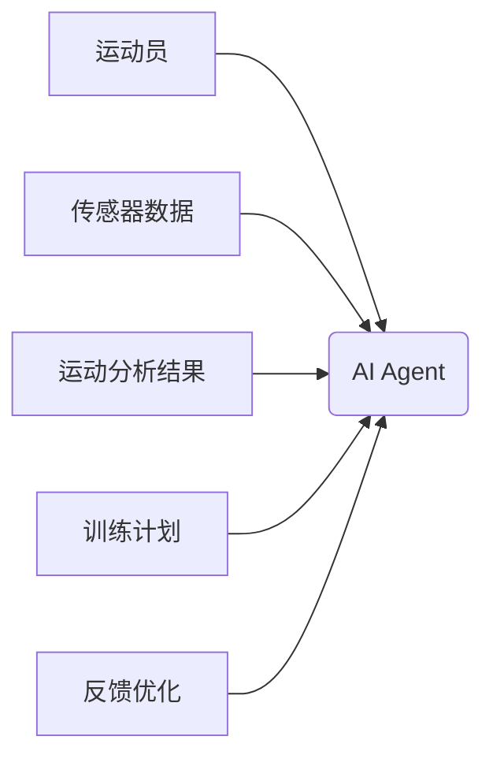
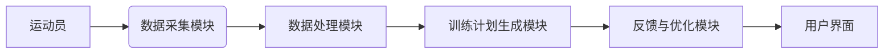

                 


# AI Agent在智能体育训练系统中的应用

> 关键词：AI Agent，智能体育训练系统，运动分析，个性化训练，实时反馈，数据驱动

> 摘要：本文探讨了AI Agent在智能体育训练系统中的应用，详细介绍了AI Agent的核心原理、智能体育训练系统的架构设计、AI Agent在体育训练中的具体应用场景，以及相关算法的实现与优化。文章通过实际案例分析，展示了AI Agent如何通过感知、决策和执行模块提升体育训练的效果与效率。

---

## 第1章 AI Agent与智能体育训练系统概述

### 1.1 AI Agent的基本概念

#### 1.1.1 AI Agent的定义
AI Agent（人工智能代理）是指能够感知环境、做出决策并执行任务的智能实体。它可以理解为一种软件或硬件系统，通过数据输入、算法处理和输出操作，实现特定目标。在体育训练领域，AI Agent主要用于辅助教练和运动员优化训练计划、分析运动表现并提供实时反馈。

#### 1.1.2 AI Agent的核心特征
AI Agent的核心特征包括：
1. **自主性**：能够自主感知环境并做出决策。
2. **反应性**：能够实时响应环境变化。
3. **学习性**：能够通过数据和反馈不断优化自身行为。
4. **协作性**：能够与其他系统或人类协同工作。

#### 1.1.3 AI Agent在体育领域的应用潜力
AI Agent在体育领域的应用潜力主要体现在以下几个方面：
1. **运动分析**：通过传感器和摄像头数据，实时分析运动员的技术动作和运动表现。
2. **个性化训练计划**：根据运动员的体能、技术特点和目标，制定个性化的训练方案。
3. **实时反馈与优化**：在训练过程中，实时提供反馈并优化训练策略。

### 1.2 智能体育训练系统的定义与特点

#### 1.2.1 智能体育训练系统的定义
智能体育训练系统是指通过传感器、摄像头等设备采集运动员的运动数据，结合AI技术进行分析和处理，并提供实时反馈和优化建议的系统。该系统能够帮助教练和运动员更科学地进行训练，提高训练效率和效果。

#### 1.2.2 智能体育训练系统的组成模块
智能体育训练系统通常包括以下几个模块：
1. **数据采集模块**：通过传感器、摄像头等设备采集运动员的运动数据。
2. **数据分析模块**：对采集的数据进行处理和分析，提取有用的特征信息。
3. **训练计划生成模块**：根据分析结果，生成个性化的训练计划。
4. **反馈与优化模块**：在训练过程中实时提供反馈，并根据反馈优化训练策略。

#### 1.2.3 智能体育训练系统的优势与挑战
智能体育训练系统的优势在于：
1. **提高训练效率**：通过数据分析和优化算法，减少无效训练时间。
2. **个性化指导**：根据运动员的实际情况提供个性化的训练建议。
3. **实时反馈**：在训练过程中实时提供反馈，帮助运动员快速调整动作和技术。

智能体育训练系统的挑战在于：
1. **数据采集的准确性**：传感器和摄像头的数据可能存在误差。
2. **算法的复杂性**：需要处理大量的数据，并设计高效的算法。
3. **系统的实时性**：在实时场景中，系统需要快速响应。

### 1.3 AI Agent在智能体育训练中的作用

#### 1.3.1 AI Agent在运动分析中的应用
AI Agent可以通过传感器和摄像头采集运动员的运动数据，结合机器学习算法，实时分析运动员的动作技术、运动姿态和运动轨迹。例如，AI Agent可以识别运动员的错误动作，并提供纠正建议。

#### 1.3.2 AI Agent在个性化训练计划中的作用
AI Agent可以根据运动员的体能、技术特点和训练目标，结合历史数据和实时反馈，制定个性化的训练计划。例如，AI Agent可以根据运动员的肌肉力量和耐力水平，推荐适合的训练强度和训练内容。

#### 1.3.3 AI Agent在实时反馈与优化中的价值
AI Agent可以在训练过程中实时监测运动员的运动数据，并根据数据反馈优化训练策略。例如，AI Agent可以根据运动员的实时心率和运动负荷，动态调整训练计划，确保运动员在安全范围内进行高强度训练。

---

## 第2章 AI Agent的核心原理

### 2.1 AI Agent的基本原理

#### 2.1.1 AI Agent的感知模块
感知模块是AI Agent的核心模块之一，负责接收和处理环境中的数据。在智能体育训练系统中，感知模块通常包括传感器和摄像头，用于采集运动员的运动数据。

#### 2.1.2 AI Agent的决策模块
决策模块是AI Agent的另一个核心模块，负责根据感知到的数据做出决策。在智能体育训练系统中，决策模块通常结合机器学习算法，分析运动员的运动数据，并生成相应的训练建议。

#### 2.1.3 AI Agent的执行模块
执行模块是AI Agent的最后一个核心模块，负责根据决策模块的建议执行具体的操作。在智能体育训练系统中，执行模块通常包括反馈装置和训练设备，用于向运动员提供实时反馈并调整训练计划。

### 2.2 AI Agent的核心算法

#### 2.2.1 机器学习算法在AI Agent中的应用
机器学习算法是AI Agent的核心算法之一，广泛应用于运动分析和个性化训练计划生成。例如，可以使用支持向量机（SVM）或随机森林（Random Forest）算法对运动员的运动数据进行分类和回归分析。

#### 2.2.2 自然语言处理在AI Agent中的作用
自然语言处理（NLP）算法在AI Agent中主要用于处理和分析教练和运动员的自然语言输入。例如，AI Agent可以通过NLP技术理解教练的训练目标，并根据目标生成相应的训练计划。

#### 2.2.3 强化学习在AI Agent中的应用
强化学习算法在AI Agent中主要用于训练计划的优化和调整。例如，AI Agent可以通过强化学习算法，根据运动员的实时反馈，动态调整训练计划，以达到最佳训练效果。

### 2.3 AI Agent的实体关系图



---

## 第3章 智能体育训练系统的设计与实现

### 3.1 系统总体架构

#### 3.1.1 系统功能模块划分
智能体育训练系统通常包括以下几个功能模块：
1. **数据采集模块**：负责采集运动员的运动数据。
2. **数据分析模块**：负责对采集的数据进行处理和分析。
3. **训练计划生成模块**：负责根据分析结果生成个性化的训练计划。
4. **反馈与优化模块**：负责在训练过程中实时提供反馈并优化训练策略。

#### 3.1.2 系统架构设计
智能体育训练系统的架构设计通常采用分层架构，包括数据采集层、数据处理层、业务逻辑层和用户界面层。每一层都有明确的功能划分和数据交互方式。

#### 3.1.3 系统交互流程
系统交互流程通常包括以下几个步骤：
1. **数据采集**：通过传感器和摄像头采集运动员的运动数据。
2. **数据分析**：对采集的数据进行处理和分析，提取有用的特征信息。
3. **训练计划生成**：根据分析结果生成个性化的训练计划。
4. **反馈与优化**：在训练过程中实时提供反馈，并根据反馈优化训练策略。

### 3.2 系统功能设计

#### 3.2.1 数据采集模块
数据采集模块负责采集运动员的运动数据，包括心率、运动轨迹、动作姿态等。常用的数据采集设备包括智能手环、运动追踪器和摄像头。

#### 3.2.2 数据分析模块
数据分析模块负责对采集的数据进行处理和分析，提取有用的特征信息。例如，可以通过机器学习算法分析运动员的动作技术，识别错误动作并提供纠正建议。

#### 3.2.3 训练计划生成模块
训练计划生成模块负责根据分析结果生成个性化的训练计划。例如，可以根据运动员的体能水平和训练目标，推荐适合的训练强度和训练内容。

#### 3.2.4 反馈与优化模块
反馈与优化模块负责在训练过程中实时提供反馈，并根据反馈优化训练策略。例如，可以根据运动员的实时心率和运动负荷，动态调整训练计划，确保运动员在安全范围内进行高强度训练。

### 3.3 系统架构图



---

## 第4章 AI Agent在体育训练中的应用场景

### 4.1 运动分析

#### 4.1.1 动作技术分析
AI Agent可以通过传感器和摄像头采集运动员的运动数据，结合机器学习算法，实时分析运动员的动作技术。例如，AI Agent可以识别运动员的错误动作，并提供纠正建议。

#### 4.1.2 运动姿态分析
AI Agent可以通过摄像头采集运动员的运动姿态，结合深度学习算法，实时分析运动员的运动姿态。例如，AI Agent可以识别运动员的站姿和动作姿态，并提供相应的反馈。

#### 4.1.3 运动轨迹分析
AI Agent可以通过传感器和摄像头采集运动员的运动轨迹，结合运动学算法，实时分析运动员的运动轨迹。例如，AI Agent可以分析运动员的跑步姿势和步频，并提供相应的反馈。

### 4.2 个性化训练计划

#### 4.2.1 体能水平评估
AI Agent可以根据运动员的体能数据，评估运动员的体能水平，并根据评估结果制定个性化的训练计划。例如，AI Agent可以根据运动员的力量和耐力水平，推荐适合的训练强度和训练内容。

#### 4.2.2 技术特点分析
AI Agent可以根据运动员的技术特点，分析运动员的技术优势和劣势，并根据分析结果制定个性化的训练计划。例如，AI Agent可以根据运动员的射门精度和传球能力，推荐适合的训练内容。

#### 4.2.3 训练目标设定
AI Agent可以根据运动员的训练目标，结合历史数据和实时反馈，制定个性化的训练计划。例如，AI Agent可以根据运动员的训练目标，推荐适合的训练时间和训练内容。

### 4.3 实时反馈与优化

#### 4.3.1 实时心率监测
AI Agent可以通过心率传感器实时监测运动员的心率，并根据心率数据动态调整训练计划。例如，AI Agent可以根据运动员的心率变化，推荐适合的训练强度。

#### 4.3.2 实时运动负荷监测
AI Agent可以通过传感器实时监测运动员的运动负荷，并根据运动负荷数据动态调整训练计划。例如，AI Agent可以根据运动员的运动负荷变化，推荐适合的训练内容。

#### 4.3.3 实时反馈优化
AI Agent可以在训练过程中实时提供反馈，并根据反馈优化训练策略。例如，AI Agent可以根据运动员的实时反馈，动态调整训练计划，以达到最佳训练效果。

### 4.4 伤病预测与预防

#### 4.4.1 运动员状态监测
AI Agent可以通过传感器和摄像头实时监测运动员的运动状态，结合历史数据和实时反馈，预测运动员的伤病风险。例如，AI Agent可以根据运动员的运动姿态和动作技术，预测运动员的伤病风险。

#### 4.4.2 伤病预防建议
AI Agent可以根据运动员的伤病风险，制定相应的预防建议。例如，AI Agent可以根据运动员的伤病风险，推荐适合的训练内容和训练强度。

#### 4.4.3 康复训练指导
AI Agent可以根据运动员的伤病情况，制定相应的康复训练计划。例如，AI Agent可以根据运动员的伤病情况，推荐适合的康复训练内容和训练强度。

---

## 第5章 算法实现

### 5.1 机器学习算法实现

#### 5.1.1 KNN算法实现
KNN（K-近邻）算法是一种常用的机器学习算法，广泛应用于分类和回归问题。以下是KNN算法的实现步骤：

1. **数据预处理**：对数据进行标准化或归一化处理。
2. **选择K值**：选择合适的K值，通常采用交叉验证方法。
3. **计算距离**：计算待测样本与训练样本之间的距离。
4. **投票分类**：根据K值选择最近邻的类别进行投票。

以下是KNN算法的Python实现代码：

```python
from sklearn.neighbors import KNeighborsClassifier
import numpy as np

# 数据预处理
X = np.array([[1, 2], [3, 4], [5, 6], [7, 8]])
y = np.array([0, 1, 0, 1])

# 模型训练
knn = KNeighborsClassifier(n_neighbors=3)
knn.fit(X, y)

# 预测
test_data = np.array([[2, 3]])
print(knn.predict(test_data))
```

#### 5.1.2 支持向量机（SVM）算法实现
支持向量机（SVM）算法是一种常用的机器学习算法，广泛应用于分类和回归问题。以下是SVM算法的实现步骤：

1. **数据预处理**：对数据进行标准化或归一化处理。
2. **选择核函数**：选择合适的核函数，通常采用RBF核函数。
3. **模型训练**：使用训练数据训练SVM模型。
4. **模型预测**：使用训练好的模型进行预测。

以下是SVM算法的Python实现代码：

```python
from sklearn.svm import SVC
import numpy as np

# 数据预处理
X = np.array([[1, 2], [3, 4], [5, 6], [7, 8]])
y = np.array([0, 1, 0, 1])

# 模型训练
svc = SVC(kernel='rbf')
svc.fit(X, y)

# 预测
test_data = np.array([[2, 3]])
print(svc.predict(test_data))
```

### 5.2 强化学习算法实现

#### 5.2.1 Q-Learning算法实现
Q-Learning算法是一种常用的强化学习算法，广泛应用于状态和动作空间较小的问题。以下是Q-Learning算法的实现步骤：

1. **初始化Q表**：创建一个Q表，记录状态和动作的Q值。
2. **选择动作**：根据当前状态选择一个动作。
3. **执行动作**：执行选择的动作，观察下一个状态和奖励。
4. **更新Q值**：根据奖励和下一个状态更新Q值。

以下是Q-Learning算法的Python实现代码：

```python
import numpy as np

# 初始化Q表
Q = np.zeros([4, 4])

# 执行动作
state = 0
action = 2
next_state = 3
reward = 1

# 更新Q值
Q[state, action] = Q[state, action] + 0.1 * (reward + np.max(Q[next_state]))
```

---

## 第6章 系统集成与优化

### 6.1 系统集成

#### 6.1.1 硬件设备集成
智能体育训练系统的硬件设备通常包括传感器、摄像头和反馈装置。例如，可以使用智能手环采集心率数据，使用摄像头采集动作姿态数据，使用反馈装置提供实时反馈。

#### 6.1.2 软件系统集成
智能体育训练系统的软件系统通常包括数据采集模块、数据分析模块、训练计划生成模块和反馈与优化模块。例如，可以使用Python编写数据分析模块，使用机器学习算法进行运动分析。

### 6.2 系统优化

#### 6.2.1 数据处理优化
数据处理优化是智能体育训练系统优化的重要部分。例如，可以通过数据压缩和数据筛选技术，减少数据处理的时间和空间复杂度。

#### 6.2.2 算法优化
算法优化是智能体育训练系统优化的另一个重要部分。例如，可以通过参数调节和模型优化，提高机器学习算法的准确性和运行效率。

#### 6.2.3 系统性能优化
系统性能优化是智能体育训练系统优化的关键部分。例如，可以通过多线程和分布式计算技术，提高系统的处理能力和响应速度。

---

## 第7章 总结与展望

### 7.1 总结
本文详细探讨了AI Agent在智能体育训练系统中的应用，介绍了AI Agent的核心原理、智能体育训练系统的架构设计、AI Agent在体育训练中的具体应用场景，以及相关算法的实现与优化。通过实际案例分析，展示了AI Agent如何通过感知、决策和执行模块提升体育训练的效果与效率。

### 7.2 展望
未来，随着人工智能技术的不断发展，AI Agent在智能体育训练系统中的应用将更加广泛和深入。例如，可以通过引入更多的传感器和摄像头，提高数据采集的准确性和丰富性；可以通过优化算法和模型，提高训练计划的个性化和智能化；可以通过引入虚拟现实和增强现实技术，提供更加沉浸式的训练体验。

---

以上是《AI Agent在智能体育训练系统中的应用》的完整目录大纲和详细内容。

