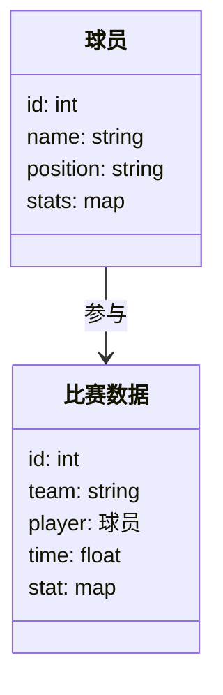
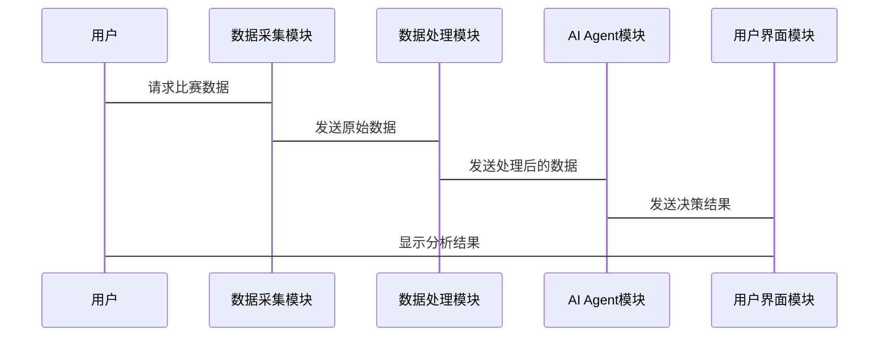

                 


## 第4章: AI Agent的算法原理与实现

### 4.3 其他相关算法及其应用

#### 4.3.1 决策树算法
决策树是一种常用的机器学习算法，通过构建树状结构来分类和回归问题。在体育数据分析中，决策树可以用于预测比赛结果或分析影响比赛结果的因素。

##### 算法步骤
1. 数据预处理：清洗数据，处理缺失值和异常值。
2. 特征选择：选择对比赛结果影响较大的特征，如得分、控球率等。
3. 模型训练：使用训练数据训练决策树模型。
4. 模型预测：利用训练好的模型对新数据进行预测。

##### 优缺点
- 优点：易于理解，适合处理分类问题。
- 缺点：对噪声数据敏感，容易过拟合。

#### 4.3.2 随机森林算法
随机森林是一种基于决策树的集成学习算法，通过构建多个决策树并集成结果来提高模型的准确性和鲁棒性。

##### 算法步骤
1. 数据预处理：与决策树类似。
2. 特征和样本抽取：使用 bootstrap 方法抽取样本，并随机选择部分特征进行树的构建。
3. 模型训练：构建多个决策树。
4. 模型预测：通过投票或平均的方式得到最终结果。

##### 优缺点
- 优点：高准确性和鲁棒性。
- 缺点：计算复杂度较高。

### 4.4 算法对比与选择

#### 4.4.1 算法对比
| 算法名称   | 优点                           | 缺点                           |
|------------|--------------------------------|--------------------------------|
| 强化学习    | 适用于动态环境，能实时调整策略 | 需要大量数据和计算资源         |
| 深度学习    | 高准确性和鲁棒性                 | 需要大量数据和计算资源         |
| 决策树      | 易于解释，适合中小规模数据       | 易于过拟合                     |
| 随机森林    | 高准确性和鲁棒性                 | 计算复杂度较高                 |

#### 4.4.2 算法选择
在体育数据分析中，选择合适的算法取决于具体的应用场景和数据规模。例如，实时比赛分析可能更适合强化学习，而历史数据分析可能更适合随机森林。

## 第5章: 系统分析与架构设计

### 5.1 问题场景介绍

#### 5.1.1 问题描述
在足球比赛中，教练需要实时分析比赛数据，制定最佳的战术策略。AI Agent可以通过实时数据采集和分析，提供战术建议。

### 5.2 系统功能设计

#### 5.2.1 领域模型


#### 5.2.2 系统架构
```mermaid
containerDiagram
    container 系统边界 {
        component 数据采集模块 {
            数据源: 数据库
        }
        component 数据处理模块 {
            处理逻辑: Python脚本
        }
        component AI Agent模块 {
            决策算法: 强化学习
        }
        component 用户界面模块 {
            界面: Web界面
        }
    }
```

#### 5.2.3 接口设计
- 数据采集模块接口：从数据库获取实时比赛数据。
- 数据处理模块接口：对数据进行清洗和特征提取。
- AI Agent模块接口：接收数据并返回决策结果。
- 用户界面模块接口：显示分析结果和决策建议。

### 5.3 系统交互流程

#### 5.3.1 交互流程


## 第6章: 项目实战

### 6.1 环境安装与配置

#### 6.1.1 安装Python和必要的库
```bash
pip install numpy pandas scikit-learn tensorflow
```

#### 6.1.2 安装Jupyter Notebook
```bash
pip install jupyter
```

### 6.2 核心代码实现

#### 6.2.1 数据处理代码
```python
import pandas as pd
import numpy as np

# 数据加载
data = pd.read_csv('football_match.csv')

# 数据清洗
data.dropna(inplace=True)
data = data[~data['score'].isnull()]
```

#### 6.2.2 AI Agent实现代码
```python
import tensorflow as tf
from tensorflow.keras import layers

# 构建强化学习模型
model = tf.keras.Sequential([
    layers.Dense(64, activation='relu'),
    layers.Dense(1, activation='linear')
])

# 定义损失函数和优化器
model.compile(loss='mean_squared_error', optimizer='adam')
```

#### 6.2.3 模型训练代码
```python
# 训练模型
model.fit(X_train, y_train, epochs=100, batch_size=32)
```

### 6.3 实际案例分析

#### 6.3.1 足球比赛分析
假设我们有一场比赛的数据，AI Agent会根据实时数据调整战术，比如改变防守策略或进攻路线。

#### 6.3.2 比赛结果预测
模型可以预测比赛的结果，如胜率、平局率等。

### 6.4 项目总结与优化建议

#### 6.4.1 项目总结
本项目展示了如何使用AI Agent进行智能体育赛事分析，从数据处理到模型训练，再到结果展示，整个流程清晰明了。

#### 6.4.2 优化建议
- 使用更复杂的模型如Transformer来提高准确性。
- 增加更多的特征，如球员状态和天气条件。
- 实现实时数据分析，提供更及时的决策支持。

## 第7章: 总结与展望

### 7.1 总结
本文详细介绍了AI Agent在智能体育赛事分析中的角色和应用，从基本概念到算法实现，再到系统设计和项目实战，全面展示了AI Agent在体育领域的潜力和价值。

### 7.2 未来展望
随着AI技术的不断发展，AI Agent在体育赛事分析中的应用将更加广泛和深入。未来的研究方向包括开发更智能的决策模型、优化系统架构以及探索更多的应用场景。

---

通过本文的介绍，读者可以全面了解AI Agent在智能体育赛事分析中的角色和技术实现，为体育数据分析和智能化提供了新的思路和方法。

