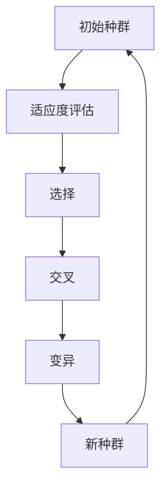
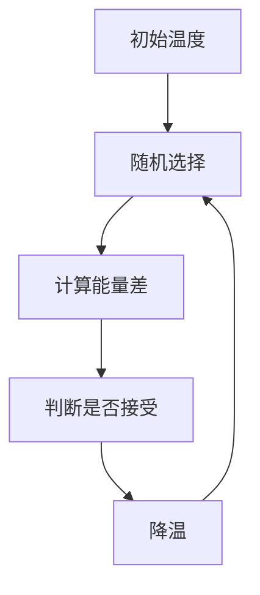
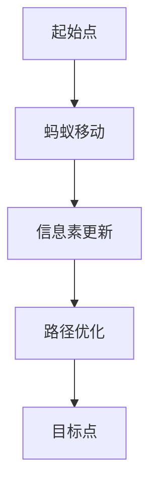
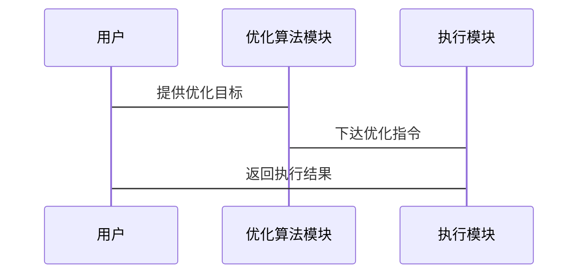

                 


# AI Agent在智能供应链优化中的应用

> 关键词：AI Agent, 智能供应链, 供应链优化, 人工智能, 优化算法, 系统架构

> 摘要：本文详细探讨了AI Agent在智能供应链优化中的应用，从基本概念、核心原理到具体应用案例，结合系统架构设计和项目实战，全面解析了AI Agent在供应链优化中的关键作用和实现方法。文章内容涵盖背景介绍、核心概念、算法原理、系统架构、项目实战等部分，旨在为读者提供一个全面的技术视角，帮助读者深入理解AI Agent在智能供应链优化中的应用价值和实现细节。

---

# 第一章: 引言

## 1.1 背景介绍
供应链优化是现代企业运营的核心挑战之一。随着人工智能技术的快速发展，AI Agent（智能体）逐渐成为供应链优化的重要工具。AI Agent通过感知、决策和执行的能力，能够显著提升供应链的效率和灵活性。

## 1.2 问题描述
传统供应链存在信息孤岛、响应慢、成本高等问题，难以应对市场变化和客户需求的快速波动。AI Agent通过实时数据处理、智能决策和自动化执行，能够有效解决这些问题。

## 1.3 问题解决
AI Agent通过数据驱动的决策、自适应优化和实时反馈机制，帮助企业在供应链的各个环节实现高效协同，提升整体运营效率。

## 1.4 边界与外延
本文聚焦于AI Agent在供应链优化中的应用，主要涵盖需求预测、库存管理、物流优化等领域，不涉及企业的生产过程和客户关系管理。

## 1.5 核心要素
- 数据源：传感器、ERP系统、订单数据
- AI Agent：感知、决策、执行
- 优化目标：成本最小化、效率最大化、客户满意度提升

---

# 第二章: AI Agent的核心概念

## 2.1 AI Agent的定义与特点
AI Agent是一种能够感知环境、自主决策并执行任务的智能实体。其特点包括：
- **自主性**：无需人工干预
- **反应性**：实时感知环境变化
- **目标导向性**：基于目标优化决策
- **学习能力**：通过数据优化性能

## 2.2 AI Agent与传统供应链的区别
| 特性               | 传统供应链           | AI Agent驱动的供应链 |
|--------------------|--------------------|--------------------|
| 数据处理能力       | 离线、低频           | 实时、高频          |
| 决策效率           | 人工主导             | 自动优化            |
| 响应速度           | 较慢                | 实时响应            |
| 灵活性              | 较低                | 高                  |

## 2.3 AI Agent的优化目标
- **成本最小化**：降低库存、运输成本
- **效率最大化**：缩短交货时间、提高资源利用率
- **客户满意度**：提升订单准确率和交付速度

---

# 第三章: AI Agent的核心原理

## 3.1 感知机制
AI Agent通过传感器、数据库等数据源感知环境，获取实时数据并进行预处理。

## 3.2 决策机制
基于预处理后的数据，AI Agent利用优化算法生成决策方案。

## 3.3 执行机制
通过API或自动化系统执行决策，并实时反馈执行结果以优化后续决策。

---

# 第四章: AI Agent的优化算法

## 4.1 遗传算法
遗传算法通过模拟生物进化过程，通过选择、交叉和变异操作生成最优解。



## 4.2 模拟退火算法
模拟退火算法通过逐步降低“温度”来寻找全局最优解。



## 4.3 蚁群算法
蚂蚁算法通过模拟蚂蚁觅食行为，通过信息素更新寻找最优路径。



---

# 第五章: AI Agent在供应链优化中的应用

## 5.1 需求预测
AI Agent通过时间序列分析、机器学习和深度学习模型实现精准需求预测。

## 5.2 库存管理
AI Agent通过动态库存优化算法，实时调整库存水平，减少库存积压和缺货风险。

## 5.3 物流路径优化
AI Agent利用图算法优化物流路径，降低运输成本和时间。

## 5.4 应急响应
AI Agent在供应链中断时，快速调整供应链策略，确保业务连续性。

---

# 第六章: AI Agent的系统架构设计

## 6.1 系统功能模块
- 数据采集模块：实时采集供应链数据
- 数据处理模块：清洗、转换和存储数据
- 优化算法模块：执行优化算法
- 执行模块：通过API或自动化系统执行决策

## 6.2 系统架构图


## 6.3 接口设计
- 数据接口：与ERP系统对接
- 执行接口：与物流系统对接
- 用户接口：提供可视化界面

## 6.4 交互流程图


---

# 第七章: 项目实战

## 7.1 环境安装
安装Python、TensorFlow、Scipy等依赖库。

## 7.2 核心代码实现
```python
import numpy as np
from sklearn.metrics import mean_squared_error

def demand_forecast(train_data, test_data):
    # 数据预处理
    train_norm = train_data normalize
    test_norm = test_data normalize
    
    # 神经网络训练
    model = Sequential()
    model.add(Dense(64, input_dim=len(train_norm.columns)))
    model.add(Activation('relu'))
    model.add(Dense(len(test_norm.columns)))
    model.compile(optimizer='adam', loss='mse')
    model.fit(train_norm, epochs=100, batch_size=32)
    
    # 预测
    prediction = model.predict(test_norm)
    return prediction
```

## 7.3 应用案例分析
分析某零售企业的库存管理优化案例，展示AI Agent的实际应用效果。

---

# 第八章: 总结与展望

## 8.1 全文总结
AI Agent通过实时感知、智能决策和自动化执行，显著提升了供应链的效率和灵活性。

## 8.2 前沿方向
- 多智能体协同优化
- 强化学习在供应链优化中的应用
- 区块链技术结合AI Agent

## 8.3 读者建议
建议读者深入学习AI Agent的核心算法和系统架构设计，结合实际场景进行创新应用。

---

# 结束语

AI Agent在智能供应链优化中的应用前景广阔，随着技术的不断进步，AI Agent将为企业带来更大的竞争优势。

