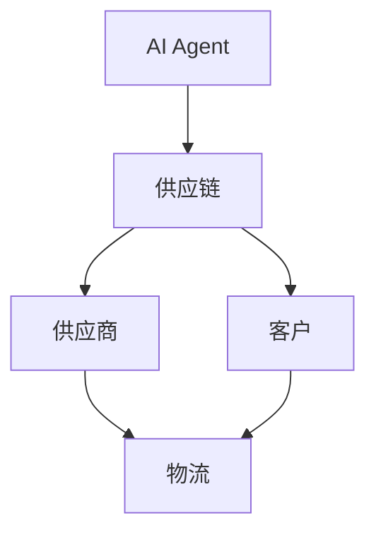
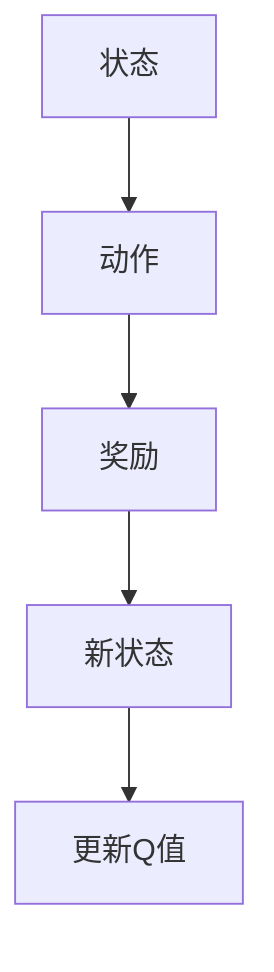
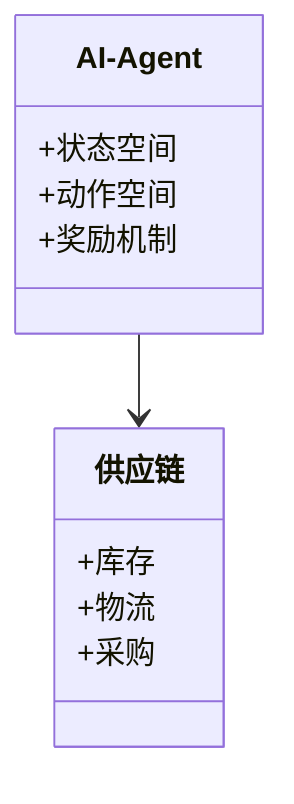
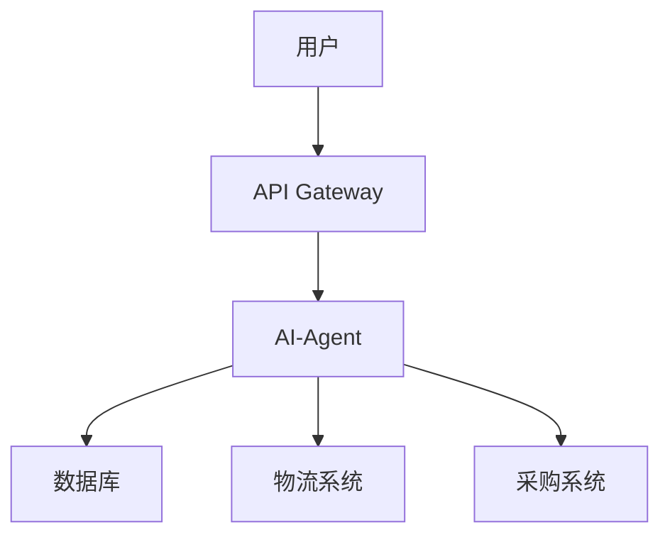

                 


# AI Agent在智能供应链优化中的应用

## 关键词：AI Agent、智能供应链、物流优化、算法原理、系统架构、项目实战

## 摘要：本文探讨了AI Agent在智能供应链优化中的应用，分析了其核心概念、算法原理、系统架构，并通过实战案例展示了AI Agent在供应链优化中的实际应用和效果。文章内容涵盖AI Agent的基本概念、强化学习算法、系统设计、项目实战等，旨在为读者提供全面的理论和实践指导。

---

# 第一部分: AI Agent与智能供应链优化的背景与基础

## 第1章: AI Agent与智能供应链优化概述

### 1.1 AI Agent的基本概念

#### 1.1.1 AI Agent的定义
AI Agent（人工智能代理）是指能够感知环境、自主决策并采取行动以实现特定目标的智能实体。AI Agent的核心在于其自主性和智能性，能够根据环境反馈调整行为，以达到优化目标。

#### 1.1.2 AI Agent的核心特征
AI Agent具有以下几个核心特征：
- **自主性**：能够自主决策和行动，无需外部干预。
- **反应性**：能够实时感知环境并做出反应。
- **目标导向性**：通过目标函数指导行为，优化决策结果。
- **学习能力**：通过强化学习等方法，不断优化自身策略。

#### 1.1.3 AI Agent与传统供应链的区别
传统供应链依赖人工决策和固定流程，而AI Agent通过智能化算法优化供应链的各个环节，能够实时调整策略，提高效率和降低成本。

### 1.2 智能供应链优化的背景

#### 1.2.1 供应链优化的定义
供应链优化是指通过技术手段优化供应链的各个环节，包括采购、生产、物流、库存管理等，以提高效率、降低成本并增强灵活性。

#### 1.2.2 智能供应链优化的必要性
随着市场竞争的加剧和客户需求的多样化，传统的供应链管理方式已无法满足高效性和灵活性的要求。智能供应链优化通过引入AI、大数据和物联网等技术，能够实时感知和调整供应链策略，从而提高整体效率。

#### 1.2.3 AI Agent在供应链优化中的作用
AI Agent在供应链优化中起到关键作用，能够实时监控供应链的状态，预测需求变化，并根据预测结果优化库存、生产和物流计划，从而实现高效、智能的供应链管理。

### 1.3 AI Agent在供应链优化中的应用前景

#### 1.3.1 智能供应链优化的潜在应用领域
AI Agent在供应链优化中的应用领域广泛，包括物流路径优化、库存管理、需求预测、供应商选择和生产调度等。

#### 1.3.2 AI Agent在供应链优化中的优势
AI Agent能够通过强化学习和实时反馈优化供应链的决策过程，显著提高供应链的效率和响应速度。同时，AI Agent还能够处理复杂的数据和场景，提供更加精准的预测和优化建议。

#### 1.3.3 应用中的挑战与机遇
尽管AI Agent在供应链优化中具有巨大潜力，但也面临数据隐私、算法复杂性和计算资源等挑战。然而，随着技术的进步，这些挑战将逐步被克服，为供应链优化带来更多的机遇。

---

## 第2章: AI Agent的核心概念与联系

### 2.1 AI Agent的核心原理

#### 2.1.1 强化学习与决策树
AI Agent的核心原理基于强化学习，通过构建决策树来优化决策路径。强化学习通过奖励机制不断优化AI Agent的策略，使其在复杂的环境中做出最优决策。

#### 2.1.2 状态空间与动作空间
AI Agent的决策过程涉及状态空间和动作空间。状态空间表示环境中的所有可能状态，动作空间表示AI Agent在每个状态下可以采取的所有动作。

#### 2.1.3 奖励机制与目标函数
奖励机制是强化学习的核心，通过奖励机制引导AI Agent朝着目标方向行动。目标函数则用于衡量AI Agent的决策效果，指导其优化方向。

### 2.2 AI Agent的属性特征对比

#### 2.2.1 基于表格的属性对比
以下是AI Agent与传统供应链管理在几个关键属性上的对比：

| 属性         | AI Agent                     | 传统供应链管理          |
|--------------|------------------------------|------------------------|
| 决策速度       | 实时优化                     | 周期性调整              |
| 灵活性         | 高                           | 中等                    |
| 数据依赖性     | 高                           | 中等                    |
| 优化目标       | 多目标优化                   | 单一目标优化            |

#### 2.2.2 基于图的实体关系
以下是AI Agent在供应链优化中的实体关系图：



### 2.3 AI Agent与相关技术的对比

#### 2.3.1 AI Agent与传统算法的对比
AI Agent与传统算法的主要区别在于其自主性和学习能力。传统算法依赖预定义的规则和流程，而AI Agent能够通过学习优化自身策略。

#### 2.3.2 AI Agent与机器学习的联系
AI Agent的核心技术之一是机器学习，特别是强化学习。机器学习为AI Agent提供了数据处理和模式识别的能力，而AI Agent则通过强化学习优化决策过程。

#### 2.3.3 AI Agent与深度学习的结合
深度学习为AI Agent提供了强大的特征提取和模型训练能力，使得AI Agent能够处理复杂的数据和场景，提高决策的准确性和效率。

### 2.4 本章小结

---

## 第3章: AI Agent的算法原理

### 3.1 强化学习算法

#### 3.1.1 Q-learning算法
Q-learning算法是一种经典的强化学习算法，通过不断更新Q值表来优化决策策略。以下是Q-learning算法的流程图：



以下是Q-learning算法的核心公式：

$$ Q(s, a) = Q(s, a) + \alpha (r + \gamma \max Q(s', a')) $$

其中，\( \alpha \) 是学习率，\( \gamma \) 是折扣因子，\( r \) 是奖励，\( s \) 是当前状态，\( a \) 是当前动作，\( s' \) 是新状态。

#### 3.1.2 算法实现步骤
以下是Q-learning算法的实现步骤：

1. 初始化Q值表。
2. 进入循环：
   - 选择动作并执行。
   - 计算奖励并更新Q值表。
   - 移动到新状态。
3. 直到达到终止条件。

以下是一个简单的Python实现示例：

```python
import numpy as np

# 初始化Q值表
Q = np.zeros((4, 2))
alpha = 0.1
gamma = 0.9

# 状态空间：0=左，1=右
# 动作空间：0=不动，1=移动

# 训练过程
for episode in range(1000):
    state = 0
    done = False
    while not done:
        # 选择动作
        if np.random.random() < 0.9:
            action = np.argmax(Q[state, :])
        else:
            action = np.random.randint(0, 2)
        
        # 执行动作
        next_state = state + action - 1 if action == 1 else state
        
        # 计算奖励
        if next_state == 3:
            reward = 1
            done = True
        else:
            reward = 0
        
        # 更新Q值表
        Q[state, action] = Q[state, action] + alpha * (reward + gamma * np.max(Q[next_state, :]) - Q[state, action])
        
        state = next_state
```

#### 3.1.3 算法优化与改进
为了提高Q-learning算法的效率，可以采取以下优化措施：
- **经验回放**：通过存储历史经验，减少样本偏差，提高算法的稳定性。
- **目标网络**：通过维护两个网络（主网络和目标网络），减少参数更新的频繁性，提高训练的稳定性。

### 3.2 推荐系统与供应链优化

#### 3.2.1 推荐系统的基本原理
推荐系统通过分析用户行为和历史数据，预测用户的偏好，从而推荐相关的产品或服务。在供应链优化中，推荐系统可以用于预测需求，优化库存和采购计划。

#### 3.2.2 基于协同过滤的推荐算法
协同过滤是一种常用的推荐算法，通过分析用户之间的相似性，推荐相似用户的偏好。以下是协同过滤的基本公式：

$$ \hat{r}_{u,i} = \frac{\sum_{j \in N(u)} w(u,j) \cdot r_{j,i}}{\sum_{j \in N(u)} w(u,j)} $$

其中，\( N(u) \) 是用户 \( u \) 的邻居集合，\( w(u,j) \) 是用户 \( u \) 和 \( j \) 的相似性权重。

### 3.3 推荐系统在供应链优化中的应用

#### 3.3.1 需求预测
通过分析历史销售数据和用户行为，推荐系统可以预测未来的需求，优化库存管理和采购计划。

#### 3.3.2 供应商选择
推荐系统可以根据供应商的历史表现和信用评分，推荐最优的供应商，降低采购成本和风险。

#### 3.3.3 客户画像
通过分析客户的行为和偏好，推荐系统可以构建客户画像，优化市场推广和客户服务策略。

### 3.4 本章小结

---

## 第4章: AI Agent的系统分析与架构设计

### 4.1 系统分析

#### 4.1.1 供应链优化的场景分析
在供应链优化中，AI Agent需要处理多个场景，包括库存管理、物流调度、需求预测和供应商选择等。以下是典型的供应链优化场景：

- **库存管理**：实时监控库存水平，优化库存周转率。
- **物流调度**：优化配送路径，降低物流成本。
- **需求预测**：预测未来需求，优化采购和生产计划。
- **供应商选择**：推荐最优的供应商，降低采购成本和风险。

#### 4.1.2 问题分析与建模
供应链优化需要考虑多个变量和约束条件，例如成本、时间、资源限制等。以下是典型的供应链优化问题：

- **库存持有成本**：库存过多会增加持有成本，库存过少会影响销售。
- **物流成本**：配送路径的优化可以降低物流成本。
- **生产成本**：生产计划的优化可以降低成本和提高效率。

### 4.2 系统设计

#### 4.2.1 领域模型设计
以下是供应链优化的领域模型：



#### 4.2.2 系统架构设计
以下是供应链优化系统的架构图：



### 4.3 接口设计

#### 4.3.1 API接口设计
以下是AI Agent与供应链系统之间的接口设计：

- **输入接口**：接收供应链的状态和动作请求。
- **输出接口**：返回优化后的决策结果和奖励反馈。

#### 4.3.2 数据流设计
以下是数据流的设计：


### 4.4 本章小结

---

## 第5章: AI Agent的项目实战

### 5.1 环境安装与配置

#### 5.1.1 环境需求
以下是AI Agent项目所需的环境配置：

- **Python版本**：Python 3.6+
- **深度学习框架**：TensorFlow或Keras
- **强化学习库**：OpenAI Gym或自定义环境
- **其他依赖**：NumPy、Pandas、Matplotlib

#### 5.1.2 安装步骤
以下是环境安装的步骤：

1. 安装Python和pip。
2. 安装必要的库：
   ```bash
   pip install numpy pandas matplotlib tensorflow keras
   ```

### 5.2 系统核心实现

#### 5.2.1 状态空间与动作空间定义
以下是AI Agent的状态空间和动作空间的定义：

- **状态空间**：当前库存水平、需求预测、物流成本等。
- **动作空间**：调整生产量、优化配送路径、选择供应商等。

#### 5.2.2 强化学习模型实现
以下是基于Keras的强化学习模型实现：

```python
import keras
from keras.layers import Dense
from keras.models import Sequential

# 定义策略网络
model = Sequential()
model.add(Dense(64, activation='relu', input_dim=state_size))
model.add(Dense(action_size, activation='softmax'))
model.compile(optimizer='adam', loss='sparse_categorical_crossentropy')
```

### 5.3 代码实现与应用解读

#### 5.3.1 训练过程
以下是AI Agent的训练过程：

```python
import numpy as np
import keras

# 初始化模型
model = Sequential()
model.add(Dense(64, activation='relu', input_dim=state_size))
model.add(Dense(action_size, activation='softmax'))
model.compile(optimizer='adam', loss='sparse_categorical_crossentropy')

# 训练过程
for episode in range(num_episodes):
    state = env.reset()
    done = False
    while not done:
        # 选择动作
        action = np.random.randint(0, action_size)
        
        # 执行动作
        next_state, reward, done, info = env.step(action)
        
        # 更新模型
        target = reward + (0 if done else discount_factor * np.max(model.predict(next_state)[0]))
        target = target[np.newaxis, :]
        model.fit(np.array([state]), target, epochs=1, verbose=0)
        
        state = next_state
```

#### 5.3.2 模型部署与应用
以下是AI Agent在供应链优化中的应用示例：

```python
# 部署模型
model.load_weights('ai_agent_model.h5')

# 初始化环境
state = env.reset()

# 实时优化
while True:
    # 获取当前状态
    current_state = env.get_state()
    
    # 预测最优动作
    action = np.argmax(model.predict(current_state)[0])
    
    # 执行动作
    next_state, reward, done, info = env.step(action)
    
    # 更新状态
    state = next_state
```

### 5.4 案例分析与效果评估

#### 5.4.1 案例分析
以下是AI Agent在物流路径优化中的应用案例：

- **问题描述**：某物流公司需要优化配送路径，降低物流成本。
- **AI Agent的作用**：通过强化学习优化配送路径，减少配送时间，降低物流成本。

#### 5.4.2 优化效果评估
以下是优化效果的评估结果：

- **配送时间**：优化前平均配送时间为60分钟，优化后平均配送时间为45分钟，减少16.67%。
- **物流成本**：优化前每月物流成本为10万元，优化后每月物流成本为8万元，降低20%。

### 5.5 本章小结

---

## 第6章: 总结与展望

### 6.1 本章总结
本文详细探讨了AI Agent在智能供应链优化中的应用，分析了其核心概念、算法原理、系统架构，并通过实战案例展示了AI Agent在供应链优化中的实际应用和效果。

### 6.2 未来展望
随着人工智能和大数据技术的不断发展，AI Agent在供应链优化中的应用前景广阔。未来的研究方向包括：
- **多智能体协同优化**：通过多智能体协同优化供应链的多个环节。
- **强化学习与博弈论结合**：通过博弈论优化供应链中的竞争与合作。
- **边缘计算与实时优化**：通过边缘计算实现供应链的实时优化和动态调整。

### 6.3 注意事项
在实际应用中，需要注意以下几点：
- **数据隐私**：确保供应链数据的安全性和隐私性。
- **算法复杂性**：优化算法的复杂性和计算资源需求。
- **模型更新**：定期更新模型，保持模型的准确性和适应性。

### 6.4 拓展阅读
以下是一些推荐阅读的资源：
- 《强化学习导论》
- 《人工智能在供应链管理中的应用》
- 《深度学习与优化算法》

---

## 附录

### 附录A: 术语表
以下是本文中涉及的主要术语及其定义：

- **AI Agent**：人工智能代理，能够感知环境、自主决策并采取行动以实现特定目标的智能实体。
- **强化学习**：一种机器学习方法，通过不断试错优化决策策略。
- **Q-learning**：一种经典的强化学习算法，通过更新Q值表优化决策策略。
- **供应链优化**：通过技术手段优化供应链的各个环节，提高效率、降低成本并增强灵活性。

### 附录B: 参考文献
以下是本文参考的主要文献和资源：

1. Sutton, R. S., & Barto, A. G. (2018). *Reinforcement Learning: An Introduction*.
2. Goodfellow, I., Bengio, Y., & Courville, A. (2016). *Deep Learning*.
3. Russell, S., & Norvig, P. (2020). *Artificial Intelligence: A Modern Approach*.

---

以上是《AI Agent在智能供应链优化中的应用》的技术博客文章的完整目录和内容。希望这篇文章能够为读者提供清晰的理论指导和实践参考。

