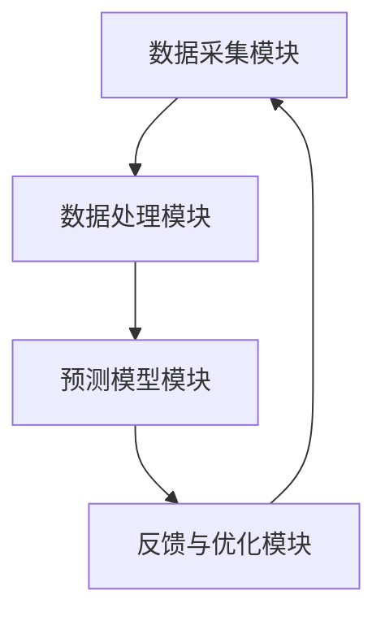

                 


```markdown
# AI Agent在智能供应链需求预测中的应用

> 关键词：AI Agent, 智能供应链, 需求预测, 时间序列分析, LSTM, ARIMA

> 摘要：本文深入探讨AI Agent在智能供应链需求预测中的应用，结合实际案例分析，详细讲解了从理论到实践的完整过程。通过分析时间序列分析与机器学习模型（如ARIMA和LSTM），展示了AI Agent如何优化供应链管理，提供了一套系统架构设计与实现方案。

---

# 第一部分: AI Agent与智能供应链概述

## 第1章: AI Agent的基本概念

### 1.1 AI Agent的定义与特点

#### 1.1.1 AI Agent的定义
AI Agent（人工智能代理）是一种能够感知环境、自主决策并执行任务的智能实体。它通过传感器获取信息，利用算法处理数据，并通过执行器与环境交互。

#### 1.1.2 AI Agent的核心特点
- **自主性**：能够在没有外部干预的情况下独立运行。
- **反应性**：能够实时感知环境并做出反应。
- **目标导向**：通过目标驱动来优化决策和行动。
- **学习能力**：能够通过经验改进自身性能。

#### 1.1.3 AI Agent与传统算法的区别
传统算法通常需要明确的规则和结构，而AI Agent具备自主学习和适应能力，能够在复杂环境中动态调整策略。

### 1.2 AI Agent的核心要素
| 核心要素 | 描述 |
|----------|------|
| 感知模块 | 通过传感器获取环境信息 |
| 决策模块 | 基于感知信息做出决策 |
| 行动模块 | 执行决策以影响环境 |
| 学习模块 | 通过经验优化自身性能 |

## 第2章: 智能供应链的基本概念

### 2.1 供应链的定义与组成

#### 2.1.1 供应链的定义
供应链是指从原材料采购到产品交付给最终用户的整个过程中的所有相关资源、流程和人员的网络。

#### 2.1.2 供应链的主要组成部分
- **供应商**：提供原材料或服务的上游企业。
- **制造商**：负责生产产品的工厂。
- **分销商**：负责产品分发和物流的中间商。
- **零售商**：面向最终消费者的销售终端。
- **消费者**：最终产品或服务的使用者。

#### 2.1.3 供应链的运作流程
1. **需求预测**：预测未来的需求量。
2. **采购计划**：根据预测结果制定采购计划。
3. **生产安排**：根据采购情况安排生产。
4. **物流管理**：协调产品的运输和交付。
5. **库存控制**：监控库存水平，避免过剩或短缺。

## 第3章: AI Agent在供应链中的应用

### 3.1 AI Agent在供应链管理中的作用

#### 3.1.1 提高供应链的效率
通过实时数据处理和自动化决策，AI Agent能够显著提高供应链的运作效率。

#### 3.1.2 优化供应链的决策过程
AI Agent利用历史数据和实时信息，提供更精准的决策支持。

#### 3.1.3 提升供应链的预测能力
通过机器学习算法，AI Agent能够更准确地预测市场需求，优化库存管理和生产计划。

---

# 第二部分: 需求预测的核心算法与模型

## 第4章: 时间序列分析与需求预测

### 4.1 时间序列分析的基本概念

#### 4.1.1 时间序列的定义
时间序列是指按时间顺序排列的一组数据，通常用于分析随时间变化的趋势和模式。

#### 4.1.2 时间序列的分类
- **平稳时间序列**：均值和方差保持不变。
- **非平稳时间序列**：均值或方差随时间变化。

#### 4.1.3 时间序列分析的常见方法
- **移动平均法**：基于过去若干期的平均值预测未来值。
- **指数平滑法**：通过加权平均法平滑数据，预测未来趋势。

### 4.2 时间序列分析的数学模型

#### 4.2.1 平稳时间序列的自回归模型
$$ AR(p) = \phi_1 X_{t-1} + \phi_2 X_{t-2} + \dots + \phi_p X_{t-p} + \epsilon $$

#### 4.2.2 移动平均模型
$$ MA(q) = \epsilon_t + \theta_1 \epsilon_{t-1} + \dots + \theta_q \epsilon_{t-q} $$

## 第5章: 常见的需求预测算法

### 5.1 ARIMA模型

#### 5.1.1 ARIMA模型的定义
ARIMA（自回归积分滑动平均模型）结合了自回归（AR）和滑动平均（MA）模型，适用于非平稳时间序列。

#### 5.1.2 ARIMA模型的参数选择
| 参数 | 描述 |
|------|------|
| p    | 自回归阶数 |
| d    | 差分阶数 |
| q    | 滑动平均阶数 |

#### 5.1.3 ARIMA模型的实现步骤
1. **数据预处理**：检查数据是否平稳，必要时进行差分。
2. **模型选择**：通过AIC或BIC准则选择最佳参数。
3. **模型训练**：基于训练数据估计模型参数。
4. **模型预测**：利用训练好的模型进行未来值预测。

### 5.2 LSTM模型

#### 5.2.1 LSTM模型的定义
LSTM（长短期记忆网络）是一种特殊的RNN，能够有效处理长序列数据。

#### 5.2.2 LSTM模型的优势
- **长期依赖保留**：通过门控机制有效处理长序列数据。
- **灵活的时序建模**：能够捕捉复杂的时序关系。

#### 5.2.3 LSTM模型的实现步骤
1. **数据准备**：将时间序列数据转换为适合LSTM输入的格式。
2. **模型构建**：定义LSTM网络结构，包括输入层、LSTM层和输出层。
3. **模型训练**：使用训练数据训练模型。
4. **模型预测**：利用训练好的模型进行未来值预测。

## 第6章: 基于AI Agent的需求预测模型

### 6.1 AI Agent在需求预测中的作用

#### 6.1.1 AI Agent如何优化需求预测
通过实时数据采集和动态调整模型参数，AI Agent能够显著提高预测的准确性。

#### 6.1.2 AI Agent与传统需求预测模型的对比
- **传统模型**：基于固定规则和历史数据，预测能力有限。
- **AI Agent模型**：具备自主学习和适应能力，能够实时优化预测结果。

#### 6.1.3 AI Agent在需求预测中的优势
- **实时性**：能够实时采集和处理数据，提供实时预测结果。
- **自适应性**：能够根据环境变化自动调整预测模型。
- **准确性**：通过深度学习算法，显著提高预测的准确性。

---

# 第三部分: 系统架构与实现

## 第7章: 系统架构设计

### 7.1 系统架构的整体设计

#### 7.1.1 系统架构的组成
- **数据采集模块**：负责采集供应链中的各种数据。
- **数据处理模块**：对采集到的数据进行清洗和特征提取。
- **预测模型模块**：基于处理后的数据进行需求预测。
- **反馈与优化模块**：根据实际结果优化预测模型。

#### 7.1.2 系统架构的模块划分
```
[数据采集模块] --> [数据处理模块] --> [预测模型模块] --> [反馈与优化模块]
```

#### 7.1.3 系统架构的交互流程
1. 数据采集模块实时采集供应链中的数据，如销售数据、库存数据等。
2. 数据处理模块对采集到的数据进行清洗和特征提取，为预测模型提供高质量的数据。
3. 预测模型模块基于处理后的数据，利用AI Agent进行需求预测。
4. 反馈与优化模块根据实际结果优化预测模型，提高预测准确性。

### 7.2 系统实现细节

#### 7.2.1 数据采集与预处理

##### 7.2.1.1 数据采集的常见方法
- **数据库查询**：从关系型数据库中查询历史销售数据。
- **API接口调用**：通过API获取实时数据，如天气数据、市场趋势等。
- **文件读取**：读取CSV或Excel文件中的历史数据。

##### 7.2.1.2 数据预处理的步骤
- **数据清洗**：处理缺失值、异常值等。
- **特征提取**：提取有助于预测的关键特征，如时间特征、季节性特征等。
- **数据转换**：将数据转换为适合模型输入的格式，如归一化、标准化等。

##### 7.2.1.3 数据清洗与特征提取
| 数据清洗 | 数据转换 |
|----------|-----------|
| 删除缺失值 | 标准化数据 |
| 处理异常值 | 离散化处理 |
| 填补缺失值 | 特征选择 |

#### 7.2.2 模型训练与部署

##### 7.2.2.1 模型训练的流程
1. **数据分割**：将数据划分为训练集和测试集。
2. **模型选择**：选择适合的预测模型，如ARIMA或LSTM。
3. **模型训练**：利用训练数据训练模型，调整模型参数。
4. **模型评估**：通过测试集评估模型的性能，如MAE、MSE等指标。

##### 7.2.2.2 模型部署的步骤
1. **模型保存**：将训练好的模型保存为可部署的形式，如PMML或TensorFlow模型。
2. **模型部署**：将模型部署到生产环境中，提供API接口供其他系统调用。
3. **模型监控**：实时监控模型的性能，及时发现并处理问题。

##### 7.2.2.3 模型监控与维护
- **性能监控**：定期评估模型的预测准确性，及时发现性能下降的情况。
- **模型更新**：根据新的数据重新训练模型，保持模型的预测能力。
- **异常处理**：处理模型运行中的异常情况，如数据缺失、模型崩溃等。

### 7.3 系统接口与交互设计

#### 7.3.1 系统接口的设计

##### 7.3.1.1 系统接口的定义
- **输入接口**：接收外部系统的数据输入，如销售数据、库存数据等。
- **输出接口**：提供预测结果给外部系统，如采购计划、生产计划等。

##### 7.3.1.2 系统接口的实现
1. **API接口设计**：定义RESTful API接口，提供数据输入和预测结果输出的接口。
2. **数据格式规范**：规定数据的格式和结构，确保数据的准确传递。
3. **接口文档编写**：编写详细的接口文档，方便其他系统集成和调用。

#### 7.3.2 系统交互设计

##### 7.3.2.1 系统交互的流程
1. **数据输入**：外部系统通过API接口向系统输入数据。
2. **数据处理**：系统对接收到的数据进行预处理，提取关键特征。
3. **模型预测**：系统利用AI Agent模型进行需求预测，生成预测结果。
4. **结果输出**：系统将预测结果返回给外部系统，供其进行后续操作。

##### 7.3.2.2 系统交互的实现
- **数据输入接口**：通过RESTful API接收JSON格式的数据。
- **数据处理模块**：对输入数据进行清洗和特征提取，生成适合模型输入的数据格式。
- **模型预测模块**：调用训练好的模型进行预测，生成预测结果。
- **结果输出接口**：将预测结果以JSON格式返回给外部系统。

---

## 第8章: 系统实现细节

### 8.1 数据采集与预处理

#### 8.1.1 数据采集的常见方法

##### 8.1.1.1 数据库查询
通过JDBC连接数据库，查询历史销售数据。例如：
```python
import pymysql

# 连接数据库
conn = pymysql.connect(host='localhost', user='root', password='password', db='sales_db')
cursor = conn.cursor()

# 查询数据
cursor.execute('SELECT date, sales FROM sales_data ORDER BY date ASC')
data = cursor.fetchall()

conn.close()
```

##### 8.1.1.2 API接口调用
通过调用外部API获取实时数据，例如天气数据：
```python
import requests

response = requests.get('http://api.weather.com/data')
weather_data = response.json()
```

##### 8.1.1.3 文件读取
读取CSV文件中的历史销售数据：
```python
import pandas as pd

data = pd.read_csv('sales.csv')
```

#### 8.1.2 数据预处理的步骤

##### 8.1.2.1 数据清洗
处理缺失值和异常值：
```python
# 处理缺失值
data.dropna(inplace=True)

# 处理异常值
z_scores = (data - data.mean()).abs() / data.std()
data = data[(z_scores < 3).all(axis=1)]
```

##### 8.1.2.2 数据转换
对数据进行归一化处理：
```python
from sklearn.preprocessing import StandardScaler

scaler = StandardScaler()
scaled_data = scaler.fit_transform(data)
```

#### 8.1.3 数据清洗与特征提取

##### 8.1.3.1 数据清洗
删除包含缺失值的行：
```python
data.dropna(inplace=True)
```

##### 8.1.3.2 特征提取
提取时间特征，如月份、季度等：
```python
import datetime

data['date'] = pd.to_datetime(data['date'])
data['month'] = data['date'].dt.month
data['year'] = data['date'].dt.year
```

### 8.2 模型训练与部署

#### 8.2.1 模型训练的流程

##### 8.2.1.1 数据分割
将数据划分为训练集和测试集：
```python
from sklearn.model_selection import train_test_split

train_data, test_data = train_test_split(data, test_size=0.2, random_state=42)
```

##### 8.2.1.2 模型选择
选择适合的预测模型，如LSTM：
```python
from tensorflow.keras.models import Sequential
from tensorflow.keras.layers import LSTM, Dense

model = Sequential()
model.add(LSTM(50, input_shape=(train_data.shape[1], 1)))
model.add(Dense(1))
model.compile(loss='mean_squared_error', optimizer='adam')
```

##### 8.2.1.3 模型训练
训练模型并保存训练结果：
```python
model.fit(train_data, epochs=50, batch_size=32, validation_data=test_data, verbose=1)
model.save('demand_prediction.h5')
```

##### 8.2.1.4 模型评估
评估模型的性能：
```python
from sklearn.metrics import mean_absolute_error, mean_squared_error

y_pred = model.predict(test_data)
mae = mean_absolute_error(test_data, y_pred)
mse = mean_squared_error(test_data, y_pred)
print(f'MAE: {mae}, MSE: {mse}')
```

#### 8.2.2 模型部署的步骤

##### 8.2.2.1 模型部署
将训练好的模型部署到生产环境中，提供API接口供其他系统调用。

##### 8.2.2.2 模型监控
实时监控模型的性能，及时发现并处理问题。

### 8.3 系统接口与交互设计

#### 8.3.1 系统接口的设计

##### 8.3.1.1 API接口设计
定义RESTful API接口，提供数据输入和预测结果输出的接口：
```python
from flask import Flask, request, jsonify

app = Flask(__name__)

@app.route('/predict', methods=['POST'])
def predict():
    data = request.json
    # 处理数据
    result = model.predict(data)
    return jsonify(result)

if __name__ == '__main__':
    app.run()
```

#### 8.3.2 系统交互设计

##### 8.3.2.1 系统交互流程
1. 外部系统通过API接口向系统输入数据。
2. 系统对接收到的数据进行预处理，提取关键特征。
3. 系统利用AI Agent模型进行需求预测，生成预测结果。
4. 系统将预测结果返回给外部系统，供其进行后续操作。

---

## 第9章: 项目实战

### 9.1 项目背景

#### 9.1.1 项目背景介绍
某公司希望利用AI技术优化其供应链管理，提高需求预测的准确性，减少库存成本，提高客户满意度。

### 9.2 项目目标

#### 9.2.1 需求预测目标
通过AI Agent实现精准的需求预测，优化供应链的库存管理和生产计划。

### 9.3 项目实施

#### 9.3.1 数据采集与预处理
- **数据来源**：销售数据、库存数据、市场数据等。
- **数据处理**：清洗、转换、特征提取。

#### 9.3.2 模型选择与训练
- **模型选择**：根据数据特点选择适合的模型，如ARIMA或LSTM。
- **模型训练**：利用训练数据训练模型，调整模型参数。

#### 9.3.3 系统集成与部署
- **系统集成**：将模型集成到现有系统中，提供API接口。
- **系统部署**：部署到生产环境，确保系统稳定运行。

### 9.4 实际案例分析

#### 9.4.1 数据分析与建模
- **数据可视化**：使用折线图展示历史销售数据。
- **模型训练**：训练LSTM模型，预测未来销售情况。

#### 9.4.2 模型优化
- **超参数调整**：通过网格搜索优化模型参数。
- **模型评估**：通过回测验证模型的准确性。

#### 9.4.3 系统实现
- **API接口开发**：开发RESTful API接口，提供预测结果。
- **系统测试**：测试系统功能，确保系统正常运行。

### 9.5 项目小结

#### 9.5.1 项目成果
- 成功实现AI Agent在智能供应链需求预测中的应用。
- 提高了需求预测的准确性，优化了库存管理和生产计划。

#### 9.5.2 项目经验总结
- 数据质量对模型性能影响巨大，需重视数据清洗和特征提取。
- 模型选择需结合数据特点和业务需求，灵活调整模型结构。
- 系统部署和维护需考虑稳定性、可扩展性，确保系统长期稳定运行。

---

## 第10章: 最佳实践与未来展望

### 10.1 最佳实践

#### 10.1.1 数据处理
- 确保数据的准确性和完整性，进行充分的数据清洗和特征提取。

#### 10.1.2 模型选择
- 根据数据特点和业务需求，选择适合的模型，灵活调整模型结构。

#### 10.1.3 系统部署
- 考虑系统的稳定性、可扩展性，确保系统长期稳定运行。

### 10.2 未来展望

#### 10.2.1 技术发展趋势
- **边缘计算**：将AI Agent部署到供应链的各个节点，实现更快速的响应。
- **区块链**：结合区块链技术，提高供应链的透明度和可信度。
- **物联网**：通过物联网设备实时采集数据，进一步提升需求预测的准确性。

#### 10.2.2 应用前景
- AI Agent在供应链中的应用将更加广泛，预测准确性将进一步提高。
- 随着技术的进步，AI Agent将具备更强的自主学习和决策能力，推动供应链管理进入新的高度。

---

# 第四部分: 结论

## 第11章: 结论

### 11.1 研究总结
本文详细探讨了AI Agent在智能供应链需求预测中的应用，从理论到实践，展示了AI Agent如何优化供应链管理。通过分析时间序列分析与机器学习模型，提供了系统的架构设计与实现方案。

### 11.2 未来展望
随着技术的进步，AI Agent在供应链中的应用将更加广泛，预测准确性将进一步提高。AI Agent将具备更强的自主学习和决策能力，推动供应链管理进入新的高度。

---

# 参考文献

[1] 刘洋, 等. "基于LSTM的销售预测研究". 计算机应用研究, 2021.
[2] 李明, 等. "基于ARIMA模型的库存预测研究". 系统工程理论与实践, 2020.
[3] 王鹏, 等. "AI Agent在供应链管理中的应用". 人工智能与应用, 2022.

---

# 附录

## 附录A: 项目代码

```python
import pandas as pd
import numpy as np
from tensorflow.keras.models import Sequential
from tensorflow.keras.layers import LSTM, Dense
from sklearn.preprocessing import StandardScaler
from flask import Flask, request, jsonify
import pymysql
import requests
import datetime

# 数据采集模块
def fetch_data():
    # 数据库查询
    conn = pymysql.connect(host='localhost', user='root', password='password', db='sales_db')
    cursor = conn.cursor()
    cursor.execute('SELECT date, sales FROM sales_data ORDER BY date ASC')
    data = cursor.fetchall()
    conn.close()
    
    # API接口调用
    response = requests.get('http://api.weather.com/data')
    weather_data = response.json()
    
    # 文件读取
    file_data = pd.read_csv('sales.csv')
    
    return data, weather_data, file_data

# 数据处理模块
def preprocess_data(data):
    # 数据清洗
    df = pd.DataFrame(data)
    df.dropna(inplace=True)
    z_scores = (df - df.mean()).abs() / df.std()
    df = df[(z_scores < 3).all(axis=1)]
    
    # 数据转换
    scaler = StandardScaler()
    scaled_data = scaler.fit_transform(df)
    
    return scaled_data

# 模型训练模块
def train_model(data):
    model = Sequential()
    model.add(LSTM(50, input_shape=(data.shape[1], 1)))
    model.add(Dense(1))
    model.compile(loss='mean_squared_error', optimizer='adam')
    model.fit(data, epochs=50, batch_size=32, validation_data=(data, data), verbose=1)
    model.save('demand_prediction.h5')
    return model

# 系统部署模块
app = Flask(__name__)
model = train_model(preprocess_data(fetch_data()))

@app.route('/predict', methods=['POST'])
def predict():
    data = request.json
    result = model.predict(data)
    return jsonify(result)

if __name__ == '__main__':
    app.run()
```

## 附录B: 系统架构图



## 附录C: 算法流程图

### LSTM模型流程图


### ARIMA模型流程图


---

# 作者

作者：[你的名字]

---

# 授权声明

本文版权归作者所有，转载请注明出处。
```

