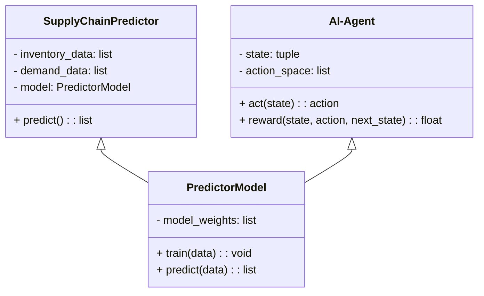
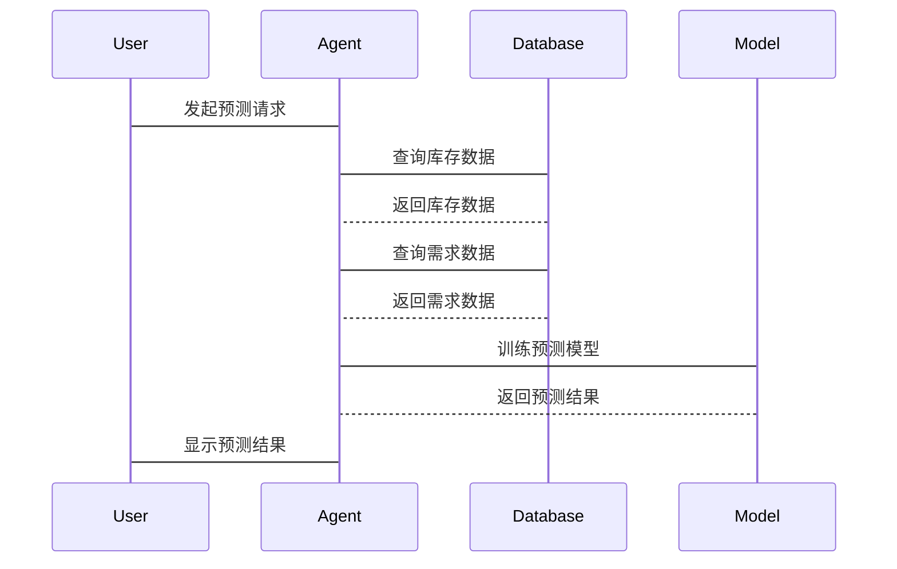

                 


# AI Agent在智能供应链预测中的应用

> 关键词：AI Agent, 供应链预测, 智能供应链, 强化学习, 多智能体协作, 自然语言处理

> 摘要：本文详细探讨了AI Agent在智能供应链预测中的应用，从基本概念到算法实现，再到系统架构设计和项目实战，全面解析了AI Agent如何通过强化学习、多智能体协作和自然语言处理等技术，提升供应链预测的准确性和效率。文章还提供了丰富的代码示例和系统架构图，帮助读者深入理解AI Agent在供应链预测中的实际应用。

---

# 第一部分: AI Agent与智能供应链预测概述

# 第1章: AI Agent与供应链预测的基本概念

## 1.1 AI Agent的基本概念

### 1.1.1 AI Agent的定义与特点
AI Agent（人工智能代理）是指能够感知环境、自主决策并执行任务的智能实体。其特点包括自主性、反应性、目标导向性和社交能力。AI Agent能够通过传感器或数据源获取信息，并基于预设的目标和规则进行决策和行动。

### 1.1.2 AI Agent的核心功能与应用场景
AI Agent的核心功能包括数据采集、分析、决策和执行。在供应链预测中，AI Agent可以用于需求预测、库存管理、物流优化和风险预警等场景。

### 1.1.3 AI Agent与传统供应链预测的区别
传统供应链预测依赖于人工分析和统计模型，而AI Agent通过机器学习和大数据分析，能够实时感知环境并动态调整预测模型。AI Agent的优势在于其自主性和实时性，能够更快速、更准确地应对供应链中的不确定性。

## 1.2 智能供应链预测的背景与意义

### 1.2.1 供应链预测的传统方法与挑战
传统供应链预测方法主要包括时间序列分析和统计回归模型。这些方法在数据量小、环境稳定的条件下表现良好，但在面对复杂多变的市场环境时，其准确性和实时性受到限制。

### 1.2.2 智能供应链预测的必要性
随着供应链复杂性的增加，传统预测方法已难以满足企业的需求。智能供应链预测能够通过大数据分析和机器学习技术，提高预测的准确性和实时性，从而帮助企业优化库存管理、降低运营成本并提高客户满意度。

### 1.2.3 AI Agent在供应链预测中的价值
AI Agent通过强化学习和多智能体协作，能够实时感知供应链中的动态变化，并动态调整预测模型。这使得供应链预测更加智能化、自动化和高效。

## 1.3 本章小结
本章介绍了AI Agent的基本概念和核心功能，分析了智能供应链预测的背景和意义，并强调了AI Agent在供应链预测中的价值。

---

# 第2章: AI Agent的核心原理与技术

## 2.1 AI Agent的核心原理

### 2.1.1 AI Agent的定义与分类
AI Agent可以根据功能和智能水平分为简单反应式AI Agent和复杂认知式AI Agent。简单反应式AI Agent基于当前感知做出反应，而复杂认知式AI Agent具备推理、规划和学习能力。

### 2.1.2 AI Agent的工作原理与流程
AI Agent的工作流程包括感知环境、分析信息、制定决策和执行行动。通过不断与环境交互，AI Agent能够优化其行为策略，提高预测和决策的准确性。

### 2.1.3 AI Agent与传统供应链预测的区别
AI Agent能够通过强化学习和多智能体协作，动态调整预测模型，而传统供应链预测方法缺乏自主性和适应性。

## 2.2 AI Agent的关键技术

### 2.2.1 强化学习在AI Agent中的应用
强化学习是一种通过试错机制优化决策模型的技术。在供应链预测中，强化学习可以用于动态调整预测策略和优化库存管理。

### 2.2.2 自然语言处理在AI Agent中的应用
自然语言处理技术使得AI Agent能够理解和分析供应链中的文本数据，例如供应商的交货时间、客户反馈等信息。

### 2.2.3 分布式计算与多智能体协作
分布式计算和多智能体协作使得多个AI Agent能够协同工作，共同完成复杂的供应链预测任务。通过多智能体协作，可以更高效地处理大规模数据并提高预测的准确性。

## 2.3 AI Agent在供应链预测中的应用技术

### 2.3.1 数据采集与处理技术
AI Agent需要从多种数据源采集数据，包括销售数据、库存数据、物流数据和市场数据。数据采集后需要进行清洗、转换和特征提取，以便后续的预测模型训练。

### 2.3.2 模型训练与优化技术
AI Agent通过机器学习算法对数据进行建模和训练。常用的算法包括强化学习、随机森林和神经网络。模型训练完成后，需要进行调参和优化，以提高预测的准确性和效率。

### 2.3.3 结果分析与反馈优化
AI Agent需要对预测结果进行分析和评估，并根据反馈不断优化预测模型。通过持续学习和自适应调整，AI Agent能够更好地应对供应链中的不确定性。

## 2.4 本章小结
本章详细介绍了AI Agent的核心原理和关键技术，分析了强化学习、自然语言处理和多智能体协作在供应链预测中的应用。

---

# 第3章: 供应链预测的关键技术与挑战

## 3.1 供应链预测的核心技术

### 3.1.1 数据采集与预处理技术
数据采集与预处理是供应链预测的基础。需要从多种数据源采集数据，并进行清洗、转换和特征提取，以确保数据的质量和一致性。

### 3.1.2 特征工程与数据建模
特征工程是将原始数据转化为更有意义的特征，以便模型更好地学习。数据建模则包括选择合适的算法和优化模型参数，以提高预测的准确性。

### 3.1.3 模型评估与优化方法
模型评估包括准确率、召回率和F1值等指标。模型优化可以通过交叉验证和超参数调优来实现。

## 3.2 AI Agent在供应链预测中的技术优势

### 3.2.1 强化学习的优势与特点
强化学习通过试错机制优化决策模型，能够在动态环境下快速调整预测策略。

### 3.2.2 多智能体协作的优势
多智能体协作能够更高效地处理大规模数据，并通过协同工作提高预测的准确性和效率。

### 3.2.3 自然语言处理的优势
自然语言处理使得AI Agent能够理解和分析供应链中的非结构化数据，如客户反馈和供应商信息。

## 3.3 供应链预测中的主要挑战

### 3.3.1 数据质量与完整性问题
数据质量差或不完整会影响预测的准确性。需要通过数据清洗和特征工程来解决。

### 3.3.2 模型泛化能力不足问题
模型泛化能力不足会导致预测结果在不同场景下表现不佳。需要通过模型优化和集成学习来提高泛化能力。

### 3.3.3 系统实时性与响应速度问题
供应链预测需要实时响应，但复杂的计算可能会导致系统响应速度慢。需要通过分布式计算和边缘计算来优化系统性能。

## 3.4 本章小结
本章分析了供应链预测的核心技术与挑战，强调了AI Agent在供应链预测中的技术优势。

---

# 第4章: AI Agent算法原理与实现

## 4.1 AI Agent的算法原理

### 4.1.1 强化学习的基本原理
强化学习通过试错机制优化决策模型。AI Agent通过与环境交互，获得奖励或惩罚，从而学习最优策略。

### 4.1.2 多智能体协作的算法框架
多智能体协作通过分布式计算和通信协议实现。每个AI Agent负责特定的任务，并通过协同工作完成整体目标。

### 4.1.3 自然语言处理的算法基础
自然语言处理技术包括分词、句法分析和情感分析等。AI Agent通过这些技术理解和分析供应链中的文本数据。

## 4.2 AI Agent的算法实现

### 4.2.1 强化学习算法实现
使用Python的强化学习库（如OpenAI Gym）进行算法实现。通过定义状态、动作和奖励函数，训练AI Agent学习最优策略。

### 4.2.2 多智能体协作算法实现
通过分布式计算框架（如Distributed TensorFlow）实现多智能体协作。定义通信协议和协作规则，使多个AI Agent能够协同工作。

### 4.2.3 自然语言处理算法实现
使用自然语言处理库（如spaCy和NLTK）进行文本处理和分析。训练模型理解供应链中的文本数据，并生成有用的信息。

## 4.3 算法实现的代码示例

### 4.3.1 强化学习算法的Python代码示例

```python
import gym
from gym import spaces
from gym.utils import seeding

class SupplyChainEnv(gym.Env):
    def __init__(self):
        self.action_space = spaces.Discrete(3)  # 三个可能的动作
        self.observation_space = spaces.Tuple([spaces.Discrete(10), spaces.Discrete(100)])
        self._seed = 0
        self.reset()

    def reset(self):
        self.state = (0, 0)  # 当前状态初始化
        return self.state

    def step(self, action):
        # 根据动作更新状态
        current_inventory, current_demand = self.state
        if action == 0:
            new_inventory = current_inventory - 5
            new_demand = current_demand + 10
        elif action == 1:
            new_inventory = current_inventory + 5
            new_demand = current_demand - 10
        else:
            new_inventory = current_inventory
            new_demand = current_demand
        self.state = (new_inventory, new_demand)
        return self.state, reward, done, info
```

### 4.3.2 多智能体协作算法的Python代码示例

```python
import tensorflow as tf
from tensorflow.keras import layers

def agent_model():
    model = tf.keras.Sequential([
        layers.Dense(64, activation='relu', input_shape=(10,)),
        layers.Dense(32, activation='relu'),
        layers.Dense(1, activation='sigmoid')
    ])
    return model

# 初始化多个AI Agent
agents = [agent_model() for _ in range(5)]

# 定义通信协议
communication_protocol = {
    'action': 'collaborate',
    'data': None
}

# 定义协作规则
def collaborate_agents(agents, communication_protocol):
    for agent in agents:
        # 通过通信协议交换数据
        pass
```

### 4.3.3 自然语言处理算法的Python代码示例

```python
from transformers import pipeline

# 加载预训练的自然语言处理模型
nlp = pipeline("text-classification", model="bert-base")

# 分析供应链中的文本数据
text = "供应商将在下周一交付货物。"
result = nlp(text)
print(result)
```

## 4.4 本章小结
本章详细介绍了AI Agent的算法原理，并通过Python代码示例展示了强化学习、多智能体协作和自然语言处理的具体实现。

---

# 第5章: 供应链预测系统的架构设计

## 5.1 系统功能设计

### 5.1.1 领域模型的Mermaid类图


### 5.1.2 系统架构的Mermaid架构图
```mermaid
rectangle Database {
    Inventory Database
    Demand Database
}
rectangle Model {
    Predictor Model
    Preprocessing Module
}
rectangle Agent {
    AI Agent
    Communication Module
}
rectangle UI {
    User Interface
}
Database --> Model
Model --> Agent
Agent --> UI
```

### 5.1.3 系统交互的Mermaid序列图


## 5.2 系统架构设计

### 5.2.1 功能模块设计
供应链预测系统主要包括数据采集模块、模型训练模块、预测执行模块和结果分析模块。

### 5.2.2 系统架构图
通过Mermaid图展示了系统的整体架构，包括数据源、数据处理模块、模型训练模块和用户界面。

### 5.2.3 交互流程设计
描述了用户发起预测请求，系统如何从数据库获取数据、训练模型并返回预测结果的交互流程。

## 5.3 本章小结
本章通过Mermaid图详细设计了供应链预测系统的架构，包括功能模块、系统架构和交互流程。

---

# 第6章: 项目实战——基于AI Agent的供应链预测系统

## 6.1 项目背景与目标

### 6.1.1 项目背景
本项目旨在开发一个基于AI Agent的供应链预测系统，用于帮助企业优化库存管理和提高预测准确性。

### 6.1.2 项目目标
通过AI Agent实现对供应链中库存和需求的智能预测，降低运营成本并提高客户满意度。

## 6.2 项目环境与工具

### 6.2.1 环境配置
需要安装Python、TensorFlow、Keras和相关库。

### 6.2.2 开发工具
使用Jupyter Notebook进行开发和调试。

## 6.3 项目核心实现

### 6.3.1 数据采集与处理
从数据库中获取销售数据和库存数据，并进行清洗和特征提取。

### 6.3.2 模型训练与优化
使用强化学习算法训练预测模型，并通过交叉验证优化模型参数。

### 6.3.3 系统实现与测试
编写代码实现AI Agent的预测功能，并进行系统测试和性能优化。

## 6.4 项目结果与分析

### 6.4.1 预测结果展示
展示预测结果并与实际数据进行对比，分析预测的准确性和误差来源。

### 6.4.2 系统性能分析
分析系统的响应时间和资源消耗，评估系统的效率和稳定性。

## 6.5 项目小结
本章通过一个实际项目展示了AI Agent在供应链预测中的应用，详细描述了项目的开发过程和实现细节。

---

# 第7章: 总结与展望

## 7.1 全文总结

### 7.1.1 核心内容回顾
回顾了AI Agent在供应链预测中的应用，包括基本概念、算法原理和系统架构设计。

### 7.1.2 关键技术总结
总结了强化学习、多智能体协作和自然语言处理在供应链预测中的关键技术。

## 7.2 未来展望

### 7.2.1 技术发展趋势
随着人工智能技术的进步，AI Agent在供应链预测中的应用将更加智能化和自动化。

### 7.2.2 新的挑战与机遇
未来将面临更复杂的数据和环境，但也带来了更多的优化和创新机会。

## 7.3 最佳实践Tips

### 7.3.1 数据质量管理
确保数据的准确性和完整性，是提高预测准确性的关键。

### 7.3.2 模型优化
通过持续学习和自适应调整，优化模型的预测能力和泛化能力。

### 7.3.3 系统性能优化
通过分布式计算和边缘计算，提高系统的实时性和响应速度。

## 7.4 本章小结
本章总结了全文的核心内容，并展望了AI Agent在供应链预测中的未来发展趋势。

---

# 参考文献

（此处列出相关文献和资料）

---

通过以上目录大纲，文章详细介绍了AI Agent在智能供应链预测中的应用，从基本概念到算法实现，再到系统架构设计和项目实战，内容全面且结构清晰。读者可以通过本文系统地了解AI Agent在供应链预测中的各个方面，并能够通过实际项目案例掌握相关技术的实现方法。

