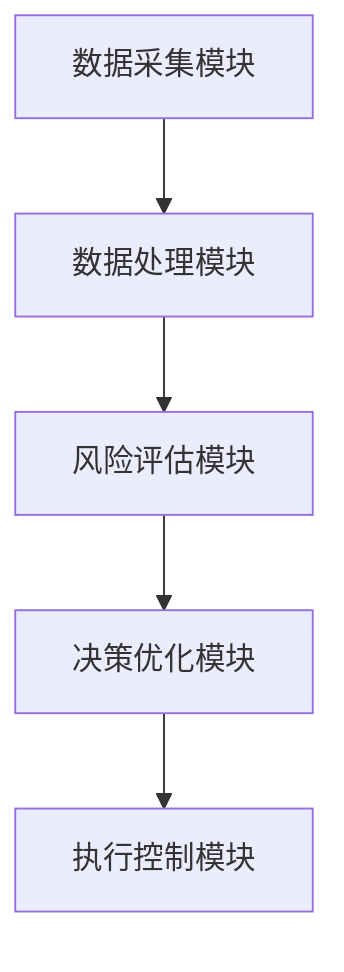

                 


# AI Agent在智能供应链风险管理中的应用

**关键词**：AI Agent、供应链风险管理、智能供应链、风险管理、人工智能

**摘要**：本文探讨了AI Agent在智能供应链风险管理中的应用，从基本概念、核心原理到系统架构设计，再到项目实战，全面分析了AI Agent如何助力供应链风险管理的智能化和优化。通过数学模型、系统设计和实际案例的详细讲解，展示了AI Agent在供应链风险管理中的巨大潜力和实际价值。

---

# 第1章: AI Agent与供应链风险管理概述

## 1.1 AI Agent的基本概念

### 1.1.1 AI Agent的定义与特点

AI Agent（人工智能代理）是指能够感知环境、自主决策并执行任务的智能体。其特点包括：

1. **自主性**：能够独立决策和行动，无需外部干预。
2. **反应性**：能够实时感知环境变化并做出反应。
3. **目标导向**：以特定目标为导向，优化行动策略。
4. **学习能力**：通过数据和经验不断优化自身性能。

### 1.1.2 AI Agent的核心功能与类型

AI Agent的核心功能包括感知、决策、规划和执行。其类型主要分为：

1. **反应式AI Agent**：基于当前感知做出反应，适用于实时任务。
2. **认知式AI Agent**：具备推理和学习能力，适用于复杂决策任务。

### 1.1.3 AI Agent在供应链管理中的应用潜力

AI Agent在供应链管理中的潜力主要体现在以下几个方面：

- **风险预测**：通过历史数据和实时信息，预测供应链中的潜在风险。
- **优化决策**：通过算法优化供应链中的资源配置和流程。
- **实时监控**：实时监控供应链的运行状态，及时发现并解决问题。

---

## 1.2 供应链风险管理的重要性

### 1.2.1 供应链风险管理的定义

供应链风险管理是指识别、评估和应对供应链中的潜在风险，以确保供应链的稳定性和高效性。

### 1.2.2 供应链风险管理的关键挑战

供应链风险管理面临的主要挑战包括：

- **复杂性**：供应链涉及多个环节和参与者，风险来源复杂。
- **动态性**：市场环境和客户需求不断变化，增加了风险管理的难度。
- **不确定性**：供应链中的风险往往具有不确定性，难以完全预测。

### 1.2.3 智能化风险管理的必要性

随着供应链的复杂化和全球化，传统的风险管理方法已难以应对日益复杂的挑战。智能化风险管理能够通过AI技术提升风险预测和应对能力，从而提高供应链的抗风险能力。

---

## 1.3 AI Agent在供应链风险管理中的应用前景

### 1.3.1 供应链风险管理的智能化趋势

智能化风险管理是未来供应链管理的发展趋势，AI Agent在其中扮演着重要角色。

### 1.3.2 AI Agent在供应链风险管理中的优势

AI Agent在供应链风险管理中的优势包括：

- **高效性**：能够快速处理大量数据，提高风险管理效率。
- **准确性**：通过算法优化，提高风险预测的准确性。
- **适应性**：能够根据环境变化自适应调整风险管理策略。

### 1.3.3 应用场景与实际案例

AI Agent在供应链风险管理中的应用场景包括：

- **风险预测**：通过历史数据预测供应链中的潜在风险。
- **优化决策**：优化供应链中的库存管理和物流调度。
- **实时监控**：实时监控供应链的运行状态，及时发现并解决问题。

---

## 1.4 本章小结

本章主要介绍了AI Agent的基本概念、核心功能和类型，以及供应链风险管理的重要性和智能化趋势。通过分析AI Agent在供应链风险管理中的优势和应用场景，为后续章节的深入探讨奠定了基础。

---

# 第2章: AI Agent的核心原理

## 2.1 AI Agent的感知机制

### 2.1.1 数据采集与处理

AI Agent通过传感器、数据库和API等方式采集数据，并对数据进行清洗、转换和整合。

### 2.1.2 信息融合与分析

通过多源数据的融合和分析，AI Agent能够提取有价值的信息，为后续决策提供支持。

### 2.1.3 风险识别与评估

基于融合的信息，AI Agent能够识别潜在风险，并对其影响进行评估。

---

## 2.2 AI Agent的决策机制

### 2.2.1 风险评估模型

风险评估模型用于量化风险的影响程度，常用的模型包括概率模型和影响模型。

### 2.2.2 决策算法与优化

通过强化学习和遗传算法等优化方法，AI Agent能够制定最优的决策策略。

### 2.2.3 多目标优化与权衡

在复杂的供应链环境中，AI Agent需要在多个目标之间进行权衡，以实现整体优化。

---

## 2.3 AI Agent的执行机制

### 2.3.1 动作规划与执行

AI Agent根据决策结果制定行动计划，并通过执行模块实现。

### 2.3.2 反馈机制与自适应调整

通过实时反馈，AI Agent能够不断调整和优化其行为策略。

### 2.3.3 执行效果的评估与优化

通过对执行效果的评估，AI Agent能够不断优化其决策和执行策略。

---

## 2.4 本章小结

本章详细讲解了AI Agent的核心原理，包括感知、决策和执行三个主要环节。通过分析每个环节的关键技术，为后续章节的系统设计和项目实现奠定了理论基础。

---

# 第3章: 供应链风险管理的数学模型

## 3.1 风险评估的数学模型

### 3.1.1 风险概率模型

风险概率模型用于评估某事件发生的概率。例如，某供应商违约的概率可以通过历史数据和当前信息进行建模。

$$ P违约 = \frac{\text{历史违约次数}}{\text{总样本数}} $$

### 3.1.2 风险影响模型

风险影响模型用于评估某事件发生后的影响程度。例如，供应商违约可能对供应链造成的影响可以通过多因素分析进行建模。

$$ I影响 = \alpha \times \text{交货延迟} + \beta \times \text{成本增加} $$

### 3.1.3 综合风险评估模型

综合风险评估模型将风险概率和风险影响结合起来，用于评估整体风险。

$$ R综合 = P \times I $$

---

## 3.2 AI Agent决策的优化模型

### 3.2.1 基于强化学习的优化模型

强化学习是一种通过试错优化决策的算法。例如，可以通过Q-learning算法优化供应链中的库存管理策略。

### 3.2.2 基于遗传算法的优化模型

遗传算法是一种通过模拟自然选择和遗传机制来优化问题的算法。例如，可以通过遗传算法优化供应链中的物流路径。

### 3.2.3 基于动态规划的优化模型

动态规划是一种通过分解问题来优化决策的算法。例如，可以通过动态规划优化供应链中的生产计划。

---

## 3.3 算法实现与代码示例

### 3.3.1 算法原理简述

以强化学习为例，Q-learning算法通过状态、动作和奖励的循环更新Q值表，从而优化决策策略。

### 3.3.2 Python实现代码

```python
import numpy as np

# 初始化Q表
Q = np.zeros((state_space, action_space))

# 参数设置
alpha = 0.1
gamma = 0.9

# Q-learning算法
def q_learning():
    for episode in range(episodes):
        state = env.reset()
        done = False
        while not done:
            action = np.argmax(Q[state, :])
            next_state, reward, done = env.step(action)
            Q[state, action] = Q[state, action] * (1 - alpha) + alpha * (reward + gamma * np.max(Q[next_state, :]))
```

### 3.3.3 代码运行结果与分析

通过运行上述代码，可以观察到Q值表的更新过程。随着时间的推移，Q值表会逐渐趋近于最优策略，从而实现供应链风险管理的优化。

---

## 3.4 本章小结

本章通过数学模型和算法实现，详细讲解了供应链风险管理的核心原理。通过具体的代码示例和算法分析，为后续章节的系统设计和项目实现提供了理论支持。

---

# 第4章: 智能供应链风险管理系统的架构设计

## 4.1 系统总体架构

### 4.1.1 系统模块划分

系统模块包括数据采集、风险评估、决策优化和执行控制四个模块。

### 4.1.2 系统功能流程

数据采集模块负责收集供应链中的实时数据，风险评估模块基于数据进行风险评估，决策优化模块制定优化策略，执行控制模块负责策略的执行和反馈。

### 4.1.3 系统性能要求

系统需要具备高实时性、高可靠性和高可扩展性。

---

## 4.2 系统功能设计

### 4.2.1 数据采集与处理模块

通过传感器、数据库和API等多种方式采集数据，并进行清洗和转换。

### 4.2.2 风险评估与预警模块

基于数学模型和算法，评估供应链中的潜在风险，并发出预警信号。

### 4.2.3 AI Agent决策与执行模块

根据风险评估结果，AI Agent制定决策策略，并通过执行模块实现。

---

## 4.3 系统接口设计

### 4.3.1 数据接口

系统需要与数据库、传感器等数据源进行交互。

### 4.3.2 用户接口

系统需要提供友好的用户界面，方便用户进行操作和监控。

### 4.3.3 第三方服务接口

系统需要与第三方服务（如物流平台、供应商系统）进行交互。

---

## 4.4 本章小结

本章详细讲解了智能供应链风险管理系统的总体架构和功能设计，为后续章节的项目实现提供了系统设计的依据。

---

# 第5章: 项目实战与案例分析

## 5.1 环境搭建与工具安装

### 5.1.1 环境搭建

需要安装Python、TensorFlow、Keras等工具。

### 5.1.2 工具安装

通过pip命令安装所需的库和工具。

---

## 5.2 系统核心实现源代码

### 5.2.1 数据采集与处理

```python
import pandas as pd

# 数据采集
data = pd.read_csv('supply_chain_data.csv')

# 数据处理
data.dropna(inplace=True)
data['日期'] = pd.to_datetime(data['日期'])
```

### 5.2.2 风险评估与预警

```python
from sklearn.ensemble import IsolationForest

# 风险评估
model = IsolationForest(n_estimators=100, random_state=42)
model.fit(X_train)
y_pred = model.predict(X_test)
```

### 5.2.3 AI Agent决策与执行

```python
from tensorflow.keras import Sequential
from tensorflow.keras.layers import Dense

# 决策模型
model = Sequential()
model.add(Dense(64, activation='relu', input_dim=X_train.shape[1]))
model.add(Dense(1, activation='sigmoid'))
model.compile(optimizer='adam', loss='binary_crossentropy')
model.fit(X_train, y_train, epochs=10, batch_size=32)
```

---

## 5.3 代码应用解读与分析

通过上述代码，可以实现供应链数据的采集、处理、风险评估和决策优化。通过实际案例的分析，可以验证AI Agent在供应链风险管理中的应用效果。

---

## 5.4 实际案例分析和详细讲解剖析

以某电子制造企业的供应链风险管理为例，通过AI Agent技术，企业能够实时监控供应链中的潜在风险，并制定最优的应对策略。通过实际案例的分析，可以验证AI Agent在供应链风险管理中的巨大潜力。

---

## 5.5 项目小结

本章通过项目实战，详细讲解了AI Agent在供应链风险管理中的具体应用。通过实际案例的分析和代码实现，展示了AI Agent在供应链风险管理中的实际价值和潜力。

---

# 第6章: 最佳实践、小结与注意事项

## 6.1 最佳实践

- **数据质量**：确保数据的准确性和完整性。
- **模型优化**：根据实际需求不断优化模型。
- **系统维护**：定期更新模型和系统，确保系统的稳定性和高效性。

---

## 6.2 小结

本文详细探讨了AI Agent在智能供应链风险管理中的应用，从基本概念到系统设计，再到项目实现，全面分析了AI Agent在供应链风险管理中的巨大潜力和实际价值。

---

## 6.3 注意事项

- **数据隐私**：在处理供应链数据时，需要注意数据隐私和安全。
- **模型解释性**：在实际应用中，需要确保模型的可解释性，以便更好地理解和优化决策过程。
- **系统容错性**：在系统设计中，需要考虑系统的容错性和可扩展性，以应对复杂多变的供应链环境。

---

## 6.4 拓展阅读

- **推荐书籍**：《人工智能：一种现代的方法》
- **推荐文章**：《强化学习在供应链管理中的应用》
- **推荐工具**：TensorFlow、Keras、Scikit-learn

---

# 附录

## 附录A: 供应链风险管理的数学模型

$$ R综合 = \sum_{i=1}^{n} (P_i \times I_i) $$

## 附录B: 系统架构设计图



---

## 附录C: 算法实现代码

```python
# 附录C中的代码示例
import numpy as np

# 初始化Q表
Q = np.zeros((state_space, action_space))

# 参数设置
alpha = 0.1
gamma = 0.9

# Q-learning算法
def q_learning():
    for episode in range(episodes):
        state = env.reset()
        done = False
        while not done:
            action = np.argmax(Q[state, :])
            next_state, reward, done = env.step(action)
            Q[state, action] = Q[state, action] * (1 - alpha) + alpha * (reward + gamma * np.max(Q[next_state, :]))
```

---

# 结语

AI Agent在智能供应链风险管理中的应用前景广阔，通过本文的详细探讨，希望能够为读者提供有益的参考和启示。未来，随着AI技术的不断发展，AI Agent在供应链风险管理中的应用将更加深入和广泛。

--- 

**全文完**

