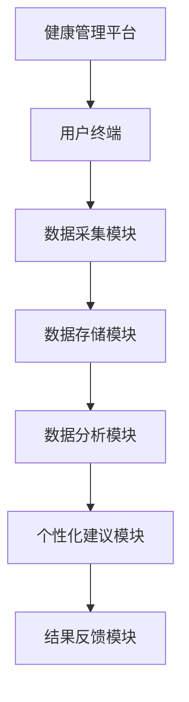

                 


---

# 《AI Agent在智能健康管理中的角色》

> **关键词**：AI Agent，智能健康管理，人工智能，健康管理，系统架构

> **摘要**：  
AI Agent（人工智能代理）在智能健康管理中扮演着越来越重要的角色。本文将从AI Agent的基本概念、核心算法、系统架构、项目实战等多个方面，深入分析AI Agent在智能健康管理中的应用价值、技术实现和未来发展方向。通过理论与实践相结合的方式，帮助读者全面理解AI Agent如何赋能智能健康管理。

---

## 第1章：AI Agent与智能健康管理的背景介绍

### 1.1 AI Agent的基本概念
- 什么是AI Agent？
- AI Agent的核心特征：智能性、自主性、反应性、社会性
- AI Agent的分类与应用场景

### 1.2 智能健康管理的概念与特点
- 健康管理的定义与发展
- 智能健康管理的核心要素：数据采集、分析、个性化建议
- 智能健康管理与传统健康管理的区别

### 1.3 AI Agent在智能健康管理中的角色定位
- AI Agent在健康管理中的功能定位
- AI Agent与其他技术（如大数据、云计算）的协同作用
- AI Agent在智能健康管理中的应用场景：疾病预测、健康监测、个性化干预

### 1.4 本章小结
- 总结AI Agent与智能健康管理的关系
- 引入下一章的核心概念

---

## 第2章：AI Agent的核心概念与原理

### 2.1 AI Agent的核心概念
- AI Agent的定义与分类
- AI Agent的组成：知识库、推理引擎、执行器
- AI Agent的工作流程：感知、推理、决策、执行

### 2.2 AI Agent的原理与机制
- 基于规则的AI Agent：简单的条件判断
- 基于机器学习的AI Agent：从数据中学习模式
- 基于强化学习的AI Agent：通过奖励机制优化决策

### 2.3 AI Agent的核心算法
- 基于规则的推理算法：简单的逻辑判断
- 机器学习算法：监督学习、无监督学习、半监督学习
- 强化学习算法：Q-learning、Deep Q-Network
- 图灵测试与AI Agent的智能性评估

### 2.4 AI Agent的优缺点分析
- 优点：高效性、准确性、可扩展性
- 缺点：数据依赖性、黑箱问题、伦理问题
- 未来发展：如何解决AI Agent的局限性

---

## 第3章：AI Agent在智能健康管理中的算法原理

### 3.1 AI Agent的核心算法
- 基于规则的AI Agent算法
- 基于机器学习的AI Agent算法
- 基于强化学习的AI Agent算法

### 3.2 健康管理中的AI Agent算法实现
- 数据预处理：清洗、特征提取
- 模型训练：分类、回归、聚类
- 模型优化：调参、交叉验证
- 模型部署：API接口、实时推理

### 3.3 健康管理中的AI Agent算法案例
- 慢性病预测案例：糖尿病预测模型
- 健康风险评估案例：心血管疾病预测
- 个性化健康建议案例：运动计划推荐

### 3.4 算法实现的代码示例
- 使用Python实现的健康管理AI Agent算法
- 代码解读：数据处理、模型训练、结果输出

---

## 第4章：智能健康管理系统的架构设计

### 4.1 智能健康管理系统的功能模块
- 数据采集模块：传感器、API接口
- 数据分析模块：特征提取、模型训练
- 个性化建议模块：基于AI Agent的决策
- 用户交互模块：可视化界面、反馈机制

### 4.2 系统架构设计
- 分层架构：数据层、业务逻辑层、用户界面层
- 微服务架构：模块化设计
- 服务通信：RESTful API、WebSocket

### 4.3 系统架构图（Mermaid）


### 4.4 系统接口设计
- 数据接口：HTTP REST API
- 用户接口：图形化界面
- 第三方服务接口：与医疗数据库的对接

---

## 第5章：AI Agent在智能健康管理中的项目实战

### 5.1 项目背景与目标
- 项目目标：构建一个基于AI Agent的智能健康管理平台
- 项目范围：慢性病管理、健康监测、个性化建议

### 5.2 项目环境配置
- 开发工具：Python、Jupyter Notebook、PostgreSQL
- 框架选择：Flask、Django、TensorFlow
- 数据来源：公开数据集、传感器数据

### 5.3 核心代码实现
```python
# 健康管理AI Agent代码示例
import numpy as np
from sklearn.model import DecisionTreeClassifier

class HealthAgent:
    def __init__(self, data):
        self.data = data
        self.model = DecisionTreeClassifier()
        self.model.fit(self.data.features, self.data.labels)

    def predict(self, input_features):
        return self.model.predict(input_features)
```

### 5.4 项目功能解读
- 数据采集与预处理
- 模型训练与优化
- 个性化建议生成
- 结果可视化与反馈

### 5.5 实际案例分析
- 慢性病预测案例：糖尿病患者风险评估
- 健康监测案例：实时心率监测与异常提醒
- 个性化建议案例：运动计划与饮食推荐

---

## 第6章：AI Agent在智能健康管理中的总结与建议

### 6.1 本章总结
- AI Agent在智能健康管理中的核心作用
- AI Agent的优势与局限性
- AI Agent的未来发展方向

### 6.2 最佳实践建议
- 数据隐私保护的重要性
- 模型可解释性的提升
- 多技术协同应用：AI Agent与大数据、物联网的结合

### 6.3 小结
- 总结全文内容
- 展望AI Agent在智能健康管理中的未来

---

## 第7章：参考文献与拓展阅读

### 7.1 参考文献
- 列出文章中引用的核心文献

### 7.2 拓展阅读
- 推荐相关领域的书籍、论文和在线资源

### 7.3 致谢
- 感谢参与本项目的所有人员

---

## 附录：AI Agent在智能健康管理中的常见问题解答

### A.1 什么是AI Agent？
- AI Agent的定义与特点
- AI Agent与传统代理的区别

### A.2 AI Agent在健康管理中的应用场景
- 慢性病管理
- 健康监测
- 个性化健康建议

### A.3 如何确保AI Agent的决策准确性？
- 数据质量的重要性
- 模型优化的技巧
- 多算法融合的应用

---

## 附录：代码示例与数学公式

### A.1 代码示例
- 健康管理AI Agent的Python代码实现

### A.2 数学公式
- 机器学习中的损失函数
- 决策树的分类算法
- 强化学习中的Q-learning公式

