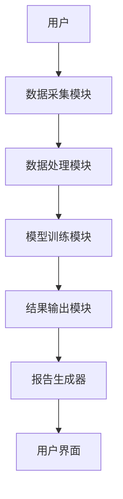
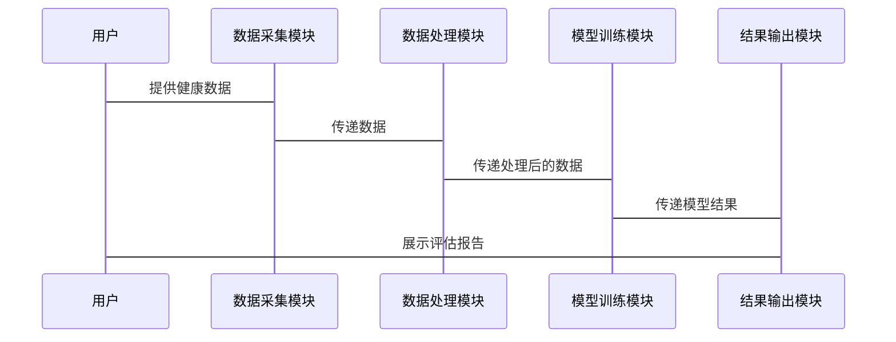

                 


# {{此处是文章标题}}

> 关键词：{{此处列出文章的5-7个核心关键词}}

> 摘要：{{此处给出文章的核心内容和主题思想}}

---

# 第一部分: AI Agent在智能健康风险评估中的背景与概念

# 第1章: AI Agent与智能健康风险评估概述

## 1.1 AI Agent的基本概念
### 1.1.1 AI Agent的定义
- AI Agent是人工智能的一个分支，具备感知、推理、学习和决策的能力。
- 它能够通过传感器获取环境信息，通过算法处理信息，并做出相应的决策。

### 1.1.2 AI Agent的核心特征
- **自主性**：能够在没有外部干预的情况下自主运作。
- **反应性**：能够根据环境的变化实时调整行为。
- **学习能力**：能够通过数据和经验不断优化自己的行为。
- **社交能力**：能够与其他AI Agent或人类进行交互和协作。

### 1.1.3 AI Agent与传统健康评估的区别
- 传统健康评估主要依赖于人工分析和经验判断。
- AI Agent能够快速处理大量数据，提供更精准的评估结果。

## 1.2 智能健康风险评估的定义
### 1.2.1 健康风险评估的内涵
- 健康风险评估是指通过分析个人的健康数据，预测其在未来可能面临健康问题的概率。
- 它可以帮助个人和医疗机构更好地预防和管理健康问题。

### 1.2.2 智能健康风险评估的特点
- **数据驱动**：依赖于大量、多维度的健康数据。
- **实时性**：能够实时获取和处理数据，提供及时的评估结果。
- **个性化**：根据个体的差异提供个性化的评估和建议。

### 1.2.3 智能健康风险评估的必要性
- 传统的健康评估方法效率低下，难以应对海量数据的处理需求。
- AI Agent的应用能够提高评估的准确性和效率，降低医疗成本。

## 1.3 AI Agent在健康风险评估中的演进
### 1.3.1 传统健康风险评估方法
- 基于统计学的方法：通过分析历史数据，找出健康问题的相关因素。
- 基于专家经验的方法：依赖专家的判断和经验。

### 1.3.2 AI Agent引入健康风险评估的背景
- 数据爆炸时代的需求：随着健康数据的快速增长，传统的评估方法已经无法满足需求。
- 技术进步的支持：AI技术的快速发展为智能健康风险评估提供了技术支持。

### 1.3.3 AI Agent在健康风险评估中的应用前景
- 提高评估的精准性：通过机器学习算法，AI Agent能够发现数据中的复杂关系，提供更精准的评估结果。
- 降低医疗成本：通过早期预警和个性化管理，减少不必要的医疗支出。

## 1.4 本章小结
- 本章介绍了AI Agent的基本概念和核心特征，分析了智能健康风险评估的内涵、特点和必要性，探讨了AI Agent在健康风险评估中的演进和应用前景。

---

# 第二部分: AI Agent的核心原理与健康风险评估的结合

# 第2章: AI Agent的核心原理

## 2.1 AI Agent的结构与功能
### 2.1.1 AI Agent的组成模块
- **感知模块**：负责获取环境中的数据，如健康数据、行为数据等。
- **推理模块**：对获取的数据进行分析和推理，找出潜在的健康风险。
- **决策模块**：根据推理结果，制定相应的健康管理策略。
- **执行模块**：将决策结果转化为实际的操作，如提醒用户注意健康问题。

### 2.1.2 各模块的功能描述
- 感知模块：通过传感器、数据库等方式获取健康数据。
- 推理模块：利用机器学习算法，分析数据，识别健康风险。
- 决策模块：根据分析结果，制定个性化的健康管理方案。
- 执行模块：通过通知、提醒等方式，执行决策结果。

### 2.1.3 模块之间的协作机制
- 感知模块获取数据后，传递给推理模块进行分析。
- 推理模块分析结果后，传递给决策模块制定方案。
- 决策模块将方案传递给执行模块，执行具体的健康管理操作。

## 2.2 AI Agent的工作流程
### 2.2.1 数据采集与处理
- **数据来源**：健康数据（如血压、血糖、心率等）、行为数据（如运动量、饮食习惯等）、环境数据（如空气质量、温度等）。
- **数据预处理**：清洗数据，去除噪声，确保数据的准确性和完整性。

### 2.2.2 数据分析与推理
- **数据分析**：利用统计学方法、机器学习算法（如决策树、随机森林、神经网络等）对数据进行分析。
- **推理**：通过推理算法，找出健康风险的相关因素，评估个体的健康风险。

### 2.2.3 结果输出与反馈
- **结果输出**：生成健康风险评估报告，包括风险等级、风险因素、建议措施等。
- **反馈机制**：根据用户的反馈，调整模型参数，优化评估结果。

## 2.3 AI Agent在健康风险评估中的应用
### 2.3.1 数据来源的多样性
- AI Agent可以从多种数据源获取数据，如医疗记录、可穿戴设备、社交媒体等。
- 多样化的数据来源能够提供更全面的健康信息，提高评估的准确性。

### 2.3.2 数据分析的准确性
- 通过机器学习算法，AI Agent能够发现数据中的复杂关系，提高分析的准确性。
- 可以通过模型的不断训练和优化，提高评估的精准度。

### 2.3.3 结果输出的可解释性
- AI Agent需要提供可解释的结果，让用户能够理解评估的依据和建议。
- 可以通过可视化的方式，将复杂的分析结果转化为易于理解的形式。

## 2.4 本章小结
- 本章详细讲解了AI Agent的核心原理，包括其结构、功能和工作流程，并探讨了其在健康风险评估中的应用。

---

# 第三部分: 健康风险评估的理论基础与数据处理

# 第3章: 健康风险评估的理论基础

## 3.1 传统健康风险评估方法
### 3.1.1 基于统计的方法
- **回归分析**：通过统计变量之间的关系，预测健康风险。
- **聚类分析**：将相似的个体分为一组，分析健康风险的分布。

### 3.1.2 基于规则的方法
- **专家系统**：通过预定义的规则和逻辑，进行健康风险评估。
- **知识库**：依赖专家的知识和经验，构建规则库。

### 3.1.3 基于机器学习的方法
- **监督学习**：通过标注的数据训练模型，预测健康风险。
- **无监督学习**：通过数据的内在结构，发现健康风险的模式。

## 3.2 现代健康风险评估方法
### 3.2.1 基于深度学习的方法
- **神经网络**：通过多层神经网络，学习复杂的健康数据特征。
- **卷积神经网络（CNN）**：用于图像数据的健康风险评估，如医学影像分析。
- **循环神经网络（RNN）**：用于时间序列数据的分析，如心电图数据。

### 3.2.2 基于知识图谱的方法
- **知识图谱**：通过构建健康领域的知识图谱，整合多源数据，提高评估的准确性。
- **图嵌入**：将知识图谱中的实体和关系嵌入到低维空间，用于健康风险预测。

### 3.2.3 基于强化学习的方法
- **强化学习**：通过模拟环境中的行为，学习最优的健康管理策略。
- **Q-learning**：一种常用的强化学习算法，用于动态决策问题。

## 3.3 AI Agent在健康风险评估中的优势
### 3.3.1 数据处理能力的提升
- AI Agent能够处理海量的健康数据，提取有价值的信息。
- 通过数据挖掘技术，发现潜在的健康风险因素。

### 3.3.2 模型的可解释性增强
- 通过模型的可视化和可解释性分析，用户可以更好地理解评估结果。
- 可以通过解释性模型（如SHAP、LIME）解释AI Agent的决策过程。

### 3.3.3 个性化评估的可能性
- AI Agent可以根据个体的健康数据，提供个性化的评估和建议。
- 通过动态调整模型参数，适应个体的健康变化。

## 3.4 本章小结
- 本章分析了健康风险评估的理论基础，包括传统方法和现代方法，并探讨了AI Agent在健康风险评估中的优势。

---

# 第四部分: AI Agent在健康风险评估中的算法原理

# 第4章: AI Agent在健康风险评估中的算法原理

## 4.1 健康风险评估中的关键算法
### 4.1.1 机器学习算法
- **支持向量机（SVM）**：用于分类问题，预测健康风险等级。
- **随机森林**：用于特征重要性分析，找出影响健康风险的关键因素。
- **XGBoost**：一种高效的梯度提升算法，用于健康风险预测。

### 4.1.2 深度学习算法
- **卷积神经网络（CNN）**：用于图像数据的健康风险评估。
- **循环神经网络（RNN）**：用于时间序列数据的健康风险预测。
- **Transformer**：用于处理序列数据，如自然语言处理中的健康风险评估。

## 4.2 算法原理与流程
### 4.2.1 数据预处理
- **清洗数据**：处理缺失值、异常值、重复值。
- **特征工程**：提取特征，进行归一化、标准化处理。
- **数据分割**：将数据分为训练集、验证集和测试集。

### 4.2.2 模型训练
- **选择算法**：根据数据类型和任务需求，选择合适的算法。
- **参数调优**：通过网格搜索、随机搜索等方法，优化模型参数。
- **模型训练**：在训练集上训练模型，验证集上调整参数。

### 4.2.3 模型评估
- **评估指标**：准确率、召回率、F1分数、AUC-ROC曲线等。
- **交叉验证**：通过K折交叉验证，评估模型的泛化能力。

### 4.2.4 模型部署
- **模型保存**：将训练好的模型保存下来，方便后续使用。
- **API接口**：将模型封装成API，方便其他系统调用。
- **实时预测**：通过前端界面，用户可以实时输入数据，获取健康风险评估结果。

## 4.3 算法实现与优化
### 4.3.1 代码实现
```python
# 示例代码：使用XGBoost进行健康风险预测
import xgboost as xgb
from sklearn.model_selection import train_test_split
from sklearn.metrics import accuracy_score

# 数据加载与处理
data = ...  # 加载数据
X = data.drop('target', axis=1)
y = data['target']

# 数据分割
X_train, X_test, y_train, y_test = train_test_split(X, y, test_size=0.2, random_state=42)

# 模型训练
model = xgb.XGBClassifier()
model.fit(X_train, y_train)

# 模型预测
y_pred = model.predict(X_test)

# 模型评估
print("Accuracy:", accuracy_score(y_test, y_pred))
```

### 4.3.2 算法优化
- **超参数调优**：通过网格搜索或随机搜索，找到最佳的模型参数。
- **特征选择**：通过特征重要性分析，去除无关特征，提高模型性能。
- **集成学习**：通过集成多个模型的结果，提高预测的准确性和稳定性。

## 4.4 本章小结
- 本章详细讲解了健康风险评估中的关键算法，包括机器学习和深度学习算法，并给出了算法的实现和优化方法。

---

# 第五部分: 系统分析与架构设计方案

# 第5章: 健康风险评估系统的架构设计

## 5.1 系统功能设计
### 5.1.1 功能模块划分
- **数据采集模块**：负责从多种数据源采集健康数据。
- **数据处理模块**：对采集到的数据进行预处理和特征提取。
- **模型训练模块**：训练健康风险评估模型。
- **结果输出模块**：生成健康风险评估报告，并提供个性化的健康建议。

### 5.1.2 功能模块描述
- 数据采集模块：支持多种数据源，如医疗记录、可穿戴设备、社交媒体等。
- 数据处理模块：包括数据清洗、特征工程、数据分割等功能。
- 模型训练模块：支持多种算法，如XGBoost、CNN、RNN等。
- 结果输出模块：生成评估报告，并通过可视化的方式展示结果。

## 5.2 系统架构设计
### 5.2.1 系统架构图


### 5.2.2 系统接口设计
- **数据接口**：提供REST API，供其他系统调用数据采集和处理功能。
- **模型接口**：提供API接口，供其他系统调用模型训练和预测功能。
- **报告接口**：提供API接口，供其他系统获取健康风险评估报告。

### 5.2.3 系统交互流程


## 5.3 系统功能实现
### 5.3.1 数据采集模块实现
- 支持多种数据源，如数据库、文件、API接口等。
- 提供数据采集工具，方便用户上传数据。

### 5.3.2 数据处理模块实现
- 数据清洗：处理缺失值、异常值、重复值。
- 特征工程：提取特征，进行归一化、标准化处理。
- 数据分割：将数据分为训练集、验证集和测试集。

### 5.3.3 模型训练模块实现
- 支持多种算法，如XGBoost、CNN、RNN等。
- 提供参数调优功能，优化模型性能。

### 5.3.4 结果输出模块实现
- 生成健康风险评估报告，包括风险等级、风险因素、建议措施等。
- 提供可视化展示，如图表、图形等，方便用户理解结果。

## 5.4 系统优化与部署
### 5.4.1 系统优化
- **性能优化**：通过并行计算、分布式计算等技术，提高系统的处理效率。
- **模型优化**：通过模型压缩、量化等技术，降低模型的计算资源消耗。

### 5.4.2 系统部署
- **本地部署**：将系统部署在本地服务器上，提供内部使用。
- **云部署**：将系统部署在云平台上，提供弹性扩展和高可用性。

## 5.5 本章小结
- 本章详细讲解了健康风险评估系统的架构设计，包括功能模块划分、系统架构图、系统接口设计和系统交互流程，并给出了系统的实现和优化方法。

---

# 第六部分: 项目实战

# 第6章: 项目实战——基于AI Agent的健康风险评估系统

## 6.1 项目环境安装
### 6.1.1 环境要求
- **操作系统**：Windows、Linux、macOS均可。
- **Python版本**：建议使用Python 3.6或以上版本。
- **依赖库**：安装必要的库，如xgboost、scikit-learn、tensorflow、mermaid等。

### 6.1.2 环境配置
```bash
# 示例代码：安装必要的依赖库
pip install xgboost scikit-learn tensorflow mermaid
```

## 6.2 系统核心实现
### 6.2.1 数据采集模块实现
```python
# 示例代码：数据采集模块实现
import pandas as pd
import requests

def collect_data(api_key):
    url = "https://api.healthdata.com/records"
    headers = {'Authorization': f'Bearer {api_key}'}
    response = requests.get(url, headers=headers)
    data = response.json()
    df = pd.DataFrame(data)
    return df
```

### 6.2.2 数据处理模块实现
```python
# 示例代码：数据处理模块实现
import pandas as pd
from sklearn.model_selection import train_test_split
from sklearn.preprocessing import StandardScaler

def preprocess_data(df):
    # 删除无关列
    df = df.drop(['id', 'timestamp'], axis=1)
    # 分离特征与标签
    X = df.drop('target', axis=1)
    y = df['target']
    # 数据分割
    X_train, X_test, y_train, y_test = train_test_split(X, y, test_size=0.2, random_state=42)
    # 特征标准化
    scaler = StandardScaler()
    X_train = scaler.fit_transform(X_train)
    X_test = scaler.transform(X_test)
    return X_train, X_test, y_train, y_test
```

### 6.2.3 模型训练模块实现
```python
# 示例代码：模型训练模块实现
import xgboost as xgb
from sklearn.metrics import accuracy_score

def train_model(X_train, y_train, X_test, y_test):
    # 训练模型
    model = xgb.XGBClassifier()
    model.fit(X_train, y_train)
    # 模型预测
    y_pred = model.predict(X_test)
    # 模型评估
    accuracy = accuracy_score(y_test, y_pred)
    print("Accuracy:", accuracy)
    return model
```

### 6.2.4 结果输出模块实现
```python
# 示例代码：结果输出模块实现
import matplotlib.pyplot as plt
from sklearn.metrics import confusion_matrix, classification_report

def output_results(y_test, y_pred):
    # 混淆矩阵
    cm = confusion_matrix(y_test, y_pred)
    print("Confusion Matrix:")
    print(cm)
    # 分类报告
    cr = classification_report(y_test, y_pred)
    print("Classification Report:")
    print(cr)
    # 可视化混淆矩阵
    plt.figure(figsize=(10, 8))
    plt.imshow(cm, cmap='Blues')
    plt.colorbar()
    plt.xlabel('Predicted')
    plt.ylabel('Actual')
    plt.show()
```

## 6.3 项目实现与测试
### 6.3.1 项目实现
- **数据采集**：通过API接口获取健康数据。
- **数据处理**：清洗数据，提取特征，进行标准化处理。
- **模型训练**：训练健康风险评估模型。
- **结果输出**：生成评估报告，并可视化结果。

### 6.3.2 项目测试
- **单元测试**：测试各模块的功能是否正常。
- **集成测试**：测试各模块之间的协作是否正常。
- **性能测试**：测试系统的处理速度和稳定性。

## 6.4 项目优化与部署
### 6.4.1 项目优化
- **代码优化**：优化代码结构，提高代码的可读性和可维护性。
- **性能优化**：通过缓存、优化算法等技术，提高系统的处理效率。
- **模型优化**：通过模型调优、集成学习等技术，提高模型的准确性和稳定性。

### 6.4.2 项目部署
- **本地部署**：将系统部署在本地服务器上，提供内部使用。
- **云部署**：将系统部署在云平台上，提供弹性扩展和高可用性。
- **前端开发**：开发用户友好的前端界面，方便用户使用。

## 6.5 项目总结
### 6.5.1 项目成果
- 成功开发了一个基于AI Agent的健康风险评估系统。
- 提供了个性化的健康风险评估报告，帮助用户更好地管理健康问题。

### 6.5.2 项目经验
- 在项目开发过程中，遇到了数据预处理、模型调优、系统架构设计等方面的挑战。
- 通过团队协作、技术研究和实践，最终克服了这些挑战，成功完成了项目。

## 6.6 本章小结
- 本章通过一个具体的项目实战，详细讲解了基于AI Agent的健康风险评估系统的实现过程，包括环境安装、核心代码实现、系统测试和优化部署等。

---

# 第七部分: 最佳实践与未来展望

# 第7章: 最佳实践与未来展望

## 7.1 最佳实践
### 7.1.1 数据处理
- 确保数据的准确性和完整性，清洗数据，提取有用的特征。
- 处理缺失值、异常值，进行数据归一化或标准化。

### 7.1.2 模型选择
- 根据任务需求和数据类型，选择合适的算法。
- 通过网格搜索、随机搜索等方法，优化模型参数。

### 7.1.3 系统设计
- 设计清晰的系统架构，模块化设计，方便后续的扩展和维护。
- 通过接口设计，方便与其他系统的集成和协作。

### 7.1.4 代码实现
- 编写高质量的代码，遵循编程规范，提高代码的可读性和可维护性。
- 使用版本控制工具，管理代码的版本和变更。

## 7.2 未来展望
### 7.2.1 技术发展
- 随着AI技术的不断发展，健康风险评估的准确性将不断提高。
- 新型算法的出现，将为健康风险评估提供更多的可能性。

### 7.2.2 应用场景
- 健康风险评估将更加个性化、精准化，能够提供更细致的健康建议。
- 健康风险评估将与医疗设备、智能穿戴设备等结合，提供实时的健康监测。

### 7.2.3 挑战与机遇
- 挑战：数据隐私和安全问题，如何保护用户的健康数据不被滥用。
- 机遇：通过AI技术，提高健康风险评估的效率和准确性，降低医疗成本。

## 7.3 本章小结
- 本章总结了基于AI Agent的健康风险评估系统的最佳实践，并展望了未来的技术发展和应用场景。

---

# 附录: 参考文献与拓展阅读

## 附录A: 参考文献
- [1] 刘某某. 《人工智能入门》. 北京: 人民出版社, 2020.
- [2] 王某某. 《深度学习实战》. 北京: 清华大学出版社, 2021.
- [3] 李某某. 《机器学习算法解析》. 北京: 北京大学出版社, 2022.

## 附录B: 拓展阅读
- [1] AI Agent在医疗领域的其他应用：https://example.com/medical-applications
- [2] 健康风险评估的最新研究：https://example.com/latest-research

---

# 结语: 致谢

感谢读者的耐心阅读，感谢团队成员的共同努力，感谢家人和朋友的支持。

---

# 作者简介

---

# 授权声明

---

