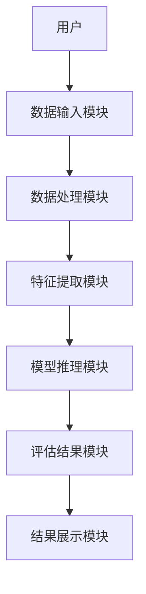

                 


# AI Agent在智能健康风险评估中的角色

> 关键词：AI Agent，健康风险评估，智能健康，人工智能，风险预测，健康数据分析

> 摘要：  
AI Agent作为一种智能体，在健康风险评估中扮演着越来越重要的角色。通过结合人工智能、大数据分析和机器学习技术，AI Agent能够高效地处理和分析海量健康数据，提供精准的健康风险预测和个性化的健康建议。本文将从AI Agent的核心原理、健康风险评估的理论基础、AI Agent在健康风险评估中的算法实现、系统架构设计以及实际项目案例等方面，深入探讨AI Agent在智能健康风险评估中的角色和应用。文章还将分析当前技术的挑战与未来发展方向，为相关领域的研究和实践提供参考。

---

## 第1章 AI Agent与智能健康风险评估概述

### 1.1 AI Agent的基本概念

#### 1.1.1 AI Agent的定义  
AI Agent（人工智能代理）是指能够感知环境、自主决策并执行任务的智能实体。它可以是一个软件程序、一个机器人，或者是嵌入在设备中的智能模块。AI Agent的核心目标是通过感知和行动，实现与环境的交互，从而完成特定任务或目标。

#### 1.1.2 AI Agent的核心特征  
AI Agent具有以下核心特征：  
1. **自主性**：能够自主决策，无需外部干预。  
2. **反应性**：能够实时感知环境变化并做出响应。  
3. **学习能力**：能够通过数据和经验不断优化自身的决策能力。  
4. **社交能力**：能够与其他AI Agent或人类进行交互和协作。  

#### 1.1.3 AI Agent与传统健康评估的区别  
传统的健康风险评估主要依赖于医生的经验和简单的统计模型，而AI Agent能够通过大数据分析、机器学习和深度学习等技术，提供更加精准和个性化的评估结果。

---

### 1.2 智能健康风险评估的定义

#### 1.2.1 健康风险评估的内涵  
健康风险评估是指通过分析个体的健康数据，预测其在未来一段时间内患某种疾病或健康问题的概率。智能健康风险评估则是通过人工智能技术，结合海量健康数据，提供更加智能化和个性化的评估结果。

#### 1.2.2 智能健康风险评估的特点  
智能健康风险评估具有以下特点：  
1. **数据驱动**：基于海量健康数据进行分析。  
2. **实时性**：能够实时更新和分析数据。  
3. **个性化**：根据个体的健康状况提供个性化的评估结果。  
4. **动态性**：能够根据环境和个体数据的变化动态调整评估结果。  

#### 1.2.3 智能健康风险评估的必要性  
随着人们健康意识的增强和医疗技术的进步，传统的健康风险评估方法已经无法满足日益增长的需求。智能健康风险评估通过AI技术，能够更高效、更准确地预测健康风险，为个体提供个性化的健康管理方案。

---

### 1.3 AI Agent在健康风险评估中的演进

#### 1.3.1 传统健康风险评估方法  
传统的健康风险评估方法主要包括问卷调查、体格检查和实验室检测等。这些方法虽然简单易行，但存在数据量小、评估结果不够精准等问题。

#### 1.3.2 AI Agent引入健康风险评估的背景  
随着人工智能技术的发展，AI Agent能够通过大数据分析和机器学习技术，对海量健康数据进行深度挖掘，从而提高健康风险评估的准确性和效率。

#### 1.3.3 AI Agent在健康风险评估中的应用前景  
AI Agent在健康风险评估中的应用前景广阔。通过结合可穿戴设备、智能医疗设备和健康大数据平台，AI Agent能够实时监测个体的健康状况，提供精准的健康风险预测和个性化的健康管理建议。

---

## 第2章 AI Agent的核心原理

### 2.1 AI Agent的结构与功能

#### 2.1.1 AI Agent的组成模块  
AI Agent的结构通常包括以下几个模块：  
1. **感知模块**：负责数据的采集和处理。  
2. **推理模块**：负责对数据进行分析和推理。  
3. **决策模块**：负责制定决策并输出行动方案。  
4. **执行模块**：负责执行决策并输出结果。  

#### 2.1.2 各模块的功能描述  
- **感知模块**：通过传感器、数据库等获取健康数据。  
- **推理模块**：利用机器学习算法对数据进行分析和预测。  
- **决策模块**：根据分析结果制定健康风险评估的决策。  
- **执行模块**：将决策结果输出给用户或相关系统。  

#### 2.1.3 模块之间的协作机制  
AI Agent的各个模块通过数据接口进行协作，感知模块向推理模块提供数据，推理模块向决策模块输出分析结果，决策模块向执行模块发送决策指令，执行模块将结果反馈给用户或系统。

---

### 2.2 AI Agent的工作流程

#### 2.2.1 数据采集与处理  
AI Agent通过传感器、智能设备和数据库获取健康数据，包括心率、血压、体重、运动数据等。  
$$\text{数据采集流程} = \text{传感器数据} + \text{用户输入数据} + \text{外部数据库数据}$$  

#### 2.2.2 数据分析与推理  
通过机器学习算法对数据进行分析和推理，例如使用随机森林、支持向量机（SVM）或深度学习模型（如神经网络）进行健康风险预测。  
$$\text{健康风险概率} = f(\text{输入特征})$$  
其中，\( f \) 是机器学习模型，输入特征包括年龄、性别、体重指数（BMI）、血压值等。

#### 2.2.3 结果输出与反馈  
AI Agent将分析结果输出给用户，并根据用户的反馈不断优化模型。

---

### 2.3 AI Agent在健康风险评估中的应用

#### 2.3.1 数据来源的多样性  
AI Agent可以从多种数据源获取健康数据，例如可穿戴设备、电子健康记录（EHR）、实验室检测数据等。

#### 2.3.2 数据分析的准确性  
通过机器学习算法，AI Agent能够对海量数据进行深度分析，提高健康风险评估的准确性。

#### 2.3.3 结果输出的可解释性  
AI Agent可以通过可视化界面向用户展示健康风险评估结果，并提供个性化的健康管理建议。

---

## 第3章 健康风险评估的理论基础

### 3.1 传统健康风险评估方法

#### 3.1.1 基于统计的方法  
传统的健康风险评估方法通常基于统计分析，例如多元回归分析。  
$$\text{健康风险} = \beta_0 + \beta_1 \times \text{特征}_1 + \beta_2 \times \text{特征}_2 + \ldots + \beta_n \times \text{特征}_n$$  

#### 3.1.2 基于规则的方法  
基于规则的方法通过预设的健康规则对个体健康状况进行评估，例如根据血压值判断是否高血压患者。

#### 3.1.3 基于机器学习的方法  
早期的机器学习方法（如随机森林和SVM）已经被用于健康风险评估，但其模型解释性较弱。

---

### 3.2 现代健康风险评估方法

#### 3.2.1 基于深度学习的方法  
深度学习模型（如卷积神经网络和循环神经网络）能够对健康数据进行更复杂的特征提取和模式识别。

#### 3.2.2 基于知识图谱的方法  
知识图谱能够整合多种健康数据源，提供更全面的健康风险评估。

#### 3.2.3 基于强化学习的方法  
强化学习通过模拟和优化决策过程，提升健康风险评估的准确性。

---

### 3.3 AI Agent在健康风险评估中的优势

#### 3.3.1 数据处理能力的提升  
AI Agent能够处理海量的健康数据，提高健康风险评估的效率和准确性。

#### 3.3.2 模型的可解释性增强  
通过可解释性机器学习技术，AI Agent能够提供更直观的健康风险评估结果。

#### 3.3.3 个性化评估的可能性  
AI Agent能够根据个体的健康数据，提供个性化的健康风险评估和建议。

---

## 第4章 AI Agent在健康风险评估中的算法原理

### 4.1 算法原理概述

#### 4.1.1 机器学习模型的选择  
在健康风险评估中，常用的机器学习模型包括逻辑回归、随机森林和梯度提升树（如XGBoost、LightGBM）。

#### 4.1.2 深度学习模型的应用  
深度学习模型（如神经网络和图神经网络）能够处理复杂的健康数据，例如图像和序列数据。

---

### 4.2 算法实现步骤

#### 4.2.1 数据预处理  
数据预处理包括数据清洗、特征选择和数据标准化。  
$$\text{标准化数据} = \frac{\text{数据} - \text{均值}}{\text{标准差}}$$  

#### 4.2.2 模型训练  
通过训练数据对机器学习模型进行训练，优化模型参数。  
$$\text{损失函数} = \sum_{i=1}^{n} (y_i - \hat{y}_i)^2$$  
其中，\( y_i \) 是真实标签，\( \hat{y}_i \) 是模型预测值。

#### 4.2.3 模型评估  
通过测试数据对模型进行评估，计算准确率、召回率和F1分数。  
$$\text{准确率} = \frac{\text{正确预测数}}{\text{总预测数}}$$  
$$\text{召回率} = \frac{\text{正确预测数}}{\text{实际正例数}}$$  
$$\text{F1分数} = \frac{2 \times \text{准确率} \times \text{召回率}}{\text{准确率} + \text{召回率}}$$  

---

## 第5章 系统架构设计

### 5.1 系统功能设计

#### 5.1.1 用户界面  
用户界面包括健康数据输入、评估结果展示和个性化建议输出。

#### 5.1.2 数据处理模块  
数据处理模块负责对输入数据进行清洗和特征提取。

#### 5.1.3 模型推理模块  
模型推理模块通过机器学习模型对数据进行分析和预测。

#### 5.1.4 结果输出模块  
结果输出模块将评估结果反馈给用户或相关系统。

---

### 5.2 系统架构图  
以下是一个AI Agent在健康风险评估中的系统架构图：



---

## 第6章 项目实战

### 6.1 环境配置

#### 6.1.1 Python环境  
安装Python 3.8或更高版本，安装必要的库（如NumPy、Pandas、Scikit-learn、XGBoost）。

#### 6.1.2 数据集  
使用公开的健康数据集，例如Kaggle上的健康风险评估数据集。

---

### 6.2 核心代码实现

#### 6.2.1 数据预处理  
```python
import pandas as pd
import numpy as np

# 加载数据集
data = pd.read_csv('health_risk.csv')

# 数据清洗
data = data.dropna()
data = pd.get_dummies(data)
```

#### 6.2.2 模型训练  
```python
from sklearn.model import XGBClassifier
from sklearn.metrics import accuracy_score

# 划分训练集和测试集
X_train, X_test, y_train, y_test = train_test_split(data.drop('label', axis=1), data['label'], test_size=0.2)

# 训练模型
model = XGBClassifier()
model.fit(X_train, y_train)

# 预测结果
y_pred = model.predict(X_test)

# 计算准确率
accuracy = accuracy_score(y_test, y_pred)
print(f'准确率: {accuracy}')
```

---

### 6.3 案例分析  
以一个高血压风险评估为例，AI Agent能够根据用户的血压、年龄、体重指数等数据，预测其患高血压的概率，并提供个性化的饮食和运动建议。

---

## 第7章 最佳实践与未来展望

### 7.1 最佳实践

#### 7.1.1 数据隐私保护  
在处理健康数据时，必须严格遵守数据隐私保护法规，例如GDPR和HIPAA。

#### 7.1.2 模型可解释性  
选择具有较高可解释性的模型，确保用户能够理解AI Agent的决策过程。

#### 7.1.3 持续优化  
定期更新模型，确保AI Agent的评估结果能够适应新的健康数据和趋势。

---

### 7.2 未来展望

#### 7.2.1 技术进步  
随着人工智能技术的不断发展，AI Agent在健康风险评估中的应用将更加广泛和精准。

#### 7.2.2 多模态数据融合  
未来的健康风险评估将更加注重多模态数据的融合，例如结合图像数据、基因数据和行为数据。

#### 7.2.3 个性化健康管理  
AI Agent将不仅仅停留在风险评估阶段，而是能够提供个性化的健康管理方案，帮助用户实现全面健康管理。

---

## 结语

AI Agent在智能健康风险评估中的角色日益重要。通过结合人工智能、大数据和机器学习技术，AI Agent能够为个体提供更加精准和个性化的健康风险评估服务。然而，随着技术的不断进步，AI Agent在健康风险评估中的应用也将面临新的挑战和机遇。未来，我们需要进一步研究和探索，以实现更加智能化和个性化的健康管理。

