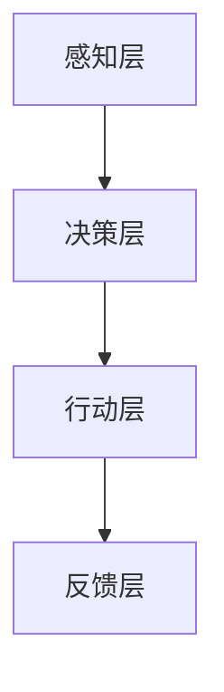
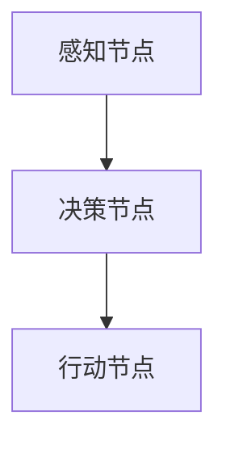
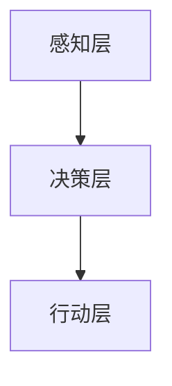
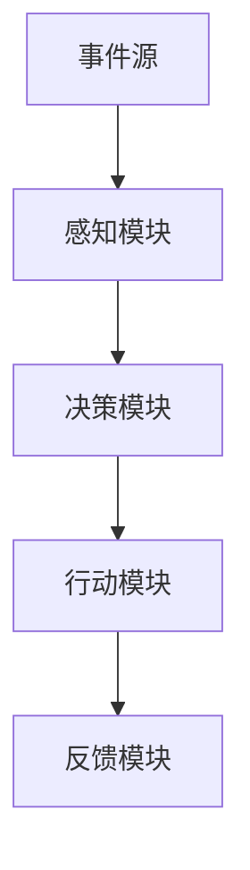
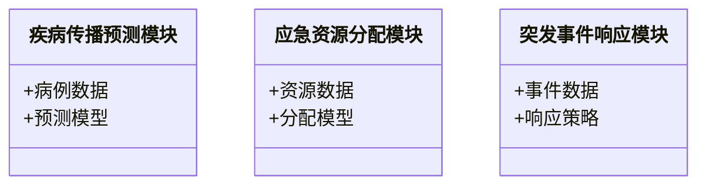
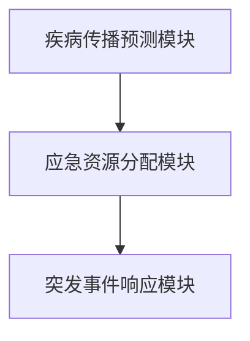
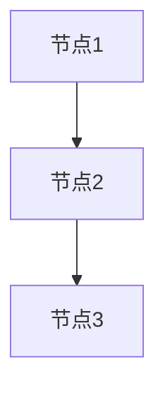
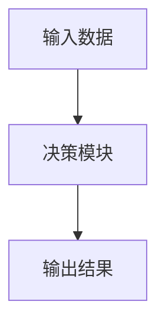
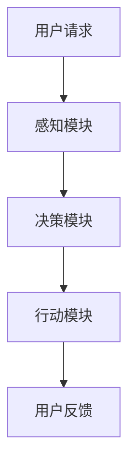

                 


# AI Agent在智能公共卫生应急中的角色

## 关键词：AI Agent、公共卫生应急、机器学习、自然语言处理、应急响应、智能系统

## 摘要：AI Agent作为一种智能代理技术，在公共卫生应急中发挥着越来越重要的作用。本文将从AI Agent的基本概念出发，探讨其在疾病传播预测、应急资源优化配置以及突发公共卫生事件响应中的具体应用。通过分析AI Agent的核心算法和系统架构，本文详细阐述了其在公共卫生应急中的优势和挑战，并结合实际案例展示了其在智能公共卫生应急中的潜力和前景。

---

## 目录

# 第1章: AI Agent与公共卫生应急的背景介绍

## 1.1 AI Agent的基本概念
### 1.1.1 AI Agent的定义与特点
- **定义**：AI Agent（人工智能代理）是指能够感知环境、自主决策并执行任务的智能实体。
- **特点**：
  - **自主性**：能够在没有外部干预的情况下独立运行。
  - **反应性**：能够实时感知环境变化并做出响应。
  - **目标导向**：通过优化目标函数来实现特定任务。
  - **学习能力**：能够通过数据和经验不断优化自身的性能。

### 1.1.2 AI Agent在公共卫生中的应用背景
- **公共卫生应急的复杂性**：
  - 疾病传播的不确定性。
  - 应急资源的有限性。
  - 突发事件的突发性和多样性。
- **AI Agent的优势**：
  - 能够快速处理大量数据，提供实时决策支持。
  - 能够模拟多种场景，优化资源配置。
  - 能够在复杂环境中自主协调任务。

### 1.1.3 公共卫生应急的现状与挑战
- **现状**：
  - 传统公共卫生应急系统依赖人工决策，效率较低。
  - 数据来源分散，难以实现高效的协同工作。
  - 应急响应的实时性要求高，传统方法难以满足。
- **挑战**：
  - 数据的实时性和准确性问题。
  - 系统的可扩展性和灵活性问题。
  - 系统的安全性和可靠性问题。

## 1.2 公共卫生应急的核心问题
### 1.2.1 疾病传播的预测与控制
- **疾病传播的预测模型**：
  - SIR模型（Susceptible-Infected-Recovered）。
  - SEIR模型（Susceptible-Exposed-Infected-Recovered）。
- **预测的挑战**：
  - 数据的不完整性。
  - 模型的可解释性问题。

### 1.2.2 应急资源的优化配置
- **资源分配问题**：
  - 医疗资源的分配。
  - 人员的调度。
  - 物资的配送。
- **优化方法**：
  - 基于线性规划的资源分配模型。
  - 基于强化学习的动态优化方法。

### 1.2.3 突发公共卫生事件的响应机制
- **事件识别与分类**：
  - 基于自然语言处理的事件识别。
  - 基于机器学习的事件分类。
- **响应机制的设计**：
  - 多级联动响应机制。
  - 跨部门协同机制。

## 1.3 AI Agent在公共卫生应急中的角色定位
### 1.3.1 AI Agent的核心功能与任务
- **信息收集与分析**：
  - 数据采集。
  - 数据清洗。
  - 数据分析。
- **决策支持**：
  - 预测与预警。
  - 资源分配。
  - 应急方案生成。
- **任务执行**：
  - 自动化操作。
  - 协调调度。

### 1.3.2 AI Agent与传统公共卫生应急的区别
- **传统方法**：
  - 依赖人工决策。
  - 数据处理效率低。
  - 响应速度慢。
- **AI Agent的优势**：
  - 实时数据处理能力。
  - 自动化决策能力。
  - 多任务协同能力。

### 1.3.3 AI Agent在公共卫生应急中的优势
- **高效性**：
  - 能够快速处理大量数据。
  - 能够实时更新决策方案。
- **准确性**：
  - 基于数据驱动的决策更准确。
  - 能够模拟多种场景，优化决策方案。
- **可扩展性**：
  - 能够适应不同规模的公共卫生事件。
  - 能够快速部署和调整。

## 1.4 本章小结
- 本章介绍了AI Agent的基本概念和特点，分析了公共卫生应急的核心问题，并探讨了AI Agent在公共卫生应急中的角色定位和优势。

---

## 第2章: AI Agent的核心概念与原理

## 2.1 AI Agent的核心概念
### 2.1.1 AI Agent的定义与分类
- **定义**：
  - AI Agent是一种能够感知环境、自主决策并执行任务的智能实体。
- **分类**：
  - **简单反射型AI Agent**：
    - 基于规则的决策。
    - 适用于简单的任务。
  - **基于模型的AI Agent**：
    - 基于知识库的决策。
    - 适用于复杂任务。
  - **基于学习的AI Agent**：
    - 基于机器学习模型的决策。
    - 适用于动态环境。

### 2.1.2 AI Agent的感知、决策与行动模块
- **感知模块**：
  - 数据采集。
  - 数据处理。
  - 状态识别。
- **决策模块**：
  - 状态评估。
  - 方案生成。
  - 方案选择。
- **行动模块**：
  - 任务执行。
  - 反馈收集。

### 2.1.3 AI Agent的智能特性与能力
- **智能特性**：
  - 学习能力。
  - 推理能力。
  - 适应能力。
- **能力**：
  - 数据分析能力。
  - 决策能力。
  - 协调能力。

### 2.1.4 核心概念对比表
| 特性 | 传统公共卫生应急 | AI Agent |
|------|------------------|----------|
| 数据处理 | 依赖人工处理 | 自动化处理 |
| 决策效率 | 低效 | 高效 |
| 响应速度 | 较慢 | 快速 |
| 可扩展性 | 有限 | 强大 |

## 2.2 AI Agent的算法原理
### 2.2.1 机器学习算法在AI Agent中的应用
- **监督学习**：
  - 用于分类和回归任务。
  - 例如，预测疾病传播趋势。
- **无监督学习**：
  - 用于聚类和降维任务。
  - 例如，识别异常行为模式。
- **强化学习**：
  - 用于动态决策任务。
  - 例如，优化资源分配。

### 2.2.2 自然语言处理在AI Agent中的应用
- **文本分析**：
  - 基于NLP的情感分析。
  - 用于舆情监控。
- **信息抽取**：
  - 从文本中提取关键信息。
  - 例如，从新闻中提取疫情相关信息。

### 2.2.3 专家系统在AI Agent中的应用
- **知识库**：
  - 基于专家经验构建的知识库。
  - 例如，疾病诊断规则。
- **推理引擎**：
  - 基于逻辑推理生成决策。
  - 例如，诊断建议生成。

## 2.3 AI Agent的系统架构
### 2.3.1 分层架构


### 2.3.2 分布式架构


### 2.3.3 混合架构


## 2.4 本章小结
- 本章详细介绍了AI Agent的核心概念、算法原理和系统架构，为后续章节的应用分析奠定了基础。

---

## 第3章: AI Agent在公共卫生应急中的具体应用

## 3.1 疾病传播预测与风险评估
### 3.1.1 疾病传播模型的构建
- **SIR模型**：
  - 描述疾病传播的基本过程。
  - 参数：感染率、恢复率。
  - 方程：
    $$ \frac{dS}{dt} = -\beta S I $$
    $$ \frac{dI}{dt} = \beta S I - \gamma I $$
    $$ \frac{dR}{dt} = \gamma I $$
- **SEIR模型**：
  - 包括暴露期。
  - 参数：感染率、潜伏期、恢复率。
  - 方程：
    $$ \frac{dS}{dt} = -\beta S I $$
    $$ \frac{dE}{dt} = \beta S I - \sigma E $$
    $$ \frac{dI}{dt} = \sigma E - \gamma I $$
    $$ \frac{dR}{dt} = \gamma I $$

### 3.1.2 AI Agent在疫情预测中的应用
- **机器学习模型**：
  - 预测病例数。
  - 预测疫情峰值。
- **数据来源**：
  - 病例数据。
  - 人口数据。
  - 环境数据。

### 3.1.3 风险评估的实现方法
- **风险评估指标**：
  - 感染风险指数。
  - 传播指数。
- **评估方法**：
  - 基于机器学习的模型。
  - 基于专家系统的推理。

## 3.2 应急资源的优化配置
### 3.2.1 应急资源的需求预测
- **需求预测模型**：
  - 基于历史数据的预测。
  - 基于机器学习的预测。
- **数据来源**：
  - 病例数据。
  - 资源使用情况。
  - 应急响应需求。

### 3.2.2 AI Agent在资源分配中的优化算法
- **线性规划模型**：
  - 目标函数：最大化资源利用率。
  - 约束条件：资源限制、需求约束。
- **强化学习算法**：
  - 状态空间：资源可用性、需求变化。
  - 动作空间：资源分配方案。
  - 奖励函数：资源利用率。

### 3.2.3 资源分配的动态调整机制
- **动态调整策略**：
  - 基于实时数据的调整。
  - 基于预测模型的调整。
- **反馈机制**：
  - 实时监控资源使用情况。
  - 动态更新分配方案。

## 3.3 突发公共卫生事件的响应与协调
### 3.3.1 事件识别与分类
- **事件识别方法**：
  - 基于机器学习的分类。
  - 基于规则的分类。
- **事件分类标准**：
  - 事件类型。
  - 事件严重性。
  - 事件影响范围。

### 3.3.2 AI Agent在事件响应中的应用
- **响应策略**：
  - 快速响应策略。
  - 协调响应策略。
- **响应流程**：
  - 事件识别。
  - 方案生成。
  - 任务执行。

### 3.3.3 系统交互流程


## 3.4 本章小结
- 本章详细介绍了AI Agent在疾病传播预测、应急资源优化配置以及突发公共卫生事件响应中的具体应用。

---

## 第4章: AI Agent的算法原理与数学模型

## 4.1 机器学习算法在AI Agent中的应用
### 4.1.1 线性回归模型
- **线性回归模型**：
  - 假设：y = βx + ε。
  - 优化目标：最小化均方误差。
  - 求解方法：最小二乘法。
- **应用场景**：
  - 疾病传播趋势预测。
  - 资源需求预测。

### 4.1.2 支持向量机模型
- **支持向量机模型**：
  - 用于分类和回归任务。
  - 优点：高维空间中的线性可分性。
- **应用场景**：
  - 疾病类型分类。
  - 应急响应优先级分类。

### 4.1.3 随机森林模型
- **随机森林模型**：
  - 由多个决策树组成。
  - 优点：抗过拟合、高维度数据处理能力强。
- **应用场景**：
  - 多因素分析。
  - 风险评估。

## 4.2 自然语言处理在AI Agent中的应用
### 4.2.1 词袋模型
- **词袋模型**：
  - 将文本表示为单词的集合。
  - 适用于文本分类任务。
- **应用场景**：
  - 疫情相关信息提取。
  - 舆情分析。

### 4.2.2 嵌入层
- **嵌入层**：
  - 用于将文本映射为低维向量。
  - 常见模型：Word2Vec、GloVe。
- **应用场景**：
  - 文本相似度计算。
  - 实体识别。

## 4.3 专家系统在AI Agent中的应用
### 4.3.1 知识库构建
- **知识库构建方法**：
  - 专家访谈。
  - 文档分析。
  - 数据挖掘。
- **知识表示**：
  - 语义网络。
  - 规则库。
- **应用场景**：
  - 疾病诊断。
  - 应急决策支持。

### 4.3.2 推理引擎
- **推理引擎**：
  - 基于逻辑推理生成决策。
  - 常见方法：基于规则的推理、基于概率的推理。
- **推理过程**：
  - 知识匹配。
  - 推理验证。
  - 决策生成。

## 4.4 本章小结
- 本章详细介绍了AI Agent中常用的机器学习算法、自然语言处理技术和专家系统，并分析了它们在公共卫生应急中的应用。

---

## 第5章: AI Agent的系统架构设计

## 5.1 系统功能设计
### 5.1.1 领域模型


### 5.1.2 功能模块交互


## 5.2 系统架构设计
### 5.2.1 分层架构


### 5.2.2 分布式架构


### 5.2.3 混合架构


## 5.3 系统接口设计
### 5.3.1 接口定义
- **输入接口**：
  - 数据输入接口。
  - 任务指令接口。
- **输出接口**：
  - 预测结果接口。
  - 分配方案接口。
  - 响应指令接口。

### 5.3.2 接口交互流程


## 5.4 系统交互设计
### 5.4.1 交互流程


### 5.4.2 交互机制
- **用户输入**：
  - 数据输入。
  - 任务指令。
- **系统响应**：
  - 预测结果。
  - 分配方案。
  - 响应指令。

## 5.5 本章小结
- 本章详细设计了AI Agent在公共卫生应急中的系统架构，包括功能模块、系统架构、接口设计和交互设计。

---

## 第6章: AI Agent的项目实战

## 6.1 环境配置
### 6.1.1 开发工具
- **编程语言**：Python。
- **深度学习框架**：TensorFlow、PyTorch。
- **自然语言处理库**：spaCy、NLTK。
- **可视化工具**：Matplotlib、Seaborn。

### 6.1.2 数据集
- **数据来源**：
  - 公共卫生数据库。
  - 疾病监测系统。
  - 新闻报道。
- **数据格式**：
  - CSV。
  - JSON。
  - XML。

## 6.2 系统核心实现
### 6.2.1 疾病传播预测模块
- **代码实现**：
  ```python
  import tensorflow as tf
  model = tf.keras.Sequential([
      tf.keras.layers.Dense(64, activation='relu'),
      tf.keras.layers.Dense(1, activation='linear')
  ])
  model.compile(optimizer='adam', loss='mean_squared_error')
  model.fit(x_train, y_train, epochs=100, batch_size=32)
  ```

### 6.2.2 应急资源分配模块
- **代码实现**：
  ```python
  import numpy as np
  from sklearn.ensemble import RandomForestRegressor
  model = RandomForestRegressor(n_estimators=100, random_state=42)
  model.fit(x_train, y_train)
  ```

### 6.2.3 突发事件响应模块
- **代码实现**：
  ```python
  import spacy
  nlp = spacy.load('en_core_web_sm')
  doc = nlp('There is an outbreak of flu in the city.')
  for token in doc:
      print(token.text, token.pos_)
  ```

## 6.3 代码应用解读与分析
### 6.3.1 疾病传播预测模块
- **功能**：
  - 基于机器学习模型预测疾病传播趋势。
- **输入**：
  - 病例数据、人口数据、环境数据。
- **输出**：
  - 预测结果、预测误差。

### 6.3.2 应急资源分配模块
- **功能**：
  - 基于随机森林模型优化资源分配方案。
- **输入**：
  - 资源需求数据、资源可用数据。
- **输出**：
  - 分配方案、分配结果。

### 6.3.3 突发事件响应模块
- **功能**：
  - 基于自然语言处理技术识别突发事件。
- **输入**：
  - 文本数据。
- **输出**：
  - 事件类型、事件严重性。

## 6.4 实际案例分析
### 6.4.1 疫情预测案例
- **案例背景**：
  - 预测某地区流感疫情。
- **数据来源**：
  - 历史病例数据。
  - 气候数据。
  - 人口数据。
- **预测结果**：
  - 病例数预测。
  - 疫情峰值预测。

### 6.4.2 应急响应案例
- **案例背景**：
  - 处理某地突发公共卫生事件。
- **数据来源**：
  - 事件报告。
  - 资源数据。
  - 应急方案。
- **响应结果**：
  - 资源分配方案。
  - 应急响应指令。

## 6.5 本章小结
- 本章通过实际案例展示了AI Agent在公共卫生应急中的应用，详细解读了系统的实现过程和代码实现。

---

## 第7章: 总结与展望

## 7.1 总结
- **总结内容**：
  - AI Agent在公共卫生应急中的核心作用。
  - 其在疾病传播预测、资源分配和事件响应中的具体应用。
  - 系统架构设计和算法实现的关键点。

## 7.2 展望
- **未来发展方向**：
  - 更加智能化的AI Agent。
  - 更加高效的算法优化。
  - 更加人性化的交互设计。
- **技术趋势**：
  - 多模态AI Agent。
  - 自适应AI Agent。
  - 分布式AI Agent。

## 7.3 本章小结
- 本章总结了全文的主要内容，并展望了AI Agent在公共卫生应急中的未来发展方向。

---

## 参考文献
1. 线性回归模型： Hastie, T., Tibshirani, R., & Friedman, J. (2009). The Elements of Statistical Learning.
2. 支持向量机模型： Vapnik, V. (1998). Statistical Learning Theory.
3. 随机森林模型： Breiman, L. (2001). Random Forests.
4. 词袋模型： Harald, S. (2010). Text Mining with Python.
5. 嵌入层： Mikolov, T., Sutskever, I., & Hinton, G. (2013). Distributed representations of words and their usage.

---

## 附录
### 附录A: 工具安装与配置
- **Python安装**：
  - 下载Python安装包。
  - 配置环境变量。
- **TensorFlow安装**：
  - 使用pip安装。
  - 验证安装。

### 附录B: 数据格式与处理
- **数据清洗**：
  - 去重。
  - 填充缺失值。
  - 数据标准化。

### 附录C: 代码示例
- **疾病传播预测模块**：
  ```python
  import numpy as np
  import pandas as pd
  from sklearn.linear_model import LinearRegression
  model = LinearRegression()
  model.fit(x_train, y_train)
  ```

---

## 结语
AI Agent在智能公共卫生应急中的应用前景广阔，随着技术的不断进步，其在疾病传播预测、资源分配和事件响应中的作用将更加重要。未来，AI Agent将更加智能化、高效化和人性化，为公共卫生应急提供更加强有力的支持。

---

**注意：** 由于篇幅限制，本文未展示所有详细代码和复杂模型的具体实现，仅提供关键部分的代码示例和算法框架。

