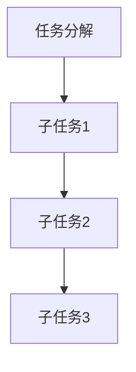
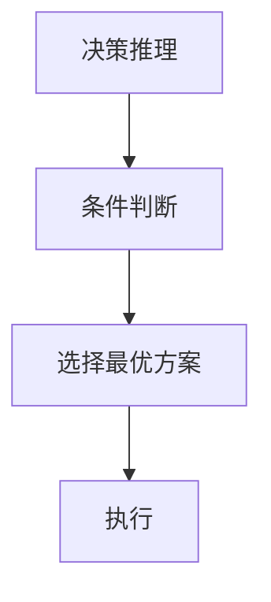
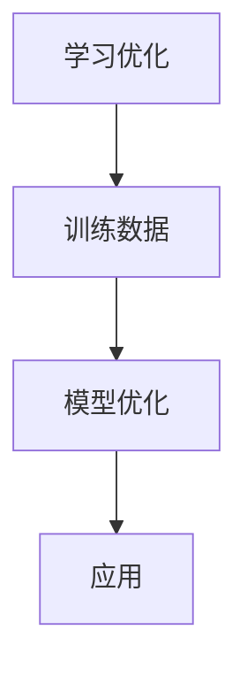
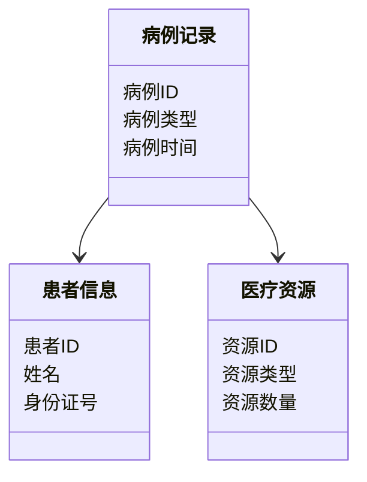
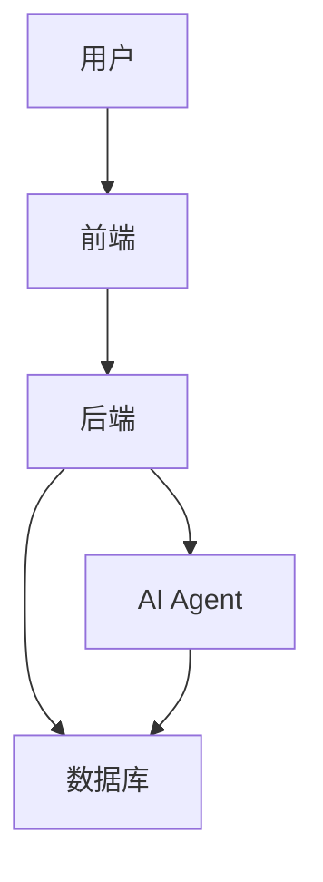
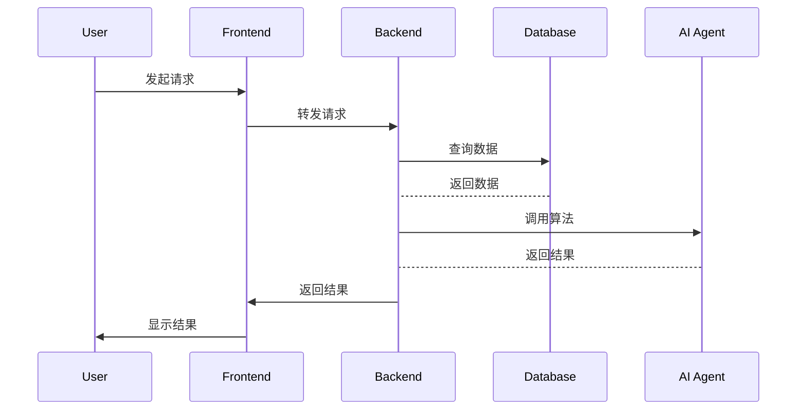

                 


# AI Agent在智能公共卫生管理中的角色

---

## 关键词：
- AI Agent
- 公共卫生管理
- 智能化
- 系统架构
- 任务分解

---

## 摘要：
AI Agent作为智能系统的核心组件，在公共卫生管理中扮演着越来越重要的角色。通过分析AI Agent的核心概念、算法原理、系统架构以及实际应用场景，本文深入探讨了AI Agent在疾病预防、疫情监测和资源分配等方面的优势，并通过实际案例展示了其在公共卫生管理中的实际应用价值。文章还详细介绍了AI Agent的数学模型和实现方法，为相关领域的研究和实践提供了重要的参考。

---

## 第1章: 公共卫生管理的背景与挑战

### 1.1 公共卫生管理的历史演变
公共卫生管理经历了从传统的人工管理到现代化、智能化的转变。随着技术的进步，尤其是人工智能和大数据技术的发展，公共卫生管理进入了智能化阶段。

#### 1.1.1 传统公共卫生管理的模式与特点
传统的公共卫生管理依赖于人工记录和统计，效率低下，且容易出错。其特点是：
- **低效性**：人工处理大量数据，效率较低。
- **主观性**：依赖个体经验，缺乏客观性。
- **滞后性**：数据处理和分析速度较慢，难以实时响应。

#### 1.1.2 当前公共卫生管理的主要挑战
现代社会公共卫生管理面临以下挑战：
- **数据量大**：需要处理海量数据，包括病例、疫苗接种、药品库存等。
- **实时性要求高**：疫情爆发时需要快速响应。
- **复杂性**：涉及多方协作，包括医院、政府、科研机构等。

#### 1.1.3 公共卫生管理的数字化转型趋势
数字化转型是公共卫生管理发展的必然趋势。通过引入AI、大数据和云计算等技术，可以提高管理效率和准确性。

### 1.2 AI Agent的基本概念与特点
AI Agent是一种智能体，能够感知环境并采取行动以实现目标。

#### 1.2.1 AI Agent的定义与核心属性
AI Agent的定义：
- AI Agent是一个能够感知环境并采取行动以实现目标的实体。

核心属性：
- **自主性**：能够在没有外部干预的情况下独立运作。
- **反应性**：能够实时感知环境并做出反应。
- **学习能力**：能够通过数据和经验不断优化自身行为。

#### 1.2.2 AI Agent与传统软件系统的区别
AI Agent与传统软件系统的主要区别在于其智能性和自主性。传统软件系统通常按照预设的规则运行，而AI Agent能够自主决策并适应环境变化。

#### 1.2.3 AI Agent在公共卫生管理中的优势
- **高效性**：能够快速处理大量数据，提高管理效率。
- **准确性**：通过数据分析和预测，减少人为错误。
- **实时性**：能够实时监控疫情动态，快速响应。

### 1.3 AI Agent在公共卫生管理中的角色定位
AI Agent在公共卫生管理中的角色可以是辅助决策者、数据分析师或执行者。

#### 1.3.1 公共卫生管理中的关键问题
- 疾病预防与控制
- 疫情监测与预警
- 资源分配与调度

#### 1.3.2 AI Agent在问题解决中的作用
AI Agent可以通过数据分析和预测，帮助公共卫生管理者制定科学的决策。

#### 1.3.3 AI Agent的边界与外延
AI Agent的边界在于其智能性和自主性。其外延包括与其他系统的协作和集成。

---

## 第2章: AI Agent的核心概念与联系

### 2.1 核心概念原理
AI Agent的核心概念包括任务分解、知识表示和决策推理。

#### 2.1.1 任务分解与优先级排序
任务分解是将复杂的任务分解为简单的子任务。优先级排序是根据任务的重要性和紧急性进行排序。

#### 2.1.2 知识表示与推理机制
知识表示是将知识以计算机可理解的形式表示。推理机制是根据知识进行推理和决策。

#### 2.1.3 决策优化与自适应能力
决策优化是通过优化算法选择最优的决策。自适应能力是根据环境变化调整自身行为的能力。

### 2.2 核心概念属性特征对比
通过对比表格可以看出AI Agent与传统软件系统的区别。

#### 2.2.1 AI Agent与传统AI系统的对比分析
| 属性         | AI Agent                 | 传统AI系统              |
|--------------|--------------------------|-------------------------|
| 自主性        | 高                      | 中                     |
| 反应性        | 高                      | 低                     |
| 学习能力      | 高                      | 低                     |

#### 2.2.2 ER实体关系图架构
ER实体关系图展示了公共卫生管理中的实体及其关系。

```mermaid
erd
  人民医院 ↔{就诊}→ 病例记录
  病例记录 ↔{记录}→ 患者信息
  患者信息 ↔{关联}→ 医疗资源
  医疗资源 ↔{分配}→ AI Agent
  AI Agent ↔{监控}→ 疫情数据
```

---

## 第3章: AI Agent的算法原理与数学模型

### 3.1 算法原理讲解
AI Agent的算法主要包括任务分解、决策推理和学习优化。

#### 3.1.1 任务分解算法
任务分解算法通过将复杂任务分解为子任务，提高效率。



#### 3.1.2 决策推理算法
决策推理算法通过分析数据做出决策。



#### 3.1.3 学习优化算法
学习优化算法通过学习数据不断优化自身行为。



### 3.2 数学模型与公式
数学模型是AI Agent算法的核心。

#### 3.2.1 任务优先级排序的数学模型
任务优先级排序的公式如下：
$$ P(i) = \frac{1}{1 + e^{-\beta (w_i - w_j)}} $$

#### 3.2.2 决策优化的数学公式
决策优化的公式如下：
$$ \text{Maximize} \sum_{i=1}^{n} u_i \cdot x_i $$

#### 3.2.3 知识表示的向量空间模型
知识表示的向量空间模型如下：
$$ \vec{v} = \sum_{i=1}^{n} \alpha_i \vec{e_i} $$

### 3.3 算法实现与举例说明
通过Python代码实现任务分解算法。

```python
def task_decomposition(tasks):
    subtasks = []
    for task in tasks:
        subtasks.extend(decompose_task(task))
    return subtasks

def decompose_task(task):
    # 分解任务为子任务
    return [subtask1, subtask2, subtask3]
```

---

## 第4章: 系统分析与架构设计

### 4.1 问题场景介绍
公共卫生管理系统的场景包括医院、疾控中心和政府机构。

### 4.2 系统功能设计
系统功能包括数据采集、分析、决策支持和执行反馈。

#### 4.2.1 领域模型设计
领域模型设计如下：



#### 4.2.2 系统架构设计
系统架构设计如下：



### 4.3 系统接口设计
系统接口包括数据接口、API接口和用户接口。

### 4.4 系统交互设计
系统交互流程如下：



---

## 第5章: 项目实战

### 5.1 环境安装
安装Python和相关库，如numpy和pandas。

```bash
pip install numpy pandas
```

### 5.2 系统核心实现
实现AI Agent的核心算法。

```python
import numpy as np
import pandas as pd

def main():
    data = pd.read_csv('cases.csv')
    print(data.head())

if __name__ == "__main__":
    main()
```

### 5.3 实际案例分析
以某地区疫情数据为例，分析AI Agent的应用。

---

## 第6章: 最佳实践

### 6.1 小结
本文详细介绍了AI Agent在公共卫生管理中的角色和应用。

### 6.2 注意事项
在实际应用中，需要注意数据隐私和算法的可解释性。

### 6.3 拓展阅读
推荐阅读相关领域的书籍和论文。

---

## 第7章: 结语

AI Agent在公共卫生管理中的应用前景广阔。随着技术的不断发展，AI Agent将在未来的公共卫生管理中发挥更大的作用。

