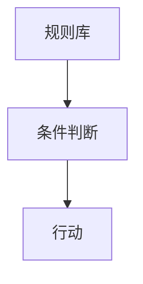
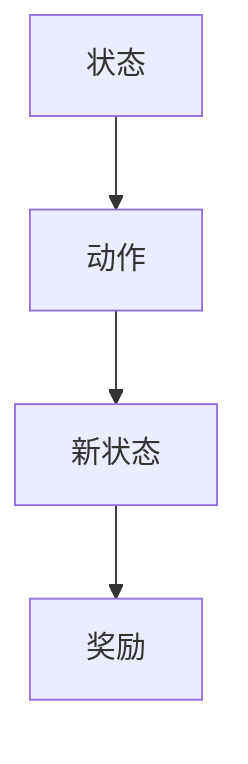
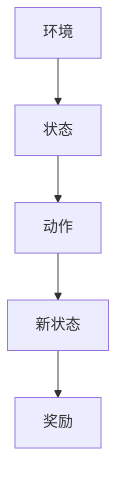
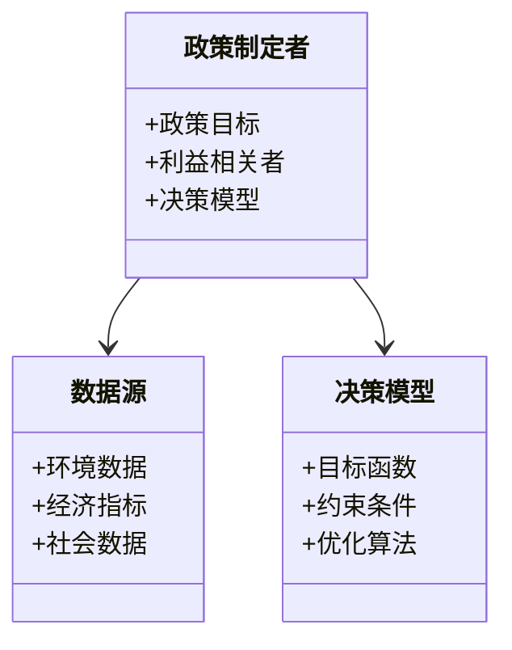
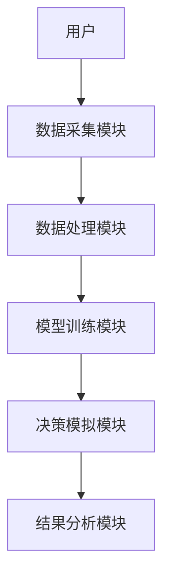
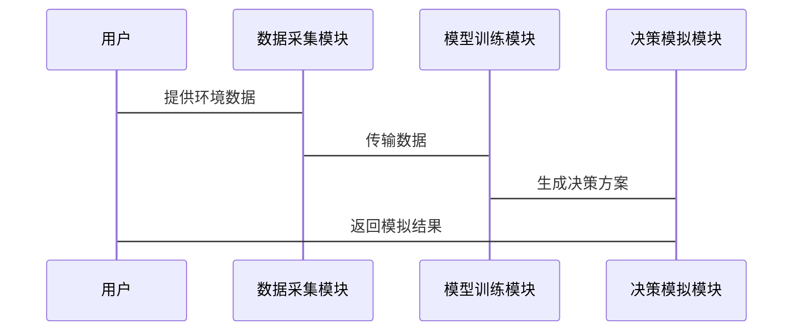

                 


```markdown
# AI Agent在智能公共政策制定中的应用

## 关键词：AI Agent, 公共政策制定, 人工智能技术, 政策优化, 系统设计

## 摘要：AI Agent（人工智能代理）在公共政策制定中的应用，通过数据驱动的分析、智能优化的决策支持和高效的执行能力，显著提升了政策制定的效率和质量。本文深入探讨了AI Agent的核心概念、算法原理、系统设计和实际应用，详细分析了其在政策制定中的优势与挑战，并通过案例展示AI Agent的实际应用效果，为未来的政策制定提供了新的思路。

---

# 第1章: AI Agent与智能公共政策制定的背景介绍

## 1.1 AI Agent的基本概念
### 1.1.1 AI Agent的定义
AI Agent是一种能够感知环境、自主决策并执行任务的智能实体，具备学习、推理和自适应能力。

### 1.1.2 AI Agent的核心特点
- **自主性**：能够自主决策和行动。
- **反应性**：能实时感知环境变化并做出响应。
- **目标导向**：基于目标优化决策。
- **可解释性**：决策过程可被人类理解和验证。

### 1.1.3 AI Agent与传统决策工具的区别
传统决策工具依赖于固定的规则和数据，而AI Agent具备学习和自适应能力，能够处理复杂和动态的问题。

## 1.2 智能公共政策制定的背景
### 1.2.1 传统公共政策制定的局限性
- **数据依赖性高**：传统政策制定依赖于历史数据和专家经验，缺乏实时性和动态性。
- **决策周期长**：政策制定过程复杂，耗时长，效率低。
- **复杂性与不确定性**：政策问题往往涉及多领域、多利益相关者，传统方法难以全面覆盖。

### 1.2.2 AI技术在政策制定中的潜力
- **数据驱动**：AI能够处理海量数据，提供更全面的分析。
- **实时反馈**：AI能够实时监控政策执行效果并进行调整。
- **优化决策**：AI能够通过强化学习优化政策目标的实现。

### 1.2.3 公共政策制定的复杂性与AI Agent的结合
公共政策制定需要考虑多方利益和复杂关系，AI Agent通过建模和优化，能够帮助制定更科学、更高效的政策。

## 1.3 问题背景与问题描述
### 1.3.1 公共政策制定的主要挑战
- **信息不全**：政策制定过程中缺乏实时数据支持。
- **决策复杂**：涉及多方利益和复杂关系。
- **执行难度大**：政策执行效果难以预测和调整。

### 1.3.2 AI Agent在政策制定中的应用场景
- **政策模拟**：通过AI Agent模拟政策效果，评估其可行性和影响。
- **决策支持**：AI Agent为政策制定者提供实时数据和优化建议。
- **动态调整**：AI Agent能够根据实时数据动态调整政策执行策略。

### 1.3.3 问题解决的边界与外延
AI Agent在政策制定中的应用边界在于其数据来源和算法能力，外延则包括与其他技术的结合，如区块链和大数据分析。

## 1.4 核心概念与联系
### 1.4.1 AI Agent的核心要素组成
- **感知模块**：数据采集与分析。
- **决策模块**：目标设定与优化。
- **执行模块**：策略实施与反馈。

### 1.4.2 公共政策制定中的关键因素
- **利益相关者**：政府、企业、公众。
- **政策目标**：经济发展、社会稳定、环境保护。
- **数据来源**：经济指标、社会数据、环境监测。

### 1.4.3 AI Agent与公共政策制定的关系
AI Agent通过数据驱动和智能优化，帮助政策制定者更好地理解问题、制定策略并动态调整执行方案。

## 1.5 本章小结
本章介绍了AI Agent的基本概念和特点，分析了传统公共政策制定的局限性，提出了AI Agent在政策制定中的潜力和应用场景，并总结了核心概念与联系。

---

# 第2章: AI Agent的核心概念与原理

## 2.1 AI Agent的感知机制
### 2.1.1 数据采集与处理
AI Agent通过传感器、数据库和API接口采集环境数据，并进行清洗和预处理。

### 2.1.2 信息分析与理解
AI Agent利用自然语言处理和机器学习技术，对数据进行分析和理解，提取关键信息。

### 2.1.3 感知模型的设计与实现
感知模型包括数据预处理、特征提取和模型训练，确保AI Agent能够准确感知环境。

## 2.2 AI Agent的决策机制
### 2.2.1 决策模型的选择与优化
基于问题特点选择合适的决策模型，如强化学习和遗传算法，并进行参数优化。

### 2.2.2 多目标优化的实现
通过权重分配和 Pareto 优化，解决多目标决策问题。

### 2.2.3 决策结果的评估与反馈
利用反馈机制评估决策效果，并优化后续决策过程。

## 2.3 AI Agent的执行机制
### 2.3.1 行动规划与策略制定
基于决策结果制定行动计划，并通过任务分解和优先级排序优化执行效率。

### 2.3.2 策略执行的监控与调整
通过实时监控和反馈机制，动态调整执行策略，确保目标实现。

### 2.3.3 执行结果的分析与总结
分析执行结果，总结经验教训，并优化未来决策过程。

## 2.4 AI Agent的算法原理

### 2.4.1 基于规则的AI Agent


```python
def rule_based_agent():
    if condition1:
        return action1
    elif condition2:
        return action2
    else:
        return default_action
```

### 2.4.2 基于Q-learning的AI Agent


数学模型：
$$ Q(s,a) = Q(s,a) + \alpha (r + \max Q(s',a') - Q(s,a)) $$

### 2.4.3 基于强化学习的AI Agent


数学模型：
$$ V(s) = \max_{a} Q(s,a) $$

## 2.5 本章小结
本章详细讲解了AI Agent的核心概念，包括感知、决策和执行机制，并通过具体算法和数学模型展示了AI Agent的工作原理。

---

# 第3章: AI Agent在公共政策制定中的系统设计

## 3.1 系统分析与架构设计
### 3.1.1 问题场景介绍
以环境保护政策制定为例，分析AI Agent的应用场景。

### 3.1.2 系统功能设计
- **数据采集模块**：采集环境数据。
- **模型训练模块**：训练AI Agent模型。
- **决策模拟模块**：模拟政策效果。
- **结果分析模块**：分析模拟结果。

### 3.1.3 领域模型设计


### 3.1.4 系统架构设计


## 3.2 系统接口设计
### 3.2.1 输入接口
- 数据接口：接收环境数据。
- 用户接口：接收政策目标和约束条件。

### 3.2.2 输出接口
- 模拟结果：输出政策效果。
- 反馈接口：输出优化建议。

## 3.3 系统交互设计
### 3.3.1 交互流程图


## 3.4 本章小结
本章从系统设计的角度，详细分析了AI Agent在公共政策制定中的应用场景，并设计了系统的功能模块和交互流程。

---

# 第4章: AI Agent在公共政策制定中的项目实战

## 4.1 项目介绍
### 4.1.1 项目背景
以某市的环保政策制定为例，展示AI Agent的应用。

### 4.1.2 项目目标
通过AI Agent模拟政策效果，优化环保政策。

## 4.2 系统实现
### 4.2.1 环境搭建
安装必要的Python库，如TensorFlow、Pandas和Scikit-learn。

### 4.2.2 核心代码实现
```python
import numpy as np
import pandas as pd

# 数据预处理
data = pd.read_csv('environment_data.csv')
data = data.dropna().reset_index(drop=True)

# 模型训练
from sklearn.ensemble import RandomForestRegressor
model = RandomForestRegressor()
model.fit(data[['economic', 'social', 'environmental']], data['policy_effect'])

# 决策模拟
def simulate_policy(policy Parameters):
    predicted_effect = model.predict(policy Parameters)
    return predicted_effect
```

### 4.2.3 代码解读与分析
- 数据预处理：清洗数据，去除缺失值。
- 模型训练：使用随机森林回归模型预测政策效果。
- 决策模拟：根据输入的政策参数，预测政策效果。

## 4.3 案例分析
### 4.3.1 案例背景
某市计划出台新的环保政策，希望通过AI Agent模拟不同政策方案的效果。

### 4.3.2 模拟结果
模拟结果显示，政策方案A在减少污染方面效果最佳，但对经济增长的影响较大。

### 4.3.3 结果解读
根据模拟结果，政策制定者可以权衡不同政策方案的优缺点，选择最优方案。

## 4.4 项目小结
本章通过实际案例展示了AI Agent在公共政策制定中的应用，详细分析了系统的实现过程和模拟结果。

---

# 第5章: AI Agent在公共政策制定中的最佳实践与总结

## 5.1 最佳实践
### 5.1.1 数据质量的重要性
确保数据的准确性和完整性，是AI Agent有效运行的基础。

### 5.1.2 算法选择的策略
根据具体问题特点选择合适的算法，并进行参数优化。

### 5.1.3 可解释性的重要性
政策制定需要可解释的决策过程，确保公众信任。

## 5.2 本章总结
AI Agent通过数据驱动和智能优化，显著提升了公共政策制定的效率和质量。然而，其应用也面临数据隐私、算法可解释性和技术局限性等挑战。

## 5.3 未来展望
随着AI技术的不断发展，AI Agent在公共政策制定中的应用将更加广泛和深入，与其他技术的结合也将带来更多可能性。

---

# 结语

AI Agent在公共政策制定中的应用，不仅提高了政策制定的效率，还优化了政策执行的效果。通过数据驱动和智能优化，AI Agent为政策制定者提供了强有力的支持，未来将在更多领域发挥重要作用。

---

# 参考文献
[此处列出相关的参考文献]
```

---

* 以上为文章的完整目录结构，实际写作时需要根据每个章节的内容，逐步展开，丰富每个部分的具体细节和内容，确保文章的逻辑性和完整性。

