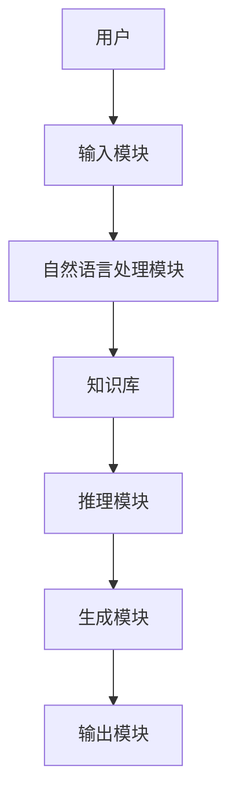
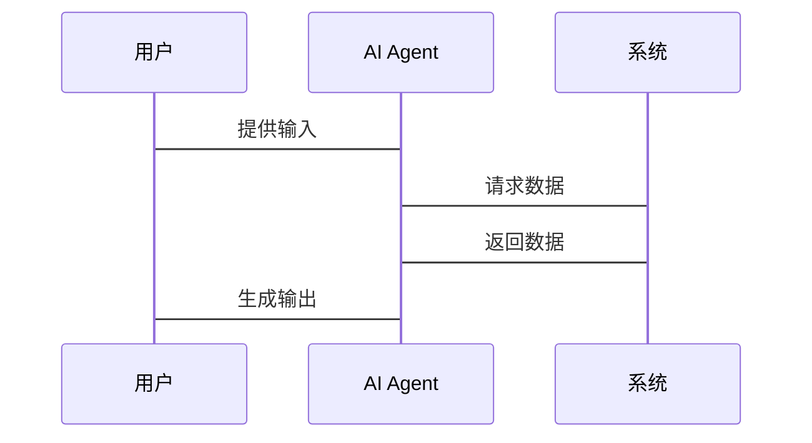

                 


```markdown
# AI Agent在智能内容生成中的应用

> 关键词：AI Agent, 智能内容生成, 自然语言处理, 机器学习, 生成式AI

> 摘要：本文系统地探讨了AI Agent在智能内容生成中的应用，从基础概念到算法原理，再到实际项目实现，详细分析了AI Agent如何利用自然语言处理和机器学习技术生成高质量内容。通过具体案例和系统设计，展示了AI Agent在智能内容生成中的巨大潜力和实际应用价值。

---

# 第一部分: AI Agent在智能内容生成中的应用概述

# 第1章: AI Agent的基本概念与应用

## 1.1 AI Agent的定义与核心概念

### 1.1.1 AI Agent的定义

AI Agent（人工智能代理）是一种能够感知环境、自主决策并执行任务的智能实体。它通过传感器获取信息，利用推理能力做出决策，并通过执行器与环境交互。AI Agent的核心目标是为用户提供智能化的服务，提升效率和体验。

### 1.1.2 AI Agent的核心特征

- **自主性**：AI Agent能够自主决策，无需人工干预。
- **反应性**：能够实时感知环境变化并做出反应。
- **目标导向**：基于明确的目标执行任务。
- **学习能力**：通过数据和经验不断优化性能。

### 1.1.3 AI Agent与传统AI的区别

| 特性             | 传统AI                 | AI Agent                |
|------------------|------------------------|--------------------------|
| 决策方式         | 基于预设规则           | 基于目标和环境反馈       |
| 执行能力         | 仅限于特定任务         | 具备自主执行能力         |
| 适应性           | 较低                   | 较高，能适应环境变化     |

## 1.2 AI Agent的发展历程

### 1.2.1 AI Agent的历史演变

AI Agent的概念起源于20世纪60年代的专家系统研究，经历了从基于规则的系统到基于模型的系统，再到基于学习的系统的演变。

### 1.2.2 AI Agent技术的现状

当前，AI Agent技术广泛应用于智能助手、推荐系统、自动驾驶等领域，结合深度学习和自然语言处理技术，展现出强大的应用潜力。

### 1.2.3 AI Agent的未来趋势

未来，AI Agent将更加智能化和个性化，具备更强的自主决策和问题解决能力，应用场景也将更加广泛。

## 1.3 AI Agent在智能内容生成中的应用场景

### 1.3.1 自然语言生成

AI Agent可以通过自然语言处理技术生成高质量的文字内容，如新闻报道、营销文案等。

### 1.3.2 内容推荐系统

AI Agent可以根据用户行为和偏好，推荐个性化的内容，提升用户体验。

### 1.3.3 智能写作辅助工具

AI Agent可以作为写作助手，提供实时建议、语法检查和内容优化，帮助用户提高写作效率。

## 1.4 本章小结

本章介绍了AI Agent的基本概念、发展历程及其在智能内容生成中的应用场景，为后续内容奠定了基础。

---

# 第二部分: AI Agent的核心概念与原理

# 第2章: AI Agent的核心概念分析

## 2.1 AI Agent的类型与分类

### 2.1.1 基于规则的AI Agent

基于预设规则的AI Agent通过条件判断和规则库做出决策，适用于任务简单、规则明确的场景。

### 2.1.2 基于模型的AI Agent

基于模型的AI Agent利用知识图谱或专家系统进行推理，适用于复杂任务。

### 2.1.3 基于学习的AI Agent

基于学习的AI Agent通过机器学习算法从数据中学习，具备更强的适应性和泛化能力。

## 2.2 AI Agent的工作原理

### 2.2.1 信息感知与处理

AI Agent通过传感器或数据接口获取环境信息，并通过自然语言处理技术进行理解和分析。

### 2.2.2 决策与执行

AI Agent基于感知的信息和目标，利用推理算法做出决策，并通过执行器执行任务。

### 2.2.3 交互与反馈

AI Agent与用户或系统进行交互，获取反馈并不断优化自身的行为。

## 2.3 AI Agent的核心要素

### 2.3.1 知识库

知识库是AI Agent的核心，存储了任务所需的所有知识和信息，包括事实、规则和经验。

### 2.3.2 行为规划模块

行为规划模块负责根据目标和环境信息，制定行动方案。

### 2.3.3 执行模块

执行模块负责将规划好的行动方案转化为具体的操作，与环境进行交互。

## 2.4 AI Agent与相关技术的对比

### 2.4.1 AI Agent与传统AI的对比

| 特性             | 传统AI                 | AI Agent                |
|------------------|------------------------|--------------------------|
| 决策方式         | 基于预设规则           | 基于目标和环境反馈       |
| 执行能力         | 仅限于特定任务         | 具备自主执行能力         |
| 适应性           | 较低                   | 较高，能适应环境变化     |

### 2.4.2 AI Agent与机器学习的对比

机器学习主要用于数据处理和模式识别，而AI Agent具备自主决策和执行能力，是机器学习技术的综合应用。

### 2.4.3 AI Agent与自然语言处理的对比

自然语言处理专注于文本的理解和生成，而AI Agent具备更广泛的应用场景和目标导向性。

## 2.5 本章小结

本章详细分析了AI Agent的类型、工作原理以及与相关技术的对比，帮助读者更好地理解AI Agent的核心概念。

---

# 第三部分: AI Agent的算法原理与数学模型

# 第3章: AI Agent的算法原理

## 3.1 基于规则的生成算法

### 3.1.1 基于规则的生成流程

1. **信息感知**：通过传感器获取环境信息。
2. **规则匹配**：将感知信息与规则库中的规则进行匹配。
3. **生成内容**：根据匹配的规则生成相应的内容。

### 3.1.2 规则的定义与优化

- **规则定义**：规则通常由条件和动作组成，例如：如果用户输入关键词“天气”，则生成天气预报。
- **规则优化**：通过数据反馈不断优化规则，提升生成内容的准确性和相关性。

### 3.1.3 规则生成的优缺点

| 特性             | 优点                   | 缺点                     |
|------------------|------------------------|--------------------------|
| 开发成本         | 低                     | 高（需要手动编写规则）   |
| 灵活性           | 低                     | 高（规则过于复杂）       |

## 3.2 基于模型的生成算法

### 3.2.1 基于模型的生成流程

1. **信息感知**：通过传感器获取环境信息。
2. **模型推理**：利用知识图谱或专家系统进行推理。
3. **生成内容**：根据推理结果生成相应的内容。

### 3.2.2 模型的构建与优化

- **模型构建**：基于领域知识构建知识图谱，定义实体和关系。
- **模型优化**：通过数据反馈不断优化模型的准确性和效率。

### 3.2.3 基于模型的优缺点

| 特性             | 优点                   | 缺点                     |
|------------------|------------------------|--------------------------|
| 知识表示         | 高效                   | 复杂                     |
| 适应性           | 较高                   | 受限于知识库的完善性     |

## 3.3 基于学习的生成算法

### 3.3.1 基于学习的生成流程

1. **信息感知**：通过传感器获取环境信息。
2. **特征提取**：利用深度学习模型提取特征。
3. **生成内容**：通过生成模型生成相应的内容。

### 3.3.2 学习算法的选择

- **监督学习**：基于标注数据进行训练。
- **无监督学习**：基于未标注数据进行聚类。
- **强化学习**：通过奖励机制优化生成内容。

### 3.3.3 基于学习的数学模型

#### 生成模型

$$ P(y|x) = \text{softmax}(Wx + b) $$

其中，\( x \) 是输入，\( y \) 是输出，\( W \) 和 \( b \) 是模型参数。

#### 增量学习

$$ W_{\text{new}} = W + \alpha (y - \hat{y}) $$

其中，\( \alpha \) 是学习率，\( y \) 是真实值，\( \hat{y} \) 是预测值。

## 3.4 基于混合的生成算法

### 3.4.1 混合算法的优势

- **结合规则和学习**：利用规则处理简单任务，利用学习处理复杂任务。
- **灵活性高**：可以根据场景动态调整生成策略。

### 3.4.2 混合算法的实现流程

1. **信息感知**：获取环境信息。
2. **策略选择**：根据任务类型选择生成策略。
3. **内容生成**：执行生成策略生成内容。

## 3.5 本章小结

本章详细讲解了AI Agent的生成算法，包括基于规则、基于模型和基于学习的算法，并探讨了混合算法的优势和实现流程。

---

# 第四部分: AI Agent的系统架构与设计

# 第4章: AI Agent的系统架构设计

## 4.1 系统功能模块设计

### 4.1.1 知识库模块

- **功能**：存储和管理任务所需的知识和数据。
- **设计**：使用知识图谱表示，支持动态更新。

### 4.1.2 行为规划模块

- **功能**：根据目标和环境信息制定行动方案。
- **设计**：基于A*算法进行路径规划。

### 4.1.3 执行模块

- **功能**：根据规划的行动方案执行具体操作。
- **设计**：支持多种执行方式，如调用API或控制物理设备。

## 4.2 系统架构设计

### 4.2.1 系统架构图



### 4.2.2 系统交互设计



## 4.3 系统接口设计

### 4.3.1 输入接口

- **输入格式**：支持文本、语音等多种形式。
- **接口协议**：采用RESTful API设计。

### 4.3.2 输出接口

- **输出格式**：支持文本、图像等多种形式。
- **接口协议**：采用WebSocket实时通信。

## 4.4 本章小结

本章详细设计了AI Agent的系统架构，包括功能模块、系统架构图和接口设计，为后续的项目实现奠定了基础。

---

# 第五部分: AI Agent的项目实战与案例分析

# 第5章: AI Agent的项目实战

## 5.1 项目环境安装与配置

### 5.1.1 开发工具安装

- **Python**：3.8及以上版本。
- **深度学习框架**：TensorFlow或PyTorch。
- **自然语言处理库**：spaCy或NLTK。

### 5.1.2 项目依赖管理

- **pip install**：安装必要的库，如transformers、numpy等。

## 5.2 系统核心实现

### 5.2.1 知识库模块实现

```python
from transformers import AutoTokenizer, AutoModelForSeq2Seq

class KnowledgeBase:
    def __init__(self):
        self.tokenizer = AutoTokenizer.from_pretrained("t5-base")
        self.model = AutoModelForSeq2Seq.from_pretrained("t5-base")

    def generate(self, input_text):
        inputs = self.tokenizer(input_text, return_tensors="pt")
        outputs = self.model.generate(inputs.input_ids, max_length=100)
        return self.tokenizer.decode(outputs[0], skip_special_tokens=True)
```

### 5.2.2 行为规划模块实现

```python
import heapq

class BehaviorPlanner:
    def plan_actions(self, goals, environment):
        # 使用A*算法进行路径规划
        open_set = []
        heapq.heappush(open_set, (0, 0, 0, []))
        visited = set()

        while open_set:
            current_cost, heuristic_cost, total_cost, path = heapq.heappop(open_set)
            current_state = (current_cost, total_cost, path)

            if current_state in visited:
                continue

            visited.add(current_state)

            if current_cost == len(goals):
                return path + [goals[current_cost]]

            for action in self.get_possible_actions(current_state):
                new_cost = current_cost + 1
                new_path = path + [action]
                heapq.heappush(open_set, (new_cost, self.heuristic(new_cost, goals), new_cost + heuristic_cost, new_path))

        return []
```

### 5.2.3 执行模块实现

```python
class ExecutionModule:
    def execute_action(self, action):
        # 示例：调用API执行操作
        import requests
        response = requests.post("http://example.com/api", json={"action": action})
        return response.json()
```

## 5.3 项目实战案例分析

### 5.3.1 案例背景

假设我们正在开发一个智能写作助手，帮助用户生成高质量的文章。

### 5.3.2 系统实现

1. **知识库模块**：存储各类文章的模板和写作技巧。
2. **行为规划模块**：根据用户输入生成写作计划。
3. **执行模块**：生成文章内容并输出。

### 5.3.3 代码实现与分析

```python
from transformers import GPT2LMHeadModel, AutoTokenizer

class AIAssistant:
    def __init__(self):
        self.tokenizer = AutoTokenizer.from_pretrained("gpt2")
        self.model = GPT2LMHeadModel.from_pretrained("gpt2")

    def generate_article(self, prompt):
        inputs = self.tokenizer(prompt, return_tensors="pt")
        outputs = self.model.generate(inputs.input_ids, max_length=500)
        return self.tokenizer.decode(outputs[0], skip_special_tokens=True)
```

## 5.4 本章小结

本章通过一个具体的项目案例，详细讲解了AI Agent的实现过程，包括环境配置、模块实现和系统集成。

---

# 第六部分: AI Agent的最佳实践与注意事项

# 第6章: AI Agent的最佳实践

## 6.1 最佳实践 tips

### 6.1.1 模型选择

根据任务需求选择合适的模型，如GPT-3适合文本生成，YOLO适合目标检测。

### 6.1.2 数据处理

确保数据的多样性和高质量，避免过拟合。

### 6.1.3 系统优化

通过并行计算和模型压缩优化系统的性能和效率。

## 6.2 注意事项

### 6.2.1 数据隐私

在处理用户数据时，必须遵守相关法律法规，保护用户隐私。

### 6.2.2 系统安全性

确保系统的安全性，防止恶意攻击和数据泄露。

### 6.2.3 可解释性

提升系统的可解释性，方便用户理解和信任。

## 6.3 本章小结

本章总结了AI Agent在实际应用中的最佳实践和注意事项，为读者提供了宝贵的参考。

---

# 第七部分: 未来展望与挑战

# 第7章: AI Agent的未来展望

## 7.1 未来发展趋势

### 7.1.1 更强的自主性

AI Agent将具备更强的自主决策能力，能够处理更复杂的任务。

### 7.1.2 更高的智能化

通过深度学习和强化学习，AI Agent的智能水平将不断提升。

### 7.1.3 更广泛的应用

AI Agent将应用于更多领域，如教育、医疗、金融等，为社会创造更大的价值。

## 7.2 挑战与解决方案

### 7.2.1 数据隐私

通过联邦学习和隐私计算保护数据隐私。

### 7.2.2 系统安全

通过加密技术和入侵检测系统提升系统安全性。

### 7.2.3 可解释性

通过可视化和可解释模型提升系统的可解释性。

## 7.3 本章小结

本章展望了AI Agent的未来发展趋势，同时分析了当前面临的主要挑战和解决方案。

---

# 结语

AI Agent在智能内容生成中的应用前景广阔，随着技术的不断进步，AI Agent将为用户提供更智能、更高效的服务。通过本文的系统分析和实践案例，读者可以深入了解AI Agent的核心概念、算法原理和实际应用，为未来的研发和创新提供有力的指导。

---

> **注**：本文目录大纲为《AI Agent在智能内容生成中的应用》一书的结构规划，具体内容将根据实际需求进一步补充和细化。
```

