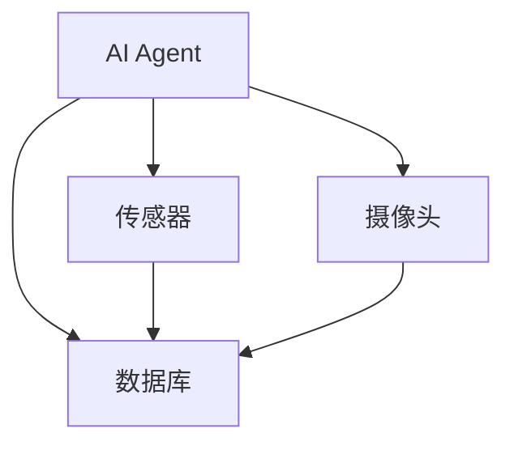
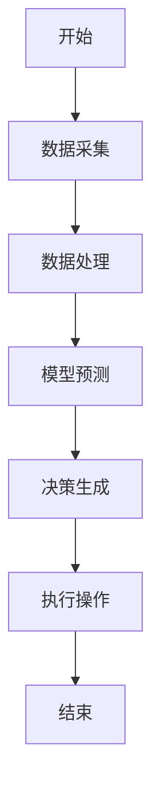
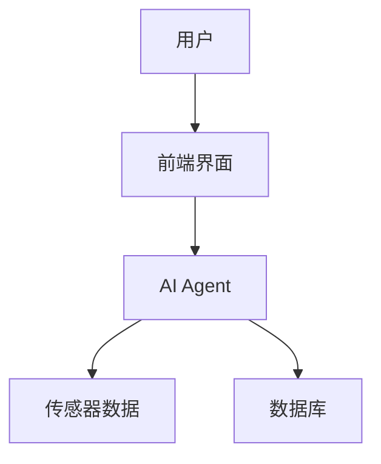
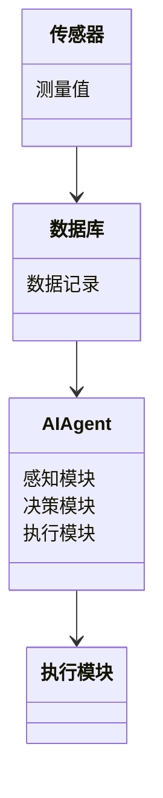
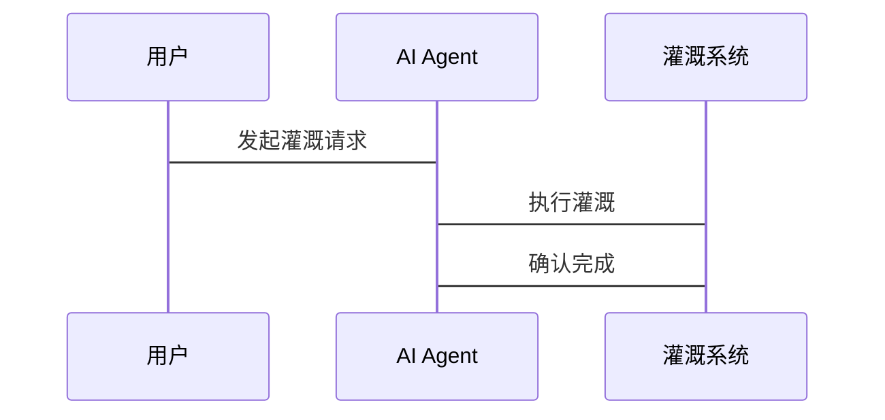

                 


# AI Agent在智能农业中的应用

> **关键词**：AI Agent，智能农业，农业智能化，人工智能，农业机器人，数据驱动农业

> **摘要**：本文探讨AI Agent在智能农业中的应用，分析其在农作物病虫害监测、农业机器人控制和农业数据分析中的作用。通过详细阐述AI Agent的核心概念、算法原理和系统架构，结合实际案例，展示如何利用AI技术提升农业生产力和效率。

---

# 第一部分: AI Agent与智能农业的背景介绍

## 第1章: AI Agent的基本概念与原理

### 1.1 AI Agent的定义与核心概念

#### 1.1.1 什么是AI Agent
AI Agent（人工智能代理）是一种智能系统，能够感知环境、自主决策并执行任务，以实现特定目标。在智能农业中，AI Agent可以用于监测作物生长、优化灌溉系统或控制农业机器人。

#### 1.1.2 AI Agent的核心特征
- **自主性**：能够独立执行任务。
- **反应性**：实时感知环境变化并做出反应。
- **目标导向**：所有行为都围绕实现特定目标展开。
- **学习能力**：通过数据不断优化性能。

#### 1.1.3 AI Agent的分类与应用场景
| 分类方式 | 类型         | 应用场景                              |
|----------|--------------|-------------------------------------|
| 智能水平 | 单智能体、多智能体 | 单智能体用于单点监测，多智能体用于全局管理 |
| 功能     | 监测型、控制型 | 监测型用于数据采集，控制型用于设备操作 |

### 1.2 智能农业的背景与发展

#### 1.2.1 农业智能化的必要性
随着人口增长和资源有限，传统农业面临效率低下、资源浪费等问题。AI Agent的引入可以提高农业生产的精准性和效率。

#### 1.2.2 智能农业的现状与挑战
- **现状**：部分农场已采用传感器和无人机进行监测。
- **挑战**：数据整合困难、AI模型泛化能力不足、设备成本高等。

#### 1.2.3 AI技术在农业中的潜力
AI Agent可以实现精准农业、优化资源利用、提高产量和质量。

---

## 第2章: AI Agent在农业中的应用背景

### 2.1 农业智能化的核心问题

#### 2.1.1 农业生产中的痛点分析
- **资源浪费**：过度灌溉导致水资源浪费。
- **病虫害防治不及时**：传统方法依赖人工经验，效率低。
- **数据孤岛**：各设备数据无法有效整合。

#### 2.1.2 AI Agent如何解决这些问题
AI Agent可以通过实时数据监测、智能决策和自动化执行，减少资源浪费、提高防治效率并整合数据。

#### 2.1.3 AI Agent在农业中的典型应用场景
- **农作物病虫害监测**：通过图像识别技术，AI Agent可以快速识别病虫害并提出防治方案。
- **农业机器人控制**：AI Agent可以控制机器人执行播种、除草等任务。
- **农业数据智能分析**：AI Agent可以整合土壤湿度、气象数据等信息，优化灌溉和施肥策略。

---

# 第二部分: AI Agent的核心概念与原理

## 第3章: AI Agent的核心概念与原理

### 3.1 AI Agent的感知机制

#### 3.1.1 数据采集与处理
AI Agent通过传感器、摄像头等设备采集环境数据，并进行预处理和特征提取。

#### 3.1.2 感知模型的构建
使用机器学习算法（如支持向量机、随机森林）构建感知模型，用于分类和预测。

#### 3.1.3 感知模型的优化
通过交叉验证和超参数调优，提高模型的准确性和鲁棒性。

### 3.2 AI Agent的决策机制

#### 3.2.1 决策算法的选择
根据应用场景选择合适的决策算法，如强化学习（Q-learning）或贪心算法。

#### 3.2.2 决策模型的优化
通过模拟测试和实际数据反馈，不断优化决策模型的性能。

### 3.3 AI Agent的执行机制

#### 3.3.1 执行策略的设计
设计具体的执行策略，如灌溉系统的控制策略。

#### 3.3.2 执行过程的监控
实时监控执行过程，及时调整策略以应对环境变化。

---

## 第4章: AI Agent在农业中的应用模型

### 4.1 农业AI Agent的实体关系模型



### 4.2 农业AI Agent的流程模型



### 4.3 农业AI Agent的系统架构



---

# 第三部分: AI Agent的算法原理与数学模型

## 第5章: AI Agent的算法原理

### 5.1 感知算法

#### 5.1.1 数据预处理算法
- **归一化**：将数据标准化，便于模型训练。
- **降维**：使用PCA等方法减少数据维度。

#### 5.1.2 分类算法
- **随机森林**：用于分类和回归。
- **支持向量机（SVM）**：用于分类任务。

#### 5.1.3 聚类算法
- **K-means**：用于无监督学习，如作物分类。

### 5.2 决策算法

#### 5.2.1 强化学习算法
- **Q-learning**：通过试错学习，优化决策策略。

#### 5.2.2 分子式算法
- **Dijkstra算法**：用于路径规划。

#### 5.2.3 集成学习算法
- **投票法**：结合多个模型的结果，提高准确率。

### 5.3 执行算法

#### 5.3.1 路径规划算法
- **A*算法**：用于机器人路径规划。

#### 5.3.2 自动控制算法
- **PID控制**：用于灌溉系统的自动控制。

---

## 第6章: AI Agent的数学模型

### 6.1 感知模型的数学表达

#### 6.1.1 分类模型
$$ P(y|x) = \frac{e^{w \cdot x + b}}{\sum_j e^{w_j \cdot x + b_j}} $$
其中，$w$ 是权重向量，$x$ 是输入特征，$b$ 是偏置。

#### 6.1.2 聚类模型
$$ \text{目标函数} = \sum_{i=1}^{n} \sum_{j=1}^{k} w_{i,j} \cdot d(i,j) $$
其中，$w_{i,j}$ 是聚类权重，$d(i,j)$ 是距离度量。

### 6.2 决策模型的数学表达

#### 6.2.1 强化学习模型
$$ Q(s, a) = r + \gamma \max_a Q(s', a) $$
其中，$s$ 是状态，$a$ 是动作，$\gamma$ 是折扣因子。

#### 6.2.2 分子式算法模型
$$ \text{路径长度} = \sum_{i=1}^{n} d(i, i+1) $$
其中，$d(i, i+1)$ 是第i步到第i+1步的距离。

---

## 第7章: 系统分析与架构设计方案

### 7.1 问题场景介绍

#### 7.1.1 农业生产中的问题
- 病虫害防治不及时。
- 资源浪费。

#### 7.1.2 AI Agent解决方案
通过实时监测和智能决策，实现精准防治和资源优化。

### 7.2 系统功能设计

#### 7.2.1 领域模型


#### 7.2.2 系统架构


#### 7.2.3 系统接口设计
- **传感器接口**：接收环境数据。
- **数据库接口**：存储和检索数据。
- **执行接口**：控制灌溉系统。

#### 7.2.4 系统交互


---

## 第8章: 项目实战

### 8.1 环境安装

#### 8.1.1 安装Python
```bash
python --version
pip install --upgrade pip
```

#### 8.1.2 安装依赖库
```bash
pip install numpy scikit-learn matplotlib
```

### 8.2 核心代码实现

#### 8.2.1 数据采集与处理
```python
import numpy as np
from sklearn import datasets
from sklearn.tree import DecisionTreeClassifier

# 生成示例数据
X = np.array([[2, 3], [5, 8], [1, 2], [7, 9]])
y = np.array([0, 1, 0, 1])

# 训练决策树模型
model = DecisionTreeClassifier()
model.fit(X, y)

# 预测新数据
new_data = np.array([[4, 5]])
print(model.predict(new_data))
```

#### 8.2.2 决策模块实现
```python
import numpy as np
from sklearn import svm

# 训练SVM模型
model = svm.SVC()
model.fit(X, y)

# 预测新数据
print(model.predict(new_data))
```

### 8.3 案例分析

#### 8.3.1 应用场景
- **病虫害监测**：AI Agent通过图像识别技术，识别作物病斑并提出防治建议。
- **灌溉控制**：根据土壤湿度和气象数据，AI Agent自动控制灌溉系统。

#### 8.3.2 实际案例
某农场使用AI Agent监测土壤湿度，优化灌溉策略，节水30%，提高作物产量15%。

### 8.4 项目小结
通过实际案例分析，展示了AI Agent在智能农业中的巨大潜力和实际应用价值。

---

## 第9章: 最佳实践与小结

### 9.1 最佳实践

#### 9.1.1 数据质量管理
确保数据的准确性和完整性，避免数据偏差。

#### 9.1.2 模型优化
定期更新模型，适应环境变化和新的数据。

#### 9.1.3 安全管理
保护农业数据的安全，防止数据泄露。

### 9.2 小结
AI Agent作为智能农业的核心技术，正在改变传统的农业生产方式，提高效率和可持续性。

### 9.3 注意事项

#### 9.3.1 数据隐私
注意保护农业数据的隐私。

#### 9.3.2 设备维护
定期维护传感器和机器人，确保系统正常运行。

#### 9.3.3 环境适应
AI Agent需要适应不同的环境和气候条件。

### 9.4 拓展阅读

#### 9.4.1 推荐书籍
- 《机器学习实战》
- 《人工智能：一种现代方法》

#### 9.4.2 推荐博客
- [机器学习博客](https://example.com)
- [人工智能博客](https://example.com)

---

通过以上结构和内容，文章详细介绍了AI Agent在智能农业中的应用，从理论到实践，帮助读者全面理解并掌握相关技术。

