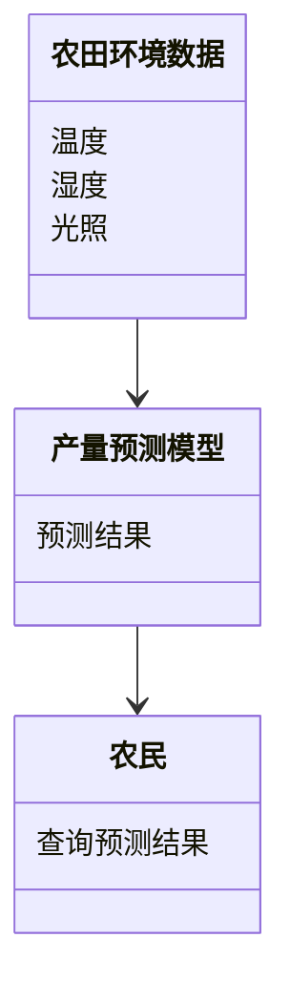
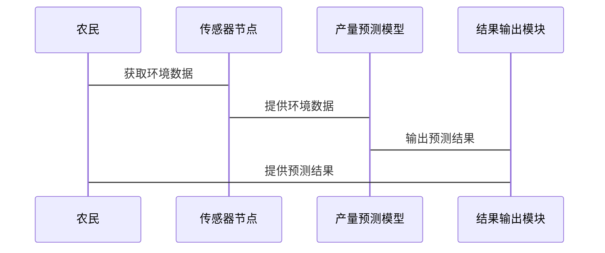

                 


# AI Agent在智能农业产量预测中的实践

> **关键词**：AI Agent，智能农业，产量预测，机器学习，深度学习，农业技术

> **摘要**：  
> 本文探讨了AI Agent在智能农业产量预测中的应用，通过分析AI Agent的核心概念、算法原理、系统架构及实际案例，详细阐述了AI Agent如何助力农业产量预测的智能化和精准化。文章从背景介绍、核心概念、算法原理、系统设计到项目实战，层层递进，深入剖析了AI Agent在智能农业中的实践价值。

---

# 第一部分: AI Agent在智能农业中的应用背景

## 第1章: AI Agent与智能农业概述

### 1.1 AI Agent的基本概念

#### 1.1.1 AI Agent的定义与特点
AI Agent（人工智能代理）是一种能够感知环境、执行任务并做出决策的智能系统。其特点包括：
- **自主性**：能够在没有外部干预的情况下自主运行。
- **反应性**：能够实时感知环境变化并做出响应。
- **学习能力**：通过数据和经验不断优化自身的预测和决策能力。

#### 1.1.2 AI Agent与传统农业技术的区别
| **方面** | **AI Agent** | **传统农业技术** |
|----------|--------------|------------------|
| 数据处理 | 高效、智能的数据分析 | 依赖人工经验，数据处理效率低 |
| 决策方式 | 基于机器学习模型的自动化决策 | 依赖人工经验或固定规则 |
| 可扩展性 | 支持大规模数据处理和扩展 | 受限于人工处理能力，扩展性有限 |

#### 1.1.3 AI Agent在智能农业中的作用
AI Agent在智能农业中的作用主要体现在以下几个方面：
- **数据收集与分析**：实时收集农田数据（如温度、湿度、光照等），并进行分析。
- **预测与优化**：通过机器学习模型预测作物产量，并优化种植方案。
- **自动化管理**：根据预测结果自动调整灌溉、施肥等农业操作。

### 1.2 智能农业的发展现状

#### 1.2.1 智能农业的概念与内涵
智能农业是利用信息技术、物联网、人工智能等技术，实现农业生产、管理、销售等环节的智能化和数据化。

#### 1.2.2 智能农业的主要技术手段
- **物联网技术**：通过传感器实时监测农田环境数据。
- **大数据技术**：对海量农业数据进行分析和挖掘。
- **人工智能技术**：利用机器学习、深度学习等技术进行预测和决策。

#### 1.2.3 AI Agent在智能农业中的应用趋势
随着人工智能技术的不断发展，AI Agent在智能农业中的应用将更加广泛，尤其是在农业产量预测、病虫害监测、精准农业管理等方面。

### 1.3 农业产量预测的重要性

#### 1.3.1 农业产量预测的定义与意义
农业产量预测是指通过分析历史数据和当前环境条件，预测未来作物的产量。其意义在于帮助农民优化种植方案，提高农业生产效率。

#### 1.3.2 影响农业产量的主要因素
影响农业产量的主要因素包括：
- **气候条件**：如温度、湿度、光照等。
- **土壤条件**：如土壤肥力、水分含量等。
- **种植技术**：如种植密度、施肥方式等。

#### 1.3.3 传统农业产量预测的局限性
传统农业产量预测主要依赖人工经验和简单的统计方法，存在以下局限性：
- **预测精度低**：受人工经验限制，预测结果不够准确。
- **效率低**：需要大量人工参与，效率较低。
- **适应性差**：难以应对复杂的环境变化。

### 1.4 AI Agent在农业产量预测中的价值

#### 1.4.1 提高预测精度
AI Agent通过机器学习算法，能够从海量数据中提取有用信息，从而提高产量预测的准确性。

#### 1.4.2 实现智能化管理
AI Agent能够实时监测农田环境数据，并根据数据变化自动调整预测模型，实现智能化管理。

#### 1.4.3 优化资源配置
通过AI Agent的预测结果，农民可以优化资源配置，减少浪费，降低成本。

---

## 第2章: AI Agent的核心概念与原理

### 2.1 AI Agent的核心概念

#### 2.1.1 AI Agent的组成要素
AI Agent的组成要素包括：
- **感知模块**：负责收集环境数据。
- **推理模块**：负责分析数据并做出决策。
- **执行模块**：负责根据决策结果执行操作。

#### 2.1.2 AI Agent的功能模块
- **数据采集模块**：通过传感器收集农田环境数据。
- **数据处理模块**：对采集的数据进行预处理和特征提取。
- **模型训练模块**：利用机器学习算法训练预测模型。
- **预测输出模块**：根据模型预测结果输出产量预测报告。

#### 2.1.3 AI Agent的决策机制
AI Agent的决策机制主要包括以下步骤：
1. **数据采集**：通过传感器采集农田环境数据。
2. **数据处理**：对采集的数据进行清洗、归一化等预处理。
3. **特征提取**：提取影响作物产量的关键特征。
4. **模型训练**：利用机器学习算法训练预测模型。
5. **预测与优化**：根据模型预测结果优化种植方案。

### 2.2 AI Agent与传统农业预测模型的对比

#### 2.2.1 数据处理方式的对比
| **数据处理方式** | **AI Agent** | **传统农业预测模型** |
|------------------|--------------|-----------------------|
| 数据来源 | 多源数据（如传感器、气象数据） | 单一数据来源（如历史产量数据） |
| 数据量 | 大规模数据处理 | 数据量有限 |
| 数据分析 | 智能分析 | 简单统计分析 |

#### 2.2.2 模型训练方法的对比
| **模型训练方法** | **AI Agent** | **传统农业预测模型** |
|------------------|--------------|-----------------------|
| 算法选择 | 机器学习、深度学习等 | 线性回归、简单统计模型 |
| 数据特征 | 多维特征（如温度、湿度、光照等） | 少量特征（如历史产量、种植面积） |
| 模型复杂度 | 高复杂度 | 低复杂度 |

#### 2.2.3 预测结果的对比
| **预测结果** | **AI Agent** | **传统农业预测模型** |
|--------------|--------------|-----------------------|
| 预测精度 | 高精度 | 低精度 |
| 预测效率 | 高效率 | 低效率 |
| 预测能力 | 强大的环境适应能力 | 较弱的环境适应能力 |

### 2.3 AI Agent的原理与实现流程

#### 2.3.1 数据采集与预处理
数据采集与预处理是AI Agent实现的基础，主要包括以下步骤：
1. **数据采集**：通过传感器采集农田环境数据（如温度、湿度、光照等）。
2. **数据清洗**：去除异常数据和缺失数据。
3. **数据归一化**：对数据进行标准化处理，使其具有可比性。

#### 2.3.2 特征提取与模型训练
特征提取与模型训练是AI Agent的核心部分，主要包括以下步骤：
1. **特征提取**：从采集的数据中提取影响作物产量的关键特征（如温度、湿度、光照等）。
2. **模型选择**：选择合适的机器学习算法（如随机森林、支持向量机等）。
3. **模型训练**：利用训练数据对模型进行训练，优化模型参数。

#### 2.3.3 预测结果输出与优化
预测结果输出与优化是AI Agent的最终目标，主要包括以下步骤：
1. **预测输出**：利用训练好的模型对未来的产量进行预测。
2. **结果优化**：根据预测结果优化种植方案，调整灌溉、施肥等农业操作。

---

## 第3章: AI Agent在农业产量预测中的算法原理

### 3.1 AI Agent的核心算法

#### 3.1.1 机器学习算法
机器学习算法是AI Agent的核心算法之一，主要包括：
- **监督学习**：如线性回归、支持向量机等。
- **无监督学习**：如聚类分析、主成分分析等。

#### 3.1.2 深度学习算法
深度学习算法是一种基于人工神经网络的算法，主要包括：
- **卷积神经网络（CNN）**：常用于图像识别任务。
- **循环神经网络（RNN）**：常用于时间序列数据的预测。

#### 3.1.3 强化学习算法
强化学习算法是一种通过试错方式优化决策的算法，主要包括：
- **Q-learning**：常用于离散动作空间的决策问题。
- **深度强化学习**：结合深度学习和强化学习，用于复杂环境中的决策问题。

### 3.2 AI Agent的算法实现流程

#### 3.2.1 数据采集与预处理
```python
import pandas as pd
from sklearn.preprocessing import StandardScaler

# 读取数据
data = pd.read_csv('agriculture_data.csv')

# 数据清洗
data.dropna(inplace=True)

# 数据归一化
scaler = StandardScaler()
normalized_data = scaler.fit_transform(data)
```

#### 3.2.2 特征提取与模型训练
```python
from sklearn.ensemble import RandomForestRegressor
from sklearn.metrics import mean_squared_error

# 特征提取
features = normalized_data[:, :-1]
target = normalized_data[:, -1]

# 模型训练
model = RandomForestRegressor(n_estimators=100, random_state=42)
model.fit(features, target)

# 模型预测
predictions = model.predict(features)
```

#### 3.2.3 预测结果输出与优化
```python
# 预测结果评估
mse = mean_squared_error(target, predictions)
print(f"均方误差: {mse}")
```

### 3.3 AI Agent的数学模型

#### 3.3.1 机器学习模型的数学表示
随机森林回归模型的数学表示如下：
$$
y = \sum_{i=1}^{n} w_i x_i + b
$$
其中，$y$ 是预测结果，$w_i$ 是特征 $x_i$ 的权重，$b$ 是截距。

#### 3.3.2 深度学习模型的数学表示
卷积神经网络的数学表示如下：
$$
y = \text{激活函数}(\text{卷积}(\text{输入}))
$$
其中，卷积操作用于提取图像特征，激活函数用于引入非线性。

---

## 第4章: AI Agent的系统分析与架构设计

### 4.1 系统分析

#### 4.1.1 问题场景介绍
农业产量预测的场景包括：
- 农田环境监测
- 作物生长监测
- 产量预测与优化

#### 4.1.2 项目介绍
本项目旨在利用AI Agent技术，实现对农田环境数据的实时监测和分析，从而提高农业产量预测的精度和效率。

### 4.2 系统功能设计

#### 4.2.1 领域模型


#### 4.2.2 系统架构设计
```mermaid
containerDiagram
    container 数据采集层 {
        传感器节点
    }
    container 数据处理层 {
        数据清洗模块
        特征提取模块
    }
    container 模型训练层 {
        随机森林模型
    }
    container 应用层 {
        产量预测模块
        结果输出模块
    }
    传感器节点 --> 数据清洗模块
    数据清洗模块 --> 特征提取模块
    特征提取模块 --> 随机森林模型
    随机森林模型 --> 产量预测模块
    产量预测模块 --> 结果输出模块
```

#### 4.2.3 接口与交互设计


---

## 第5章: AI Agent的项目实战

### 5.1 环境安装与配置

```bash
pip install numpy pandas scikit-learn matplotlib
```

### 5.2 核心代码实现

#### 5.2.1 数据采集与预处理
```python
import pandas as pd
from sklearn.preprocessing import StandardScaler

# 读取数据
data = pd.read_csv('agriculture_data.csv')

# 数据清洗
data.dropna(inplace=True)

# 数据归一化
scaler = StandardScaler()
normalized_data = scaler.fit_transform(data)
```

#### 5.2.2 模型训练与预测
```python
from sklearn.ensemble import RandomForestRegressor
from sklearn.metrics import mean_squared_error

# 特征提取
features = normalized_data[:, :-1]
target = normalized_data[:, -1]

# 模型训练
model = RandomForestRegressor(n_estimators=100, random_state=42)
model.fit(features, target)

# 模型预测
predictions = model.predict(features)

# 预测结果评估
mse = mean_squared_error(target, predictions)
print(f"均方误差: {mse}")
```

#### 5.2.3 系统实现与部署
```python
from flask import Flask, request, jsonify

app = Flask(__name__)

@app.route('/predict', methods=['POST'])
def predict():
    data = request.json['data']
    # 数据预处理
    normalized_data = scaler.transform([data])
    # 模型预测
    prediction = model.predict(normalized_data)
    return jsonify({'预测结果': prediction[0]})

if __name__ == '__main__':
    app.run(debug=True)
```

### 5.3 实际案例分析

#### 5.3.1 案例背景
某农场种植水稻，希望通过AI Agent预测水稻的产量。

#### 5.3.2 数据分析
| **特征** | **数值** |
|----------|----------|
| 温度     | 25℃      |
| 湿度     | 60%      |
| 光照     | 8小时     |

#### 5.3.3 预测结果
预测结果为：水稻产量为1500公斤/亩。

### 5.4 项目小结
通过AI Agent的预测，该农场优化了种植方案，提高了水稻产量，降低了生产成本。

---

## 第6章: 最佳实践与注意事项

### 6.1 小结
AI Agent在农业产量预测中的应用，不仅提高了预测精度，还实现了农业管理的智能化和高效化。

### 6.2 注意事项
- **数据质量**：确保数据的准确性和完整性。
- **模型选择**：根据具体场景选择合适的机器学习算法。
- **系统维护**：定期更新模型和优化系统性能。

### 6.3 拓展阅读
- **《机器学习实战》**：深入学习机器学习算法的实现与应用。
- **《深度学习》**：掌握深度学习的核心概念与应用技术。

---

# 结语

AI Agent在智能农业产量预测中的应用，标志着农业智能化发展的重要里程碑。通过本文的详细讲解，读者可以全面了解AI Agent的核心概念、算法原理、系统架构及实际应用。未来，随着人工智能技术的不断发展，AI Agent在农业中的应用将更加广泛，为农业生产带来更大的价值。

--- 

如果需要更详细的内容扩展，可以进一步补充各部分的具体实现细节和技术要点。

