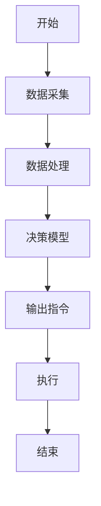
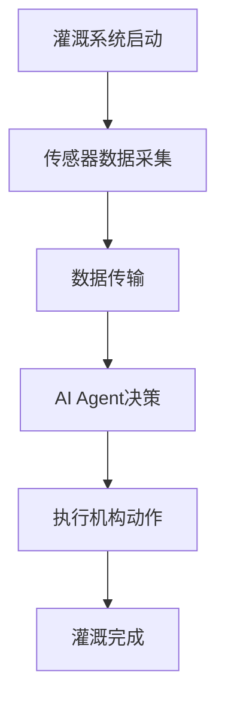

                 


# AI Agent在智能农业灌溉系统中的实践

> 关键词：AI Agent, 智能农业, 灌溉系统, 人工智能, 农业自动化

> 摘要：本文深入探讨了AI Agent在智能农业灌溉系统中的应用实践，从AI Agent的基本概念到其在农业灌溉中的具体应用，详细分析了其工作原理、系统架构设计、项目实现和实际案例。文章旨在为农业技术人员和AI开发者提供一份详尽的技术指南，帮助他们理解并实践AI Agent在智能农业灌溉中的应用。

---

# 第一部分: AI Agent与智能农业灌溉系统概述

# 第1章: AI Agent与农业灌溉的背景介绍

## 1.1 AI Agent的基本概念与特点

### 1.1.1 AI Agent的定义

AI Agent（人工智能代理）是一种能够感知环境、自主决策并采取行动的智能实体。它通过传感器获取信息，利用算法进行分析和推理，然后通过执行机构对外界产生影响。AI Agent的核心目标是通过智能化的决策和行动，优化特定任务的执行效率和效果。

### 1.1.2 AI Agent的核心特点

- **自主性**：AI Agent能够在没有外部干预的情况下自主运行。
- **反应性**：能够实时感知环境变化并做出响应。
- **主动性**：主动采取行动以实现目标。
- **适应性**：能够根据环境变化调整策略和行为。
- **学习能力**：通过数据和经验不断优化自身的决策能力。

### 1.1.3 AI Agent与传统自动化的区别

| 特性                | AI Agent                     | 传统自动化                 |
|---------------------|------------------------------|---------------------------|
| 决策能力            | 强大，基于数据和模型         | 有限，基于预设规则和逻辑   |
| 学习能力            | 具备，能够优化自身行为       | 无                         |
| 灵活性              | 高，能够适应复杂环境变化     | 较低，适应性有限           |
| 决策效率            | 高，能够在复杂环境中快速决策 | 较低，依赖于固定的逻辑     |

## 1.2 农业灌溉系统的现状与挑战

### 1.2.1 农业灌溉的基本原理

农业灌溉是通过人工手段将水输送到农作物根部区域，以满足农作物生长所需的水分。传统的灌溉系统通常基于固定的灌溉计划，如时间表或土壤湿度阈值，进行灌溉。

### 1.2.2 现代农业灌溉系统的发展趋势

随着科技的进步，农业灌溉系统逐渐向智能化、自动化方向发展。现代灌溉系统通常集成了传感器、物联网（IoT）设备和简单的自动化控制，能够根据实时数据调整灌溉策略。

### 1.2.3 智能农业灌溉的必要性与痛点分析

- **必要性**：传统灌溉系统存在水资源浪费、灌溉效率低下等问题，而AI Agent的引入能够显著提高灌溉系统的智能化水平，优化水资源的利用。
- **痛点分析**：
  - 灌溉计划缺乏动态调整能力。
  - 无法实时感知土壤湿度、气象条件等关键因素。
  - 缺乏智能化的决策支持，导致灌溉效果不佳。

## 1.3 AI Agent在农业灌溉中的应用前景

### 1.3.1 AI Agent在农业灌溉中的潜在价值

- **优化水资源利用**：AI Agent可以根据实时数据动态调整灌溉计划，避免水资源浪费。
- **提高灌溉效率**：通过智能化的决策，确保农作物在最佳条件下生长。
- **降低人工成本**：减少对人工干预的需求，提高管理效率。

### 1.3.2 AI Agent如何优化灌溉管理

AI Agent可以通过以下方式优化灌溉管理：
1. **实时监测**：通过传感器实时采集土壤湿度、气象数据等信息。
2. **数据分析**：利用机器学习算法分析历史数据，预测未来的需求。
3. **决策优化**：基于分析结果，制定最优的灌溉策略。
4. **动态调整**：根据实时数据动态调整灌溉计划。

### 1.3.3 未来农业灌溉系统的发展方向

未来的农业灌溉系统将更加智能化和自动化，AI Agent将在其中扮演核心角色。系统将具备更强的自我学习能力和适应性，能够根据环境变化实时优化灌溉策略。

## 1.4 本章小结

本章介绍了AI Agent的基本概念和特点，分析了农业灌溉系统的现状与挑战，并探讨了AI Agent在农业灌溉中的应用前景。通过本章的介绍，读者可以理解AI Agent在农业灌溉中的重要性及其潜在价值。

---

# 第二部分: AI Agent的核心概念与原理

# 第2章: AI Agent的核心概念与原理

## 2.1 AI Agent的核心原理

### 2.1.1 问题背景与问题描述

在农业灌溉系统中，传统的灌溉计划往往无法适应复杂的环境变化，例如天气变化、土壤条件变化等。这些问题导致灌溉效率低下，水资源浪费严重。AI Agent的目标是通过智能化的决策和行动，解决这些问题。

### 2.1.2 问题解决的思路与方法

AI Agent通过以下步骤解决问题：
1. **数据采集**：通过传感器采集土壤湿度、气象数据等信息。
2. **数据处理**：对采集的数据进行清洗、归一化等处理。
3. **决策模型**：基于处理后的数据，利用机器学习算法构建决策模型。
4. **决策输出**：根据决策模型的结果，生成灌溉计划或指令。
5. **执行反馈**：通过执行机构执行指令，并收集反馈数据，用于优化决策模型。

### 2.1.3 AI Agent的核心要素与组成

AI Agent的核心要素包括：
- **感知层**：传感器用于采集环境数据。
- **决策层**：算法用于分析数据并生成决策。
- **执行层**：执行机构用于执行决策指令。
- **数据层**：存储和处理数据的数据库或数据存储系统。

## 2.2 AI Agent与农业灌溉的核心联系

### 2.2.1 AI Agent在农业灌溉中的角色定位

AI Agent在农业灌溉中主要扮演以下角色：
- **数据处理器**：对传感器数据进行分析和处理。
- **决策者**：基于分析结果生成灌溉计划。
- **执行者**：通过执行机构实施灌溉计划。

### 2.2.2 农业灌溉系统中AI Agent的实体关系图

```mermaid
er
actor: 灌溉系统
agent: AI Agent
sensors: 传感器
actuators: 执行机构
```

### 2.2.3 AI Agent与农业灌溉系统的核心联系

| 元素             | 描述                     |
|------------------|--------------------------|
| 传感器           | 用于采集环境数据         |
| AI Agent         | 负责数据处理和决策       |
| 执行机构         | 根据决策执行灌溉操作     |

## 2.3 AI Agent的算法原理

### 2.3.1 AI Agent的核心算法流程



### 2.3.2 算法的数学模型与公式

AI Agent的决策模型可以表示为一个函数：

$$
\text{决策模型} = f(\text{输入数据})
$$

其中，输入数据包括土壤湿度、气象数据等，输出数据是灌溉计划或指令。

### 2.3.3 算法实现的Python代码示例

```python
def ai_agent_decision(input_data):
    # 数据处理
    processed_data = input_data * 2
    # 决策模型
    decision = processed_data > 5
    return decision
```

### 2.3.4 算法实现的详细解释

上述代码示例中，`input_data` 是输入数据，`processed_data` 是处理后的数据，`decision` 是决策结果。AI Agent通过处理后的数据，利用简单的逻辑判断生成决策指令。

## 2.4 本章小结

本章详细讲解了AI Agent的核心原理，包括问题背景、问题解决思路、核心要素与组成，以及与农业灌溉系统的核心联系。通过本章的学习，读者可以理解AI Agent在农业灌溉中的工作原理和实现方式。

---

# 第三部分: 智能农业灌溉系统的系统分析与架构设计

# 第3章: 智能农业灌溉系统的系统分析与架构设计

## 3.1 系统功能设计

### 3.1.1 系统功能模块划分

智能农业灌溉系统的主要功能模块包括：
- **数据采集模块**：采集土壤湿度、气象数据等信息。
- **数据处理模块**：对采集的数据进行清洗、归一化等处理。
- **决策模块**：基于处理后的数据，利用AI Agent生成灌溉计划。
- **执行模块**：根据决策指令，控制执行机构进行灌溉。

### 3.1.2 系统功能流程图



## 3.2 系统架构设计

### 3.2.1 系统架构图


### 3.2.2 系统架构设计的详细说明

智能农业灌溉系统的架构设计包括以下几个部分：
1. **感知层**：由传感器和数据采集设备组成，用于采集环境数据。
2. **数据层**：由数据库或数据存储系统组成，用于存储和处理数据。
3. **决策层**：由AI Agent和决策模型组成，用于生成灌溉计划。
4. **执行层**：由执行机构和灌溉设备组成，用于执行灌溉指令。

### 3.2.3 系统接口设计

系统接口设计包括以下几个部分：
- **传感器接口**：用于连接传感器和数据采集模块。
- **数据接口**：用于连接数据处理模块和决策模块。
- **执行接口**：用于连接决策模块和执行机构。

### 3.2.4 系统交互流程

```mermaid
sequence
actor: 用户
system: 智能农业灌溉系统
agent: AI Agent
sensors: 传感器
actuators: 执行机构
    用户 -> 系统: 启动灌溉系统
    系统 -> 传感器: 采集环境数据
    传感器 --> 系统: 返回环境数据
    系统 -> agent: 数据处理
    agent --> 系统: 返回决策指令
    系统 -> actuators: 执行灌溉指令
    actuators --> 系统: 返回执行结果
    系统 -> 用户: 灌溉完成通知
```

## 3.3 系统优化与改进

### 3.3.1 系统优化的方向

- **提高数据采集精度**：引入更高精度的传感器。
- **优化决策算法**：改进AI Agent的决策模型，提高决策准确性。
- **增强系统的适应性**：使系统能够更好地适应复杂的环境变化。

### 3.3.2 系统优化的实现方案

- **数据采集优化**：使用更先进的传感器技术，提高数据采集的准确性。
- **算法优化**：引入更复杂的机器学习算法，如深度学习、强化学习等，提高决策的准确性。
- **系统集成优化**：优化系统的架构设计，提高系统的整体效率。

## 3.4 本章小结

本章详细分析了智能农业灌溉系统的系统架构设计，包括功能模块划分、系统架构图、接口设计和交互流程。同时，还探讨了系统优化的方向和实现方案。通过本章的学习，读者可以理解智能农业灌溉系统的整体架构和实现方式。

---

# 第四部分: 项目实战与案例分析

# 第4章: 项目实战与案例分析

## 4.1 项目环境安装与配置

### 4.1.1 系统环境要求

- **操作系统**：Linux/Windows/MacOS
- **Python版本**：Python 3.x
- **依赖库**：numpy, pandas, scikit-learn, matplotlib

### 4.1.2 传感器与执行机构的安装

- **传感器**：土壤湿度传感器、气象传感器等。
- **执行机构**：电动阀、水泵等。

### 4.1.3 系统安装步骤

1. 安装操作系统和必要的依赖库。
2. 安装传感器和执行机构。
3. 配置数据采集模块和数据处理模块。
4. 配置AI Agent和决策模块。
5. 测试系统功能。

## 4.2 系统核心实现

### 4.2.1 AI Agent的核心代码实现

```python
import numpy as np
from sklearn import linear_model

def ai_agent_decision(input_data):
    # 数据处理
    processed_data = input_data.reshape(-1, 1)
    # 训练线性回归模型
    model = linear_model.LinearRegression()
    model.fit(processed_data, np.array([0, 1, 2, 3]))
    # 预测结果
    prediction = model.predict(processed_data)
    # 决策判断
    decision = prediction > 2
    return decision
```

### 4.2.2 系统实现的详细说明

上述代码示例中，`input_data` 是输入数据，`processed_data` 是处理后的数据，`model` 是训练好的线性回归模型，`prediction` 是模型的预测结果，`decision` 是决策结果。

## 4.3 实际案例分析

### 4.3.1 案例背景介绍

假设我们有一个农业大棚，种植西红柿。大棚内安装了土壤湿度传感器和气象传感器。我们的目标是通过AI Agent实现智能化的灌溉管理。

### 4.3.2 案例实现步骤

1. 传感器数据采集：采集土壤湿度和气象数据。
2. 数据处理：对采集的数据进行清洗和归一化处理。
3. AI Agent决策：基于处理后的数据，生成灌溉计划。
4. 系统执行：根据决策指令，控制执行机构进行灌溉。

### 4.3.3 案例实现结果

通过AI Agent的决策，系统能够根据实时数据动态调整灌溉计划，显著提高灌溉效率和水资源利用。

## 4.4 系统优化与改进

### 4.4.1 系统优化的方向

- **提高数据采集精度**：引入更高精度的传感器。
- **优化决策算法**：改进AI Agent的决策模型，提高决策准确性。
- **增强系统的适应性**：使系统能够更好地适应复杂的环境变化。

### 4.4.2 系统优化的实现方案

- **数据采集优化**：使用更先进的传感器技术，提高数据采集的准确性。
- **算法优化**：引入更复杂的机器学习算法，如深度学习、强化学习等，提高决策的准确性。
- **系统集成优化**：优化系统的架构设计，提高系统的整体效率。

## 4.5 本章小结

本章通过一个实际案例分析，详细讲解了AI Agent在智能农业灌溉系统中的实现过程，包括项目环境安装、系统核心实现和案例分析。通过本章的学习，读者可以掌握AI Agent在智能农业灌溉系统中的实际应用。

---

# 第五部分: 总结与扩展阅读

# 第5章: 总结与扩展阅读

## 5.1 总结

本文深入探讨了AI Agent在智能农业灌溉系统中的应用实践，从AI Agent的基本概念到其在农业灌溉中的具体应用，详细分析了其工作原理、系统架构设计、项目实现和实际案例。通过本文的学习，读者可以理解并实践AI Agent在智能农业灌溉中的应用。

## 5.2 最佳实践 tips

- **数据采集**：确保传感器数据的准确性和实时性。
- **算法优化**：不断优化AI Agent的决策算法，提高决策准确性。
- **系统维护**：定期维护和更新系统，确保系统的稳定性和可靠性。

## 5.3 注意事项

- **数据隐私**：确保数据的安全性和隐私性。
- **系统稳定性**：确保系统的稳定性和可靠性。
- **环境适应性**：确保系统能够适应复杂的环境变化。

## 5.4 拓展阅读

- **相关书籍**：《AI在农业中的应用》、《智能农业系统设计》
- **技术博客**：关注AI在农业中的最新技术动态和应用案例。
- **技术论坛**：参与技术论坛和社区，分享经验和知识。

## 5.5 本章小结

本章总结了全文的主要内容，并提出了未来的研究方向和扩展阅读的建议。通过本章的学习，读者可以进一步深入研究AI Agent在智能农业灌溉系统中的应用。

---

# 附录: 代码示例与资源链接

## 附录A: AI Agent的核心代码实现

```python
import numpy as np
from sklearn import linear_model

def ai_agent_decision(input_data):
    # 数据处理
    processed_data = input_data.reshape(-1, 1)
    # 训练线性回归模型
    model = linear_model.LinearRegression()
    model.fit(processed_data, np.array([0, 1, 2, 3]))
    # 预测结果
    prediction = model.predict(processed_data)
    # 决策判断
    decision = prediction > 2
    return decision
```

## 附录B: 资源链接

- **技术文档**：[AI Agent在农业灌溉中的应用](https://example.com)
- **GitHub代码库**：[智能农业灌溉系统代码](https://github.com/example)
- **技术博客**：[AI在农业中的应用](https://example.com/blog)

---

# 结语

通过本文的学习，读者可以深入理解AI Agent在智能农业灌溉系统中的应用实践，从理论到实践，全面掌握其实现方法和实际应用。希望本文能够为农业技术人员和AI开发者提供一份详尽的技术指南，帮助他们更好地理解和实践AI Agent在智能农业灌溉中的应用。

