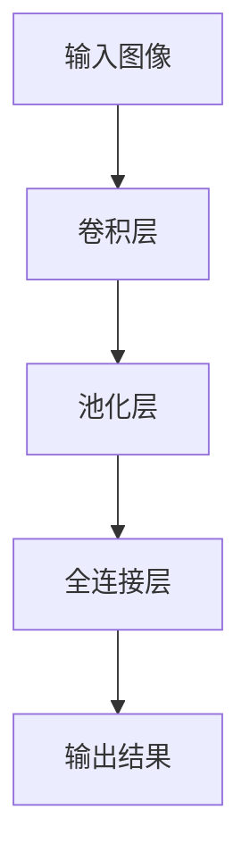
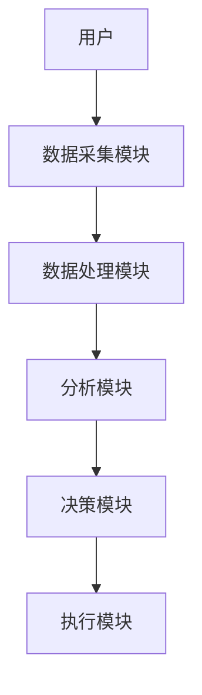

                 


# AI Agent在智能农业病虫害防控中的实践

> 关键词：AI Agent，智能农业，病虫害防控，卷积神经网络，图像识别，系统架构

> 摘要：本文探讨AI Agent在智能农业病虫害防控中的应用，从核心概念到算法原理，再到系统设计与项目实战，全面解析其在农业病虫害防控中的实践价值。通过具体案例分析，展示AI Agent如何提升病虫害识别的准确性和效率，为智能农业的发展提供新的思路。

---

# 第1章: AI Agent与智能农业概述

## 1.1 AI Agent的基本概念

### 1.1.1 AI Agent的定义与特点
AI Agent（人工智能代理）是指能够感知环境、自主决策并执行任务的智能实体。它具备以下几个关键特点：
- **自主性**：能够在没有外部干预的情况下独立运作。
- **反应性**：能够实时感知环境变化并做出响应。
- **目标导向**：基于目标或任务驱动行为。
- **学习能力**：通过数据和经验不断优化自身的性能。

### 1.1.2 AI Agent的核心要素与功能
AI Agent的核心功能包括：
1. **感知**：通过传感器、摄像头等设备获取环境数据。
2. **推理与决策**：基于感知数据进行分析和推理，制定最优决策。
3. **执行**：根据决策结果执行相应的操作，如喷洒农药、调整灌溉等。

### 1.1.3 AI Agent与传统方法的区别
传统的病虫害防控方法主要依赖人工观察和经验判断，效率低且容易受到主观因素的影响。而AI Agent能够通过大数据分析和机器学习算法，快速识别病虫害并制定最优防控策略，显著提高了防控的准确性和效率。

## 1.2 智能农业的发展现状

### 1.2.1 智能农业的定义与内涵
智能农业是指利用现代信息技术（如物联网、大数据、人工智能等）对农业生产进行智能化管理，以提高农业生产效率、降低成本、减少资源浪费。

### 1.2.2 智能农业的主要技术与应用领域
智能农业的主要技术包括：
- 物联网（IoT）：用于实时监测农田环境数据。
- 大数据：用于分析和预测农业生产趋势。
- 人工智能：用于优化农业生产流程和病虫害防控。

### 1.2.3 病虫害防控在智能农业中的重要性
病虫害是影响农业生产的主要因素之一，传统的病虫害防控方法效率低下，容易错过最佳防控时期。通过AI Agent实现智能化病虫害防控，可以显著提高防控效率，减少农业损失。

## 1.3 病虫害防控的传统方法与挑战

### 1.3.1 传统方法的流程与特点
传统的病虫害防控方法主要包括：
1. **人工观察**：通过肉眼观察作物叶片或果实，判断是否存在病虫害。
2. **化学防治**：发现病虫害后，喷洒农药进行防控。
3. **定期监测**：通过定期检查农田环境，预测病虫害的发生趋势。

### 1.3.2 传统方法的局限性与不足
- **效率低**：人工观察耗时耗力，容易遗漏病虫害的早期症状。
- **成本高**：需要大量的人力和物力投入。
- **精度低**：受主观因素影响，判断不够准确。

### 1.3.3 智能化病虫害防控的需求与趋势
随着人工智能技术的快速发展，智能化病虫害防控成为农业智能化发展的必然趋势。通过AI Agent实现智能化病虫害识别和防控，可以显著提高防控效率和准确性。

## 1.4 本章小结
本章介绍了AI Agent的基本概念、智能农业的发展现状以及病虫害防控的传统方法与挑战。通过对比分析，明确了智能化病虫害防控的需求与趋势。

---

# 第2章: AI Agent在病虫害防控中的核心概念

## 2.1 AI Agent的核心原理

### 2.1.1 感知与数据采集
AI Agent通过多种传感器（如摄像头、温湿度传感器等）采集农田环境数据，包括作物的生长状态、病虫害症状等。

### 2.1.2 数据处理与特征提取
通过图像处理技术对采集的图像数据进行预处理，提取病虫害的特征，如颜色、纹理、形状等。

### 2.1.3 决策与行动
基于提取的特征，AI Agent利用机器学习算法进行分类和预测，制定最优的病虫害防控策略，并通过执行机构（如无人机、喷洒设备等）实施防控。

## 2.2 病虫害防控中的关键要素

### 2.2.1 病虫害识别的特征提取
通过图像处理技术提取病虫害的特征，如颜色、纹理、形状等。

### 2.2.2 数据驱动的决策机制
基于历史数据和实时数据，利用机器学习算法进行预测和决策。

### 2.2.3 多源数据融合与分析
将来自不同传感器的数据进行融合分析，提高病虫害识别的准确性和可靠性。

## 2.3 AI Agent与传统病虫害防控的对比

### 2.3.1 传统方法的流程与特点
传统的病虫害防控方法流程繁琐，效率低，容易受到主观因素的影响。

### 2.3.2 AI Agent的优势与创新
AI Agent通过智能化识别和决策，显著提高了病虫害防控的效率和准确性。

### 2.3.3 两者的对比分析
通过对比分析，明确了AI Agent在病虫害防控中的优势和创新点。

## 2.4 本章小结
本章详细讲解了AI Agent的核心原理和病虫害防控中的关键要素，并通过对比分析，明确了AI Agent在病虫害防控中的优势。

---

# 第3章: AI Agent的算法原理与数学模型

## 3.1 病虫害图像识别的算法选择

### 3.1.1 常见图像识别算法对比
常用的图像识别算法包括支持向量机（SVM）、随机森林（RF）、卷积神经网络（CNN）等。通过对比分析，选择最适合病虫害识别的算法。

### 3.1.2 卷积神经网络（CNN）的应用
CNN是一种常用的图像识别算法，通过多层卷积和池化操作，能够有效提取图像的特征。

### 3.1.3 模型训练与优化策略
通过数据增强、正则化等技术优化模型性能，提高识别准确率。

## 3.2 病虫害识别的数学模型

### 3.2.1 图像处理的数学基础
图像处理的数学基础包括图像的灰度化、二值化、边缘检测等。

### 3.2.2 CNN的数学模型与公式
CNN的数学模型包括卷积层、池化层、全连接层等，具体公式如下：

$$ \text{输出} = \text{输入} \times \text{权重} + \text{偏置} $$

### 3.2.3 模型训练的优化算法
常用的优化算法包括随机梯度下降（SGD）、Adam优化器等。

## 3.3 病虫害识别的算法流程图



## 3.4 本章小结
本章详细讲解了病虫害图像识别的算法选择和数学模型，并通过流程图展示了算法的执行过程。

---

# 第4章: 系统分析与架构设计

## 4.1 系统应用场景与需求分析

### 4.1.1 病虫害防控的典型场景
AI Agent在智能农业中的典型应用场景包括田间实时监测、病虫害早期预警、精准喷洒等。

### 4.1.2 系统功能需求分析
系统需要具备以下功能：
- 数据采集与传输
- 病虫害识别与预警
- 精准喷洒与控制

### 4.1.3 系统性能与稳定性要求
系统需要具备高稳定性、高准确性和高效率，能够实时处理大量数据。

## 4.2 系统功能设计

### 4.2.1 数据采集模块设计
数据采集模块负责采集农田环境数据，包括图像、温湿度、光照等。

### 4.2.2 数据处理与分析模块
数据处理模块负责对采集的数据进行预处理和特征提取，分析模块基于机器学习算法进行病虫害识别。

### 4.2.3 决策与控制模块
决策模块根据分析结果制定防控策略，控制模块负责执行相应的操作，如喷洒农药等。

## 4.3 系统架构设计



## 4.4 系统接口与交互设计

### 4.4.1 数据接口规范
系统需要提供标准的数据接口，支持与其他系统（如物联网平台）进行数据交互。

### 4.4.2 用户界面设计
用户界面需要简洁直观，方便用户进行操作和监控。

### 4.4.3 系统与外部设备的交互
系统需要与外部设备（如无人机、喷洒设备）进行交互，实现精准喷洒。

## 4.5 本章小结
本章详细讲解了系统的应用场景与需求分析，设计了系统的功能模块和架构，并通过交互图展示了系统的运行流程。

---

# 第5章: 项目实战与实现

## 5.1 环境搭建与工具安装

### 5.1.1 开发环境配置
推荐使用Python 3.8及以上版本，安装必要的库（如TensorFlow、Keras、OpenCV等）。

### 5.1.2 数据集准备与预处理
准备病虫害图像数据集，进行图像增强和标注。

### 5.1.3 开发工具安装与配置
安装Jupyter Notebook、PyCharm等开发工具，并配置相应的环境变量。

## 5.2 系统核心实现

### 5.2.1 数据采集与处理代码
```python
import cv2

# 读取图像
img = cv2.imread('leaf.jpg')
# 转换为灰度图
gray = cv2.cvtColor(img, cv2.COLOR_BGR2GRAY)
# 检测边缘
edges = cv2.Canny(gray, 100, 200)
cv2.imwrite('edges.jpg', edges)
```

### 5.2.2 病虫害识别与分类代码
```python
import tensorflow as tf
from tensorflow.keras import layers

# 构建CNN模型
model = tf.keras.Sequential([
    layers.Conv2D(32, (3,3), activation='relu', input_shape=(224, 224, 3)),
    layers.MaxPooling2D((2,2)),
    layers.Conv2D(64, (3,3), activation='relu'),
    layers.MaxPooling2D((2,2)),
    layers.Flatten(),
    layers.Dense(128, activation='relu'),
    layers.Dense(2, activation='softmax')
])

# 编译模型
model.compile(optimizer='adam', loss='sparse_categorical_crossentropy', metrics=['accuracy'])
```

### 5.2.3 精准喷洒与控制代码
```python
# 控制无人机喷洒
def spray农药():
    print("开始喷洒农药")
    # 连接无人机
    drone.connect()
    # 设置喷洒参数
    drone.setSprayParameters()
    # 执行喷洒
    drone.spray()
    # 断开连接
    drone.disconnect()

spray农药()
```

## 5.3 项目实战案例分析

### 5.3.1 案例背景
某农场采用AI Agent进行病虫害防控，通过图像识别技术实时监测作物生长状态。

### 5.3.2 数据分析与结果解读
通过模型识别，发现某区域作物感染病害，系统自动触发喷洒指令。

### 5.3.3 实施效果与经验总结
AI Agent的成功应用显著提高了病虫害防控效率，减少了农业损失。

## 5.4 本章小结
本章通过具体案例展示了AI Agent在病虫害防控中的实际应用，详细讲解了系统的实现过程和效果。

---

# 第6章: 最佳实践与注意事项

## 6.1 最佳实践 tips

### 6.1.1 数据质量管理
确保数据的准确性和完整性，进行数据清洗和标注。

### 6.1.2 模型优化策略
通过数据增强、模型调参等技术优化模型性能。

### 6.1.3 系统维护与更新
定期更新模型和系统软件，确保系统的稳定性和先进性。

## 6.2 小结
AI Agent在智能农业病虫害防控中的应用前景广阔，通过最佳实践可以进一步提升系统的性能和效果。

## 6.3 注意事项

### 6.3.1 数据隐私与安全
确保数据的隐私和安全，避免数据泄露。

### 6.3.2 系统兼容性与扩展性
设计系统时要考虑兼容性和扩展性，方便未来的升级和维护。

### 6.3.3 用户培训与技术支持
对用户进行培训，确保系统的正确使用和维护。

## 6.4 拓展阅读
推荐阅读相关领域的最新论文和技术文档，关注人工智能在农业中的其他应用。

---

# 附录

## 附录 A: 代码实现细节
详细讲解代码实现的每一步，包括数据预处理、模型训练、系统部署等。

## 附录 B: 系统架构图
展示系统的详细架构图，包括各模块之间的交互关系。

## 附录 C: 参考文献
列出文章中引用的所有文献和资料。

---

# 结语

AI Agent在智能农业病虫害防控中的应用是现代农业智能化发展的必然趋势。通过本文的详细讲解，读者可以深入了解AI Agent的核心原理、系统设计和实际应用。未来，随着人工智能技术的不断发展，AI Agent在农业中的应用将更加广泛，为农业的可持续发展提供强有力的技术支持。

