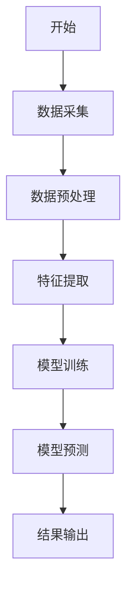
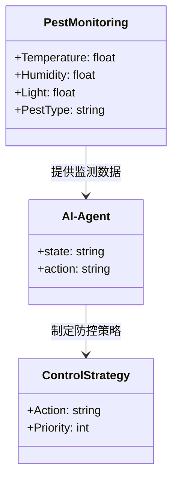
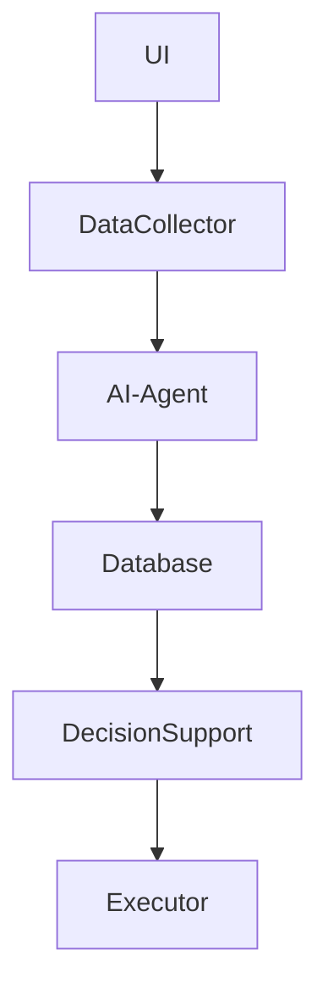
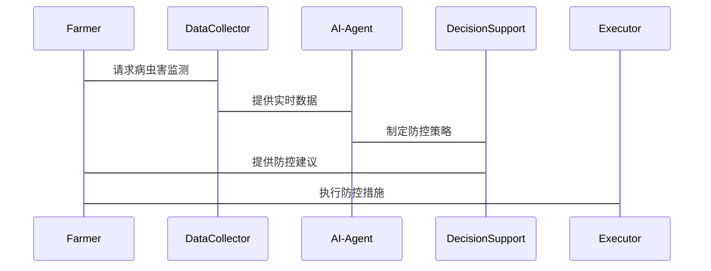

                 


# AI Agent在智能农业病虫害防控中的应用

**关键词**：AI Agent，智能农业，病虫害防控，农业智能化，人工智能技术

**摘要**：  
随着农业智能化的推进，AI Agent（人工智能代理）在病虫害防控中的应用日益重要。本文系统介绍AI Agent的基本概念、核心原理、算法实现、系统架构设计以及在农业病虫害防控中的实际应用。通过详细分析AI Agent在农业病虫害监测、智能决策和精准防控中的作用，探讨其在现代农业中的潜力与挑战，为农业智能化转型提供技术参考。

---

# 第一部分: AI Agent在智能农业病虫害防控中的背景介绍

## 第1章: AI Agent的基本概念与农业应用背景

### 1.1 AI Agent的基本概念

#### 1.1.1 AI Agent的定义
AI Agent（人工智能代理）是指能够感知环境、自主决策并执行任务的智能体。它具备目标导向性、自主性、反应性和社会性等核心特征。

#### 1.1.2 AI Agent的核心特征
- **目标导向性**：AI Agent的行为旨在实现特定目标。
- **自主性**：能够在没有外部干预的情况下独立运作。
- **反应性**：能够实时感知环境变化并做出反应。
- **社会性**：能够与其他系统或人类进行交互协作。

#### 1.1.3 AI Agent与传统农业技术的区别
- 传统农业技术依赖人工操作或固定程序，而AI Agent能够自主学习和优化。
- AI Agent能够实时适应环境变化，传统技术则缺乏灵活性。

### 1.2 农业病虫害防控的现状与挑战

#### 1.2.1 病虫害对农业生产的威胁
病虫害会导致农作物减产、品质下降，严重威胁粮食安全。传统防控方法效率低、成本高，且难以实现精准防治。

#### 1.2.2 传统病虫害防控方法的局限性
- 依赖人工经验，难以快速响应。
- 监测手段单一，缺乏数据支持。
- 防控措施缺乏针对性，浪费资源。

#### 1.2.3 现代农业对智能化防控的需求
现代农业需要高效、精准、低成本的病虫害防控技术。AI Agent能够通过数据驱动的方式，实现病虫害的智能化监测与决策。

### 1.3 AI Agent在病虫害防控中的应用前景

#### 1.3.1 AI Agent在病虫害监测中的潜力
AI Agent可以通过传感器、无人机等设备实时采集病虫害数据，实现精准监测。

#### 1.3.2 AI Agent在精准防控中的优势
AI Agent能够根据病虫害的特征和环境数据，制定个性化防控策略，减少资源浪费。

#### 1.3.3 AI Agent在农业智能化转型中的作用
AI Agent是农业智能化的重要组成部分，能够推动农业从传统模式向数字化、智能化转型。

## 第2章: AI Agent在农业病虫害防控中的问题背景

### 2.1 病虫害防控的主要问题

#### 2.1.1 病虫害监测的实时性与准确性问题
传统病虫害监测手段存在延迟和误差，难以满足现代化农业的需求。

#### 2.1.2 病虫害防控的决策支持问题
缺乏智能化的决策支持系统，导致防控措施不够科学和精准。

#### 2.1.3 病虫害防控的资源优化配置问题
资源分配不合理，导致防控成本高、效果差。

### 2.2 AI Agent在病虫害防控中的问题解决路径

#### 2.2.1 数据驱动的病虫害监测
AI Agent通过实时采集和分析数据，实现病虫害的早期预警和精准监测。

#### 2.2.2 智能决策支持系统
AI Agent能够基于大数据和机器学习模型，提供科学的防控决策。

#### 2.2.3 资源优化配置与协同控制
AI Agent通过优化资源配置，实现病虫害防控的高效协同。

### 2.3 AI Agent在农业病虫害防控中的边界与外延

#### 2.3.1 AI Agent的应用边界
AI Agent的应用范围主要集中在病虫害监测、决策支持和资源优化，但不涉及具体的物理操作。

#### 2.3.2 AI Agent与农业其他技术的协同关系
AI Agent需要与物联网、大数据、区块链等技术协同，形成完整的农业智能化生态系统。

#### 2.3.3 AI Agent在农业生态中的角色定位
AI Agent是农业智能化的核心技术之一，能够提升农业生产的效率和可持续性。

## 第3章: AI Agent的核心概念与联系

### 3.1 AI Agent的核心概念原理

#### 3.1.1 感知模块的作用机制
感知模块通过传感器和数据采集设备，实时采集病虫害相关数据，如温度、湿度、光照等。

#### 3.1.2 决策模块的逻辑推理
决策模块基于感知数据和历史信息，利用机器学习模型进行分析，生成防控策略。

#### 3.1.3 执行模块的行动策略
执行模块根据决策模块的指令，通过自动化设备执行具体的防控措施，如喷洒农药、调节环境等。

### 3.2 核心概念属性特征对比表格

| 概念       | 属性特征               |
|------------|------------------------|
| 感知模块   | 数据采集、特征提取     |
| 决策模块   | 状态分析、策略选择     |
| 执行模块   | 动作规划、效果反馈     |

### 3.3 ER实体关系图架构

```mermaid
erd
  actor: Farmer
  system: AI Agent System
  entity: Pest Data
  entity: Environment Data
  entity: Control Strategy
  
  Farmer --> AI Agent System: 请求病虫害防控
  AI Agent System --> Pest Data: 数据采集
  AI Agent System --> Environment Data: 数据采集
  AI Agent System --> Control Strategy: 智能决策
  Control Strategy --> Farmer: 提供防控建议
```

---

**接下来内容将围绕算法原理、系统架构设计、项目实战等部分展开，具体内容包括：**

- **算法原理讲解**：使用Mermaid流程图和Python代码，详细讲解AI Agent的算法实现。
- **系统分析与架构设计方案**：通过领域模型、系统架构图和交互序列图，展示系统设计。
- **项目实战**：从环境安装到代码实现，结合实际案例分析，展示AI Agent在病虫害防控中的具体应用。
- **总结与展望**：总结AI Agent在农业病虫害防控中的应用成果，并展望未来的发展方向。

---

**第二部分: AI Agent的算法原理与实现**

## 第4章: AI Agent的算法原理

### 4.1 算法实现的核心思路
AI Agent通过感知、决策和执行三个模块，实现病虫害的智能化监测与防控。

### 4.2 基于机器学习的病虫害识别算法

#### 4.2.1 数据预处理与特征提取
```python
import numpy as np
from sklearn.preprocessing import StandardScaler

# 数据预处理示例
X = np.array([[1, 2, 3], [4, 5, 6]])
scaler = StandardScaler()
X_scaled = scaler.fit_transform(X)
```

#### 4.2.2 病虫害识别的分类模型
```python
from sklearn.svm import SVC

# 支持向量机模型
model = SVC()
model.fit(X_scaled, y)
```

#### 4.2.3 算法流程图


### 4.3 基于强化学习的决策优化

#### 4.3.1 强化学习的基本原理
强化学习通过智能体与环境的交互，学习最优策略。其数学模型可以表示为：
$$ Q(s, a) = Q(s, a) + \alpha [r + \max_{a'} Q(s', a') - Q(s, a)] $$

#### 4.3.2 算法实现
```python
import numpy as np

# 强化学习示例代码
class Agent:
    def __init__(self, state_space, action_space):
        self.state_space = state_space
        self.action_space = action_space
        self.Q = np.zeros((state_space, action_space))
    
    def act(self, state, epsilon=0.1):
        if np.random.random() < epsilon:
            return np.random.randint(self.action_space)
        return np.argmax(self.Q[state])
    
    def update(self, state, action, reward, next_state, alpha=0.1):
        self.Q[state, action] += alpha * (reward + np.max(self.Q[next_state]) - self.Q[state, action])
```

---

**第三部分: 系统分析与架构设计**

## 第5章: 系统分析与架构设计方案

### 5.1 系统功能模块设计

#### 5.1.1 数据采集模块
数据采集模块通过传感器和无人机等设备，实时采集病虫害相关数据。

#### 5.1.2 数据分析模块
数据分析模块利用机器学习模型，对采集到的数据进行分析，识别病虫害类型和严重程度。

#### 5.1.3 决策支持模块
决策支持模块根据分析结果，制定防控策略，并优化资源配置。

#### 5.1.4 系统交互模块
系统交互模块为用户提供友好的操作界面，方便用户查看和管理病虫害防控信息。

### 5.2 系统架构设计

#### 5.2.1 领域模型


#### 5.2.2 系统架构图


#### 5.2.3 系统交互序列图


---

**第四部分: 项目实战与应用案例**

## 第6章: 项目实战

### 6.1 环境安装与配置

#### 6.1.1 安装Python环境
使用Anaconda安装Python 3.8及以上版本。

#### 6.1.2 安装依赖库
安装必要的机器学习库，如Scikit-learn、TensorFlow、Mermaid等。

### 6.2 系统核心功能实现

#### 6.2.1 数据采集模块
编写代码实现传感器数据的采集和存储。

#### 6.2.2 数据分析模块
利用机器学习模型进行病虫害识别和分类。

#### 6.2.3 决策支持模块
实现基于强化学习的优化策略。

#### 6.2.4 系统交互模块
开发用户友好的操作界面，支持数据可视化和决策展示。

### 6.3 实际案例分析

#### 6.3.1 病虫害监测案例
通过AI Agent实时监测农田病虫害情况，提前预警。

#### 6.3.2 精准防控案例
根据AI Agent的决策，实施精准的病虫害防控措施，减少资源浪费。

### 6.4 项目总结与经验分享

#### 6.4.1 项目小结
总结项目实施过程中的经验和教训，优化系统设计。

#### 6.4.2 注意事项
提醒读者在实际应用中需要注意的问题，如数据隐私、系统稳定性等。

#### 6.4.3 未来展望
展望AI Agent在农业病虫害防控中的未来发展，探讨更多潜在应用场景。

---

**第五部分: 总结与展望**

## 第7章: 总结与展望

### 7.1 核心观点回顾
AI Agent在农业病虫害防控中的应用前景广阔，能够显著提升农业生产的效率和可持续性。

### 7.2 未来发展方向
- 提高AI Agent的自主性和智能性。
- 推动AI Agent与更多农业技术的协同应用。
- 加强数据安全和隐私保护。

### 7.3 最佳实践Tips

#### 7.3.1 系统设计建议
在设计AI Agent系统时，应注重模块化和可扩展性。

#### 7.3.2 技术选型建议
根据具体需求选择合适的机器学习算法和工具。

#### 7.3.3 实施注意事项
在实际应用中，应充分考虑环境复杂性和数据质量。

---

**结语**  
AI Agent作为农业智能化的重要技术手段，正在改变传统的病虫害防控方式。通过本文的系统介绍和深入分析，读者可以更好地理解AI Agent在农业中的潜力和应用价值。未来，随着技术的不断进步，AI Agent将在农业病虫害防控中发挥更大的作用，为农业可持续发展提供有力支持。

