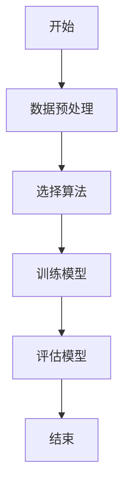
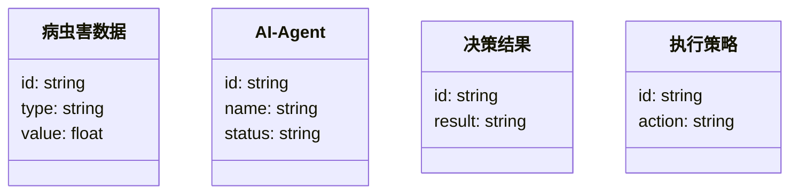
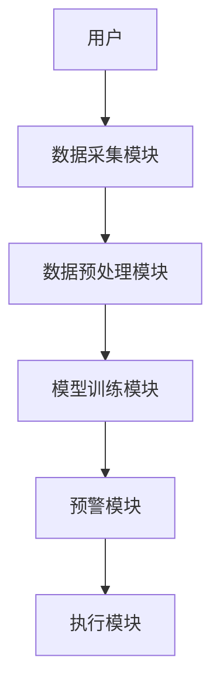

                 


# AI Agent在智能农业病虫害预警中的实践

> 关键词：AI Agent，智能农业，病虫害预警，机器学习，深度学习

> 摘要：本文详细探讨了AI Agent在智能农业病虫害预警中的应用，从背景、核心概念、算法原理到系统架构设计和项目实战，全面解析了如何利用AI Agent技术实现高效的病虫害预警系统。文章内容涵盖理论与实践，旨在为农业智能化提供技术参考。

---

## 第1章 AI Agent与智能农业病虫害预警概述

### 1.1 AI Agent的基本概念
AI Agent（人工智能代理）是一种能够感知环境、做出决策并采取行动的智能体。它具备自主性、反应性、目标导向和社会能力等特征，能够解决复杂问题。

#### 1.1.1 AI Agent的定义
AI Agent是指在计算机系统中，能够根据感知到的环境信息，自主地采取行动以实现目标的实体。

#### 1.1.2 AI Agent的核心特征
- **自主性**：AI Agent能够自主决策，无需外部干预。
- **反应性**：能够实时感知环境变化并做出反应。
- **目标导向**：基于目标采取行动，优化决策。
- **社会能力**：能够与其他系统或人类进行交互协作。

#### 1.1.3 AI Agent与传统算法的区别
AI Agent不仅仅是一个算法，而是一个能够独立运行的系统，具备感知、决策和执行的能力，能够适应复杂动态的环境。

### 1.2 智能农业病虫害预警的现状
病虫害是影响农业生产的主要因素之一，传统的病虫害预警方法存在效率低、成本高等问题。

#### 1.2.1 病虫害预警的传统方法
传统方法主要依赖人工观察和经验判断，存在以下问题：
- 数据采集效率低
- 预测准确性差
- 响应速度慢

#### 1.2.2 智能农业的发展趋势
随着人工智能技术的快速发展，智能农业逐渐成为趋势，AI Agent在其中扮演着重要角色。

#### 1.2.3 AI Agent在农业中的应用潜力
AI Agent可以通过实时数据采集、智能分析和快速响应，显著提升病虫害预警的效率和准确性。

### 1.3 本章小结
本章介绍了AI Agent的基本概念及其在智能农业中的应用潜力，为后续章节奠定了基础。

---

## 第2章 AI Agent的核心原理

### 2.1 AI Agent的感知模块
感知模块负责从环境中获取数据并进行处理。

#### 2.1.1 数据采集与处理
- 数据采集：通过传感器获取农田环境数据，如温度、湿度、光照等。
- 数据预处理：清洗、归一化等处理，确保数据质量。

#### 2.1.2 数据特征提取
提取关键特征，如温度波动、湿度变化等，用于后续分析。

#### 2.1.3 数据分析与模式识别
使用机器学习算法识别病虫害的模式和趋势。

### 2.2 AI Agent的决策模块
决策模块根据感知数据做出预警决策。

#### 2.2.1 决策算法的选择
- 机器学习算法：如随机森林、支持向量机等。
- 深度学习算法：如卷积神经网络（CNN）、循环神经网络（RNN）。

#### 2.2.2 决策逻辑的设计
设计基于风险评估的决策逻辑，确定预警级别。

#### 2.2.3 决策结果的输出
输出预警信息，如病虫害类型、严重程度等。

### 2.3 AI Agent的执行模块
执行模块负责根据决策结果采取相应行动。

#### 2.3.1 执行策略的制定
制定基于预警级别的应对策略，如喷洒农药、调整灌溉等。

#### 2.3.2 执行过程的监控
实时监控执行过程，确保策略得到有效执行。

#### 2.3.3 执行结果的反馈
收集执行结果，更新模型参数，优化后续决策。

### 2.4 AI Agent的核心概念对比表
| 概念         | 特性               | 描述                                         |
|--------------|--------------------|---------------------------------------------|
| 感知模块     | 数据采集与处理     | 从环境中获取数据并进行预处理                 |
| 决策模块     | 算法选择与逻辑     | 根据数据做出决策                             |
| 执行模块     | 策略执行与反馈     | 根据决策执行操作并反馈结果                 |

### 2.5 AI Agent的ER实体关系图
```mermaid
erd
  entity AI-Agent {
    id: string
    name: string
    status: string
    }
  entity 病虫害数据 {
    id: string
    type: string
    value: float
    }
  entity 决策结果 {
    id: string
    result: string
    }
  entity 执行策略 {
    id: string
    action: string
    }
  entity 反馈结果 {
    id: string
    outcome: string
    }
```

### 2.6 本章小结
本章详细讲解了AI Agent的核心原理，包括感知、决策和执行模块的功能与实现。

---

## 第3章 AI Agent的算法原理

### 3.1 机器学习算法
#### 3.1.1 线性回归
$$ y = \beta_0 + \beta_1x + \epsilon $$
用于预测病虫害的发生概率。

#### 3.1.2 支持向量机（SVM）
用于分类病虫害类型，通过构建超平面实现数据分类。

### 3.2 深度学习算法
#### 3.2.1 卷积神经网络（CNN）
用于图像识别，识别病虫害的形态特征。

#### 3.2.2 循环神经网络（RNN）
用于时间序列分析，预测病虫害的发生趋势。

### 3.3 算法流程图


### 3.4 本章小结
本章介绍了AI Agent中常用的机器学习和深度学习算法，并通过流程图展示了算法的整体流程。

---

## 第4章 系统分析与架构设计

### 4.1 问题场景介绍
农田环境复杂，需要实时监测病虫害的发生。

### 4.2 系统功能设计
- 数据采集模块：实时采集环境数据。
- 数据分析模块：分析数据并识别病虫害。
- 预警模块：发出预警信号。

### 4.3 领域模型类图


### 4.4 系统架构设计


### 4.5 系统接口设计
- 数据接口：传感器数据的输入和输出。
- 预警接口：向用户或系统发出预警信号。

### 4.6 本章小结
本章分析了系统的需求并设计了相应的架构，为后续的实现提供了指导。

---

## 第5章 项目实战

### 5.1 环境安装
- 安装Python、TensorFlow、Keras等工具。

### 5.2 核心代码实现
```python
# 数据预处理
import pandas as pd
data = pd.read_csv('data.csv')
data_preprocessed = data.dropna()

# 模型训练
from sklearn.linear_model import LinearRegression
model = LinearRegression()
model.fit(X_train, y_train)

# 预警模块
def predict_disease():
    prediction = model.predict(X_test)
    return prediction
```

### 5.3 案例分析
分析某农田的数据，预测病虫害的发生并制定应对策略。

### 5.4 本章小结
本章通过实际案例展示了AI Agent在病虫害预警中的应用，验证了理论的可行性。

---

## 第6章 总结与展望

### 6.1 项目总结
AI Agent在病虫害预警中的应用显著提高了预警的效率和准确性。

### 6.2 未来展望
未来，AI Agent在农业中的应用将更加广泛，如精准农业、智能灌溉等领域。

### 6.3 最佳实践
- 数据质量是关键，确保数据的准确性和完整性。
- 模型的可解释性需要进一步提升，便于用户理解和应用。

### 6.4 本章小结
本章总结了项目的成果，并展望了AI Agent在农业中的未来发展。

---

## 结语
AI Agent在智能农业病虫害预警中的应用前景广阔，随着技术的不断进步，农业智能化将更加高效和精准。

---

## 参考文献
1. LeCun Y, Bengio Y, Hinton G. Deep learning. Nature, 2015, 521(7552): 436-444.
2. Bishop C M. Pattern recognition and machine learning. Springer, 2006.

---

感谢阅读，希望本文对您了解AI Agent在智能农业中的应用有所帮助。

