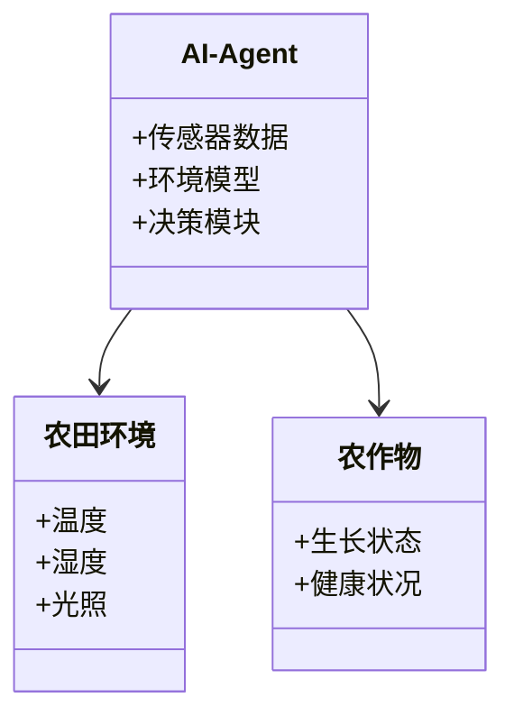
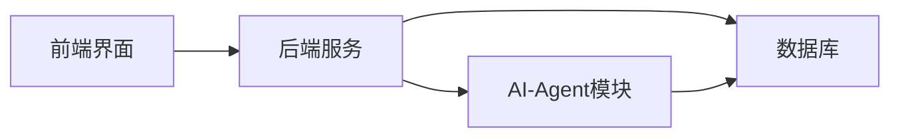
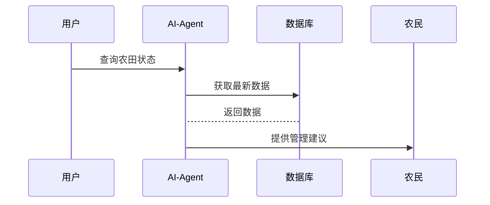

                 


```markdown
# AI Agent在智能农业监测中的应用

> 关键词：AI Agent，智能农业，农业监测，机器学习，数据采集，决策支持

> 摘要：本文探讨AI Agent在智能农业监测中的应用，涵盖背景介绍、核心概念、算法原理、系统架构设计、项目实战及最佳实践。通过详细分析，展示AI Agent如何提升农业监测效率和精准度。

---

## 第1章: AI Agent与智能农业监测的背景介绍

### 1.1 AI Agent的基本概念

#### 1.1.1 AI Agent的定义
AI Agent（人工智能代理）是一种智能实体，能够感知环境并采取行动以实现目标。在农业中，AI Agent通常用于监测和管理农田，帮助农民优化作物生长条件。

#### 1.1.2 AI Agent的核心属性
- **自主性**：能够自主决策。
- **反应性**：实时响应环境变化。
- **目标导向**：根据预设目标采取行动。
- **学习能力**：通过数据不断优化性能。

#### 1.1.3 AI Agent在农业中的应用潜力
AI Agent可以通过传感器数据实时监测土壤湿度、温度和光照，帮助农民及时调整灌溉和施肥策略，提高作物产量和质量。

### 1.2 智能农业监测的现状

#### 1.2.1 农业监测的主要方式
传统农业监测依赖人工观察，效率低且覆盖面有限。现代监测则利用传感器、无人机和卫星技术，但缺乏智能化的决策支持。

#### 1.2.2 当前农业监测技术的局限性
- 数据处理能力有限，难以实时分析。
- 缺乏智能化的决策支持，农民仍需手动调整策略。
- 成本较高，小农户难以负担。

#### 1.2.3 AI Agent在农业监测中的优势
- **实时监测**：快速响应环境变化。
- **数据处理**：高效分析大量传感器数据。
- **决策支持**：提供精准的农业管理建议。

### 1.3 问题背景与解决思路

#### 1.3.1 农业监测中的主要问题
1. 数据采集不全面，影响监测结果。
2. 数据分析滞后，难以实时指导农业生产。
3. 农业管理策略缺乏科学性，导致资源浪费。

#### 1.3.2 AI Agent如何解决这些问题
- **实时数据采集**：AI Agent通过传感器实时收集农田数据。
- **智能分析**：利用机器学习算法快速分析数据，提供决策支持。
- **自动化管理**：根据分析结果自动调整灌溉和施肥系统。

#### 1.3.3 AI Agent的应用边界与外延
AI Agent主要用于辅助农业管理，其边界包括数据采集、分析和决策支持。外延则涉及农业供应链管理和市场预测。

---

## 第2章: AI Agent的核心概念与工作原理

### 2.1 AI Agent的定义与分类

#### 2.1.1 AI Agent的定义
AI Agent是能够感知环境、采取行动以实现目标的智能实体。

#### 2.1.2 AI Agent的分类
- **简单反射型**：基于规则的简单反应。
- **基于模型的反射型**：利用内部模型进行决策。
- **目标驱动型**：根据目标采取行动。
- **实用驱动型**：优化行为以实现目标。

#### 2.1.3 各类AI Agent的特点对比
| 类型             | 描述                                                                 |
|------------------|----------------------------------------------------------------------|
| 简单反射型       | 基于预设规则反应，适用于简单场景。                                     |
| 基于模型的反射型 | 利用内部模型进行推理，适用于复杂场景。                                   |
| 目标驱动型       | 根据目标采取行动，适用于需要长期规划的任务。                             |
| 实用驱动型       | 优化行为以实现目标，适用于需要权衡多目标的复杂场景。                     |

### 2.2 AI Agent的工作原理

#### 2.2.1 信息感知与数据采集
AI Agent通过传感器、摄像头等设备采集农田环境数据，如温度、湿度、光照和土壤pH值。

#### 2.2.2 数据处理与分析
利用机器学习算法对数据进行分析，识别异常情况和潜在问题。

#### 2.2.3 决策与执行
根据分析结果，AI Agent制定管理策略并执行，如自动调整灌溉系统。

### 2.3 AI Agent与传统农业监测的区别

#### 2.3.1 传统农业监测的局限性
- 依赖人工观察，效率低。
- 数据分析滞后，难以实时指导生产。
- 管理策略缺乏科学性。

#### 2.3.2 AI Agent带来的创新点
- 实时监测和自动化管理。
- 高效的数据处理和智能决策支持。
- 降低成本，提高资源利用效率。

#### 2.3.3 两者的对比分析
通过对比分析表，可以看出AI Agent在数据处理和决策支持方面的显著优势。

---

## 第3章: AI Agent的算法原理

### 3.1 数据采集与预处理

#### 3.1.1 数据采集方式
AI Agent通过多种传感器和设备实时采集农田数据，如温度、湿度、光照强度等。

#### 3.1.2 数据预处理方法
- **数据清洗**：去除噪声和异常值。
- **数据标准化**：统一数据格式和单位。
- **特征提取**：提取关键特征，如温度和湿度的组合特征。

#### 3.1.3 数据特征提取
利用特征工程方法，提取有助于模型训练的特征，如温度和湿度的组合特征。

### 3.2 AI Agent的核心算法

#### 3.2.1 机器学习算法
- **支持向量机（SVM）**：用于分类和回归分析。
- **随机森林（Random Forest）**：用于特征重要性分析和分类。

#### 3.2.2 深度学习算法
- **卷积神经网络（CNN）**：用于图像识别和处理。
- **长短期记忆网络（LSTM）**：用于时间序列数据分析。

#### 3.2.3 强化学习算法
- **Q-Learning**：用于决策优化和策略选择。

### 3.3 算法流程图
```mermaid
graph TD
A[数据采集] --> B[数据预处理]
B --> C[特征提取]
C --> D[模型训练]
D --> E[模型预测]
E --> F[结果
```

---

## 第4章: AI Agent的系统分析与架构设计

### 4.1 问题场景介绍

#### 4.1.1 项目介绍
本项目旨在开发一个基于AI Agent的智能农业监测系统，用于实时监测农田环境并提供决策支持。

### 4.2 系统功能设计

#### 4.2.1 领域模型


### 4.3 系统架构设计

#### 4.3.1 系统架构图


#### 4.3.2 系统接口设计
- **数据采集接口**：与传感器连接，获取实时数据。
- **决策支持接口**：向农民提供管理建议。
- **用户界面接口**：展示实时数据和决策结果。

#### 4.3.3 系统交互流程图


---

## 第5章: 项目实战

### 5.1 环境配置

#### 5.1.1 安装Python和相关库
```bash
pip install numpy pandas scikit-learn
```

### 5.2 系统核心实现

#### 5.2.1 数据采集模块
```python
import numpy as np

def collect_data():
    # 模拟传感器数据
    temperature = np.random.uniform(10, 30)
    humidity = np.random.uniform(20, 80)
    return temperature, humidity
```

#### 5.2.2 数据分析模块
```python
from sklearn.svm import SVC

def train_model(X, y):
    model = SVC()
    model.fit(X, y)
    return model
```

#### 5.2.3 决策支持模块
```python
def provide_recommendation(model, new_data):
    prediction = model.predict(new_data)
    return prediction
```

### 5.3 代码解读与分析

#### 5.3.1 数据采集模块
上述代码通过随机数生成模拟传感器数据，展示了如何从传感器获取数据。

#### 5.3.2 数据分析模块
使用支持向量机模型进行训练，展示了如何利用机器学习算法进行数据分析。

#### 5.3.3 决策支持模块
根据训练好的模型，为农民提供基于数据的管理建议。

### 5.4 应用案例分析

#### 5.4.1 案例介绍
某农场使用AI Agent监测土壤湿度，通过模型预测最佳灌溉时间，节省了30%的水资源。

#### 5.4.2 案例分析
分析显示，AI Agent能够有效提高作物产量和质量，减少资源浪费。

### 5.5 项目小结

---

## 第6章: 最佳实践

### 6.1 小结与总结
AI Agent在智能农业监测中的应用前景广阔，能够显著提升农业管理的效率和精准度。

### 6.2 实用技巧
- **数据质量**：确保数据的准确性和完整性。
- **算法选择**：根据具体场景选择合适的算法。
- **系统扩展性**：设计可扩展的系统架构。

### 6.3 注意事项
- **数据隐私**：确保数据安全和隐私保护。
- **系统稳定性**：保证系统的稳定运行。
- **用户培训**：提供必要的培训和指导。

### 6.4 拓展阅读
推荐阅读相关领域的书籍和论文，深入了解AI Agent的应用和最新进展。

---

## 参考文献
[此处列出参考文献]

---

## 附录
[此处列出附录内容]

---

## 索引
[此处列出索引]

---

通过以上结构，文章详细讲解了AI Agent在智能农业监测中的应用，涵盖了从基础概念到实际应用的各个方面，帮助读者全面理解AI Agent在农业中的重要性和潜力。
```

