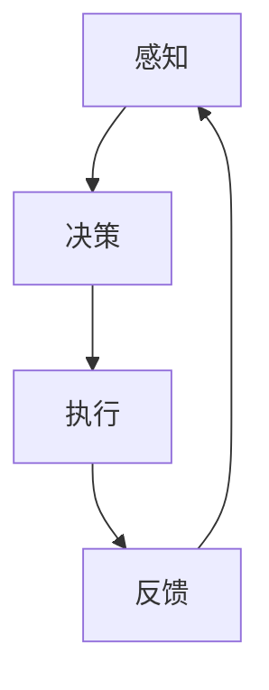
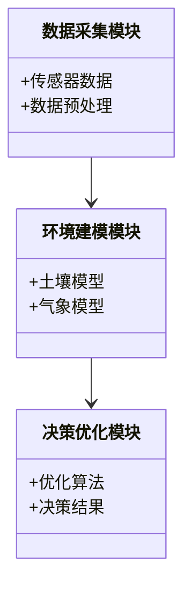
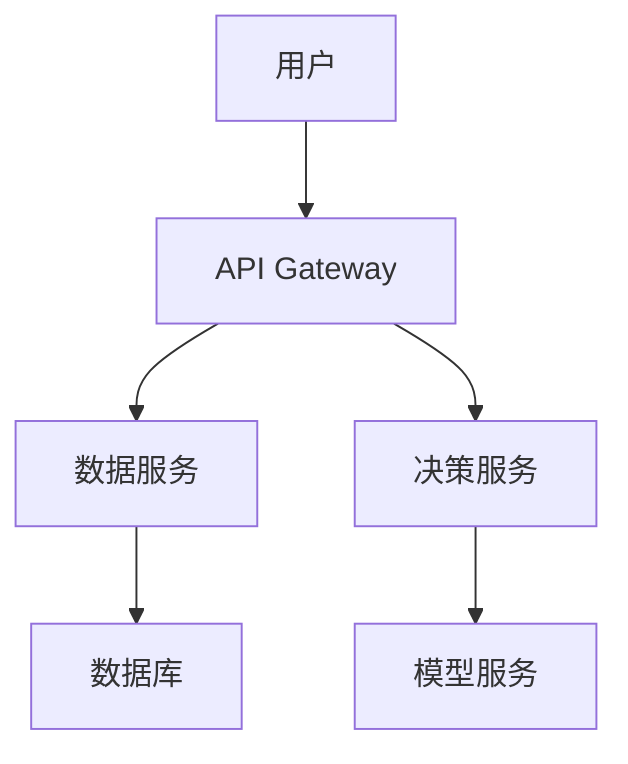

                 


# AI Agent在智能农业规划中的实践

## 关键词：AI Agent, 智能农业, 农业规划, 优化算法, 系统架构, 案例分析

## 摘要：  
本文探讨了AI Agent在智能农业规划中的应用，分析了其核心概念、算法原理、系统架构以及实际案例。通过详细的技术分析和实例，展示了AI Agent如何优化农业规划过程，提高农业生产效率和可持续性。

---

# 第一部分: AI Agent与智能农业规划的背景与基础

## 第1章: AI Agent与智能农业规划概述

### 1.1 AI Agent的基本概念与特点
#### 1.1.1 AI Agent的定义与核心要素
AI Agent（人工智能代理）是指能够感知环境、自主决策并执行任务的智能实体。其核心要素包括：
- **感知能力**：通过传感器或数据源获取环境信息。
- **决策能力**：基于感知信息进行推理和决策。
- **执行能力**：通过执行器或系统接口实现操作。
- **学习能力**：通过反馈优化自身行为。

#### 1.1.2 AI Agent在农业中的应用潜力
AI Agent可以用于农业规划、作物管理、资源优化等领域。例如，AI Agent可以通过分析土壤湿度、天气数据等信息，自动调整灌溉系统。

#### 1.1.3 智能农业规划的背景与意义
智能农业规划通过AI技术优化资源配置，提高农业生产效率，减少资源浪费，实现可持续发展。

### 1.2 智能农业规划的现状与挑战
#### 1.2.1 当前农业规划的主要问题
传统农业规划依赖人工经验，存在效率低、精准度差的问题。

#### 1.2.2 AI技术在农业规划中的优势
AI技术可以提高数据处理能力，优化决策过程，实现精准农业。

#### 1.2.3 智能农业规划的边界与外延
智能农业规划的边界包括数据采集、决策优化、执行控制等环节，外延则涉及农业生态系统的整体优化。

### 1.3 AI Agent在农业规划中的应用背景
#### 1.3.1 农业智能化的需求驱动
随着人口增长和资源有限，农业智能化成为必然趋势。

#### 1.3.2 AI Agent的核心作用
AI Agent通过实时感知和决策，优化农业规划过程。

#### 1.3.3 智能农业规划的未来趋势
AI Agent将与物联网、大数据等技术深度融合，推动农业向智能化、数字化方向发展。

### 1.4 本章小结
本章介绍了AI Agent的基本概念、在农业中的应用潜力以及智能农业规划的背景与挑战。

---

# 第二部分: AI Agent的核心概念与原理

## 第2章: AI Agent的核心概念与联系

### 2.1 AI Agent的核心原理
#### 2.1.1 感知与数据获取
AI Agent通过传感器获取土壤湿度、温度、光照等数据。

#### 2.1.2 决策与规划算法
基于感知数据，AI Agent使用优化算法制定农业规划。

#### 2.1.3 执行与反馈机制
AI Agent根据决策结果执行操作，并通过反馈优化后续行为。

### 2.2 AI Agent的感知模块
#### 2.2.1 数据源的分类与特点
数据源包括土壤传感器、气象站、卫星图像等，各有不同的特点和应用场景。

#### 2.2.2 数据预处理与特征提取
对原始数据进行清洗、归一化处理，并提取关键特征。

#### 2.2.3 感知模型的构建与优化
使用机器学习模型（如随机森林）构建感知模型，并通过交叉验证优化模型性能。

### 2.3 AI Agent的决策模块
#### 2.3.1 农业规划的决策模型
基于优化算法（如遗传算法）制定作物种植计划。

#### 2.3.2 多目标优化算法
在资源有限的情况下，优化多个目标（如产量、成本）。

#### 2.3.3 决策结果的验证与评估
通过模拟验证决策结果，并使用指标（如净收益）评估决策优劣。

### 2.4 AI Agent的执行

---

## 图表示例：

### AI Agent在农业规划中的流程图（Mermaid）


### AI Agent与农业环境的实体关系图（Mermaid）
```mermaid
er
    entity 土壤传感器
    entity 气象站
    entity 决策模型
    entity 灌溉系统
    土壤传感器 --|> 决策模型
    气象站 --|> 决策模型
    决策模型 --|> 灌溉系统
```

---

## 第3章: AI Agent的算法原理与实现

### 3.1 AI Agent的算法原理
#### 3.1.1 基于模型的规划算法
通过构建农业模型，模拟不同决策的效果。

#### 3.1.2 强化学习算法
使用强化学习优化决策过程。

#### 3.1.3 群智算法
通过多AI Agent协同完成复杂任务。

### 3.2 强化学习在农业规划中的应用
#### 3.2.1 马尔可夫决策过程（MDP）
定义状态、动作、奖励等概念，并通过Q-learning算法优化决策。

#### 3.2.2 强化学习的实现代码
```python
import numpy as np

# 示例代码：强化学习在灌溉决策中的应用
class IrrigationAgent:
    def __init__(self, state_space, action_space):
        self.state_space = state_space
        self.action_space = action_space
        self.Q = np.zeros((state_space, action_space))

    def act(self, state):
        return np.argmax(self.Q[state, :])

    def update(self, state, action, reward):
        self.Q[state, action] += reward

# 初始化环境
state_space = 5  # 示例：5种土壤湿度状态
action_space = 3  # 示例：3种灌溉动作
agent = IrrigationAgent(state_space, action_space)

# 训练过程
for episode in range(100):
    state = 2  # 示例：当前状态为中等湿度
    action = agent.act(state)
    reward = 1 if action == 1 else 0  # 示例奖励
    agent.update(state, action, reward)
```

### 3.3 算法的优化与调优
通过调整学习率、奖励机制等参数，优化AI Agent的决策性能。

---

## 第4章: 系统分析与架构设计

### 4.1 系统分析
#### 4.1.1 问题场景介绍
以智能灌溉系统为例，分析AI Agent的应用场景。

#### 4.1.2 系统功能设计
设计数据采集、环境建模、决策优化等模块。

#### 4.1.3 领域模型设计（Mermaid类图）


### 4.2 系统架构设计
#### 4.2.1 分层架构设计
将系统分为感知层、决策层和执行层。

#### 4.2.2 微服务架构设计（Mermaid架构图）
```mermaid
graph TD
    API Gateway --> 数据服务
    API Gateway --> 决策服务
    数据服务 --> 数据库
    决策服务 --> 模型服务
```

#### 4.2.3 系统接口设计
定义API接口，如`/api/irrigation?state=2`。

#### 4.2.4 系统交互流程图（Mermaid序列图）
```mermaid
sequenceDiagram
    用户调用 API Gateway
    API Gateway -> 数据服务: 获取传感器数据
    数据服务 -> 数据库: 查询历史数据
    API Gateway -> 决策服务: 请求决策
    决策服务 -> 模型服务: 运行优化算法
    模型服务 -> 决策服务: 返回决策结果
    API Gateway -> 用户: 返回灌溉建议
```

---

## 第5章: 项目实战与案例分析

### 5.1 项目环境搭建
#### 5.1.1 安装必要的工具
安装Python、TensorFlow、Scikit-learn等库。

#### 5.1.2 数据集准备
获取土壤湿度、气象数据等训练数据。

### 5.2 系统核心实现
#### 5.2.1 数据采集模块
编写代码采集传感器数据。

#### 5.2.2 决策优化模块
实现强化学习算法优化灌溉策略。

#### 5.2.3 系统接口设计
开发API接口，供其他系统调用。

### 5.3 案例分析
#### 5.3.1 案例背景
以某农场为例，分析AI Agent如何优化灌溉计划。

#### 5.3.2 实施过程
部署系统并进行测试。

#### 5.3.3 实施效果
通过数据对比，展示AI Agent带来的效益。

---

## 第6章: 最佳实践与总结

### 6.1 小结
总结AI Agent在智能农业规划中的应用价值。

### 6.2 注意事项
提示读者在实际应用中需要注意的问题。

### 6.3 拓展阅读
推荐相关书籍和资源，供读者深入学习。

---

## 附录: 代码示例

### 附录A: 强化学习代码
```python
import numpy as np

class IrrigationAgent:
    def __init__(self, state_size, action_size):
        self.state_size = state_size
        self.action_size = action_size
        self.Q = np.zeros((state_size, action_size))

    def act(self, state):
        return np.argmax(self.Q[state, :])

    def update(self, state, action, reward):
        self.Q[state, action] += reward

# 示例训练过程
agent = IrrigationAgent(5, 3)
for _ in range(100):
    state = np.random.randint(0, 5)
    action = agent.act(state)
    reward = np.random.randint(0, 2)
    agent.update(state, action, reward)
```

### 附录B: 系统架构图


---

通过以上结构，我们可以系统地分析和实现AI Agent在智能农业规划中的应用，为农业智能化提供有力的技术支持。

