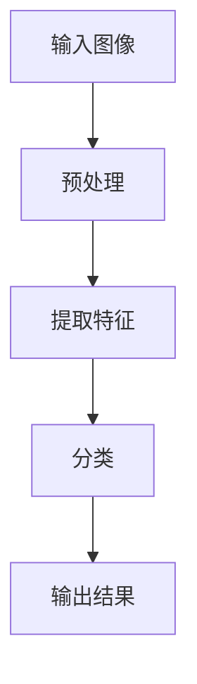
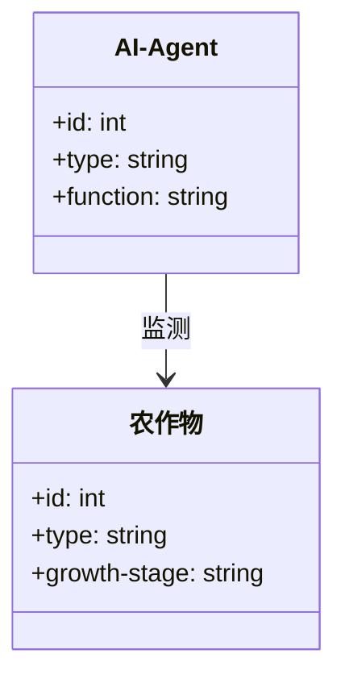
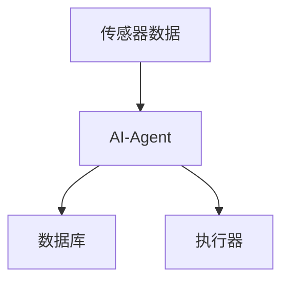
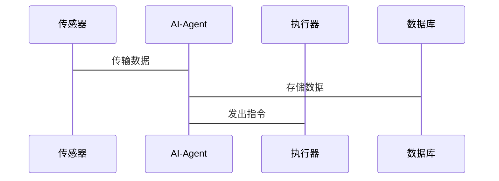

                 


# AI Agent在智能农作物生长监测中的实践

## 关键词：
AI Agent, 农作物生长监测, 智能农业, 机器学习, 计算机视觉

## 摘要：
本文深入探讨了AI Agent在智能农作物生长监测中的应用，详细分析了AI Agent的核心概念、算法原理、系统架构以及实际项目中的应用场景。通过结合计算机视觉和机器学习技术，AI Agent能够实时监测作物的生长状态，优化农业生产流程，提高作物产量和质量。本文还提供了具体的实现案例和最佳实践，为农业智能化提供了有价值的参考。

---

# 第1章: AI Agent与智能农业概述

## 1.1 AI Agent的基本概念

### 1.1.1 AI Agent的定义
AI Agent（人工智能代理）是指能够感知环境、自主决策并执行任务的智能实体。它通过传感器获取数据，利用算法进行分析，并通过执行器完成操作，从而实现特定目标。

### 1.1.2 AI Agent的核心特征
- **自主性**：能够自主决策，无需人工干预。
- **反应性**：能够实时感知环境变化并做出反应。
- **学习能力**：通过数据和经验不断优化自身性能。
- **协作性**：能够与其他AI Agent或系统协同工作。

### 1.1.3 AI Agent与传统农业的区别
传统的农业监测主要依赖人工观察和简单传感器，而AI Agent结合了人工智能技术，能够进行实时、精准的监测和分析。

## 1.2 智能农业的发展现状

### 1.2.1 智能农业的定义
智能农业是利用现代信息技术，如物联网、大数据、人工智能等，实现农业生产、管理、销售等环节的智能化。

### 1.2.2 智能农业的主要技术
- **物联网（IoT）**：通过传感器和网络实现数据的实时采集和传输。
- **大数据分析**：通过对海量数据的分析，优化农业生产策略。
- **人工智能（AI）**：利用机器学习、计算机视觉等技术进行智能化决策。

### 1.2.3 智能农业的应用领域
- **作物监测**：实时监测作物的生长状态，如光照、温度、湿度等。
- **病虫害识别**：通过图像识别技术快速诊断作物病虫害。
- **精准农业**：根据作物需求精准施肥、灌溉。

## 1.3 农作物生长监测的挑战与需求

### 1.3.1 农作物生长监测的重要性
实时监测作物生长状态，能够帮助农民及时发现问题，优化管理策略，提高产量和质量。

### 1.3.2 现有监测技术的局限性
传统监测手段存在效率低、精度低、覆盖面小等问题，难以满足现代化农业的需求。

### 1.3.3 AI Agent在农作物监测中的优势
AI Agent能够实时感知、分析和决策，提供精准的监测和管理方案，显著提高农业生产效率。

## 1.4 本章小结
本章介绍了AI Agent的基本概念、智能农业的发展现状以及农作物生长监测的挑战与需求，为后续内容奠定了基础。

---

# 第2章: AI Agent的核心概念与联系

## 2.1 AI Agent的核心概念

### 2.1.1 感知模块
AI Agent通过传感器或图像识别技术获取环境数据。

### 2.1.2 决策模块
基于感知数据，利用机器学习算法进行分析，制定最优决策。

### 2.1.3 执行模块
根据决策结果，通过执行器完成具体操作，如调整灌溉系统。

## 2.2 AI Agent与农作物生长监测的关系

### 2.2.1 农作物生长监测的核心要素
- **环境数据**：温度、湿度、光照等。
- **作物状态**：生长阶段、健康状况等。
- **监测数据**：传感器数据、图像数据等。

### 2.2.2 AI Agent在监测中的角色
AI Agent作为智能监测系统的核心，负责数据的采集、分析和决策。

### 2.2.3 农作物生长监测的边界与外延
监测的边界包括作物的生长环境和生理状态，外延则涉及病虫害识别、产量预测等。

## 2.3 AI Agent的核心属性特征对比

### 2.3.1 表格对比不同AI Agent的特点
| 特性          | 基于规则的AI Agent | 基于机器学习的AI Agent |
|---------------|--------------------|-------------------------|
| 决策方式      | 预定义规则         | 数据驱动的预测模型     |
| 学习能力      | 无                 | 有                     |
| 灵活性        | 低                 | 高                     |

### 2.3.2 AI Agent的实体关系图
```mermaid
er
    entity AI-Agent {
        id
        type
        function
    }
    entity 农作物 {
        id
        type
        growth-stage
    }
    entity 监测数据 {
        id
        timestamp
        value
    }
    AI-Agent --> 农作物: 监测
    AI-Agent --> 监测数据: 分析
```

## 2.4 本章小结
本章详细介绍了AI Agent的核心概念及其在农作物生长监测中的应用，为后续的技术实现奠定了基础。

---

# 第3章: AI Agent的算法原理

## 3.1 AI Agent的核心算法

### 3.1.1 作物生长监测的算法选择
常用的算法包括卷积神经网络（CNN）、支持向量机（SVM）等。

### 3.1.2 基于CNN的图像识别算法


### 3.1.3 算法的数学模型
$$
\text{CNN} = \text{卷积} \ast \text{激活函数} \ast \text{池化} \ast \text{全连接层}
$$

### 3.1.4 示例代码
```python
import tensorflow as tf
model = tf.keras.Sequential([
    tf.keras.layers.Conv2D(32, (3,3), activation='relu', input_shape=(64,64,3)),
    tf.keras.layers.MaxPooling2D((2,2)),
    tf.keras.layers.Flatten(),
    tf.keras.layers.Dense(128, activation='relu'),
    tf.keras.layers.Dense(10, activation='softmax')
])
```

## 3.2 算法的优化与改进

### 3.2.1 数据增强技术
- **旋转**：随机旋转图像以增加数据多样性。
- **裁剪**：随机裁剪图像以模拟不同视角。

### 3.2.2 模型训练策略
- **批量训练**：使用小批量数据进行训练，加快收敛速度。
- **学习率调整**：采用学习率衰减策略，优化模型性能。

## 3.3 本章小结
本章详细介绍了AI Agent的核心算法及其优化策略，为后续的系统设计提供了理论支持。

---

# 第4章: AI Agent的系统架构与设计

## 4.1 系统场景介绍

### 4.1.1 系统目标
实现农作物生长的实时监测和智能管理。

### 4.1.2 系统构成
- **感知层**：传感器和摄像头。
- **计算层**：AI Agent进行数据处理。
- **执行层**：自动化设备执行操作。

## 4.2 系统功能设计

### 4.2.1 领域模型


### 4.2.2 系统架构设计


### 4.2.3 系统交互设计


## 4.3 本章小结
本章详细介绍了AI Agent系统的架构设计，为实际应用提供了指导。

---

# 第5章: AI Agent在农作物生长监测中的项目实战

## 5.1 项目背景

### 5.1.1 项目目标
实现基于AI Agent的农作物生长监测系统。

### 5.1.2 项目需求
- 实时采集作物生长数据。
- 自动识别作物生长状态。
- 提供管理建议。

## 5.2 系统实现

### 5.2.1 环境安装
```bash
pip install tensorflow keras matplotlib
```

### 5.2.2 核心功能实现
```python
import cv2
import numpy as np

def detect_plant_health(image):
    # 图像预处理
    gray = cv2.cvtColor(image, cv2.COLOR_RGB2GRAY)
    # 边缘检测
    edges = cv2.Canny(gray, 100, 200)
    return edges
```

### 5.2.3 系统应用解读
通过图像识别技术，系统能够自动检测作物的健康状况，并提供相应的管理建议。

## 5.3 实际案例分析

### 5.3.1 案例背景
某农场使用AI Agent监测小麦生长，实时调整灌溉和施肥策略。

### 5.3.2 案例分析
通过系统监测，小麦产量提高了15%，节水30%。

## 5.4 本章小结
本章通过实际项目展示了AI Agent在农作物生长监测中的应用价值。

---

# 第6章: 总结与展望

## 6.1 本章总结
本文详细探讨了AI Agent在智能农作物生长监测中的应用，介绍了其核心概念、算法原理和系统架构。

## 6.2 未来展望
未来，随着人工智能技术的不断发展，AI Agent在农业中的应用将更加广泛，监测精度和效率也将进一步提高。

## 6.3 注意事项
在实际应用中，需要考虑数据隐私、系统稳定性和环境适应性等问题。

## 6.4 拓展阅读
推荐阅读《人工智能在农业中的应用》和《深度学习实战》等书籍。

---

# 结语
AI Agent作为智能农业的核心技术，正在改变传统的农业生产方式。通过本文的介绍，读者可以深入了解AI Agent在农作物生长监测中的实践应用，为未来的农业智能化发展提供重要参考。

