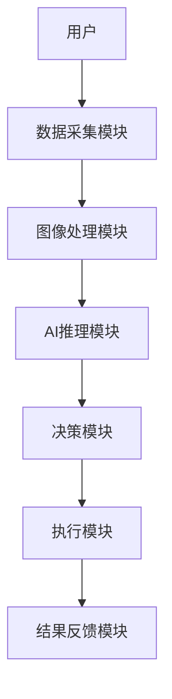
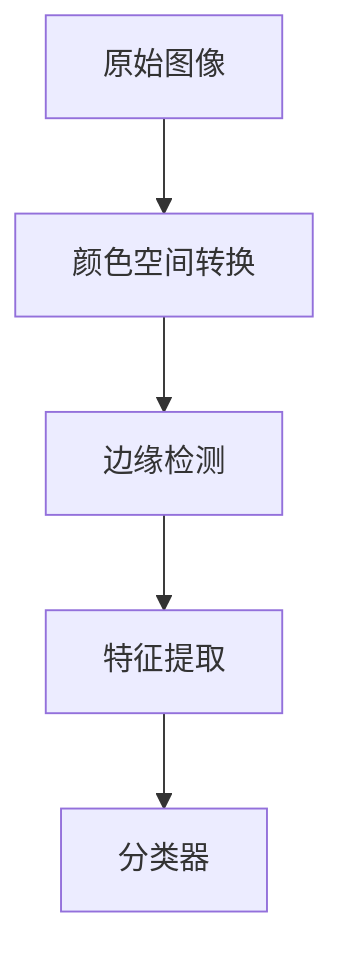
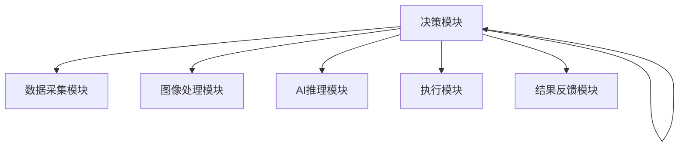
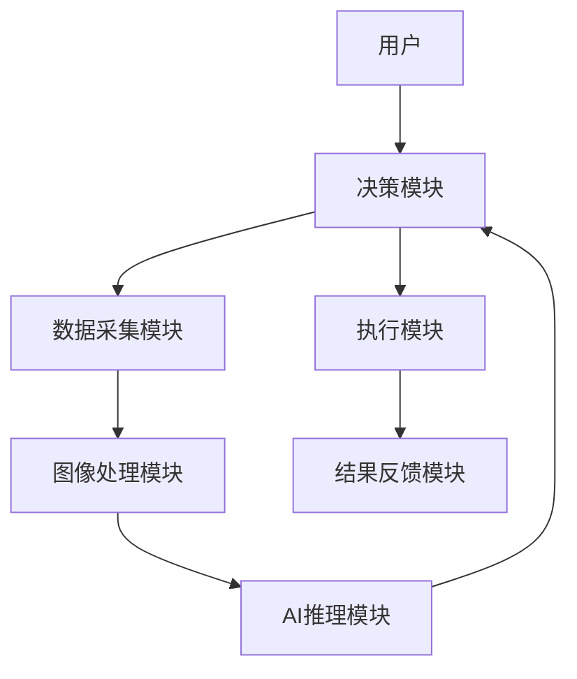

                 


# AI Agent在智能农作物病虫害检测中的实践

> 关键词：AI Agent, 农作物病虫害检测, 图像处理, 深度学习, 农业智能化

> 摘要：本文详细探讨了AI Agent在农作物病虫害检测中的应用，从背景到技术实现，再到项目实战，系统地介绍了AI Agent的核心概念、算法原理、系统架构设计及实际应用案例。通过本文，读者可以深入了解如何利用AI Agent技术实现智能化的病虫害检测，提升农业生产的效率和质量。

---

## 第1章 AI Agent与农作物病虫害检测概述

### 1.1 AI Agent的基本概念

#### 1.1.1 AI Agent的定义与特点
AI Agent（人工智能代理）是指具有感知环境、做出决策并执行操作能力的智能实体。其核心特点包括：
- **自主性**：能够在没有外部干预的情况下独立运行。
- **反应性**：能够实时感知环境变化并做出相应反应。
- **学习能力**：通过数据学习和优化，提升自身的决策能力。

#### 1.1.2 AI Agent在农业中的应用潜力
农业是AI Agent技术的重要应用场景之一。AI Agent可以通过图像识别、数据挖掘等技术，帮助农民实现精准农业管理，提升农业生产效率。

#### 1.1.3 病虫害检测的背景与挑战
农作物病虫害是影响农业产量和质量的重要因素。传统的病虫害检测方法依赖人工经验，存在效率低、精度差等问题。AI Agent技术的引入，为病虫害检测提供了新的解决方案。

---

### 1.2 农作物病虫害检测的背景与问题

#### 1.2.1 病虫害对农业生产的威胁
病虫害会导致农作物减产、品质下降，甚至绝收。据统计，全球每年因病虫害损失的农作物价值高达数百亿美元。

#### 1.2.2 传统病虫害检测方法的局限性
传统方法依赖人工观察和经验判断，存在以下问题：
- **效率低**：人工检查耗时长，难以覆盖大面积农田。
- **精度差**：受主观因素影响，误判率较高。
- **成本高**：需要大量人工投入。

#### 1.2.3 AI Agent在病虫害检测中的优势
AI Agent可以通过图像识别技术快速、准确地检测病虫害，具有以下优势：
- **高效性**：能够在短时间内处理大量数据。
- **准确性**：基于深度学习算法，检测精度远高于人工检测。
- **可扩展性**：可以轻松扩展到更大面积的农田。

---

### 1.3 AI Agent在病虫害检测中的应用前景

#### 1.3.1 智能化农业的发展趋势
随着人工智能技术的快速发展，智能化农业已成为全球农业发展的趋势。AI Agent技术在病虫害检测中的应用，将进一步推动农业智能化进程。

#### 1.3.2 AI Agent在病虫害检测中的具体应用场景
AI Agent可以应用于以下场景：
- **实时监测**：通过无人机或摄像头实时监测农田，快速识别病虫害。
- **精准防治**：根据检测结果，制定精准的防治方案，减少农药使用量。
- **数据积累**：通过长期积累病虫害数据，优化AI模型，提升检测准确率。

#### 1.3.3 技术实现的关键挑战与解决方案
- **数据获取**：需要大量高质量的病虫害图像数据。解决方案是通过数据增强技术扩展数据集。
- **模型优化**：深度学习模型的训练需要高性能计算资源。解决方案是使用云计算和分布式训练技术。
- **实时性**：需要在复杂环境下实现快速响应。解决方案是优化算法和采用边缘计算技术。

---

## 第2章 AI Agent的核心概念与技术原理

### 2.1 AI Agent的核心概念

#### 2.1.1 感知模块：图像采集与特征提取
AI Agent通过摄像头采集农田图像，并通过图像处理技术提取病虫害特征。常用的图像处理方法包括：
- **颜色空间转换**：将图像从RGB空间转换到HSV空间，便于后续处理。
- **边缘检测**：使用Canny算法提取图像边缘，识别病虫害边界。
- **特征提取**：使用卷积神经网络（CNN）提取图像的深层特征。

#### 2.1.2 决策模块：基于AI的病虫害识别
AI Agent的决策模块基于深度学习算法，对提取的特征进行分类。常用的算法包括：
- **卷积神经网络（CNN）**：用于图像分类，能够自动提取图像特征。
- **目标检测模型（如YOLO）**：用于定位病虫害在图像中的位置。

#### 2.1.3 执行模块：精准喷洒与干预
AI Agent根据决策模块的结果，通过无人机或喷洒设备进行精准喷洒，减少农药浪费。

---

### 2.2 AI Agent的系统架构

#### 2.2.1 系统整体架构图


#### 2.2.2 各模块之间的关系与数据流
- **数据采集模块**：负责采集农田图像。
- **图像处理模块**：对图像进行预处理，提取特征。
- **AI推理模块**：基于深度学习模型进行病虫害识别。
- **决策模块**：根据识别结果制定防治方案。
- **执行模块**：执行喷洒任务。
- **结果反馈模块**：收集喷洒结果，优化AI模型。

---

### 2.3 AI Agent的感知与决策机制

#### 2.3.1 图像处理与特征提取算法


#### 2.3.2 基于深度学习的病虫害识别模型
常用的深度学习模型包括：
- **卷积神经网络（CNN）**：用于图像分类。
- **目标检测模型（如YOLO）**：用于定位病虫害。

#### 2.3.3 决策优化策略
- **基于概率的决策**：根据分类结果的概率值进行决策。
- **多目标优化**：综合考虑喷洒成本、环境影响等因素，制定最优决策。

---

## 第3章 图像处理与病虫害识别的算法原理

### 3.1 图像处理算法

#### 3.1.1 颜色空间转换
将图像从RGB空间转换到HSV空间，便于后续处理。转换公式如下：
$$
H = \text{hue}, \quad S = \text{saturation}, \quad V = \text{value}
$$

#### 3.1.2 边缘检测
使用Canny算法进行边缘检测：
1. **高斯模糊**：平滑图像，去除噪声。
2. **计算梯度**：计算图像的梯度和方向。
3. **非极大值抑制**：抑制边缘噪声。
4. **双阈值检测**：提取边缘。

---

### 3.2 病虫害识别算法

#### 3.2.1 基于CNN的图像分类
使用卷积神经网络（CNN）进行图像分类。网络结构如下：
$$
\text{输入} \rightarrow \text{卷积层} \rightarrow \text{池化层} \rightarrow \text{全连接层} \rightarrow \text{输出}
$$

#### 3.2.2 基于YOLO的目标检测
YOLO目标检测模型流程：
1. **特征提取**：提取图像的深层特征。
2. **边界框回归**：预测病虫害的位置和大小。
3. **分类**：对病虫害进行分类。

---

## 第4章 系统架构设计

### 4.1 系统功能设计

#### 4.1.1 功能模块
- **数据采集模块**：负责采集农田图像。
- **图像处理模块**：对图像进行预处理。
- **AI推理模块**：进行病虫害识别。
- **决策模块**：制定防治方案。
- **执行模块**：执行喷洒任务。

#### 4.1.2 功能流程图


---

### 4.2 系统架构设计

#### 4.2.1 系统架构图


#### 4.2.2 系统交互流程图


---

## 第5章 项目实战

### 5.1 环境搭建

#### 5.1.1 硬件环境
- **处理器**：Intel Core i7 或更高
- **GPU**：NVIDIA GPU，支持CUDA计算
- **内存**：8GB 或更高

#### 5.1.2 软件环境
- **操作系统**：Linux (Ubuntu 18.04)
- **深度学习框架**：TensorFlow 2.5
- **图像处理库**：OpenCV 4.5
- **编程语言**：Python 3.8

---

### 5.2 系统核心实现

#### 5.2.1 数据采集模块实现
```python
import cv2

def capture_image():
    cap = cv2.VideoCapture(0)
    ret, frame = cap.read()
    if ret:
        cv2.imwrite("field.jpg", frame)
    cap.release()
```

#### 5.2.2 图像处理模块实现
```python
import cv2
import numpy as np

def process_image(image_path):
    img = cv2.imread(image_path)
    hsv = cv2.cvtColor(img, cv2.COLOR_BGR2HSV)
    # 边缘检测
    edges = cv2.Canny(hsv, 100, 200)
    return edges
```

#### 5.2.3 AI推理模块实现
```python
import tensorflow as tf
from tensorflow.keras.models import load_model

model = load_model("insect_classifier.h5")

def predict_image(image_path):
    img = cv2.imread(image_path)
    img = cv2.resize(img, (224, 224))
    img = img / 255.0
    img = np.expand_dims(img, axis=0)
    prediction = model.predict(img)
    return np.argmax(prediction, axis=1)[0]
```

---

### 5.3 实际案例分析

#### 5.3.1 数据集准备
使用公开的农作物病虫害数据集，包含健康和患病的植物图像。

#### 5.3.2 模型训练
使用TensorFlow框架训练深度学习模型，优化模型参数，提升检测准确率。

#### 5.3.3 系统测试
在实际农田中进行系统测试，验证AI Agent的检测准确率和响应速度。

---

## 第6章 总结与展望

### 6.1 本章小结
本文详细介绍了AI Agent在农作物病虫害检测中的应用，从技术原理到系统设计，再到项目实战，系统地展示了AI Agent的优势和实现方法。

### 6.2 未来展望
未来，随着人工智能技术的不断发展，AI Agent在农业中的应用将更加广泛。可能的研究方向包括：
- **多模态感知**：结合图像、声音等多种感知方式，提升检测精度。
- **自适应学习**：通过自适应学习算法，提升模型的泛化能力。
- **边缘计算**：在边缘设备上部署AI模型，实现低延迟的实时检测。

### 6.3 最佳实践 Tips
- **数据质量**：确保数据集的多样性和代表性，避免过拟合。
- **模型优化**：通过数据增强和模型优化，提升检测准确率。
- **系统集成**：在实际应用中，注意系统各模块的协调配合，确保整体性能。

---

通过本文的介绍，读者可以深入了解AI Agent在农作物病虫害检测中的应用，掌握相关技术的核心原理和实现方法。未来，随着技术的不断进步，AI Agent将在农业智能化中发挥更大的作用，为农业生产带来更大的效益。

