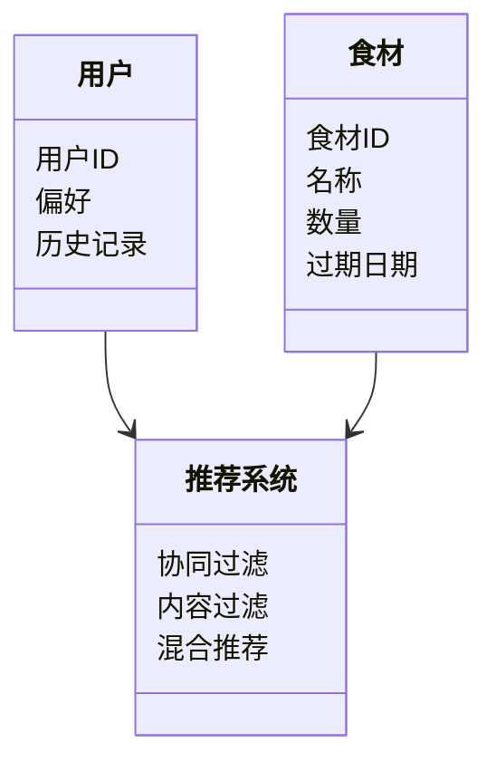

                 


# AI Agent在智能冰箱中的食材管理

> 关键词：AI Agent, 智能冰箱, 食材管理, 推荐算法, 系统架构

> 摘要：本文探讨了AI Agent在智能冰箱中的食材管理应用，详细分析了AI Agent的核心概念、算法原理、系统架构以及项目实现，旨在为技术人员和产品经理提供深入的技术见解。

---

## 第一部分：AI Agent与智能冰箱食材管理概述

### 第1章：AI Agent的基本概念与背景

#### 1.1 AI Agent的定义与核心特征
- **AI Agent的定义**：AI Agent是能够感知环境并采取行动以实现目标的智能实体。
- **核心特征**：自主性、反应性、目标导向、学习能力。

#### 1.2 智能冰箱食材管理的背景
- **发展历程**：从机械冰箱到智能冰箱，技术逐步升级。
- **痛点与需求**：食材过期、管理复杂、浪费问题。

#### 1.3 AI Agent与食材管理的结合
- **应用场景**：自动采购、库存预警、食谱推荐。
- **解决痛点**：优化食材管理流程，减少浪费。

---

### 第2章：AI Agent与食材管理的核心概念

#### 2.1 AI Agent的原理与实现
- **基本原理**：通过传感器数据和历史记录，AI Agent学习用户习惯并推荐食材。
- **核心算法**：协同过滤和混合推荐模型。

#### 2.2 食材管理系统的构成
- **功能模块**：库存管理、采购建议、食谱推荐。
- **数据流**：传感器数据 → 用户偏好 → 推荐结果。

#### 2.3 AI Agent与食材管理的关联
- **角色**：AI Agent作为系统中枢，协调各模块运作。
- **交互流程**：用户需求 → AI Agent处理 → 系统响应。

---

## 第二部分：AI Agent食材管理的核心算法与数学模型

### 第3章：算法原理

#### 3.1 基于协同过滤的推荐算法
- **基本原理**：通过用户行为相似性推荐食材。
- **数学模型**：公式表示为：
  $$\text{sim}(u, v) = \frac{\sum_{i}(u_i - \bar{u})(v_i - \bar{v})}{\sqrt{\sum_{i}(u_i - \bar{u})^2} \cdot \sqrt{\sum_{i}(v_i - \bar{v})^2}}$$
- **实现流程**：数据收集、相似度计算、推荐生成。

#### 3.2 基于内容的推荐算法
- **基本原理**：分析食材属性，推荐相似产品。
- **数学模型**：使用余弦相似度计算：
  $$\text{sim}(i, j) = \frac{\sum_{k}w_{ik}w_{jk}}{\sqrt{\sum_{k}w_{ik}^2} \cdot \sqrt{\sum_{k}w_{jk}^2}}$$
- **实现流程**：数据预处理、特征提取、相似度计算。

#### 3.3 混合推荐模型
- **定义**：结合协同过滤和内容推荐的混合模型。
- **数学公式**：线性加权：
  $$\text{score} = \alpha \cdot \text{CF}(i, j) + (1-\alpha) \cdot \text{CB}(i, j)$$
- **实现流程**：数据整合、模型训练、结果优化。

---

## 第三部分：AI Agent食材管理的系统架构与设计

### 第4章：系统分析

#### 4.1 系统功能设计
- **库存管理模块**：实时监控食材库存，预警过期产品。
- **采购建议模块**：根据消耗情况推荐采购清单。
- **食谱推荐模块**：结合库存和用户偏好推荐菜谱。

#### 4.2 领域模型


#### 4.3 系统架构设计


---

## 第四部分：AI Agent食材管理的项目实战

### 第5章：项目实现

#### 5.1 环境安装
- **工具**：Python、TensorFlow、Pandas、Scikit-learn。
- **步骤**：安装库、配置环境。

#### 5.2 核心代码实现
```python
import numpy as np
from sklearn.metrics.pairwise import cosine_similarity

# 协同过滤实现
def collaborative_filtering(user_item_matrix):
    user_similarity = cosine_similarity(user_item_matrix)
    # 找出最相似的用户
    similar_users = np.argmax(user_similarity, axis=1)
    return user_item_matrix.dot(user_similarity)

# 混合推荐实现
def hybrid_recommendation(user_data, item_data):
    cf_scores = collaborative_filtering(user_data)
    cb_scores = content_based_filtering(item_data)
    alpha = 0.5
    return alpha * cf_scores + (1 - alpha) * cb_scores
```

#### 5.3 案例分析
- **数据来源**：模拟用户行为数据。
- **结果展示**：推荐列表及其置信度。

#### 5.4 项目总结
- **优势**：减少食材浪费，提高管理效率。
- **挑战**：数据隐私和模型优化。

---

## 第五部分：总结与展望

### 6.1 最佳实践Tips
- 数据清洗的重要性。
- 模型调优的必要性。

### 6.2 小结
AI Agent在智能冰箱中的应用前景广阔，通过协同过滤和混合推荐模型，能够有效提升食材管理效率。

### 6.3 注意事项
- 数据隐私保护。
- 系统的可扩展性设计。

### 6.4 拓展阅读
推荐阅读相关领域的最新论文和技术博客，深入了解AI Agent的其他应用场景。

---

# 结语
AI Agent在智能冰箱中的食材管理不仅提升了用户体验，也为智能家居的发展开辟了新方向。随着技术的进步，AI Agent的应用将更加广泛和深入，值得我们持续关注和研究。

