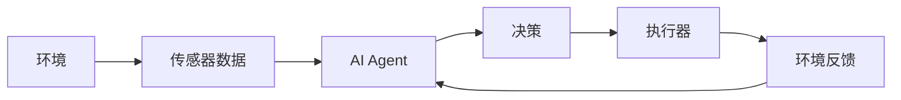
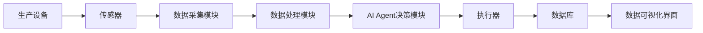

                 


# AI Agent在智能制造中的实践应用

## 关键词：AI Agent, 智能制造, 人工智能, 工业自动化, 多智能体系统

## 摘要：AI Agent（人工智能代理）作为一种能够感知环境、自主决策并执行任务的智能实体，在智能制造领域展现出了巨大的潜力。本文将从AI Agent的基本概念出发，深入探讨其在智能制造中的核心原理、技术实现、系统架构及实际应用。通过案例分析和项目实战，详细阐述AI Agent在智能制造中的具体应用场景，并总结其优势与挑战。本文旨在为技术从业者提供一份全面的技术指南，帮助他们在智能制造领域更好地理解和应用AI Agent技术。

---

# 第一部分: AI Agent与智能制造的背景与概念

# 第1章: AI Agent的基本概念与智能制造的背景

## 1.1 AI Agent的定义与特点

### 1.1.1 AI Agent的定义

AI Agent（人工智能代理）是一种能够感知环境、自主决策并执行任务的智能实体。它通过传感器获取环境信息，结合内部知识库和决策逻辑，生成行动方案，并通过执行器与环境交互。AI Agent的核心在于其自主性、反应性和学习能力。

### 1.1.2 AI Agent的核心特点

- **自主性**：AI Agent能够自主决策，无需外部干预。
- **反应性**：能够实时感知环境变化并做出反应。
- **学习性**：通过数据和经验不断优化决策能力。
- **协作性**：能够与其他Agent或系统协同工作。

### 1.1.3 AI Agent与传统自动化的区别

| 特性         | AI Agent                  | 传统自动化              |
|--------------|---------------------------|-------------------------|
| 决策能力     | 强大，基于实时数据和模型  | 较弱，基于预设规则      |
| 灵活性       | 高，能够适应复杂环境变化 | 较低，适应性有限        |
| 数据处理能力 | 强大，支持大数据分析      | 较弱，主要依赖预设逻辑  |

## 1.2 智能制造的背景与现状

### 1.2.1 智能制造的定义与特点

智能制造是一种以数据驱动、智能决策、实时优化为特征的生产模式。它通过物联网、大数据、人工智能等技术，实现生产过程的智能化和高效化。

### 1.2.2 智能制造的发展历程

- **第一阶段**：自动化生产（20世纪末）：基于机械自动化和简单的PLC控制。
- **第二阶段**：信息化生产（21世纪初）：引入ERP、MES等信息化系统。
- **第三阶段**：智能化生产（当前阶段）：AI、物联网、大数据等技术的应用。

### 1.2.3 当前智能制造的应用现状

- **工业机器人**：广泛应用于汽车制造、电子组装等领域。
- **预测性维护**：通过传感器数据预测设备故障。
- **智能物流**：无人仓储、无人配送等。

## 1.3 AI Agent在智能制造中的应用前景

### 1.3.1 AI Agent在智能制造中的潜在应用领域

- **生产优化**：通过实时数据分析优化生产计划。
- **质量控制**：AI Agent可以实时监控生产过程，发现异常并及时处理。
- **设备维护**：通过预测性维护减少设备 downtime。
- **供应链管理**：优化供应链中的库存和物流。

### 1.3.2 企业采用AI Agent的优势

- **提高效率**：通过自动化决策减少人工干预。
- **降低成本**：通过优化资源利用降低生产成本。
- **增强灵活性**：能够快速适应市场变化和生产需求。

### 1.3.3 AI Agent应用的挑战与机遇

- **挑战**：数据安全、算法复杂性、多系统集成。
- **机遇**：提高生产效率、降低运营成本、推动产业升级。

## 1.4 本章小结

本章介绍了AI Agent的基本概念及其在智能制造中的应用前景。通过对比AI Agent与传统自动化技术，明确了AI Agent在智能制造中的独特优势和潜力。

---

# 第二部分: AI Agent的核心概念与原理

# 第2章: AI Agent的核心概念与原理

## 2.1 AI Agent的决策机制

### 2.1.1 状态感知与目标设定

AI Agent通过传感器和数据源获取环境信息，结合内部目标函数，生成决策。例如，在智能制造中，AI Agent可以通过生产设备的传感器数据感知当前生产状态，并根据目标函数（如最大化产量或最小化能耗）生成决策。

### 2.1.2 行动规划与执行

AI Agent在感知环境后，需要规划具体的行动方案，并通过执行器执行。例如，在生产线上，AI Agent可以根据当前生产状态生成调整生产线速度的决策，并通过执行器（如变频器）调整设备运行速度。

### 2.1.3 学习与优化

AI Agent通过机器学习算法不断优化其决策模型。例如，使用强化学习算法，AI Agent可以在模拟环境中不断试验不同的决策策略，最终找到最优策略。

## 2.2 AI Agent的通信与协作

### 2.2.1 多智能体系统

在智能制造中，通常需要多个AI Agent协同工作。例如，在一个工厂中，可能存在多个负责不同设备维护的AI Agent，它们需要通过通信协议进行协作。

### 2.2.2 跨Agent通信协议

AI Agent之间的通信需要遵循特定的协议。例如，使用DDS（数据分布服务）或MQTT协议进行实时数据交换。

### 2.2.3 协作与协调机制

为了确保多个AI Agent能够高效协作，需要设计合理的协作机制。例如，使用基于角色的协作机制，每个AI Agent负责不同的任务，并通过共享信息进行协调。

## 2.3 AI Agent的环境适应能力

### 2.3.1 动态环境的应对策略

智能制造环境通常是动态变化的，例如设备故障、市场需求波动等。AI Agent需要具备动态适应能力，能够根据环境变化快速调整决策策略。

### 2.3.2 不确定性处理方法

在智能制造中，环境信息可能存在不确定性。例如，传感器数据可能存在噪声，市场需求可能突然变化。AI Agent需要通过概率推理或模糊逻辑等方法处理不确定性。

### 2.3.3 环境建模与实时反馈

AI Agent需要对环境进行建模，并根据实时反馈不断优化模型。例如，使用强化学习算法，AI Agent可以根据实时反馈优化其决策策略。

## 2.4 本章小结

本章详细介绍了AI Agent的核心概念，包括决策机制、通信协作和环境适应能力。通过这些机制，AI Agent能够在复杂的智能制造环境中实现自主决策和高效协作。

---

# 第三部分: AI Agent在智能制造中的技术实现

# 第3章: AI Agent在智能制造中的技术实现

## 3.1 AI Agent的算法原理

### 3.1.1 强化学习算法

强化学习是一种通过试错机制优化决策策略的算法。例如，AI Agent可以通过强化学习算法，在模拟环境中不断试验不同的决策策略，最终找到最优策略。

### 3.1.2 深度学习算法

深度学习是一种基于神经网络的算法，能够从大量数据中提取特征。例如，AI Agent可以通过深度学习算法，从生产设备的传感器数据中提取故障特征，实现预测性维护。

### 3.1.3 算法实现

以下是一个强化学习算法的Python代码示例：

```python
import numpy as np
import gym

# 创建环境
env = gym.make('CartPole-v0')

# 初始化参数
learning_rate = 0.01
epsilon = 0.99

# 神经网络模型
class QNetwork:
    def __init__(self, state_space, action_space):
        self.state_space = state_space
        self.action_space = action_space
        self.model = Sequential()
        self.model.add(Dense(16, input_dim=state_space, activation='relu'))
        self.model.add(Dense(action_space, activation='linear'))
        self.model.compile(optimizer=Adam(lr=learning_rate), loss='mse')

    def act(self, state):
        if np.random.random() < epsilon:
            return random.randint(0, self.action_space-1)
        q_values = self.model.predict(state)
        return np.argmax(q_values[0])

    def train(self, state, action, reward, next_state):
        target = self.model.predict(state)
        target[0][action] = reward + np.max(self.model.predict(next_state)[0])
        self.model.fit(state, target, epochs=1, verbose=0)

# 初始化网络
q_network = QNetwork(env.observation_space.shape[0], env.action_space.n)

# 训练过程
for episode in range(1000):
    state = env.reset()
    while True:
        action = q_network.act(state)
        next_state, reward, done, info = env.step(action)
        q_network.train(state, action, reward, next_state)
        if done:
            break
```

### 3.1.4 算法流程图



### 3.1.5 算法数学模型

强化学习算法的数学模型如下：

$$ Q(s, a) = Q(s, a) + \alpha (r + \gamma \max_a Q(s', a) - Q(s, a)) $$

其中：
- \( Q(s, a) \) 是当前状态 \( s \) 下动作 \( a \) 的价值函数。
- \( \alpha \) 是学习率。
- \( r \) 是奖励。
- \( \gamma \) 是折扣因子。
- \( s' \) 是下一个状态。

## 3.2 AI Agent的通信与协作

### 3.2.1 多智能体系统

在智能制造中，通常需要多个AI Agent协同工作。例如，在一个工厂中，可能存在多个负责不同设备维护的AI Agent，它们需要通过通信协议进行协作。

### 3.2.2 跨Agent通信协议

AI Agent之间的通信需要遵循特定的协议。例如，使用DDS（数据分布服务）或MQTT协议进行实时数据交换。

### 3.2.3 协作与协调机制

为了确保多个AI Agent能够高效协作，需要设计合理的协作机制。例如，使用基于角色的协作机制，每个AI Agent负责不同的任务，并通过共享信息进行协调。

## 3.3 AI Agent的环境适应能力

### 3.3.1 动态环境的应对策略

智能制造环境通常是动态变化的，例如设备故障、市场需求波动等。AI Agent需要具备动态适应能力，能够根据环境变化快速调整决策策略。

### 3.3.2 不确定性处理方法

在智能制造中，环境信息可能存在不确定性。例如，传感器数据可能存在噪声，市场需求可能突然变化。AI Agent需要通过概率推理或模糊逻辑等方法处理不确定性。

### 3.3.3 环境建模与实时反馈

AI Agent需要对环境进行建模，并根据实时反馈不断优化模型。例如，使用强化学习算法，AI Agent可以根据实时反馈优化其决策策略。

## 3.4 本章小结

本章详细介绍了AI Agent在智能制造中的技术实现，包括算法原理、通信协作和环境适应能力。通过这些技术，AI Agent能够在复杂的智能制造环境中实现自主决策和高效协作。

---

# 第四部分: AI Agent在智能制造中的系统设计与实现

# 第4章: AI Agent在智能制造中的系统设计与实现

## 4.1 系统分析与架构设计

### 4.1.1 问题场景介绍

智能制造系统通常包括生产设备、传感器、执行器、数据存储和分析系统等组件。AI Agent需要在这些组件中协同工作，实现智能化的生产管理。

### 4.1.2 系统功能设计

AI Agent在智能制造中的系统功能设计需要考虑以下几点：
- **数据采集**：通过传感器获取设备状态、生产数据等信息。
- **数据处理**：对采集到的数据进行清洗、转换和分析。
- **决策制定**：基于分析结果生成决策。
- **执行与反馈**：通过执行器执行决策，并将结果反馈到系统中。

### 4.1.3 系统架构设计

以下是智能制造中AI Agent系统的架构设计：



### 4.1.4 系统接口设计

AI Agent需要与生产设备、传感器、执行器等系统进行交互。以下是系统接口设计的示例：

- **传感器接口**：通过RS-485或Modbus协议与传感器通信。
- **执行器接口**：通过PLC或SCADA系统与执行器通信。
- **数据库接口**：通过JDBC或ODBC与数据库通信。

### 4.1.5 系统交互设计

以下是系统交互的流程图：


## 4.2 系统实现

### 4.2.1 环境安装

为了实现AI Agent系统，需要安装以下环境：

- **操作系统**：Linux或Windows。
- **编程语言**：Python。
- **深度学习框架**：TensorFlow或Keras。
- **通信协议**：MQTT、Modbus等。

### 4.2.2 核心代码实现

以下是AI Agent的核心代码实现示例：

```python
import numpy as np
import gym

# 创建环境
env = gym.make('CartPole-v0')

# 初始化参数
learning_rate = 0.01
epsilon = 0.99

# 神经网络模型
class QNetwork:
    def __init__(self, state_space, action_space):
        self.state_space = state_space
        self.action_space = action_space
        self.model = Sequential()
        self.model.add(Dense(16, input_dim=state_space, activation='relu'))
        self.model.add(Dense(action_space, activation='linear'))
        self.model.compile(optimizer=Adam(lr=learning_rate), loss='mse')

    def act(self, state):
        if np.random.random() < epsilon:
            return random.randint(0, self.action_space-1)
        q_values = self.model.predict(state)
        return np.argmax(q_values[0])

    def train(self, state, action, reward, next_state):
        target = self.model.predict(state)
        target[0][action] = reward + np.max(self.model.predict(next_state)[0])
        self.model.fit(state, target, epochs=1, verbose=0)

# 初始化网络
q_network = QNetwork(env.observation_space.shape[0], env.action_space.n)

# 训练过程
for episode in range(1000):
    state = env.reset()
    while True:
        action = q_network.act(state)
        next_state, reward, done, info = env.step(action)
        q_network.train(state, action, reward, next_state)
        if done:
            break
```

### 4.2.3 代码解读与分析

上述代码实现了一个基于强化学习的AI Agent，用于控制CartPole环境。AI Agent通过感知环境状态，生成决策，并通过执行器执行动作。通过不断训练，AI Agent能够掌握最优的控制策略。

### 4.2.4 实际案例分析

在智能制造中，AI Agent可以应用于预测性维护。例如，通过传感器数据预测设备故障，并提前进行维护，从而减少设备 downtime。

### 4.2.5 项目小结

本章通过一个具体的项目案例，详细讲解了AI Agent在智能制造中的系统设计与实现过程。通过环境安装、核心代码实现和案例分析，读者可以更好地理解AI Agent在实际应用中的具体实现方法。

## 4.3 本章小结

本章详细介绍了AI Agent在智能制造中的系统设计与实现，包括系统架构设计、接口设计、交互设计以及实际项目实现。通过具体案例的分析，读者可以更好地理解AI Agent在智能制造中的实际应用。

---

# 第五部分: 总结与展望

# 第5章: 总结与展望

## 5.1 最佳实践 Tips

- **数据质量**：确保传感器数据的准确性和实时性。
- **算法选择**：根据具体场景选择合适的算法。
- **系统集成**：确保AI Agent能够与现有系统无缝集成。

## 5.2 小结

本文从AI Agent的基本概念出发，深入探讨了其在智能制造中的核心原理、技术实现、系统架构及实际应用。通过具体案例的分析，读者可以更好地理解AI Agent在智能制造中的潜力和应用价值。

## 5.3 注意事项

- **数据安全**：确保数据在传输和存储过程中的安全性。
- **算法优化**：不断优化AI Agent的决策算法，提高其决策效率和准确性。
- **人机协作**：在实际应用中，需要平衡AI Agent的自动化决策和人工干预。

## 5.4 拓展阅读

- **参考文献**：介绍与AI Agent和智能制造相关的经典论文和书籍。
- **推荐阅读**：推荐一些与智能制造和AI技术相关的技术博客和书籍。

## 5.5 本章小结

通过本文的介绍，读者可以全面了解AI Agent在智能制造中的应用前景和技术实现方法。未来，随着AI技术的不断发展，AI Agent在智能制造中的应用将会更加广泛和深入。

---

# 结语

AI Agent作为一种新兴的技术，在智能制造中展现出了巨大的潜力。通过本文的介绍，读者可以全面了解AI Agent的基本概念、核心原理、技术实现和实际应用。希望本文能够为技术从业者提供一份全面的技术指南，帮助他们在智能制造领域更好地理解和应用AI Agent技术。

