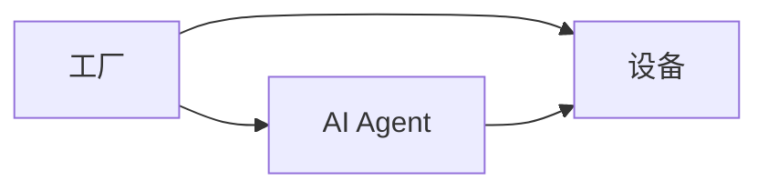
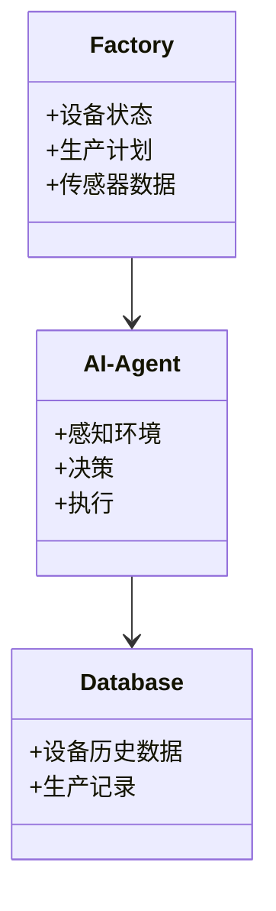
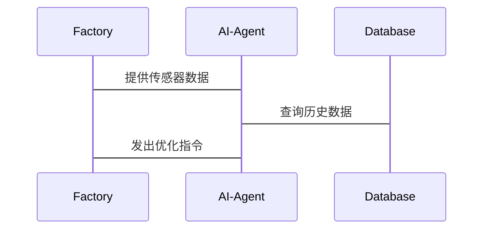

                 


# 《AI Agent在智能制造中的实践案例》

## 关键词：AI Agent, 智能制造, 工业自动化, 人工智能, 工业机器人, 智能供应链

## 摘要：  
本文将深入探讨AI Agent在智能制造中的实际应用案例，结合背景介绍、核心概念、算法原理、系统架构、项目实战等内容，全面解析AI Agent如何赋能智能制造。通过具体案例分析，本文将展示AI Agent在智能工厂、工业机器人、智能供应链等领域的实际应用，帮助读者理解AI Agent在智能制造中的价值和未来发展趋势。

---

# 第一章：智能制造与AI Agent的背景介绍

## 1.1 智能制造的定义与特点

### 1.1.1 智能制造的定义  
智能制造是一种基于人工智能、大数据、物联网等技术的先进制造模式，旨在通过智能化的生产、管理和服务，实现制造过程的高效、灵活和可持续。

### 1.1.2 智能制造的核心特点  
智能制造具有以下核心特点：  
1. **智能化**：通过AI技术实现自主决策和优化。  
2. **数字化**：利用数字技术实现生产过程的全数字化管理。  
3. **网络化**：通过物联网和工业互联网实现设备、系统之间的互联互通。  
4. **个性化**：支持定制化生产，满足多样化的客户需求。  

### 1.1.3 智能制造的行业应用现状  
智能制造已在汽车、电子、化工、制药等行业得到广泛应用，尤其是在工业机器人、智能供应链和智能工厂等领域取得了显著成果。

---

## 1.2 AI Agent的基本概念

### 1.2.1 AI Agent的定义  
AI Agent（人工智能代理）是一种能够感知环境、自主决策并执行任务的智能实体。它可以是一个软件程序、机器人或其他智能设备。

### 1.2.2 AI Agent的核心属性与特征  
1. **自主性**：能够自主决策，无需人工干预。  
2. **反应性**：能够实时感知环境变化并做出响应。  
3. **学习能力**：通过机器学习算法不断优化自身性能。  
4. **协作性**：能够与其他AI Agent或系统协同工作。  

### 1.2.3 AI Agent与传统自动化系统的区别  
AI Agent的核心区别在于其智能化和自主性。传统自动化系统基于固定的程序运行，而AI Agent能够通过学习和优化实现动态调整。

---

## 1.3 智能制造中的AI Agent应用场景

### 1.3.1 智能工厂中的AI Agent  
AI Agent在智能工厂中用于优化生产计划、设备维护和质量控制。例如，AI Agent可以通过分析传感器数据预测设备故障，从而实现预防性维护。

### 1.3.2 工业机器人与AI Agent的结合  
工业机器人通过集成AI Agent实现智能化操作，例如自主路径规划、视觉识别和协作机器人（Cobots）的应用。

### 1.3.3 智能供应链中的AI Agent  
AI Agent在智能供应链中用于需求预测、库存优化和物流调度。例如，AI Agent可以根据历史销售数据和市场趋势预测需求，并优化库存管理。

---

## 1.4 本章小结  
本章介绍了智能制造的定义、特点及其行业应用现状，并详细阐述了AI Agent的基本概念、核心属性以及在智能制造中的应用场景。

---

# 第二章：AI Agent的核心概念与联系

## 2.1 AI Agent的核心原理

### 2.1.1 AI Agent的感知与决策机制  
AI Agent通过传感器或API接口获取环境数据，利用机器学习算法进行分析，并基于分析结果做出决策。

### 2.1.2 AI Agent的学习与优化算法  
AI Agent通常采用强化学习（Reinforcement Learning）或监督学习（Supervised Learning）算法进行优化。例如，强化学习通过奖励机制优化AI Agent的行为策略。

### 2.1.3 AI Agent的通信与协作能力  
AI Agent能够通过标准协议与其他系统或AI Agent进行通信，并通过分布式协作实现复杂任务的完成。

---

## 2.2 AI Agent与智能制造系统的实体关系

### 2.2.1 实体关系图（Mermaid）



### 2.2.2 AI Agent与传统自动化系统的对比表  

| 属性       | AI Agent                     | 传统自动化系统               |
|------------|------------------------------|-----------------------------|
| 智能性     | 高                           | 无或低                      |
| 自主性     | 高                           | 低或无                      |
| 学习能力   | 高                           | 无或低                      |
| 适应性     | 高                           | 低或无                      |

---

## 2.3 本章小结  
本章详细介绍了AI Agent的核心原理，并通过实体关系图和对比表展示了AI Agent与智能制造系统之间的关系。

---

# 第三章：AI Agent的算法原理

## 3.1 强化学习算法原理

### 3.1.1 强化学习的定义与特点  
强化学习是一种通过试错机制优化决策策略的机器学习方法。其核心是通过与环境的交互获得奖励，并基于奖励优化行为策略。

### 3.1.2 强化学习的数学模型  
强化学习的核心数学模型包括状态（State）、动作（Action）、奖励（Reward）和策略（Policy）。状态转移可以通过马尔可夫决策过程（MDP）建模。

### 3.1.3 强化学习的算法实现  
常用的强化学习算法包括Q-Learning和Deep Q-Network（DQN）。以下是Q-Learning的伪代码实现：

```python
def q_learning():
    while True:
        state = get_current_state()
        action = choose_action(state)
        reward = get_reward(state, action)
        next_state = get_next_state()
        update_q_table(state, action, reward, next_state)
```

### 3.1.4 强化学习的优缺点  
- **优点**：适合动态环境，能够实现自主决策。  
- **缺点**：需要大量的训练数据，计算成本较高。  

---

## 3.2 监督学习算法原理

### 3.2.1 监督学习的定义与特点  
监督学习是一种基于标注数据训练模型的机器学习方法。其核心是通过输入-输出对训练模型，使其能够对新数据进行预测。

### 3.2.2 监督学习的数学模型  
监督学习的数学模型通常基于损失函数和优化器。例如，线性回归的损失函数为均方误差（MSE）。

$$ \text{MSE} = \frac{1}{n}\sum_{i=1}^{n}(y_i - \hat{y}_i)^2 $$

### 3.2.3 监督学习的算法实现  
常用的监督学习算法包括线性回归和随机森林。以下是线性回归的Python实现示例：

```python
from sklearn.linear_model import LinearRegression

model = LinearRegression()
model.fit(X_train, y_train)
y_pred = model.predict(X_test)
```

---

## 3.3 本章小结  
本章介绍了AI Agent中常用的强化学习和监督学习算法，并通过数学公式和代码示例展示了其原理和实现方法。

---

# 第四章：AI Agent的系统架构与设计

## 4.1 系统架构设计

### 4.1.1 系统功能设计  
智能制造系统的核心功能包括生产监控、设备维护、供应链优化和质量控制。

### 4.1.2 系统架构图（Mermaid）



### 4.1.3 系统接口设计  
系统接口设计包括设备接口、数据库接口和用户接口。设备接口用于与工业机器人通信，数据库接口用于存储和检索数据，用户接口用于人机交互。

---

## 4.2 系统交互设计

### 4.2.1 系统交互流程（Mermaid）



---

## 4.3 本章小结  
本章通过系统架构图和交互流程图展示了AI Agent在智能制造系统中的设计与实现。

---

# 第五章：AI Agent的项目实战

## 5.1 智能质量检测案例

### 5.1.1 项目背景  
某汽车制造厂需要通过AI Agent实现车身缺陷的自动检测。

### 5.1.2 环境配置  
- **硬件**：工业相机、PC  
- **软件**：OpenCV、深度学习框架（如TensorFlow）

### 5.1.3 系统实现  
以下是基于OpenCV的图像处理代码示例：

```python
import cv2

# 读取图像
img = cv2.imread("defect.jpg")

# 图像预处理
gray = cv2.cvtColor(img, cv2.COLOR_BGR2GRAY)
edges = cv2.Canny(gray, 50, 150)

# 检测边缘
cv2.imshow("Edges", edges)
cv2.waitKey(0)
cv2.destroyAllWindows()
```

### 5.1.4 实验结果  
通过实验，AI Agent能够准确识别车身缺陷，并将结果反馈给生产线进行修复。

---

## 5.2 本章小结  
本章通过智能质量检测案例展示了AI Agent在智能制造中的实际应用，并详细讲解了项目的实现过程。

---

# 第六章：总结与展望

## 6.1 本文总结  
本文详细介绍了AI Agent在智能制造中的应用场景、算法原理和系统架构，并通过具体案例展示了其实际价值。

## 6.2 未来展望  
随着AI技术的不断发展，AI Agent在智能制造中的应用将更加广泛。未来，AI Agent将与边缘计算、5G等技术结合，进一步提升智能制造的智能化水平。

---

## 6.3 最佳实践 Tips  

1. 在实际应用中，建议结合具体业务需求选择合适的AI算法。  
2. 系统设计时，要注意系统的可扩展性和可维护性。  
3. 数据是AI Agent的核心，建议重视数据的采集和质量管理。  

---

## 6.4 本章小结  
本章总结了本文的主要内容，并展望了AI Agent在智能制造中的未来发展方向。

---

# 参考文献  
（此处列出相关文献和资源）

---

通过以上目录和内容安排，本文将系统地介绍AI Agent在智能制造中的实践案例，帮助读者全面理解AI Agent的技术原理和实际应用价值。

