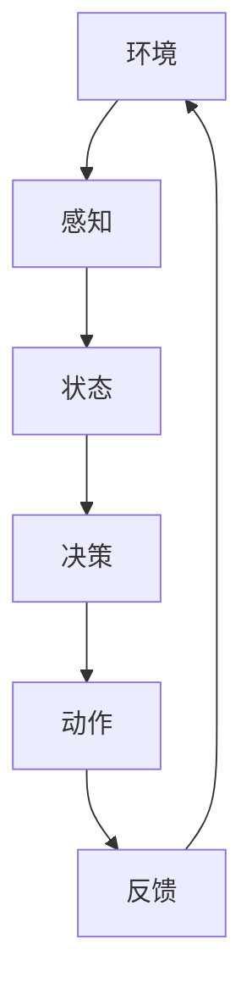
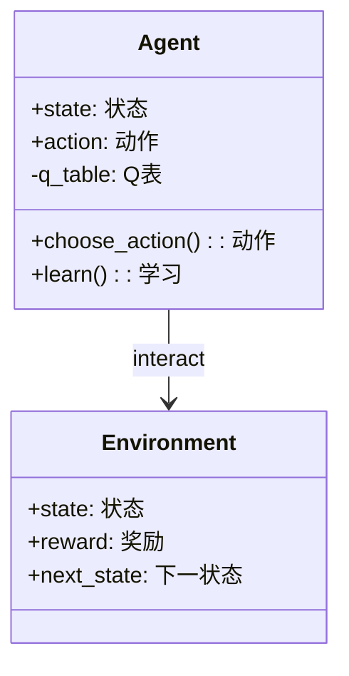
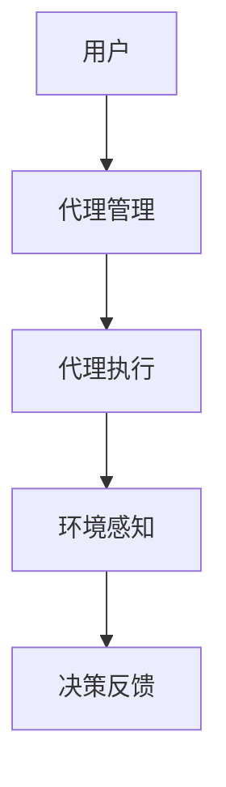
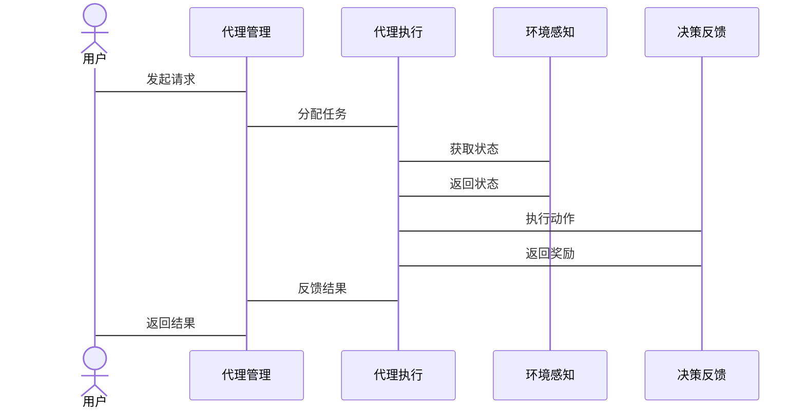

                 


# AI Agent在智能制造中的应用

> 关键词：AI Agent，智能制造，强化学习，知识图谱，系统架构，项目实战

> 摘要：本文详细探讨了AI Agent在智能制造中的应用，从背景与概念、核心算法、系统架构到项目实战，层层剖析，展示了AI Agent如何赋能智能制造的各个环节，包括生产优化、质量检测、供应链管理等，并通过实际案例分析，揭示了其在提高效率、降低成本和提升决策能力方面的巨大潜力。同时，本文还提供了最佳实践建议，帮助读者在实际应用中更好地部署和优化AI Agent系统。

---

# 第一部分: AI Agent与智能制造的背景与概念

# 第1章: AI Agent与智能制造概述

## 1.1 AI Agent的基本概念
### 1.1.1 AI Agent的定义与特点
AI Agent（人工智能代理）是指能够感知环境、自主决策并执行任务的智能体。其特点包括自主性、反应性、主动性、社交性和学习性。AI Agent能够通过传感器或数据输入感知环境，通过算法分析信息，并基于目标驱动做出决策和行动。

### 1.1.2 AI Agent的核心功能与分类
AI Agent的核心功能包括感知、推理、规划、学习和执行。根据应用场景的不同，AI Agent可以分为简单反射型、基于模型的反应型、目标驱动型和实用驱动型。

### 1.1.3 AI Agent与传统自动化的区别
传统自动化基于固定的程序和规则，而AI Agent具有学习和自适应能力，能够根据环境变化动态调整行为。传统自动化适用于简单重复任务，而AI Agent适用于复杂决策和不确定性环境。

## 1.2 智能制造的定义与特点
### 1.2.1 智能制造的定义
智能制造是一种通过数字化、网络化和智能化技术实现从设计、生产到服务的全生命周期优化的制造模式。

### 1.2.2 智能制造的核心技术与发展趋势
智能制造的核心技术包括工业物联网（IIoT）、工业大数据、人工智能（AI）、云计算和数字孪生。发展趋势包括智能化、网络化、协同化和绿色化。

### 1.2.3 智能制造与工业4.0的关系
工业4.0是智能制造的前身，强调通过智能化生产系统和Cyber-Physical Systems（CPS）实现无人工厂的目标。智能制造是工业4.0的进一步发展和深化。

## 1.3 AI Agent在智能制造中的融合与应用
### 1.3.1 AI Agent与智能制造的协同机制
AI Agent通过与工业物联网、工业大数据和工业AI的协同，实现智能制造中的智能决策、自主优化和实时反馈。

### 1.3.2 AI Agent在智能制造中的应用场景
AI Agent在智能制造中的应用场景包括生产优化、质量检测、供应链管理、设备维护和产品设计优化。

### 1.3.3 当前AI Agent在智能制造中的应用现状与趋势
当前，AI Agent在智能制造中的应用尚处于起步阶段，主要集中在单点优化和局部决策。未来，随着AI技术的进步和工业数字化的深化，AI Agent将更加广泛地应用于全局优化和智能协同。

## 1.4 本章小结
本章介绍了AI Agent和智能制造的基本概念、特点及二者的融合与应用，为后续章节的分析奠定了基础。

---

# 第二部分: AI Agent的核心概念与原理

# 第2章: AI Agent的核心概念与联系

## 2.1 AI Agent的核心概念原理
### 2.1.1 AI Agent的感知与决策机制
AI Agent通过传感器或数据输入感知环境，利用算法进行推理和规划，基于目标驱动做出决策并执行任务。

### 2.1.2 AI Agent的自主性与适应性
AI Agent的自主性体现在无需外部干预即可完成任务，适应性则体现在能够根据环境变化动态调整行为。

### 2.1.3 AI Agent的协作与通信能力
AI Agent能够通过通信接口与其他Agent或系统协同工作，实现任务分配、信息共享和决策共识。

## 2.2 AI Agent与智能制造核心要素的对比分析
### 2.2.1 AI Agent与工业物联网的对比
工业物联网侧重于数据采集和设备连接，而AI Agent强调数据的分析和智能决策。

### 2.2.2 AI Agent与工业大数据的对比
工业大数据关注数据的存储和分析，而AI Agent注重数据的实时处理和决策优化。

### 2.2.3 AI Agent与工业AI的对比
工业AI侧重于模型训练和预测，而AI Agent强调实时决策和自主行动。

## 2.3 AI Agent在智能制造中的ER实体关系图
```mermaid
er
  actor: 用户
  system: 制造系统
  agent: AI Agent
  action: 行为
  relation: 关系
  actor --> action: 提供指令
  system --> action: 提供环境数据
  agent --> action: 执行决策
  agent --> system: 输出结果
  action --> relation: 关联关系
```

## 2.4 本章小结
本章通过对比分析和ER图展示了AI Agent在智能制造中的核心概念和联系，为后续的算法和系统设计提供了理论支持。

---

# 第三部分: AI Agent的算法原理与数学模型

# 第3章: AI Agent的核心算法原理

## 3.1 强化学习算法在AI Agent中的应用
### 3.1.1 强化学习的基本原理
强化学习是一种通过试错机制，基于奖励信号优化决策策略的学习方法。其核心是通过最大化累积奖励来优化动作选择。

### 3.1.2 Q-learning算法的实现
Q-learning算法是一种经典的强化学习算法，适用于离散动作空间和状态空间。其更新公式为：
$$ Q(s,a) = Q(s,a) + \alpha (r + \gamma \max Q(s',a') - Q(s,a)) $$

### 3.1.3 Deep Q-Network (DQN)算法的优化
DQN算法通过深度神经网络近似Q值函数，解决了传统Q-learning算法在高维状态空间中的计算难题。其核心思想是通过经验回放和目标网络来稳定训练过程。

## 3.2 知识图谱在AI Agent中的应用
### 3.2.1 知识图谱的基本原理
知识图谱是一种结构化的数据表示方式，用于表示实体之间的关系和属性。其核心是通过图结构建模知识。

### 3.2.2 知识图谱的构建与推理
知识图谱的构建包括数据抽取、实体识别和关系抽取。推理则是通过图遍历算法（如BFS和DFS）进行路径分析和属性推断。

### 3.2.3 知识图谱的表示学习
知识图谱的表示学习通过将实体和关系映射到低维向量空间，实现高效的相似性计算和语义理解。

## 3.3 基于强化学习的AI Agent算法实现


```python
import numpy as np
class QLearningAgent:
    def __init__(self, state_space_size, action_space_size):
        self.q_table = np.zeros((state_space_size, action_space_size))
        self.learning_rate = 0.1
        self.discount_factor = 0.9
        self.epsilon = 0.1
    
    def choose_action(self, state):
        if np.random.random() < self.epsilon:
            return np.random.randint(0, self.action_space_size)
        return np.argmax(self.q_table[state])
    
    def learn(self, current_state, action, reward, next_state):
        target = reward + self.discount_factor * np.max(self.q_table[next_state])
        self.q_table[current_state][action] = self.q_table[current_state][action] + self.learning_rate * (target - self.q_table[current_state][action])
```

## 3.4 本章小结
本章通过强化学习和知识图谱的算法实现，详细介绍了AI Agent的核心算法原理及其在智能制造中的应用潜力。

---

# 第四部分: AI Agent的系统分析与架构设计

# 第4章: AI Agent的系统分析与架构设计

## 4.1 系统分析与问题场景
### 4.1.1 制造系统的典型场景
智能制造中的典型场景包括生产优化、质量检测、设备维护和供应链管理。

### 4.1.2 AI Agent在制造系统中的角色
AI Agent在制造系统中充当智能决策者和执行者，能够实时感知环境、优化决策并执行任务。

## 4.2 系统功能设计
### 4.2.1 领域模型设计


### 4.2.2 系统架构设计


## 4.3 接口设计与交互流程
### 4.3.1 系统接口设计
系统接口包括代理管理接口、环境感知接口和决策反馈接口。

### 4.3.2 系统交互流程


## 4.4 本章小结
本章通过系统分析与架构设计，展示了AI Agent在智能制造中的实现方式和应用场景。

---

# 第五部分: AI Agent的项目实战

# 第5章: AI Agent的项目实战

## 5.1 项目背景与环境搭建
### 5.1.1 项目背景
本项目旨在通过AI Agent实现智能制造中的生产优化任务。

### 5.1.2 环境搭建
安装Python、TensorFlow和Keras等依赖库。

## 5.2 项目核心实现
### 5.2.1 核心代码实现
```python
import numpy as np
from keras.models import Sequential
from keras.layers import Dense

class DeepQNetwork:
    def __init__(self, input_dim, output_dim):
        self.model = Sequential()
        self.model.add(Dense(24, activation='relu', input_dim=input_dim))
        self.model.add(Dense(output_dim, activation='linear'))
        self.model.compile(optimizer='adam', loss='mse')
    
    def predict(self, state):
        return self.model.predict(np.array([state]))[0]
    
    def train(self, states, targets):
        self.model.fit(np.array(states), np.array(targets), epochs=1, verbose=0)
```

### 5.2.2 代码应用解读与分析
AI Agent通过深度Q网络实现智能决策，能够在复杂环境中找到最优策略。

## 5.3 项目实战：生产优化案例分析
### 5.3.1 案例背景
某制造企业希望通过AI Agent优化生产排程，降低生产成本。

### 5.3.2 案例分析与实施
通过AI Agent的强化学习算法，优化生产排程，提升生产效率和资源利用率。

## 5.4 本章小结
本章通过项目实战，展示了AI Agent在智能制造中的具体应用，验证了其在生产优化中的潜力。

---

# 第六部分: AI Agent的最佳实践与总结

# 第6章: AI Agent的最佳实践与总结

## 6.1 最佳实践
### 6.1.1 数据质量管理
确保数据的准确性和完整性，是AI Agent发挥效用的前提。

### 6.1.2 模型选择与优化
根据具体场景选择合适的算法，并通过持续优化提升模型性能。

### 6.1.3 安全性与可解释性
确保AI Agent系统的安全性，同时提升系统的可解释性，便于管理和维护。

## 6.2 小结
AI Agent在智能制造中的应用前景广阔，但其落地需要结合实际场景，注重数据质量、算法优化和系统安全。

## 6.3 注意事项
在实际应用中，需要注意AI Agent的实时性、可靠性和可扩展性，避免因系统故障导致生产中断。

## 6.4 拓展阅读
推荐阅读《强化学习入门》和《知识图谱与语义理解》等书籍，深入学习AI Agent的核心技术。

---

# 附录: 代码示例

```python
import numpy as np
from keras.models import Sequential
from keras.layers import Dense

class AI_Agent:
    def __init__(self, state_space_size, action_space_size):
        self.model = Sequential()
        self.model.add(Dense(24, activation='relu', input_dim=state_space_size))
        self.model.add(Dense(action_space_size, activation='linear'))
        self.model.compile(optimizer='adam', loss='mse')
    
    def感知环境(self, state):
        return self.model.predict(np.array([state]))[0]
    
    def 执行动作(self, action, env):
        return env.execute_action(action)
```

---

# 结语

AI Agent作为智能制造的核心技术之一，正在推动制造业向智能化、网络化和协同化方向发展。未来，随着AI技术的不断进步，AI Agent将在智能制造中发挥更大的作用，为企业创造更大的价值。

--- 

以上是《AI Agent在智能制造中的应用》的技术博客文章的完整目录和内容大纲。

