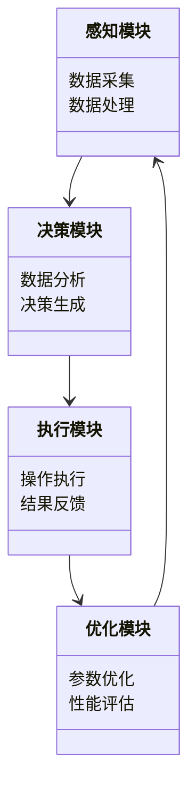

                 


# AI Agent在智能制造中的角色与实践

## 关键词：人工智能代理、智能制造、算法原理、系统架构、项目实战

## 摘要：  
随着工业4.0和智能制造的快速发展，人工智能代理（AI Agent）在制造过程中的应用日益广泛。本文从AI Agent的基本概念出发，分析其在智能制造中的核心作用，详细探讨其算法原理、数学模型、系统架构设计，并结合实际案例进行项目实战演示，最后总结最佳实践和未来发展方向。

---

# 第1章: AI Agent与智能制造的背景介绍

## 1.1 AI Agent的定义与核心概念

### 1.1.1 AI Agent的基本定义  
人工智能代理（AI Agent）是指能够感知环境、自主决策并采取行动以实现目标的智能体。它具备学习、推理、规划和自适应能力，能够在复杂环境中完成任务。

### 1.1.2 AI Agent的核心属性与特征  
- **自主性**：能够在没有外部干预的情况下自主运行。  
- **反应性**：能够实时感知环境变化并做出响应。  
- **目标导向性**：所有行动都围绕实现特定目标展开。  
- **社交能力**：能够与其他系统或人类进行交互和协作。

### 1.1.3 AI Agent与传统自动化的区别  
| 属性          | 传统自动化                  | AI Agent                     |
|---------------|-----------------------------|----------------------------|
| 决策能力      | 基于预设规则                | 具备自主学习与决策能力      |
| 环境适应性    | 适应性有限                  | 高度适应动态环境            |
| 任务处理方式  | 单一任务                    | 多任务处理与协作            |

## 1.2 智能制造的背景与现状

### 1.2.1 智能制造的定义与内涵  
智能制造是一种通过物联网、大数据、人工智能等技术实现生产过程智能化的新型制造模式，旨在提高生产效率、降低成本并增强灵活性。

### 1.2.2 智能制造的发展历程与趋势  
智能制造经历了从机械化、自动化到信息化、数字化的演变，当前正向智能化方向发展，核心是实现生产系统的智能化决策与自主优化。

### 1.2.3 AI Agent与智能制造的关系  
AI Agent作为智能制造的核心技术之一，通过实时数据处理、自主决策和优化控制，推动生产过程的智能化转型。

---

# 第2章: AI Agent的核心概念与原理

## 2.1 AI Agent的核心概念解析

### 2.1.1 AI Agent的决策机制  
AI Agent的决策机制包括感知、推理和行动三个步骤：  
1. **感知**：通过传感器或数据接口获取环境信息。  
2. **推理**：基于感知信息进行分析和判断，生成决策方案。  
3. **行动**：根据决策结果执行相应操作。

### 2.1.2 AI Agent的学习能力  
AI Agent通过监督学习、强化学习和无监督学习等方式不断优化自身的决策模型。

### 2.1.3 AI Agent的自适应能力  
AI Agent能够根据环境变化动态调整自身参数和行为模式，以适应不同的生产场景。

## 2.2 AI Agent与相关概念的对比分析

### 2.2.1 AI Agent与传统自动化系统的对比  
- **传统自动化系统**：基于固定的程序和规则运行，不具备自主决策能力。  
- **AI Agent**：具备自主学习和决策能力，能够适应复杂环境的变化。

### 2.2.2 AI Agent与工业机器人之间的区别  
- **工业机器人**：主要用于执行特定的物理操作，依赖于预设程序。  
- **AI Agent**：作为决策中枢，协调机器人和其他设备完成复杂任务。

---

# 第3章: AI Agent的算法原理与数学模型

## 3.1 基于强化学习的AI Agent算法

### 3.1.1 强化学习的基本原理  
强化学习是一种通过试错机制优化决策模型的算法。AI Agent通过与环境的交互获得奖励或惩罚，逐步优化自身的策略。

### 3.1.2 强化学习的数学模型  
强化学习的核心公式包括：  
- **状态空间**：$S$ 表示所有可能的状态集合。  
- **动作空间**：$A$ 表示所有可能的动作集合。  
- **奖励函数**：$R(s, a)$ 表示在状态$s$下执行动作$a$获得的奖励。  
- **策略函数**：$\pi(a|s)$ 表示在状态$s$下选择动作$a$的概率。  

### 3.1.3 强化学习的实现流程  
1. 初始化策略函数和参数。  
2. 在环境中执行动作，观察状态和奖励。  
3. 根据奖励更新策略函数。  
4. 重复上述步骤直到收敛。

### 3.1.4 Python实现代码  
```python
import numpy as np
import gym

# 初始化环境
env = gym.make('CartPole-v0')
env.seed(42)

# 初始化参数
learning_rate = 0.01
gamma = 0.99

# 策略函数
def policy(state, theta):
    return np.tanh(np.dot(state, theta))

# 值函数
def value_function(state, theta_v):
    return np.tanh(np.dot(state, theta_v))

# 策略梯度算法实现
# ...（省略具体实现细节）
```

---

# 第4章: AI Agent的系统架构设计

## 4.1 系统功能模块设计

### 4.1.1 系统功能模块划分  
- **感知模块**：负责数据采集和环境感知。  
- **决策模块**：负责基于感知数据进行决策。  
- **执行模块**：负责根据决策结果执行操作。  
- **优化模块**：负责优化系统性能和参数。  

### 4.1.2 系统功能流程  
1. 感知模块采集环境数据并传递给决策模块。  
2. 决策模块基于数据生成决策方案。  
3. 执行模块根据决策方案执行操作。  
4. 优化模块根据执行结果优化系统参数。

### 4.1.3 系统功能的Mermaid类图  


---

# 第5章: AI Agent的项目实战

## 5.1 项目环境与工具安装

### 5.1.1 环境需求  
- 操作系统：Linux或Windows。  
- Python版本：3.6以上。  
- 需要安装的库：TensorFlow、Keras、OpenAI Gym等。

### 5.1.2 工具安装命令  
```bash
pip install numpy gym tensorflow
```

## 5.2 核心代码实现

### 5.2.1 感知模块代码  
```python
import gym

env = gym.make('CartPole-v0')
env.seed(42)
```

### 5.2.2 决策模块代码  
```python
import numpy as np
import gym

class AI-Agent:
    def __init__(self, state_dim, action_dim):
        self.theta = np.random.randn(state_dim, action_dim)
```

### 5.2.3 执行模块代码  
```python
def execute_action(env, action):
    obs, reward, done, info = env.step(action)
    return obs, reward, done
```

### 5.2.4 优化模块代码  
```python
def optimize_model(theta, reward):
    # 使用强化学习算法更新theta
    pass
```

## 5.3 实际案例分析

### 5.3.1 案例背景  
在智能制造中，AI Agent可以用于优化生产流程，例如动态调整生产线参数以提高产量。

### 5.3.2 案例实现  
```python
# 初始化环境
env = gym.make('CartPole-v0')
env.seed(42)

# 初始化参数
theta = np.random.randn(4, 1)

# 训练过程
for episode in range(1000):
    state = env.reset()
    total_reward = 0
    while not done:
        action = policy(state, theta)
        next_state, reward, done, _ = env.step(action)
        total_reward += reward
        # 更新策略参数
        update_policy(theta, state, action, reward)
    print(f"Episode {episode}, Reward: {total_reward}")
```

### 5.3.3 案例分析与总结  
通过上述代码实现，AI Agent能够逐步优化其决策策略，从而在复杂环境中实现最优控制。

---

# 第6章: 最佳实践与小结

## 6.1 小结  
本文详细介绍了AI Agent在智能制造中的核心作用，从算法原理到系统架构，再到项目实战，全面展示了AI Agent的应用场景和实现方法。

## 6.2 注意事项  
- 确保数据质量和实时性，这对AI Agent的决策至关重要。  
- 定期优化算法模型，以适应不断变化的生产环境。  
- 注意系统安全性和容错性，避免因AI Agent故障导致生产中断。

## 6.3 拓展阅读  
- 《强化学习：算法与应用》  
- 《智能制造系统架构与实践》  
- 《人工智能在工业自动化中的应用》  

---

通过以上章节的详细讲解，读者可以全面了解AI Agent在智能制造中的角色与实践，为实际应用提供理论支持和实践指导。

