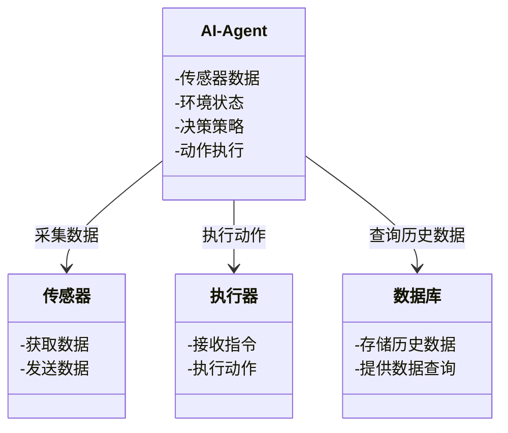
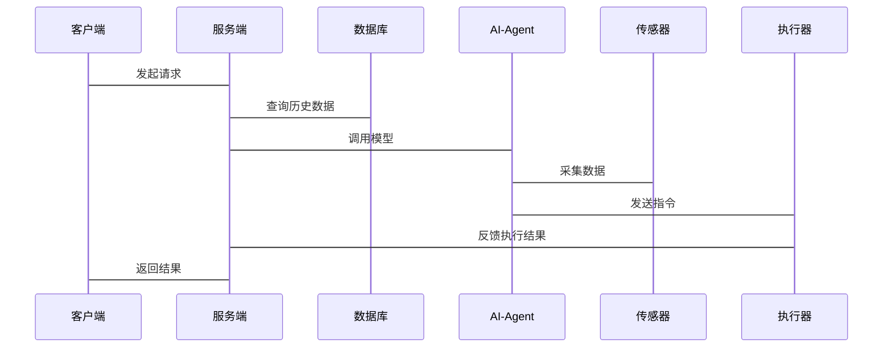

                 


# AI Agent在智能制造质量控制中的角色

## 关键词：AI Agent，智能制造，质量控制，强化学习，监督学习，系统架构

## 摘要：本文探讨了AI Agent在智能制造质量控制中的核心角色，分析了其在缺陷检测、过程监控和质量预测等方面的应用，详细讲解了相关算法原理和系统架构设计，最后通过实际案例展示了AI Agent在质量控制中的巨大潜力。

---

## 第1章: 智能制造与质量控制概述

### 1.1 智能制造的定义与现状

#### 1.1.1 智能制造的定义
智能制造是一种以数据驱动、自动化和智能化为核心的制造模式，通过物联网（IoT）、大数据、人工智能（AI）和云计算等技术，实现从设计、生产到交付的全生命周期智能化管理。

#### 1.1.2 智能制造的发展历程
智能制造的概念起源于20世纪90年代，随着工业4.0的提出，智能制造在全球范围内得到快速发展。近年来，AI技术的突破进一步推动了智能制造的普及。

#### 1.1.3 智能制造的核心技术
智能制造的核心技术包括物联网、大数据分析、人工智能、机器人技术和区块链等。

### 1.2 质量控制在智能制造中的重要性

#### 1.2.1 质量控制的基本概念
质量控制是指在生产过程中通过检测和监控确保产品符合既定标准的过程。在智能制造中，质量控制不仅是生产过程的一部分，更是实现高效生产和客户满意度的关键。

#### 1.2.2 智能制造中的质量控制挑战
传统质量控制方法依赖人工检测，存在效率低、成本高等问题。随着生产复杂性的增加，传统方法难以满足智能制造的需求。

#### 1.2.3 质量控制对智能制造的价值
高质量的产品是企业竞争力的核心，智能制造中的质量控制能够显著提高生产效率、降低缺陷率，同时优化资源利用。

### 1.3 AI Agent的基本概念

#### 1.3.1 什么是AI Agent
AI Agent是一种智能体，能够感知环境、自主决策并执行任务。它能够通过传感器获取数据，利用算法进行分析，并根据结果采取行动。

#### 1.3.2 AI Agent的分类
AI Agent可以根据智能水平分为简单反射型、基于模型的反应型、目标驱动型和效用驱动型。

#### 1.3.3 AI Agent的特点与优势
AI Agent的特点包括自主性、反应性、目标导向和学习能力。其优势在于能够适应动态环境，快速做出决策。

### 1.4 AI Agent在质量控制中的应用背景

#### 1.4.1 质量控制中的传统方法
传统质量控制方法包括人工检查、统计过程控制（SPC）和简单的自动化检测。

#### 1.4.2 传统方法的局限性
传统方法效率低、成本高，且难以应对复杂多变的生产环境。

#### 1.4.3 AI Agent在质量控制中的潜力
AI Agent能够通过实时数据处理和深度学习模型，显著提高质量控制的效率和准确性。

## 第2章: AI Agent在智能制造质量控制中的核心概念

### 2.1 AI Agent的核心原理

#### 2.1.1 AI Agent的基本原理
AI Agent通过感知环境、分析数据、制定决策并执行动作来实现目标。其核心是算法和数据处理能力。

#### 2.1.2 AI Agent的感知与决策机制
AI Agent通过传感器获取数据，利用算法进行分析，生成决策，并通过执行器采取行动。

#### 2.1.3 AI Agent的学习与优化
AI Agent能够通过强化学习和监督学习不断优化自身的算法和决策模型。

### 2.2 AI Agent与智能制造系统的关联

#### 2.2.1 AI Agent在智能制造系统中的角色
AI Agent作为系统的核心组件，负责数据处理、决策制定和任务执行。

#### 2.2.2 AI Agent与其他系统组件的交互
AI Agent与其他系统组件如传感器、执行器和数据库进行交互，实现数据的实时处理和系统的协同工作。

#### 2.2.3 AI Agent在智能制造中的价值链
AI Agent能够优化生产流程、降低缺陷率、提高生产效率，从而提升企业的整体竞争力。

### 2.3 AI Agent在质量控制中的具体应用

#### 2.3.1 缺陷检测
AI Agent可以通过图像识别和深度学习模型，实现对产品质量的实时检测。

#### 2.3.2 过程监控
AI Agent能够监控生产过程中的关键参数，及时发现异常并采取纠正措施。

#### 2.3.3 质量预测与优化
AI Agent通过分析历史数据和实时数据，预测未来可能出现的质量问题，并优化生产参数。

### 2.4 AI Agent在质量控制中的优势

#### 2.4.1 高效性
AI Agent能够快速处理大量数据，显著提高质量控制的效率。

#### 2.4.2 准确性
通过深度学习和强化学习，AI Agent能够实现高精度的质量检测。

#### 2.4.3 可扩展性
AI Agent能够轻松扩展到不同的生产环境和产品类型。

## 第3章: AI Agent在智能制造质量控制中的算法原理

### 3.1 基于强化学习的AI Agent算法

#### 3.1.1 强化学习的基本原理
强化学习是一种通过试错机制，通过与环境的交互来学习最优策略的方法。其核心是通过奖励机制优化动作选择。

#### 3.1.2 AI Agent在强化学习中的角色
AI Agent作为智能体，通过与环境交互，学习最优策略以最大化累计奖励。

#### 3.1.3 强化学习在质量控制中的应用
在质量控制中，强化学习可以用于优化检测策略和生产参数调整。

### 3.2 基于监督学习的AI Agent算法

#### 3.2.1 监督学习的基本原理
监督学习是一种通过标注数据训练模型，使其能够对新数据进行分类或回归预测的方法。

#### 3.2.2 AI Agent在监督学习中的应用
AI Agent可以通过监督学习模型进行缺陷分类和质量预测。

#### 3.2.3 监督学习在质量控制中的优势
监督学习能够通过大量标注数据进行训练，提高模型的准确性和稳定性。

### 3.3 算法实现与代码示例

#### 3.3.1 强化学习算法实现
```python
import numpy as np
import gym

env = gym.make('CartPole-v0')
env.seed(1)
np.random.seed(1)

class AIAgent:
    def __init__(self, env):
        self.env = env
        self.learning_rate = 0.01
        self.discount_factor = 0.99
        self.episode = 1000
        self.steps = 200
        
    def run(self):
        for _ in range(self.episode):
            state = self.env.reset()
            for _ in range(self.steps):
                action = self.policy(state)
                next_state, reward, done, _ = self.env.step(action)
                self.update_policy(state, action, reward, next_state)
                if done:
                    break
                state = next_state
        
    def policy(self, state):
        return self.env.action_space.sample()
        
    def update_policy(self, state, action, reward, next_state):
        pass
        
agent = AIAgent(env)
agent.run()
```

#### 3.3.2 监督学习算法实现
```python
from sklearn import svm

# 假设X为输入特征，y为标签
model = svm.SVC()
model.fit(X, y)
# 预测新样本
print(model.predict(X_new))
```

### 3.4 数学模型与公式

#### 3.4.1 强化学习中的Q-learning算法
在Q-learning中，智能体通过以下公式更新Q值：
$$ Q(s, a) = (1-\alpha) Q(s, a) + \alpha (r + \gamma \max Q(s', a')) $$
其中，$\alpha$是学习率，$\gamma$是折扣因子。

#### 3.4.2 监督学习中的线性回归模型
线性回归模型的损失函数为：
$$ L = \frac{1}{2n}\sum_{i=1}^{n} (y_i - \hat{y}_i)^2 $$
其中，$n$是样本数量，$y_i$是真实值，$\hat{y}_i$是预测值。

## 第4章: 系统分析与架构设计

### 4.1 问题场景介绍

#### 4.1.1 制造过程中的缺陷检测
在智能制造中，缺陷检测是质量控制的重要环节。AI Agent可以通过图像识别技术，实时检测产品中的缺陷。

#### 4.1.2 生产过程中的实时监控
AI Agent需要实时监控生产过程中的关键参数，如温度、压力和速度，以确保生产过程的稳定性。

### 4.2 系统功能设计

#### 4.2.1 领域模型设计
使用mermaid类图展示领域模型：


#### 4.2.2 系统架构设计
使用mermaid架构图展示系统架构：


### 4.3 系统接口设计

#### 4.3.1 系统接口
AI Agent需要与传感器、执行器和数据库进行交互，接口设计如下：
- 传感器接口：提供数据采集和发送的功能。
- 执行器接口：接收并执行AI Agent的指令。
- 数据库接口：存储和查询历史数据。

#### 4.3.2 交互序列图
使用mermaid序列图展示系统交互：


## 第5章: 项目实战

### 5.1 环境安装与配置

#### 5.1.1 安装Python
安装Python 3.8及以上版本，推荐使用Anaconda或miniconda。

#### 5.1.2 安装依赖库
安装必要的Python库，如TensorFlow、Keras、OpenCV和scikit-learn。

```bash
pip install numpy tensorflow keras scikit-learn
```

### 5.2 系统核心实现

#### 5.2.1 缺陷检测实现
使用深度学习模型进行缺陷检测：
```python
import cv2
import numpy as np
import tensorflow as tf

model = tf.keras.models.load_model('defect_model.h5')
image = cv2.imread('input.jpg')
image = cv2.resize(image, (224, 224))
image = image / 255.0
image = np.expand_dims(image, axis=0)
prediction = model.predict(image)
print('Prediction:', prediction)
```

#### 5.2.2 过程监控实现
通过强化学习实现生产过程的实时监控：
```python
import gym
from gym import spaces
import numpy as np

class QualityControlEnv(gym.Env):
    def __init__(self):
        self.observation_space = spaces.Box(low=0, high=1, shape=(1,))
        self.action_space = spaces.Discrete(2)
        self.current_state = 0

    def step(self, action):
        # 模拟生产过程的状态变化
        pass

    def reset(self):
        self.current_state = 0
        return self.current_state
```

### 5.3 代码解读与分析

#### 5.3.1 缺陷检测代码解读
上述代码加载预训练的深度学习模型，读取输入图像并进行缺陷检测。通过模型的预测结果，判断是否存在缺陷。

#### 5.3.2 强化学习代码解读
上述代码定义了一个强化学习环境，包括状态空间和动作空间。通过与环境的交互，AI Agent学习优化生产过程中的决策。

### 5.4 实际案例分析

#### 5.4.1 某汽车制造厂的应用
AI Agent用于实时检测汽车制造过程中的缺陷，显著降低了缺陷率，提高了生产效率。

#### 5.4.2 某电子制造厂的应用
通过AI Agent进行生产过程监控，优化了生产参数，降低了生产成本。

### 5.5 项目小结

## 第6章: 最佳实践与总结

### 6.1 小结
AI Agent在智能制造质量控制中的应用前景广阔，能够显著提高效率和准确性。

### 6.2 注意事项
在实际应用中，需要考虑数据质量、模型训练和系统的可扩展性。

### 6.3 拓展阅读
推荐阅读《机器学习实战》和《深度学习入门》等书籍，进一步了解AI Agent的相关知识。

---

# 结语

通过本文的详细分析，我们可以看到AI Agent在智能制造质量控制中的巨大潜力。随着技术的不断进步，AI Agent将在更多领域发挥重要作用，推动制造业的智能化转型。

