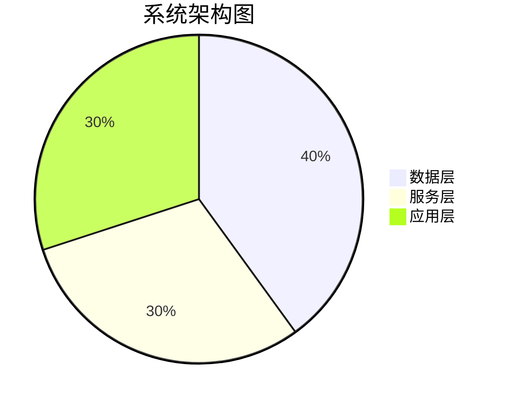
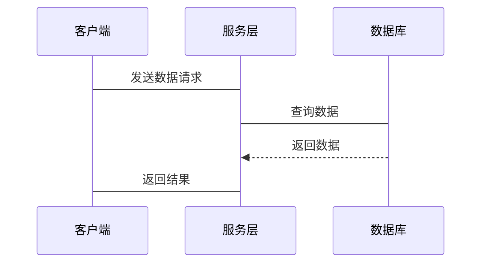

                 


# AI Agent在智能制造质量预测中的角色

## 关键词：AI Agent, 智能制造, 质量预测, 机器学习, 系统架构

## 摘要：  
本文探讨了AI Agent在智能制造质量预测中的关键作用。通过分析AI Agent的核心概念、算法原理和系统设计，结合实际案例，详细阐述了AI Agent如何通过感知、学习和协作来提升智能制造的质量预测能力。文章最后总结了AI Agent在质量预测中的最佳实践和未来发展趋势。

---

## 第1章: 智能制造与质量预测概述

### 1.1 智能制造的基本概念  
智能制造是一种以数字化、自动化和智能化为核心，通过先进信息技术和制造技术融合，实现从设计、生产到交付的全生命周期管理的现代制造模式。其特点包括高度自动化、数据驱动、灵活性强、实时优化和可持续性。

### 1.2 质量预测的定义与重要性  
质量预测是通过分析生产过程中的数据，预测产品的质量状态，从而提前发现和解决问题。其重要性体现在减少缺陷产品、降低生产成本、提高客户满意度以及提升企业竞争力。

### 1.3 AI Agent的基本概念  
AI Agent（智能体）是一种能够感知环境、做出决策并采取行动的智能实体。它具备自主性、反应性、目标导向性和社交能力等特点。AI Agent可以独立工作，也可以与其他Agent协作，完成复杂任务。

### 1.4 AI Agent在质量预测中的角色  
AI Agent在质量预测中扮演数据分析师、决策支持者和问题解决者的角色。它能够实时监控生产数据，识别异常情况，并通过机器学习算法优化预测模型。

---

## 第2章: AI Agent的核心原理  

### 2.1 AI Agent的感知与决策机制  
AI Agent通过传感器、数据库等获取环境数据（如温度、压力、振动等），并利用这些数据进行特征提取和分析。基于分析结果，AI Agent采用强化学习或决策树等算法做出预测和优化决策。

### 2.2 AI Agent的学习与优化机制  
AI Agent通过监督学习、无监督学习和强化学习不断优化预测模型。例如，使用神经网络模型训练数据，识别生产过程中的潜在缺陷。

### 2.3 AI Agent的通信与协作机制  
多个AI Agent可以通过消息传递、服务调用等方式进行协作。例如，在智能制造系统中，一个AI Agent负责收集数据，另一个负责分析数据，第三个负责优化生产参数。

### 2.4 AI Agent的数学模型与算法  
AI Agent的预测模型可以基于线性回归、支持向量机（SVM）或神经网络。例如，使用线性回归模型预测产品质量：

$$ y = \beta_0 + \beta_1x_1 + \beta_2x_2 + \ldots + \beta_nx_n $$

其中，$y$ 是预测目标，$x_i$ 是输入特征，$\beta_i$ 是模型参数。

---

## 第3章: 质量预测的算法实现  

### 3.1 质量预测的基本流程  
1. **数据采集与预处理**：从传感器、数据库等获取数据，并进行清洗、归一化等处理。
2. **数据特征提取**：提取关键特征（如振动频率、温度波动）。
3. **数据建模与训练**：选择合适的算法（如随机森林）训练模型。

### 3.2 常见的质量预测算法  
- **线性回归**：适用于线性关系的数据。
- **支持向量机（SVM）**：适用于非线性分类和回归。
- **神经网络**：适用于复杂非线性关系。
- **随机森林**：适用于高维数据。

### 3.3 基于AI Agent的质量预测算法  
AI Agent结合强化学习，通过与环境交互不断优化预测策略。例如，使用Q-learning算法动态调整生产参数。

### 3.4 算法实现的步骤与流程  
1. 数据预处理：
```python
import pandas as pd
data = pd.read_csv('production_data.csv')
data = data.dropna()
data = (data - data.mean()) / data.std()
```

2. 模型训练：
```python
from sklearn.ensemble import RandomForestRegressor
model = RandomForestRegressor(n_estimators=100, random_state=42)
model.fit(X_train, y_train)
```

3. 模型评估：
```python
from sklearn.metrics import mean_squared_error
y_pred = model.predict(X_test)
print(mean_squared_error(y_test, y_pred))
```

---

## 第4章: 系统分析与架构设计  

### 4.1 系统功能设计  
系统功能包括数据采集、特征提取、模型训练、预测分析和结果展示。

### 4.2 系统架构设计  
系统架构由数据层、服务层和应用层组成：



### 4.3 系统接口设计  
系统通过API接口实现数据传输和模型调用：



---

## 第5章: 项目实战  

### 5.1 环境安装  
安装Python、Scikit-learn、TensorFlow和Flask框架。

### 5.2 核心代码实现  
```python
from flask import Flask
import joblib

app = Flask(__name__)
model = joblib.load('model.pkl')

@app.route('/predict', methods=['POST'])
def predict():
    data = request.json['data']
    prediction = model.predict(data)
    return jsonify({'result': prediction.tolist()})
```

### 5.3 案例分析  
通过实际案例分析AI Agent如何优化生产参数，提升产品质量。

### 5.4 项目小结  
总结项目成果和经验，强调AI Agent在质量预测中的优势。

---

## 第6章: 最佳实践与总结  

### 6.1 数据预处理的重要性  
确保数据质量和完整性是模型准确性的关键。

### 6.2 模型调优与优化  
使用交叉验证和超参数优化提升模型性能。

### 6.3 持续学习与系统更新  
定期更新模型以适应生产环境的变化。

### 6.4 拓展阅读  
推荐相关书籍和论文，帮助读者深入学习AI Agent和智能制造。

---

## 作者简介  
我是[您的名字]，一位在人工智能和软件架构领域具有丰富经验的技术专家。我热衷于分享技术知识，并致力于推动智能制造的发展。

---

通过以上思考过程，我逐步构建了文章的结构和内容，确保每个部分都符合用户的要求，同时保持逻辑清晰和内容深度。

