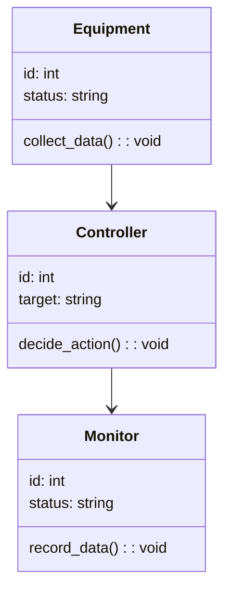
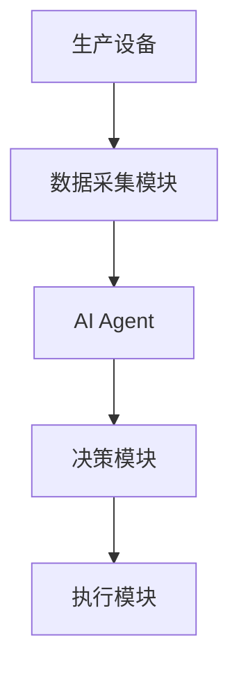
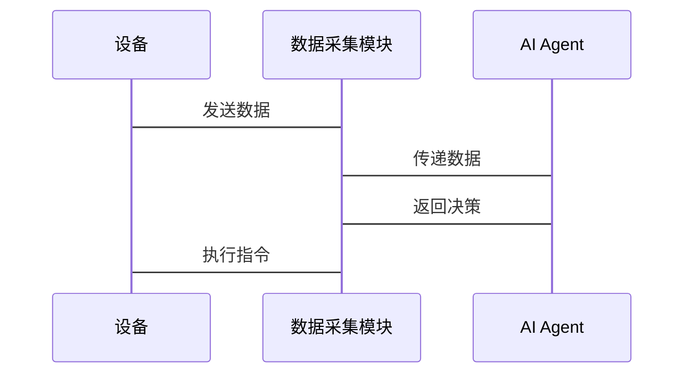

                 


# AI Agent在智能制造过程控制中的角色

**关键词**：AI Agent，智能制造，过程控制，智能工厂，工业自动化，人工智能

**摘要**：本文探讨了AI Agent在智能制造过程控制中的角色和应用。通过详细分析AI Agent的核心概念、算法原理、系统架构以及实际案例，本文展示了AI Agent如何在智能制造中实现高效的过程控制，提升生产效率和产品质量。

---

# 第1章: AI Agent与智能制造概述

## 1.1 AI Agent的基本概念

### 1.1.1 智能代理（AI Agent）的定义
智能代理（AI Agent）是一种能够感知环境、自主决策并采取行动以实现目标的实体。它可以是一个软件程序或物理设备，具备学习、推理和自适应能力。

### 1.1.2 智能代理的核心特征
智能代理的核心特征包括：
1. **自主性**：无需外部干预，自主决策。
2. **反应性**：能够实时感知环境并做出反应。
3. **目标导向**：基于目标进行决策和行动。
4. **学习能力**：通过数据和经验改进性能。

### 1.1.3 智能代理的分类与应用场景
智能代理可以分为以下几类：
- **反应式智能代理**：基于当前感知做出反应，适用于实时控制场景。
- **规划式智能代理**：具备目标规划能力，适用于复杂任务。
- **学习式智能代理**：通过机器学习不断优化性能，适用于数据驱动的场景。

---

## 1.2 智能制造的基本概念

### 1.2.1 智能制造的定义与特点
智能制造是一种利用人工智能、大数据、物联网等技术实现生产过程智能化的制造模式。其特点是高效、灵活、精准和可持续。

### 1.2.2 智能制造的关键技术
智能制造的关键技术包括：
- **物联网（IoT）**：实现设备间的互联互通。
- **大数据分析**：从海量数据中提取有价值的信息。
- **人工智能（AI）**：用于决策优化和自主控制。
- **工业机器人**：实现自动化生产。

### 1.2.3 智能制造的发展历程
智能制造经历了从传统制造到自动化制造，再到智能化制造的演变。当前，随着AI和物联网技术的发展，智能制造正朝着更高效、更灵活的方向迈进。

---

## 1.3 AI Agent在智能制造中的作用

### 1.3.1 AI Agent在智能制造中的角色定位
AI Agent在智能制造中扮演着多重角色：
- **监控与诊断**：实时监控生产过程，诊断异常情况。
- **优化控制**：根据实时数据优化生产参数。
- **决策支持**：辅助人类操作员做出决策。

### 1.3.2 AI Agent如何实现过程控制
AI Agent通过以下方式实现过程控制：
1. **数据采集**：收集生产过程中的各种数据。
2. **状态分析**：分析数据，识别异常情况。
3. **决策制定**：基于分析结果，制定控制策略。
4. **执行与反馈**：执行决策并收集反馈，不断优化控制策略。

### 1.3.3 AI Agent在智能制造中的优势与挑战
优势：
- **高效性**：能够快速响应，提高生产效率。
- **准确性**：基于数据和模型进行决策，减少人为错误。
- **可扩展性**：适用于不同规模和复杂度的生产场景。

挑战：
- **数据依赖性**：需要高质量的数据支持。
- **算法复杂性**：复杂算法的实现和优化难度较大。
- **安全性**：需防范网络攻击和数据泄露。

---

## 1.4 本章小结
本章介绍了AI Agent和智能制造的基本概念，分析了AI Agent在智能制造中的角色和作用。接下来的章节将深入探讨AI Agent的核心概念、算法原理和系统架构。

---

# 第2章: AI Agent的核心概念与原理

## 2.1 AI Agent的智能结构

### 2.1.1 知识表示
知识表示是AI Agent理解世界的基础。常用的知识表示方法包括：
- **符号表示法**：使用符号逻辑表示知识。
- **语义网络**：通过节点和边表示概念及其关系。

### 2.1.2 行为选择
行为选择是AI Agent根据当前状态和目标选择最优行动的过程。常见的行为选择算法包括：
- **贪心算法**：选择当前最优的行为。
- **A*算法**：基于启发式搜索选择最优路径。

### 2.1.3 环境交互
环境交互是AI Agent与外部世界进行信息交换的过程。通过传感器和执行器实现感知和行动。

---

## 2.2 AI Agent的决策机制

### 2.2.1 基于模型的决策
基于模型的决策依赖于预定义的模型和规则。例如，PID控制器基于数学模型进行控制。

### 2.2.2 基于经验的决策
基于经验的决策通过历史数据和经验进行模式识别和预测。例如，基于强化学习的策略网络。

### 2.2.3 基于学习的决策
基于学习的决策利用机器学习算法从数据中学习决策策略。例如，深度学习模型可以直接从图像数据中学习决策规则。

---

## 2.3 AI Agent的通信与协作

### 2.3.1 多智能体系统
多智能体系统由多个AI Agent组成，通过协同工作实现更复杂的任务。例如，在智能工厂中，多个AI Agent可以协同完成生产调度和资源分配。

### 2.3.2 智能体之间的通信协议
智能体之间的通信需要遵循特定的协议，例如：
- **FIPA（Foundation for Intelligent Physical Agents）**：定义了智能体之间的通信标准。

---

# 第3章: AI Agent的算法原理

## 3.1 基于模型的规划算法

### 3.1.1 算法流程
基于模型的规划算法通常包括以下步骤：
1. 建立环境模型。
2. 确定目标和约束条件。
3. 生成候选行动方案。
4. 选择最优方案。

### 3.1.2 数学模型与公式
数学模型示例：
$$
\text{目标函数} = \sum_{i=1}^{n} w_i x_i
$$

### 3.1.3 Python代码示例
```python
import numpy as np

def model_based_planning(environment, target):
    # 建立环境模型
    model = environment.build_model()
    # 确定目标和约束
    constraints = environment.get_constraints()
    # 生成候选方案
    candidates = generate_candidates(model, target, constraints)
    # 选择最优方案
    optimal = select_optimal(candidates)
    return optimal
```

---

## 3.2 基于经验的强化学习

### 3.2.1 算法流程
强化学习算法通常包括以下步骤：
1. 状态感知。
2. 行动选择。
3. 奖励反馈。
4. 策略优化。

### 3.2.2 强化学习的数学模型
强化学习的数学模型通常涉及状态、动作和奖励：
$$
R(s, a) = \text{奖励函数}
$$

### 3.2.3 Python代码示例
```python
import numpy as np
import gym

env = gym.make('CartPole-v0')
env.seed(1)

policy = np.random.randn(env.action_space.n)
while True:
    state = env.reset()
    done = False
    while not done:
        action = np.argmax(policy[state])
        state, reward, done, info = env.step(action)
        env.render()
```

---

# 第4章: 系统分析与架构设计

## 4.1 问题场景介绍

### 4.1.1 智能制造过程中的控制问题
智能制造过程中常见的控制问题包括生产效率优化、资源分配和质量控制。

### 4.1.2 系统需求分析
系统需求包括实时监控、异常检测和自主决策。

---

## 4.2 系统架构设计

### 4.2.1 领域模型类图
领域模型类图展示了系统中各组件之间的关系。例如：



### 4.2.2 系统架构图
系统架构图展示了系统的整体结构。例如：



---

## 4.3 系统接口设计

### 4.3.1 数据接口
数据接口用于设备、传感器和系统的数据交互。例如：
- **数据采集接口**：从设备采集实时数据。
- **数据存储接口**：将数据存储到数据库中。

### 4.3.2 通信接口
通信接口用于智能体之间的通信。例如：
- **HTTP接口**：通过REST API进行通信。
- **WebSocket接口**：实时通信。

---

## 4.4 系统交互流程

### 4.4.1 交互流程图
系统交互流程图展示了系统的运行流程。例如：



---

# 第5章: 项目实战

## 5.1 环境安装

### 5.1.1 开发环境搭建
开发环境包括Python、TensorFlow、Keras和相关库的安装。

### 5.1.2 数据准备
数据准备包括收集生产过程中的实时数据，并进行预处理。

---

## 5.2 核心代码实现

### 5.2.1 数据采集模块
数据采集模块代码示例：
```python
import serial

ser = serial.Serial('COM3', 9600)
data = ser.readline().decode()
print(data)
```

### 5.2.2 AI Agent实现
AI Agent实现代码示例：
```python
class AI-Agent:
    def __init__(self):
        self.model = load_model('model.h5')

    def decide_action(self, state):
        prediction = self.model.predict(np.array([state]))
        return np.argmax(prediction)
```

---

## 5.3 案例分析与总结

### 5.3.1 案例分析
通过具体案例分析AI Agent在智能工厂中的应用效果，如设备监控和生产优化。

### 5.3.2 项目总结
总结项目的实施过程、遇到的问题及解决方案，强调AI Agent的优势和未来发展方向。

---

# 第6章: 总结与展望

## 6.1 总结
总结AI Agent在智能制造过程控制中的作用和应用价值。

## 6.2 注意事项
注意事项包括数据质量、算法选择和系统集成等方面的问题。

## 6.3 未来展望
未来展望包括AI Agent与边缘计算、数字孪生等技术的结合，进一步提升智能制造的智能化水平。

---

# 参考文献
1. Russell, S. J., & Norvig, P. (2010). Artificial Intelligence: A Modern Approach.
2. 其他相关书籍和论文。

---

以上是《AI Agent在智能制造过程控制中的角色》的完整目录和内容安排。通过逐步分析和详细阐述，本文旨在帮助读者全面理解AI Agent在智能制造中的角色和应用。

