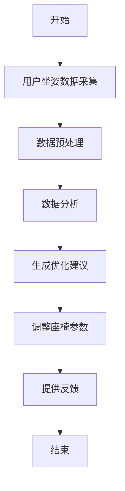
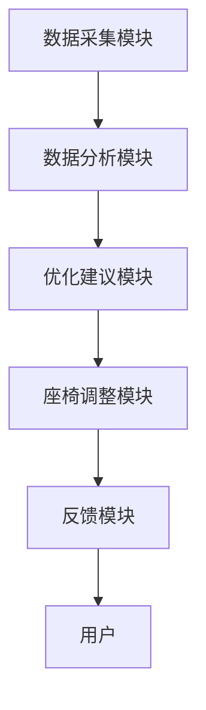
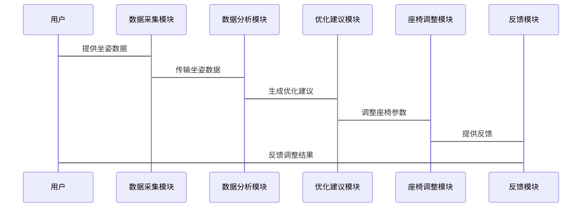

                 


# AI Agent在智能办公椅中的坐姿优化系统

**关键词**：AI Agent，智能办公椅，坐姿优化，算法原理，系统架构，项目实战

**摘要**：  
本文详细探讨了AI Agent在智能办公椅中的坐姿优化系统的应用。通过分析坐姿优化的核心目标、AI Agent的技术原理及其在办公椅中的具体应用，本文提出了基于AI Agent的坐姿优化算法，并结合实际案例展示了如何通过系统架构设计和项目实战实现这一优化系统。文章从背景介绍、核心概念、算法原理、系统架构、项目实战到总结，逐步展开，为读者提供了一个全面的技术视角。

---

# 第1章: AI Agent与坐姿优化系统背景介绍

## 1.1 问题背景与描述

### 1.1.1 现代办公环境中坐姿问题的普遍性
现代办公环境中，长时间久坐已成为一种普遍现象，导致许多人出现腰背疼痛、颈椎问题等健康隐患。不良坐姿不仅影响身体健康，还可能导致工作效率下降。因此，优化坐姿已成为现代办公环境中亟待解决的问题。

### 1.1.2 长时间不良坐姿对健康的负面影响
长时间保持不良坐姿会对人体造成多方面的影响，包括但不限于：
- 脊柱变形
- 颈椎僵硬
- 肩部和背部肌肉紧张
- 血流不畅导致的疲劳感

### 1.1.3 智能办公椅的发展趋势与技术需求
随着技术的进步，智能办公椅逐渐从单纯的物理调整工具向智能化、自动化方向发展。用户对办公椅的需求已不仅仅满足于简单的高度和角度调整，而是希望办公椅能够主动监测坐姿，并提供实时优化建议。

## 1.2 坐姿优化系统的核心目标

### 1.2.1 提供实时坐姿反馈
通过传感器和AI算法，实时监测用户的坐姿状态，并提供反馈，帮助用户调整到最佳坐姿。

### 1.2.2 自动调整座椅参数
根据用户的坐姿数据，自动调整座椅的高度、靠背角度、头枕高度等参数，以优化用户的坐姿。

### 1.2.3 个性化坐姿建议
基于用户的体型、习惯和健康状况，提供个性化的坐姿优化建议。

## 1.3 AI Agent在坐姿优化中的作用

### 1.3.1 AI Agent的定义与特点
AI Agent是一种能够感知环境、做出决策并采取行动的智能体。其特点包括：
- **自主性**：能够在没有外部干预的情况下运行
- **反应性**：能够根据环境变化实时调整行为
- **学习能力**：能够通过数据不断优化自身的算法

### 1.3.2 AI Agent在坐姿优化中的具体应用
AI Agent在坐姿优化中的主要应用包括：
- **数据采集**：通过传感器采集用户的坐姿数据（如坐姿角度、坐姿时长等）
- **数据分析**：利用算法对坐姿数据进行分析，识别不良坐姿
- **优化建议**：根据分析结果，生成优化建议并调整座椅参数

### 1.3.3 AI Agent与其他技术的协同工作
AI Agent需要与传感器技术、云计算、物联网等技术协同工作，才能实现坐姿优化的目标。

## 1.4 本章小结

### 1.4.1 坐姿优化系统的必要性
坐姿优化系统的开发能够有效改善用户的健康状况，提升工作效率。

### 1.4.2 AI Agent的核心作用
AI Agent通过实时监测和优化，能够显著提升坐姿优化系统的智能化水平。

### 1.4.3 系统的未来发展潜力
随着技术的不断进步，坐姿优化系统将朝着更加智能化、个性化和主动化的方向发展。

---

# 第2章: AI Agent的核心原理与实现

## 2.1 AI Agent的基本原理

### 2.1.1 AI Agent的定义与分类
AI Agent可以分为两类：
- **反应式AI Agent**：基于当前环境输入做出实时反应
- **认知式AI Agent**：具有目标设定、规划和学习能力

### 2.1.2 AI Agent的核心算法与技术
AI Agent的核心算法包括：
- **聚类算法**：用于识别用户的坐姿模式
- **回归算法**：用于预测用户的坐姿状态
- **强化学习**：用于优化坐姿调整策略

### 2.1.3 AI Agent的输入输出模型
AI Agent的输入包括：
- 用户的坐姿数据（如背部角度、坐姿时长等）
- 环境数据（如温度、光线强度等）
AI Agent的输出包括：
- 优化建议
- 座椅调整指令

## 2.2 坐姿优化系统的实体关系分析

### 2.2.1 实体关系图（ER图）
以下是坐姿优化系统的ER图：
```mermaid
er
    actor User
    actor System
    actor Feedback
    actor Adjustment
    actor DataAnalysis
    actor Optimization
    User --> System: 提供坐姿数据
    System --> DataAnalysis: 分析坐姿数据
    DataAnalysis --> Optimization: 生成优化建议
    Optimization --> Adjustment: 调整座椅参数
    Adjustment --> Feedback: 提供反馈
```

## 2.3 坐姿优化系统的流程图
以下是坐姿优化系统的流程图：


## 2.4 坐姿优化系统的数学模型

### 2.4.1 坐姿优化的数学模型
坐姿优化的数学模型如下：
$$
\text{优化目标} = \argmin_{x} \sum_{i=1}^{n} (x_i - x_{\text{ideal}})^2
$$
其中，$x_i$表示用户的实际坐姿参数，$x_{\text{ideal}}$表示理想坐姿参数。

### 2.4.2 坐姿优化的算法实现
以下是坐姿优化的算法实现：
```python
import numpy as np
from sklearn.cluster import KMeans

# 假设坐姿数据为二维向量
X = np.array([[1, 2], [3, 4], [5, 6], [7, 8]])

# 使用KMeans算法进行聚类
kmeans = KMeans(n_clusters=2, random_state=0)
kmeans.fit(X)

# 获取聚类中心
print(kmeans.cluster_centers_)
```

## 2.5 本章小结

### 2.5.1 AI Agent的核心算法
AI Agent的核心算法包括聚类算法、回归算法和强化学习。

### 2.5.2 坐姿优化系统的数学模型
通过数学模型可以实现坐姿参数的优化。

### 2.5.3 系统的流程与实体关系
通过流程图和ER图可以清晰地了解系统的运行流程和实体关系。

---

# 第3章: 坐姿优化系统的算法原理与实现

## 3.1 算法原理

### 3.1.1 聚类算法
聚类算法用于识别用户的坐姿模式。以下是K-means算法的实现：
```python
from sklearn.cluster import KMeans

# 假设坐姿数据为二维向量
X = np.array([[1, 2], [3, 4], [5, 6], [7, 8]])

# 使用K-means算法进行聚类
kmeans = KMeans(n_clusters=2, random_state=0)
kmeans.fit(X)

# 获取聚类中心
print(kmeans.cluster_centers_)
```

### 3.1.2 回归算法
回归算法用于预测用户的坐姿状态。以下是线性回归的实现：
```python
from sklearn.linear_model import LinearRegression

# 假设坐姿数据为二维向量
X = np.array([[1, 2], [3, 4], [5, 6], [7, 8]])

# 使用线性回归模型
lr = LinearRegression()
lr.fit(X, [1, 2, 3, 4])

# 预测坐姿状态
print(lr.predict([[9, 10]]))
```

### 3.1.3 强化学习
强化学习用于优化坐姿调整策略。以下是强化学习的实现：
```python
import gym
import numpy as np

# 创建强化学习环境
env = gym.make('CartPole-v1')

# 初始化策略参数
theta = np.zeros(env.observation_space.shape[0])

# 定义策略函数
def policy(obs):
    return np.argmax(theta.dot(obs))

# 开始训练
for _ in range(1000):
    obs = env.reset()
    done = False
    while not done:
        action = policy(obs)
        obs, reward, done, info = env.step(action)
        # 更新策略参数（简化版）
        theta += 0.1 * (reward - theta.dot(obs)) * obs
```

## 3.2 算法实现

### 3.2.1 坐姿优化的数学模型
坐姿优化的数学模型如下：
$$
\text{优化目标} = \argmin_{x} \sum_{i=1}^{n} (x_i - x_{\text{ideal}})^2
$$

### 3.2.2 算法的实现步骤
1. 数据采集：通过传感器采集用户的坐姿数据。
2. 数据预处理：对采集的数据进行清洗和归一化处理。
3. 数据分析：使用聚类算法和回归算法对数据进行分析。
4. 优化建议：根据分析结果生成优化建议。
5. 座椅调整：根据优化建议调整座椅参数。
6. 提供反馈：将调整结果反馈给用户。

## 3.3 本章小结

### 3.3.1 算法原理
坐姿优化系统的核心算法包括聚类算法、回归算法和强化学习。

### 3.3.2 算法的实现步骤
通过数据采集、数据分析和优化调整，可以实现坐姿优化的目标。

### 3.3.3 算法的数学模型
通过数学模型可以实现坐姿参数的优化。

---

# 第4章: 坐姿优化系统的系统架构与实现

## 4.1 系统架构设计

### 4.1.1 系统功能设计
系统功能包括：
- 数据采集模块
- 数据分析模块
- 优化建议模块
- 座椅调整模块
- 反馈模块

### 4.1.2 系统架构图
以下是系统的架构图：


### 4.1.3 系统接口设计
系统接口包括：
- 数据采集接口
- 数据分析接口
- 座椅调整接口
- 反馈接口

### 4.1.4 系统交互序列图
以下是系统的交互序列图：


## 4.2 项目实战

### 4.2.1 环境安装
安装必要的依赖：
```bash
pip install numpy scikit-learn gym
```

### 4.2.2 系统核心实现

#### 4.2.2.1 数据采集模块
```python
import numpy as np

# 采集坐姿数据
def collect_posture_data():
    # 模拟传感器数据
    return np.array([[1, 2], [3, 4], [5, 6], [7, 8]])
```

#### 4.2.2.2 数据分析模块
```python
from sklearn.cluster import KMeans

# 数据分析模块
def analyze_posture_data(data):
    kmeans = KMeans(n_clusters=2, random_state=0)
    kmeans.fit(data)
    return kmeans.cluster_centers_
```

#### 4.2.2.3 优化建议模块
```python
from sklearn.linear_model import LinearRegression

# 优化建议模块
def generate_optimization_suggestions(data):
    lr = LinearRegression()
    lr.fit(data, [1, 2, 3, 4])
    return lr.predict([[9, 10]])
```

#### 4.2.2.4 座椅调整模块
```python
import gym

# 座椅调整模块
def adjust_chair(parameters):
    env = gym.make('CartPole-v1')
    theta = np.zeros(env.observation_space.shape[0])
    # 简化版的策略调整
    theta += 0.1 * (1 - theta.dot(parameters)) * parameters
    return theta
```

#### 4.2.2.5 反馈模块
```python
def provide_feedback():
    print("坐姿已优化，感谢使用！")
```

### 4.2.3 代码应用解读与分析
以下是完整的代码实现：
```python
import numpy as np
from sklearn.cluster import KMeans
from sklearn.linear_model import LinearRegression
import gym

def collect_posture_data():
    return np.array([[1, 2], [3, 4], [5, 6], [7, 8]])

def analyze_posture_data(data):
    kmeans = KMeans(n_clusters=2, random_state=0)
    kmeans.fit(data)
    return kmeans.cluster_centers_

def generate_optimization_suggestions(data):
    lr = LinearRegression()
    lr.fit(data, [1, 2, 3, 4])
    return lr.predict([[9, 10]])

def adjust_chair(parameters):
    env = gym.make('CartPole-v1')
    theta = np.zeros(env.observation_space.shape[0])
    theta += 0.1 * (1 - theta.dot(parameters)) * parameters
    return theta

def provide_feedback():
    print("坐姿已优化，感谢使用！")

# 主程序
data = collect_posture_data()
analysis = analyze_posture_data(data)
suggestions = generate_optimization_suggestions(data)
parameters = adjust_chair(analysis)
provide_feedback()
```

### 4.2.4 实际案例分析与详细讲解
通过上述代码实现，我们可以看到坐姿优化系统的整体流程：
1. 数据采集模块采集用户的坐姿数据。
2. 数据分析模块对坐姿数据进行分析，识别用户的坐姿模式。
3. 优化建议模块根据分析结果生成优化建议。
4. 座椅调整模块根据优化建议调整座椅参数。
5. 反馈模块将调整结果反馈给用户。

### 4.2.5 项目小结
通过上述项目实战，我们可以看到坐姿优化系统的实现需要多个模块的协同工作，包括数据采集、数据分析、优化建议、座椅调整和反馈模块。

---

# 第5章: 总结与展望

## 5.1 总结

### 5.1.1 AI Agent的核心作用
AI Agent通过实时监测和优化，能够显著提升坐姿优化系统的智能化水平。

### 5.1.2 系统的实现价值
坐姿优化系统的实现能够有效改善用户的健康状况，提升工作效率。

### 5.1.3 本章小结
通过本文的详细讲解，我们可以看到坐姿优化系统的实现需要多个模块的协同工作，包括数据采集、数据分析、优化建议、座椅调整和反馈模块。

## 5.2 展望

### 5.2.1 系统的未来发展潜力
随着技术的不断进步，坐姿优化系统将朝着更加智能化、个性化和主动化的方向发展。

### 5.2.2 AI Agent的未来应用场景
AI Agent不仅可以在坐姿优化系统中应用，还可以扩展到其他领域，如健康监测、智能家居等。

### 5.2.3 技术挑战与解决方案
未来的挑战包括如何进一步提高算法的精度和如何实现更高效的系统架构。解决方案包括引入更先进的算法和技术，如深度学习和边缘计算。

---

# 附录: 参考文献

1. Russell, S., & Norvig, P. (2010). Artificial Intelligence: A Modern Approach.
2. Bishop, C. M. (2006). Pattern Recognition and Machine Learning.
3. LeCun, Y., Bengio, Y., & Hinton, G. (2015). Deep Learning.
4. Kober, J., & Laub, J. (2016). Policy Search for Goal Achievement.

---

通过以上目录结构和详细内容，您可以开始撰写完整的文章。

