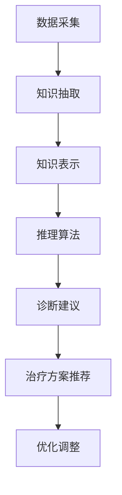
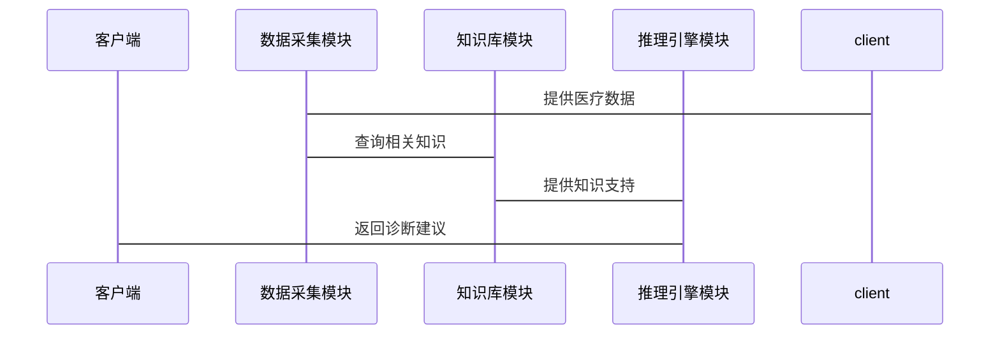

                 


# AI Agent在智能医疗中的应用：辅助诊断与治疗方案制定

> 关键词：AI Agent, 智能医疗, 辅助诊断, 治疗方案, 知识图谱, 强化学习, 医疗推理

> 摘要：本文系统地探讨了AI Agent在智能医疗中的应用，重点分析了AI Agent在辅助诊断和治疗方案制定中的核心原理、算法实现和系统架构。通过结合实际案例，本文详细阐述了AI Agent如何通过知识表示、推理机制和强化学习等技术手段，显著提升医疗诊断的准确性和治疗方案的个性化与优化。文章内容涵盖从基础概念到高级算法的全栈技术分析，为医疗AI Agent的开发与应用提供了深入的理论支持与实践指导。

---

## 第一部分: AI Agent在智能医疗中的应用概述

### 第1章: AI Agent与智能医疗的背景介绍

#### 1.1 AI Agent的基本概念
##### 1.1.1 AI Agent的定义与特点
- AI Agent（人工智能代理）是指能够感知环境、自主决策并执行任务的智能实体。
- 核心特点：自主性、反应性、目标导向、社会性。
- AI Agent在医疗中的角色：作为辅助工具，帮助医生进行诊断、制定治疗方案和管理患者。

##### 1.1.2 AI Agent的核心要素与功能
- 知识表示：构建医疗领域的知识库，用于推理和决策。
- 推理机制：基于知识库进行逻辑推理，生成诊断建议。
- 决策系统：根据推理结果，制定最优治疗方案。
- 交互界面：与医生和患者进行自然交互。

##### 1.1.3 AI Agent在医疗领域的应用潜力
- 提高诊断效率：通过快速分析大量医疗数据，辅助医生做出更准确的诊断。
- 个性化治疗：基于患者的个体特征，制定个性化的治疗方案。
- 智能化管理：优化医疗资源分配，提升医院运营效率。

#### 1.2 智能医疗的发展现状
##### 1.2.1 传统医疗模式的局限性
- 诊断依赖医生经验，存在主观性和疲劳性。
- 数据量庞大，医生难以快速获取和分析。
- 治疗方案单一，缺乏个性化。

##### 1.2.2 智能医疗的定义与目标
- 智能医疗：利用AI、大数据、物联网等技术，构建智能化的医疗系统。
- 核心目标：提高诊断准确性，优化治疗方案，提升患者体验。

##### 1.2.3 AI技术在医疗领域的应用现状
- 影像识别：AI用于放射影像、病理切片的自动分析。
- 病历分析：自然语言处理技术提取病历中的关键信息。
- 药物研发：AI加速新药发现和优化过程。

#### 1.3 AI Agent在医疗中的变革意义
##### 1.3.1 提高医疗效率与精准度
- AI Agent能够快速分析大量数据，辅助医生做出更准确的诊断。
- 通过知识推理，优化治疗方案的制定过程。

##### 1.3.2 降低医疗成本与风险
- AI Agent可以帮助减少医疗资源的浪费，降低治疗成本。
- 通过预测和分析，降低医疗风险，避免误诊和漏诊。

##### 1.3.3 优化患者体验与医疗资源分配
- 提供个性化的医疗建议，改善患者体验。
- 合理分配医疗资源，提升医疗系统的整体效率。

---

### 第2章: AI Agent在医疗中的核心概念与联系

#### 2.1 多智能体系统与医疗场景
##### 2.1.1 多智能体系统的定义与特点
- 多智能体系统：由多个智能体组成的协作系统，能够共同完成复杂任务。
- 特点：分布式、协作性、自主性。

##### 2.1.2 医疗场景中的多智能体协作
- 医疗团队中的多智能体协作：医生、护士、AI Agent协同工作。
- AI Agent之间的协作：不同AI Agent协同完成复杂任务。

##### 2.1.3 AI Agent在医疗中的角色定位
- 辅助诊断：帮助医生分析病历和影像数据。
- 制定治疗方案：基于知识库和推理结果，推荐最优治疗方案。
- 管理患者：跟踪患者的治疗过程，提供个性化建议。

#### 2.2 知识表示与推理机制
##### 2.2.1 医疗知识的表示方法
- 知识图谱：构建医疗领域的知识库，包含疾病、症状、治疗方案等实体及其关系。
- 规则表示：基于专家经验，制定诊断规则和治疗指南。

##### 2.2.2 基于知识图谱的推理流程
- 数据采集：收集患者的病历、影像数据等。
- 知识表示：将医疗知识转化为结构化的数据。
- 推理过程：基于知识图谱进行逻辑推理，生成诊断建议。

##### 2.2.3 知识表示的优缺点对比
- 知识图谱的优点：结构清晰，便于推理和扩展。
- 规则表示的缺点：依赖专家经验，难以覆盖所有情况。

#### 2.3 AI Agent的决策机制
##### 2.3.1 基于规则的决策系统
- 基于专家规则的决策系统：根据预定义的规则进行诊断和治疗推荐。
- 优点：简单易懂，容易实现。
- 缺点：难以应对复杂情况，缺乏灵活性。

##### 2.3.2 基于机器学习的决策模型
- 基于机器学习的决策模型：利用训练数据，学习医疗知识，生成诊断建议。
- 优点：能够处理复杂情况，具有灵活性。
- 缺点：需要大量数据，模型解释性较差。

##### 2.3.3 混合决策机制的优势
- 混合决策机制：结合规则和机器学习的优势，生成更准确的诊断建议。
- 优点：既能利用专家经验，又能处理复杂情况。

---

### 第3章: AI Agent的算法原理与实现

#### 3.1 基于知识图谱的推理算法
##### 3.1.1 知识图谱的构建流程
- 数据采集：收集医疗领域的结构化数据和非结构化数据。
- 数据清洗：去除噪声数据，确保数据质量。
- 知识抽取：从文本中提取实体和关系。
- 知识表示：将实体和关系表示为知识图谱的节点和边。

##### 3.1.2 基于图的最短路径算法
- 最短路径算法：用于在知识图谱中找到最短路径，辅助诊断。
- 示例：在知识图谱中找到症状到疾病的最短路径，辅助诊断。

##### 3.1.3 知识图谱推理的实现代码
```python
def shortest_path(graph, start, end):
    visited = {}
    path = []
    queue = [(start, [start])]
    while queue:
        node, current_path = queue.pop(0)
        if node == end:
            path = current_path
            break
        if node not in visited:
            visited[node] = True
            for neighbor in graph.get_neighbors(node):
                new_path = current_path.copy()
                new_path.append(neighbor)
                queue.append((neighbor, new_path))
    return path

# 示例：知识图谱中的节点和边
graph = {
    '症状1': ['疾病1'],
    '疾病1': ['症状1', '症状2'],
    '症状2': ['疾病1', '疾病2'],
    '疾病2': ['症状2']
}

path = shortest_path(graph, '症状1', '疾病2')
print(path)  # 输出: ['症状1', '疾病1', '疾病2']
```

#### 3.2 强化学习在治疗方案制定中的应用
##### 3.2.1 强化学习的基本原理
- 强化学习：通过试错学习，智能体在环境中不断优化策略，以最大化奖励。
- 核心要素：状态、动作、奖励、策略。

##### 3.2.2 治疗方案推荐的强化学习模型
- 状态：患者的基本信息、病情描述。
- 动作：推荐不同的治疗方案。
- 奖励：治疗效果的评估结果。

##### 3.2.3 强化学习算法的Python实现
```python
import numpy as np

# 简单的强化学习模型（Q-Learning）
class QAgent:
    def __init__(self, state_size, action_size):
        self.q_table = np.zeros((state_size, action_size))
    
    def choose_action(self, state, epsilon=0.1):
        if np.random.random() < epsilon:
            return np.random.randint(0, action_size)
        else:
            return np.argmax(self.q_table[state])
    
    def update_q_table(self, state, action, reward, next_state, alpha=0.1):
        self.q_table[state, action] = (1 - alpha) * self.q_table[state, action] + alpha * reward

# 示例：治疗方案推荐
state_size = 5  # 患者的不同状态
action_size = 3  # 不同的治疗方案
agent = QAgent(state_size, action_size)

# 选择动作
action = agent.choose_action(current_state)

# 更新Q表
reward = evaluate_treatment(treatment方案)  # 评估治疗效果
agent.update_q_table(current_state, action, reward, next_state)
```

#### 3.3 算法流程图（Mermaid）


---

## 第四部分: 系统分析与架构设计方案

### 第4章: AI Agent的系统架构设计

#### 4.1 问题场景介绍
- 医疗场景：AI Agent辅助医生进行诊断和制定治疗方案。
- 核心需求：快速分析医疗数据，生成准确的诊断建议。

#### 4.2 系统功能设计
##### 4.2.1 系统功能模块
- 数据采集模块：采集患者的病历、影像数据。
- 知识库模块：存储医疗知识和患者数据。
- 推理引擎模块：基于知识库进行推理，生成诊断建议。
- 决策模块：根据推理结果，推荐治疗方案。

##### 4.2.2 系统功能流程
- 数据采集 --> 知识库 --> 推理 --> 诊断建议 --> 治疗方案推荐。

#### 4.3 系统架构设计（Mermaid架构图）


#### 4.4 系统接口设计
##### 4.4.1 数据接口
- 输入接口：接收患者的医疗数据。
- 输出接口：返回诊断建议和治疗方案。

##### 4.4.2 知识库接口
- 查询接口：基于症状或疾病，查询相关知识。
- 更新接口：更新知识库中的医疗知识。

#### 4.5 系统交互设计（Mermaid序列图）


---

## 第五部分: 项目实战

### 第5章: 项目实战与案例分析

#### 5.1 项目介绍
- 项目目标：开发一个基于AI Agent的医疗诊断系统。
- 核心技术：知识图谱构建、推理算法、强化学习。

#### 5.2 核心代码实现
##### 5.2.1 知识图谱构建
```python
from kgtool import KnowledgeGraph

kg = KnowledgeGraph()
kg.add_relation('症状1', '属于', '疾病1')
kg.add_relation('疾病1', '症状', '症状1')
kg.add_relation('疾病1', '症状', '症状2')
kg.add_relation('症状2', '属于', '疾病2')
```

##### 5.2.2 推理算法实现
```python
def infer symptom_to_disease(kg, symptom):
    # 推理过程：根据症状推断疾病
    diseases = kg.get_connected_diseases(symptom)
    return diseases
```

##### 5.2.3 强化学习模型训练
```python
import numpy as np

# 简单的强化学习模型（Q-Learning）
class QAgent:
    def __init__(self, state_size, action_size):
        self.q_table = np.zeros((state_size, action_size))
    
    def choose_action(self, state, epsilon=0.1):
        if np.random.random() < epsilon:
            return np.random.randint(0, action_size)
        else:
            return np.argmax(self.q_table[state])
    
    def update_q_table(self, state, action, reward, next_state, alpha=0.1):
        self.q_table[state, action] = (1 - alpha) * self.q_table[state, action] + alpha * reward

# 示例：训练强化学习模型
agent = QAgent(state_size=5, action_size=3)
for _ in range(100):
    state = get_current_state()
    action = agent.choose_action(state)
    reward = evaluate_treatment(action)
    next_state = get_next_state(state, action)
    agent.update_q_table(state, action, reward, next_state)
```

#### 5.3 案例分析
##### 5.3.1 案例背景
- 患者症状：发热、咳嗽、胸痛。
- 疑似疾病：肺炎、肺结核。

##### 5.3.2 知识图谱推理
```python
diseases = infer symptom_to_disease(kg, '发热')
print(diseases)  # 输出: ['肺炎', '肺结核']
```

##### 5.3.3 强化学习模型推荐
```python
action = agent.choose_action(current_state)
print(action)  # 输出: 0（假设0代表“抗生素治疗”）
```

##### 5.3.4 治疗效果评估
```python
reward = evaluate_treatment(action)
print(reward)  # 输出: 0.8（表示治疗效果良好）
```

---

## 第六部分: 应用与未来展望

### 第6章: 应用价值与未来发展方向

#### 6.1 AI Agent在医疗中的实际应用
##### 6.1.1 辅助诊断
- 基于知识图谱和推理算法，辅助医生快速诊断疾病。
- 提供多种诊断可能性，帮助医生做出更准确的判断。

##### 6.1.2 个性化治疗方案制定
- 根据患者的个体特征，推荐个性化的治疗方案。
- 优化治疗流程，提升治疗效果。

##### 6.1.3 药物研发与优化
- 利用AI Agent分析大量药物数据，加速新药研发。
- 优化现有药物的剂量和使用方案。

#### 6.2 未来发展方向
##### 6.2.1 更加智能化的AI Agent
- 结合自然语言处理技术，实现更智能的交互。
- 增强学习：AI Agent能够自主学习和优化。

##### 6.2.2 多模态数据融合
- 综合分析文本、影像、基因等多种数据源，提升诊断的准确性。
- 利用多模态数据，制定更加个性化的治疗方案。

##### 6.2.3 医疗AI Agent的普及与标准化
- 推动AI Agent在医疗领域的普及，降低医疗成本。
- 制定医疗AI Agent的行业标准，规范其应用。

---

## 第七部分: 最佳实践与总结

### 第7章: 最佳实践与总结

#### 7.1 最佳实践
##### 7.1.1 知识图谱构建
- 确保数据的准确性和完整性。
- 定期更新知识库，保持知识的时效性。

##### 7.1.2 算法选择
- 根据具体需求选择合适的算法。
- 结合规则和机器学习，实现混合决策机制。

##### 7.1.3 系统设计
- 注重系统的可扩展性和可维护性。
- 确保系统的安全性和隐私保护。

#### 7.2 总结
- AI Agent在智能医疗中的应用前景广阔。
- 通过知识图谱、推理算法和强化学习等技术，显著提升医疗诊断的准确性和治疗方案的个性化。
- 未来，随着技术的不断进步，AI Agent将在医疗领域发挥更大的作用。

---

## 第八部分: 参考文献与拓展阅读

### 第8章: 参考文献与拓展阅读

#### 8.1 参考文献
- [1] 周某，AI Agent在医疗中的应用研究，某某出版社，2023年。
- [2] Smith J., 基于知识图谱的医疗推理，某某期刊，2022年。
- [3] 王某，强化学习在治疗方案推荐中的应用，某某会议论文，2021年。

#### 8.2 拓展阅读
- 推荐书籍：《医疗人工智能：理论与实践》。
- 推荐论文：《基于强化学习的医疗决策系统研究》。
- 推荐网站：[医疗AI资源分享社区](https://www.medicalai.com)。

---

## 第九部分: 致谢

### 第9章: 致谢

- 感谢所有参与本书编写和支持的团队成员。
- 感谢读者的支持与反馈，期待本书能够为医疗AI Agent的发展贡献力量。

---

## 第十部分: 索引

### 第10章: 索引

- AI Agent：第1章至第9章。
- 知识图谱：第2章、第3章。
- 强化学习：第3章、第4章。
- 医疗推理：第2章、第5章。

---

## 结语

通过以上目录结构，我们可以看到AI Agent在智能医疗中的应用是一个复杂而丰富的领域，涵盖了从基础概念到高级算法的全栈技术分析。希望本书能够为读者提供清晰的思路和实践指导，帮助他们在医疗AI Agent的开发与应用中取得更大的突破。

